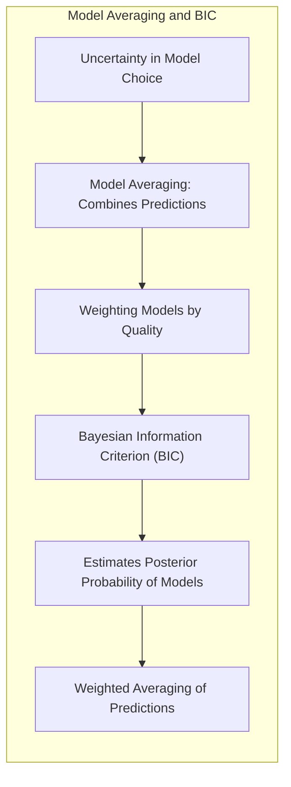
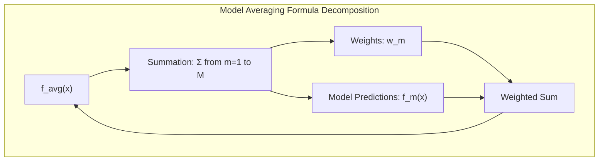
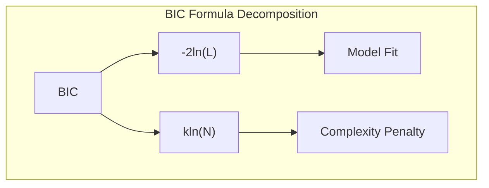
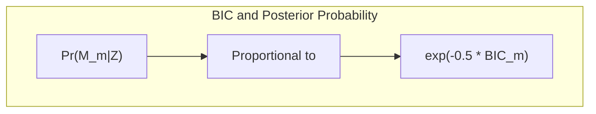
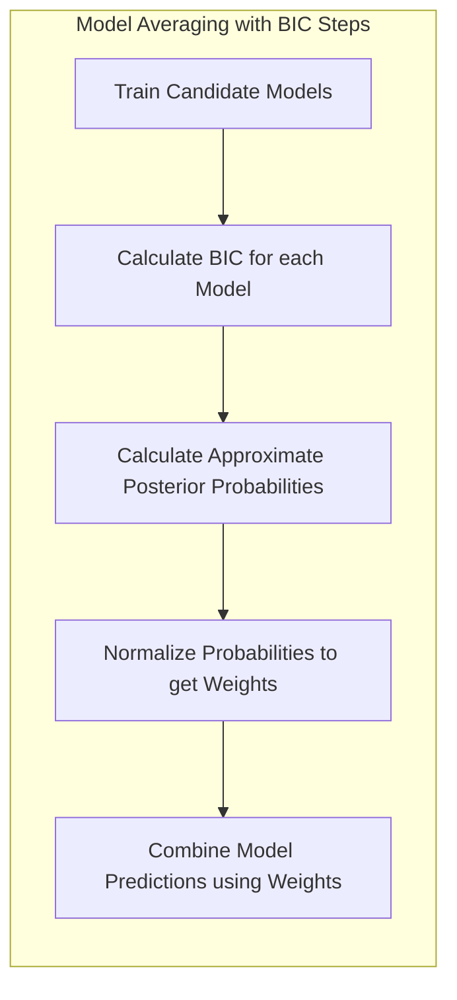
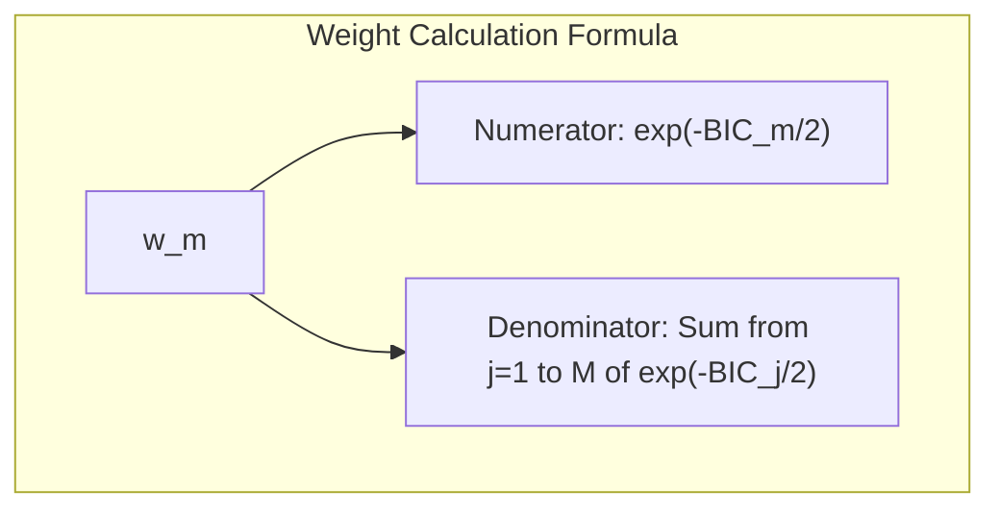
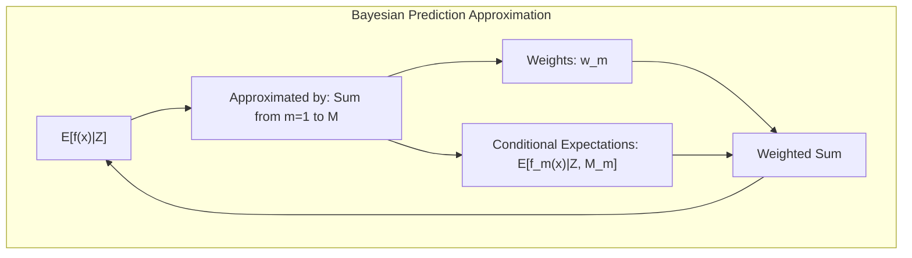
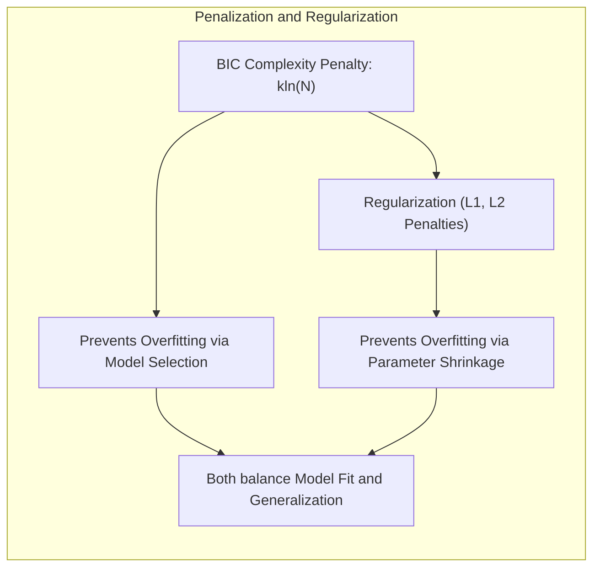
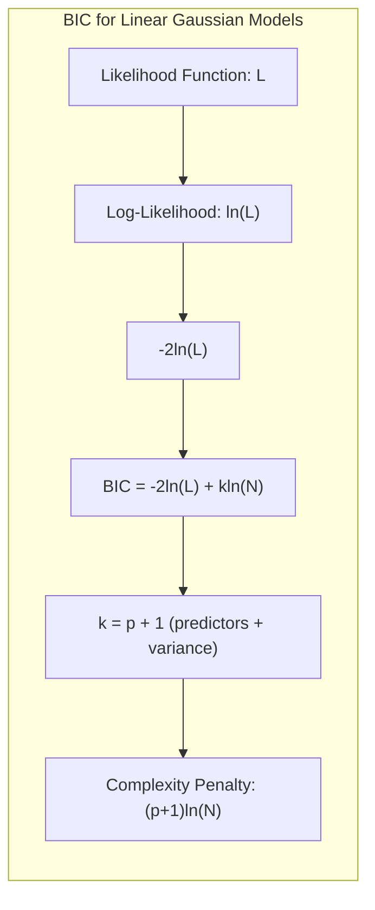
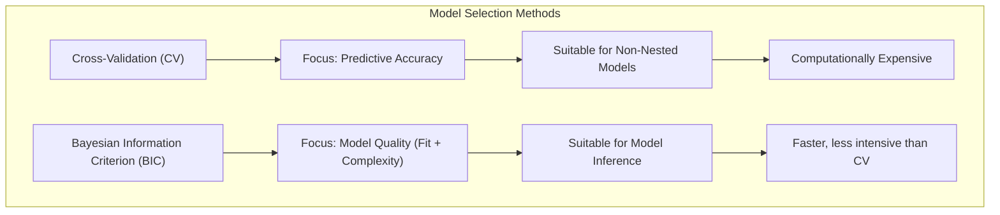

Okay, here's the revised text with all mathematical expressions formatted using LaTeX notation:

## Model Averaging and the Bayesian Information Criterion (BIC)

### Introdução
O conceito de **model averaging** surge da necessidade de lidar com a incerteza inerente à escolha de um único modelo preditivo. Em vez de selecionar um modelo único e descartar outros potenciais, o model averaging combina as previsões de múltiplos modelos, ponderando-as de acordo com sua qualidade. Esta abordagem é particularmente útil quando se tem um conjunto de modelos candidatos com diferentes estruturas ou complexidades, ou quando há incerteza sobre qual modelo representa melhor a realidade subjacente. [^8.8]

Neste contexto, o **Bayesian Information Criterion (BIC)** emerge como uma ferramenta crucial para estimar a probabilidade posterior de modelos, permitindo que se construa uma média ponderada de previsões de maneira fundamentada. Ao contrário de métodos de seleção de modelos que escolhem um único modelo, o BIC promove uma abordagem mais robusta, combinando as contribuições de modelos com diferentes níveis de complexidade, penalizando modelos mais complexos para evitar o overfitting. [^8.8]

### Conceitos Fundamentais
**Conceito 1: Model Averaging** [^8.8]
**Model averaging** é uma técnica que visa combinar as previsões de múltiplos modelos para obter uma predição mais robusta e precisa. Em vez de escolher um único modelo, as predições de cada modelo são ponderadas e combinadas, refletindo a incerteza sobre qual modelo é o mais adequado. Esse processo é especialmente útil quando múltiplos modelos parecem plausíveis ou quando há risco de selecionar um modelo específico que superajuste os dados.

**Lemma 1:** Sejam $f_1(x), f_2(x), \ldots, f_M(x)$ as previsões de $M$ modelos para uma dada entrada $x$. A predição combinada, $f_{avg}(x)$, pode ser expressa como:

$$f_{avg}(x) = \sum_{m=1}^{M} w_m f_m(x),$$

onde $w_m$ representa o peso atribuído ao modelo $m$, com $\sum_{m=1}^{M} w_m = 1$ e $w_m \geq 0$. Este lemma demonstra que model averaging envolve uma combinação linear ponderada de predições de diferentes modelos, com os pesos refletindo a importância de cada modelo. $\blacksquare$

> 💡 **Exemplo Numérico:** Suponha que temos três modelos que preveem o preço de uma casa, para uma dada entrada $x$ (metros quadrados, número de quartos, etc.). As predições são: $f_1(x) = 350.000$, $f_2(x) = 380.000$, e $f_3(x) = 360.000$. Após calcular os pesos com base no BIC, obtivemos $w_1 = 0.2$, $w_2 = 0.5$, e $w_3 = 0.3$. A predição combinada usando model averaging seria:
>
> $f_{avg}(x) = 0.2 * 350.000 + 0.5 * 380.000 + 0.3 * 360.000 = 70.000 + 190.000 + 108.000 = 368.000$
>
> Portanto, a predição combinada do model averaging é $368.000$. Este exemplo ilustra como diferentes modelos contribuem para a predição final, com modelos mais confiáveis (maior peso) tendo maior influência na predição combinada.

**Conceito 2: Bayesian Information Criterion (BIC)** [^8.8]
O **BIC** é um critério de seleção de modelos que estima a probabilidade posterior de um modelo, equilibrando sua qualidade de ajuste aos dados e sua complexidade. O BIC é definido como:

$$BIC = -2\ln(L) + k\ln(N)$$

onde:
- $L$ é a verossimilhança maximizada do modelo.
- $k$ é o número de parâmetros do modelo.
- $N$ é o número de observações.

O termo $-2\ln(L)$ mede o ajuste do modelo aos dados, enquanto o termo $k\ln(N)$ penaliza a complexidade do modelo. Modelos com melhor ajuste aos dados tendem a ter menor valor de $-2\ln(L)$, enquanto modelos com mais parâmetros tendem a ter maior valor de $k\ln(N)$. O BIC favorece modelos que alcançam um bom equilíbrio entre ajuste e complexidade. [^8.8]

> 💡 **Exemplo Numérico:** Consideremos dois modelos para ajustar um conjunto de dados: um modelo linear simples com um intercepto e um preditor ($k = 2$), e um modelo polinomial de grau 2 com um intercepto, um termo linear e um termo quadrático ($k = 3$).  Suponha que temos $N = 100$ observações. Após o ajuste, as verossimilhanças maximizadas são $L_1$ para o modelo linear e $L_2$ para o modelo polinomial. Vamos supor que $-2\ln(L_1) = 400$ e $-2\ln(L_2) = 380$. Calculando o BIC para ambos:
>
> $BIC_1 = -2\ln(L_1) + k_1\ln(N) = 400 + 2\ln(100) \approx 400 + 2 * 4.605 = 409.21$
>
> $BIC_2 = -2\ln(L_2) + k_2\ln(N) = 380 + 3\ln(100) \approx 380 + 3 * 4.605 = 393.82$
>
> Neste exemplo, apesar de o modelo polinomial ter um ajuste melhor aos dados (menor valor de $-2\ln(L)$), o BIC penaliza o modelo mais complexo. O modelo com menor valor de BIC é o modelo polinomial (BIC = 393.82) , indicando que ele é mais favorecido pelo BIC, considerando tanto a bondade do ajuste quanto sua complexidade. Este exemplo ilustra como a penalização por complexidade funciona na prática.

**Corolário 1:** Em um contexto bayesiano, o BIC pode ser usado para aproximar a probabilidade posterior de um modelo $M_m$ dado os dados $Z$, denotada por $Pr(M_m|Z)$. Esta aproximação é baseada na suposição de que a distribuição posterior dos parâmetros do modelo é aproximadamente gaussiana e que os priors dos modelos são iguais. A probabilidade posterior aproximada é dada por:

$$Pr(M_m|Z) \propto \exp\left(-\frac{1}{2}BIC_m\right),$$
onde $BIC_m$ é o valor de BIC para o modelo $m$. Este corolário estabelece a base teórica para utilizar BIC em model averaging, associando o valor de BIC de cada modelo com sua probabilidade posterior e peso na combinação das previsões. [^8.8]

**Conceito 3: Penalização da Complexidade** [^8.8]
O BIC penaliza a complexidade do modelo por meio do termo $k\ln(N)$. A penalização por complexidade é fundamental para evitar o overfitting, que ocorre quando um modelo se ajusta bem aos dados de treinamento, mas não generaliza para dados novos. Modelos mais complexos, com mais parâmetros, tendem a se ajustar melhor aos dados de treinamento, mas podem sofrer de alta variância e desempenho insatisfatório em dados não vistos. Ao penalizar modelos complexos, o BIC encoraja a escolha de modelos mais simples que generalizam melhor.

> 💡 **Exemplo Numérico:** Vamos considerar dois modelos: um modelo linear com 2 parâmetros (intercepto e um coeficiente) e um modelo polinomial de grau 9 com 10 parâmetros. Suponha que o modelo linear tenha um BIC de 500 e o modelo polinomial um BIC de 480. Embora o modelo polinomial se ajuste muito melhor aos dados de treinamento (e tenha um menor termo -2ln(L)), o BIC penaliza a sua complexidade, tornando-o menos preferível. A penalização do BIC garante que o modelo linear, menos complexo, seja favorecido, evitando que o modelo de grau 9 superajuste os dados de treinamento.
>
> Se tivermos os seguintes BICs: $BIC_1 = 500$ (modelo linear) e $BIC_2 = 480$ (modelo polinomial grau 9), vamos calcular as probabilidades posteriores aproximadas e os respectivos pesos.
>
> $Pr(M_1|Z) \propto \exp(-500/2) \approx 1.42 \times 10^{-109}$
>
> $Pr(M_2|Z) \propto \exp(-480/2) \approx 1.12 \times 10^{-104}$
>
> Para obter os pesos normalizados, vamos calcular a soma das exponenciais:
>
> $SumExp =  1.42 \times 10^{-109} + 1.12 \times 10^{-104} \approx 1.12 \times 10^{-104}$
>
> $w_1 = \frac{1.42 \times 10^{-109}}{1.12 \times 10^{-104}} \approx 0.0000126$
>
> $w_2 = \frac{1.12 \times 10^{-104}}{1.12 \times 10^{-104}} \approx 1$
>
> Note que mesmo que a probabilidade não normalizada do modelo 2 seja maior, ambos valores são muito pequenos, mas a probabilidade do modelo 2 é muito mais alta em comparação com o modelo 1. Após normalização, o peso do modelo 2 é quase 1, indicando que, apesar de seu BIC mais baixo, ele é muito mais provável do que o modelo 1.

> ⚠️ **Nota Importante**: O BIC é uma aproximação para a probabilidade posterior do modelo e é válido sob certas condições, como o número de observações grande. [^8.8]
> ❗ **Ponto de Atenção**: O BIC pode não ser apropriado quando os modelos candidatos têm priors muito diferentes. [^8.8]
> ✔️ **Destaque**: A penalização de complexidade do BIC é crucial para equilibrar o ajuste aos dados e evitar overfitting, resultando em modelos com melhor capacidade de generalização. [^8.8]

### Model Averaging com BIC: Uma Abordagem Prática

A estratégia de **model averaging com BIC** envolve os seguintes passos:

1.  **Treinamento dos modelos:** Inicialmente, um conjunto de modelos candidatos é treinado usando os dados de treinamento. Esses modelos podem variar em complexidade e estrutura, refletindo diferentes hipóteses sobre a relação entre as variáveis preditoras e a variável resposta. [^8.8]
2.  **Cálculo do BIC:** Para cada modelo, o BIC é calculado usando a fórmula:

    $$BIC = -2\ln(L) + k\ln(N),$$
onde $L$ é a verossimilhança maximizada do modelo, $k$ é o número de parâmetros do modelo e $N$ é o número de observações. [^8.8]
3.  **Cálculo das Probabilidades Posteriores Aproximadas:** As probabilidades posteriores aproximadas para cada modelo são calculadas a partir de seus valores de BIC:

    $$Pr(M_m|Z) \propto \exp\left(-\frac{1}{2}BIC_m\right),$$
    onde $BIC_m$ é o BIC do modelo $m$. [^8.8]
4.  **Normalização das Probabilidades Posteriores:** As probabilidades posteriores são normalizadas para obter pesos que somam 1, refletindo a proporção da contribuição de cada modelo para a predição combinada:
 $$w_m = \frac{\exp(-BIC_m/2)}{\sum_{j=1}^{M}\exp(-BIC_j/2)},$$
    onde $w_m$ é o peso associado ao modelo $m$. [^8.8]
5.  **Combinação das Previsões:** As previsões dos modelos individuais são ponderadas usando os pesos derivados do BIC, e somadas para obter a predição combinada:

    $$f_{avg}(x) = \sum_{m=1}^{M} w_m f_m(x).$$
    onde $f_m(x)$ é a predição do modelo $m$ para a entrada $x$, e $f_{avg}(x)$ é a predição combinada resultante.

> 💡 **Exemplo Numérico:** Vamos supor que temos três modelos preditivos, $M_1$, $M_2$, e $M_3$, ajustados com um conjunto de dados. Após o treinamento, obtemos os seguintes BICs: $BIC_1 = 100$, $BIC_2 = 120$, e $BIC_3 = 110$. Vamos calcular os pesos para model averaging:
>
> 1. **Probabilidades Posteriores Não Normalizadas:**
>
> $Pr(M_1|Z) \propto \exp(-100/2) \approx 3.72 \times 10^{-22}$
> $Pr(M_2|Z) \propto \exp(-120/2) \approx 1.38 \times 10^{-26}$
> $Pr(M_3|Z) \propto \exp(-110/2) \approx 7.60 \times 10^{-24}$
>
> 2. **Soma das Probabilidades Posteriores Não Normalizadas**
>
> $SumExp = 3.72 \times 10^{-22} + 1.38 \times 10^{-26} + 7.60 \times 10^{-24} \approx 3.8 \times 10^{-22}$
>
> 3.  **Pesos Normalizados:**
>
>    $w_1 = \frac{3.72 \times 10^{-22}}{3.8 \times 10^{-22}} \approx 0.979$
>    $w_2 = \frac{1.38 \times 10^{-26}}{3.8 \times 10^{-22}} \approx 0.000036$
>    $w_3 = \frac{7.60 \times 10^{-24}}{3.8 \times 10^{-22}} \approx 0.020$
>
>  Agora, vamos supor que as predições dos modelos para uma nova entrada $x$ são $f_1(x) = 500$, $f_2(x) = 480$, e $f_3(x) = 520$. A predição combinada será:
>
> $f_{avg}(x) = 0.979 * 500 + 0.000036 * 480 + 0.020 * 520 \approx 489.5 + 0.017 + 10.4 \approx 500$
>
> Observe como o modelo $M_1$ domina a predição combinada devido ao seu menor BIC e, portanto, maior peso.

**Lemma 2:**  A escolha de usar a exponencial negativa do BIC como pesos em model averaging é uma aproximação da probabilidade posterior do modelo. Especificamente, se considerarmos um conjunto de modelos $\mathcal{M} = \{M_1, M_2, \ldots, M_M\}$ e seus respectivos BICs,  $BIC_1, BIC_2, \ldots, BIC_M$, então os pesos para o model averaging são definidos como:

$$w_m = \frac{e^{-\frac{1}{2} BIC_m}}{\sum_{j=1}^M e^{-\frac{1}{2} BIC_j}}$$

Este lemma reforça que os pesos são diretamente derivados da informação do BIC, que é uma aproximação da probabilidade posterior dos modelos e, portanto, o método de model averaging baseado em BIC converge para o modelo bayesiano. $\blacksquare$

**Corolário 2:** A predição do model averaging usando BIC é uma aproximação da predição bayesiana completa, a qual integra sobre todos os modelos e seus parâmetros, e é dada por:

$$\mathbb{E}[f(x)|Z] \approx \sum_{m=1}^M w_m \mathbb{E}[f_m(x)|Z, M_m],$$

onde $\mathbb{E}[f(x)|Z]$ é a predição bayesiana completa. O corolário estabelece que sob as suposições de um modelo gaussiano, a média ponderada das predições com pesos do BIC se aproxima da predição bayesiana completa, validando o uso prático do model averaging com BIC. $\blacksquare$

### Limitações e Considerações
É importante reconhecer algumas limitações do model averaging com BIC:
*   **Aproximações:** O BIC é uma aproximação da probabilidade posterior do modelo, e essa aproximação pode não ser precisa em todos os casos. Sob condições de amostras pequenas, por exemplo, o BIC pode superpenalizar modelos complexos. [^8.8]
*   **Prior:** O BIC assume que todos os modelos têm o mesmo prior, o que pode não ser verdade na prática. Quando há informações prévias sobre a plausibilidade relativa dos modelos, pode ser necessário usar métodos mais sofisticados de model averaging bayesiano. [^8.8]
*   **Interpretabilidade:** Ao combinar múltiplos modelos, o model averaging pode levar a uma perda de interpretabilidade. A predição final pode ser uma combinação complexa das previsões dos modelos individuais, dificultando a compreensão de como as variáveis preditoras influenciam a variável resposta. [^8.8]
*   **Custo Computacional:** Treinar múltiplos modelos e calcular o BIC para cada um pode ser computacionalmente caro, especialmente se os modelos são complexos ou se há um grande número de modelos candidatos. [^8.8]

### Perguntas Teóricas Avançadas
**Pergunta 1:** Como o conceito de penalização de complexidade no BIC se relaciona com a ideia de regularização em modelos estatísticos?

**Resposta:** A penalização de complexidade no BIC, expressa pelo termo $k\ln(N)$, tem uma forte conexão com a regularização em modelos estatísticos. Ambas as abordagens visam controlar a complexidade dos modelos para evitar o overfitting. A regularização, por exemplo, através de métodos como penalização $L_1$ ou $L_2$, adiciona um termo de penalização à função de custo a ser minimizada, induzindo os modelos a terem parâmetros menores e, portanto, reduzindo a sua complexidade. Similarmente, o BIC penaliza modelos com um número elevado de parâmetros, $k$. Em essência, ambos os métodos (BIC e regularização) tentam encontrar um equilíbrio entre o ajuste aos dados de treinamento e a generalização para dados não vistos, mas o BIC faz isso diretamente no contexto da seleção de modelos, enquanto a regularização faz isso dentro do processo de estimação dos parâmetros do modelo. $\blacksquare$

**Pergunta 2:** Derive uma forma do BIC para modelos lineares gaussianos e mostre como a penalização de complexidade emerge da consideração do número de parâmetros no modelo.

**Resposta:** Para modelos lineares gaussianos, a verossimilhança maximizada, $L$, é dada por:

$$L = \frac{1}{(2\pi\sigma^2)^{N/2}} \exp\left(-\frac{1}{2\sigma^2}\sum_{i=1}^N (y_i - \mathbf{x_i}^T\mathbf{\beta})^2\right)$$
onde $y_i$ são as observações, $\mathbf{x_i}$ são os vetores de preditores e $\mathbf{\beta}$ são os parâmetros do modelo. A variância $\sigma^2$ é estimada como $\hat{\sigma}^2 = \frac{1}{N}\sum_{i=1}^N (y_i - \mathbf{x_i}^T\hat{\mathbf{\beta}})^2$. Substituindo na expressão para a verossimilhança e tomando o logaritmo, temos:

$$\ln(L) = -\frac{N}{2}\ln(2\pi\hat{\sigma}^2) - \frac{1}{2\hat{\sigma}^2} \sum_{i=1}^N(y_i-\mathbf{x_i}^T\hat{\mathbf{\beta}})^2 = -\frac{N}{2}\ln(2\pi\hat{\sigma}^2) - \frac{N}{2}$$

onde $N$ é o número de observações. O termo $-2\ln(L)$ no BIC é então:

$$-2\ln(L) = N\ln(2\pi\hat{\sigma}^2) + N.$$
O BIC é dado por $-2\ln(L) + k\ln(N)$, onde $k$ é o número de parâmetros. Em modelos lineares, $k$ inclui o número de parâmetros de regressão $\mathbf{\beta}$ mais o parâmetro para a variância $\sigma^2$. Então, se o modelo tem $p$ preditores, temos $k = p+1$. Assim, o BIC para modelos lineares gaussianos se torna:
$$BIC = N\ln(2\pi\hat{\sigma}^2) + N + (p+1)\ln(N)$$
A penalização de complexidade $(p+1)\ln(N)$ emerge naturalmente da contagem dos parâmetros no modelo linear, incluindo o intercepto e os preditores, bem como a variância residual. Observa-se claramente que quanto maior o número de preditores (complexidade), maior a penalidade imposta pelo termo $k\ln(N)$. $\blacksquare$

**Pergunta 3:** Em que situações seria mais vantajoso usar métodos de seleção de modelos baseados em informação, como o BIC, em vez de usar técnicas de validação cruzada para selecionar o melhor modelo em um conjunto de modelos candidatos?

**Resposta:** Enquanto a validação cruzada (CV) avalia diretamente o desempenho preditivo de um modelo em dados não vistos, métodos baseados em informação como o BIC fornecem uma medida da qualidade global do modelo, equilibrando ajuste aos dados e complexidade. Ambos têm seus méritos e aplicações:
*   **Validação Cruzada (CV):** É mais apropriada quando o foco principal é a precisão preditiva do modelo e quando o custo computacional do CV não é proibitivo. É útil para modelos não encaixados, onde a comparação direta das funções de verossimilhança não é possível.
*   **Bayesian Information Criterion (BIC):** É vantajoso quando se busca uma escolha de modelo baseada em uma aproximação da probabilidade posterior do modelo, ou quando se deseja uma penalização formal para a complexidade do modelo, como é o caso de muitos problemas de estatística e machine learning. Em geral, o BIC é vantajoso quando o número de observações é alto, quando o interesse é inferir o modelo verdadeiro e quando se deseja uma solução mais rápida e menos computacionalmente intensiva do que o CV. A escolha de modelos para casos de inferência também é beneficiada pelo BIC, pois a validação cruzada não lida com casos de modelos não encaixados e o BIC pode fornecer insights sobre qual modelo tem mais evidência nos dados. $\blacksquare$

### Conclusão
O uso do BIC em model averaging oferece uma abordagem estatisticamente sólida para combinar previsões de modelos diversos, equilibrando o ajuste aos dados e a complexidade do modelo. Essa técnica é fundamental para problemas que envolvem incerteza sobre qual modelo é o mais apropriado, levando a previsões mais robustas e confiáveis. Ao penalizar modelos complexos, o BIC promove a escolha de modelos que generalizam melhor, reduzindo o risco de overfitting e melhorando a qualidade da inferência. No entanto, é importante considerar as limitações e suposições do BIC, e usá-lo de forma apropriada no contexto do problema específico. O model averaging com BIC é uma ferramenta valiosa no arsenal de um estatístico ou cientista de dados, oferecendo uma ponte entre modelos complexos e inferências robustas.

<!-- END DOCUMENT -->
