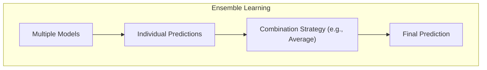
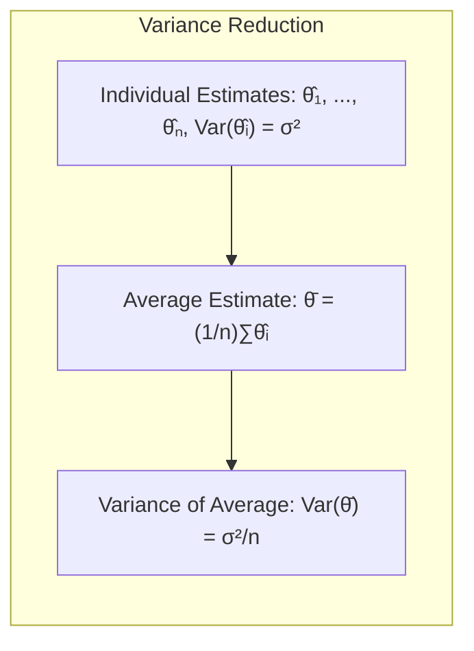
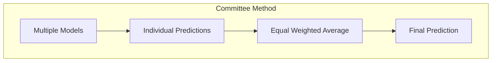
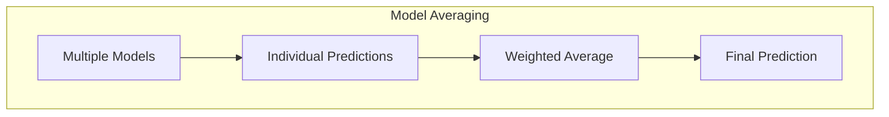
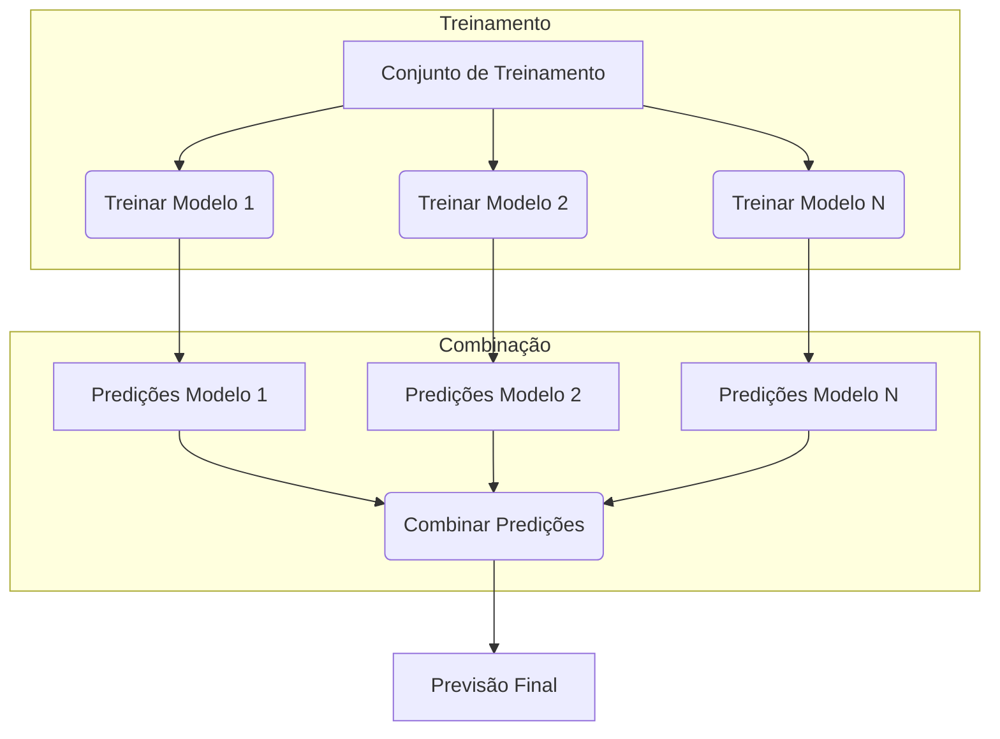
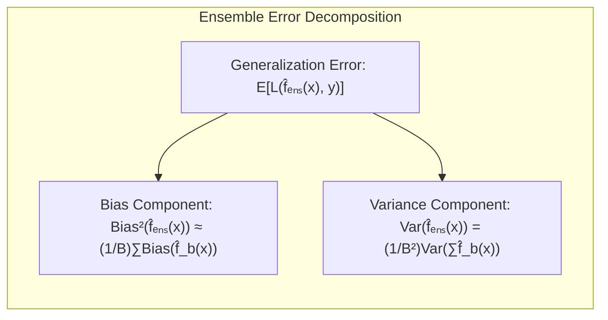
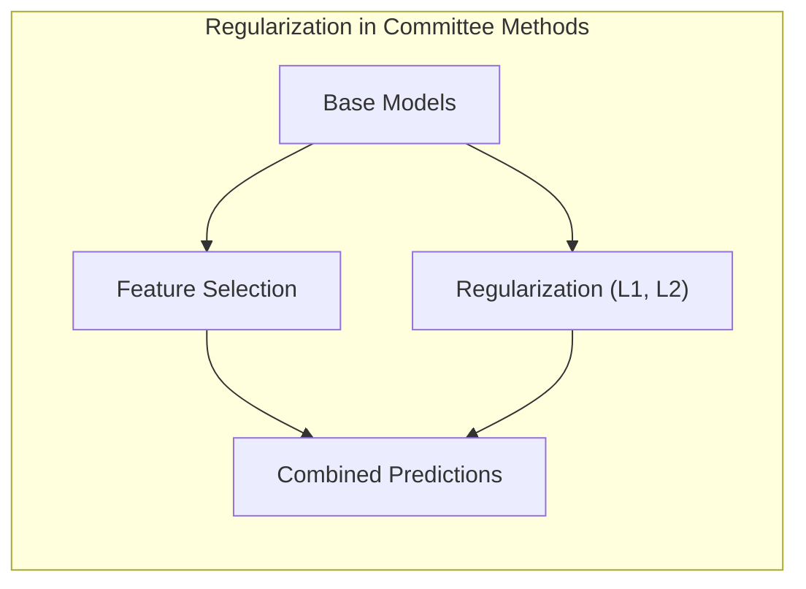
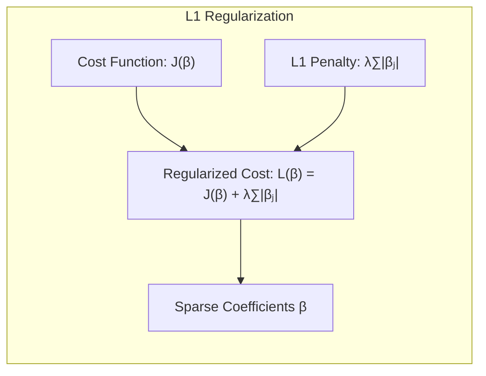
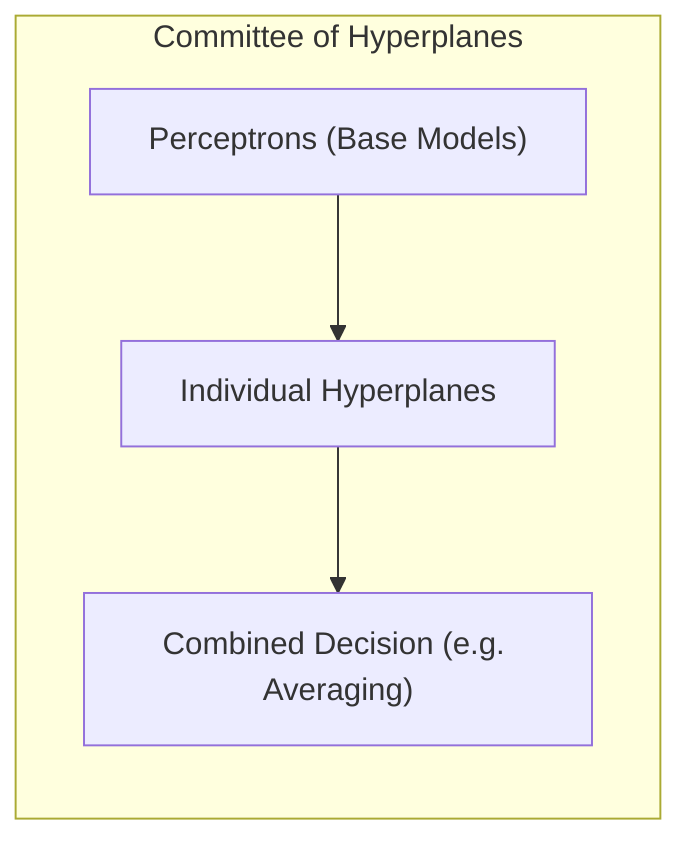
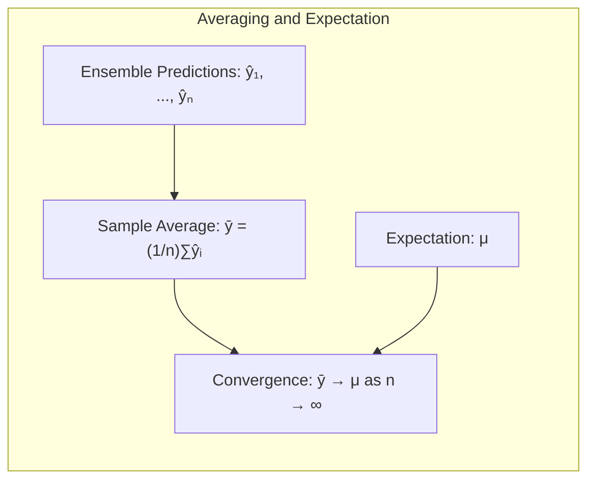

## Committee Methods: Model Averaging and Combination for Enhanced Prediction

<imagem: Mapa mental complexo conectando a ideia de ensembles, métodos de comitê, bagging, boosting, stacking e bumping. O mapa mental deve incluir os principais pontos de cada técnica e suas relações, destacando como métodos de comitê se encaixam em uma categoria maior de model averaging>

### Introdução

Neste capítulo, exploramos uma variedade de técnicas para aprimorar a inferência de modelos e a precisão preditiva, com foco em métodos que combinam múltiplas fontes de informação ou modelos preditivos. Os métodos de comitê, em particular, representam uma abordagem poderosa para modelagem preditiva, aproveitando a força da diversidade para obter previsões mais robustas e precisas. Este capítulo visa detalhar o funcionamento desses métodos e discutir sua relevância no contexto do aprendizado estatístico [^8.1].

### Conceitos Fundamentais

**Conceito 1:** O conceito de **ensemble learning** é central para a compreensão dos métodos de comitê. Em vez de confiar em um único modelo, os ensembles combinam as previsões de vários modelos, muitas vezes de maneiras simples, como uma média [^8.1]. Essa combinação pode levar a uma redução da variância e a previsões mais estáveis, em especial quando os modelos individuais são propensos à alta variância. Os métodos de comitê exploram essa ideia de forma direta e eficaz.



**Lemma 1:** *A média de estimativas independentes de um parâmetro possui uma variância menor do que a variância de qualquer estimativa individual.*

**Prova:** Sejam $\hat{\theta_1}, \hat{\theta_2}, \ldots, \hat{\theta_n}$ estimativas independentes de um parâmetro $\theta$, cada uma com variância $\sigma^2$. A média dessas estimativas é dada por:
$$ \bar{\theta} = \frac{1}{n} \sum_{i=1}^n \hat{\theta_i} $$
A variância da média é:
$$ Var(\bar{\theta}) = Var \left( \frac{1}{n} \sum_{i=1}^n \hat{\theta_i} \right) = \frac{1}{n^2} \sum_{i=1}^n Var(\hat{\theta_i}) = \frac{1}{n^2} \cdot n \sigma^2 = \frac{\sigma^2}{n} $$
Como $\frac{\sigma^2}{n} < \sigma^2$ para $n > 1$, a variância da média é menor do que a variância de qualquer estimativa individual. $\blacksquare$



> 💡 **Exemplo Numérico:** Considere que temos três modelos independentes que estimam a altura de uma pessoa, com as seguintes estimativas (em cm) e variâncias:
>
> *   Modelo 1: $\hat{\theta_1} = 170$, $Var(\hat{\theta_1}) = 10$
> *   Modelo 2: $\hat{\theta_2} = 173$, $Var(\hat{\theta_2}) = 10$
> *   Modelo 3: $\hat{\theta_3} = 168$, $Var(\hat{\theta_3}) = 10$
>
> A média das estimativas é:
>
> $$ \bar{\theta} = \frac{170 + 173 + 168}{3} = 170.33 $$
>
> A variância da média é:
>
> $$ Var(\bar{\theta}) = \frac{10}{3} \approx 3.33 $$
>
> Como esperado, a variância da média (3.33) é menor que a variância de cada estimativa individual (10). Isso ilustra como a combinação de estimativas independentes reduz a incerteza.

**Conceito 2:** Os **métodos de comitê**, conforme mencionado em [^8.1], são uma forma de ensemble learning onde as previsões de vários modelos são combinadas para obter um resultado final. Esses métodos frequentemente utilizam uma média simples das previsões de modelos individuais, o que pode ser visto como uma forma direta de model averaging. A abordagem de comitê busca, de maneira geral, simplificar a combinação de modelos, tratando-os com igual importância e sem pesos.

**Corolário 1:** Se as estimativas são não-independentes, a variância da média ainda pode ser menor que a variância de cada estimativa individual se a correlação for positiva, mas o efeito da redução da variância é atenuado em relação ao caso independente.

> 💡 **Exemplo Numérico:** Suponha que temos dois modelos que estimam a probabilidade de um cliente comprar um produto, e esses modelos têm uma correlação positiva entre eles.
> * Modelo 1: Probabilidade estimada $\hat{p_1} = 0.6$, com variância $Var(\hat{p_1}) = 0.02$
> * Modelo 2: Probabilidade estimada $\hat{p_2} = 0.7$, com variância $Var(\hat{p_2}) = 0.02$
> * Covariância entre os modelos: $Cov(\hat{p_1}, \hat{p_2}) = 0.01$
>
> A média das estimativas é $\bar{p} = \frac{0.6+0.7}{2} = 0.65$. A variância da média, considerando a não-independência, é:
>
> $Var(\bar{p}) = \frac{1}{2^2}[Var(\hat{p_1}) + Var(\hat{p_2}) + 2Cov(\hat{p_1},\hat{p_2})] = \frac{1}{4}[0.02 + 0.02 + 2(0.01)] = \frac{0.06}{4} = 0.015$
>
> Note que, mesmo com a correlação positiva, a variância da média (0.015) é menor do que a variância de cada estimativa individual (0.02), mas o efeito da redução é menor do que seria se os modelos fossem independentes (onde a variância seria 0.01).



**Conceito 3:** O **model averaging**, também introduzido em [^8.1], engloba uma classe mais ampla de técnicas em que modelos são combinados por meio de uma média ponderada. Diferente de métodos de comitê, que utilizam pesos iguais, o model averaging pode atribuir pesos diferentes aos modelos com base em seu desempenho ou complexidade [^8.8]. Essa abordagem oferece maior flexibilidade e pode levar a uma melhor precisão preditiva.
> ⚠️ **Nota Importante**: Apesar da simplicidade dos métodos de comitê, é essencial considerar o grau de diversidade entre os modelos combinados. Modelos muito similares podem não fornecer melhorias significativas.



### Regressão Linear e Mínimos Quadrados para Classificação

<imagem: Diagrama em estilo flowchart que explica o processo de um método de comitê para classificação, mostrando os passos de treinamento de modelos individuais, combinação de previsões e decisão final>


**Explicação:** Este diagrama ilustra o processo de treinamento e combinação em um método de comitê, onde múltiplos modelos são treinados e suas previsões são agregadas.

Ao discutir como métodos de comitê se relacionam com regressão linear e mínimos quadrados, é útil considerar como essas técnicas de regressão podem ser usadas para construir modelos base para os comitês. Em uma abordagem direta, modelos lineares podem ser usados como os modelos individuais de um comitê, e a previsão combinada seria uma média das previsões lineares [^8.1]. A regressão de indicadores, por exemplo, poderia ser utilizada para construir modelos base que são combinados em um método de comitê. Como descrito em [^8.2], a regressão linear também pode ser usada como um meio de ponderar modelos, embora a discussão sobre *stacked generalization* em [^8.8] indique que modelos mais complexos de ponderação podem ser úteis.

**Lemma 2:** *O erro de generalização de um ensemble de modelos pode ser decomposto em uma soma de bias e variância, onde a média das previsões reduz a variância, enquanto o bias é dado pelo bias médio dos modelos individuais.*
**Prova:** Seja $L(\hat{f}, y)$ a função de custo do modelo $\hat{f}$ sobre o valor $y$. Podemos decompor o erro esperado de um ensemble $\hat{f}_{ens}(x)$ como:
$$ E_x[L(\hat{f}_{ens}(x),y)] = Bias^2(\hat{f}_{ens}(x)) + Var(\hat{f}_{ens}(x)) $$
Onde o bias do ensemble é aproximadamente igual a média do bias dos modelos individuais, i.e.:
$$Bias(\hat{f}_{ens}(x)) \approx \frac{1}{B} \sum_{b=1}^{B} Bias(\hat{f}_{b}(x))$$
E a variância do ensemble é dada por:
$$Var(\hat{f}_{ens}(x)) = \frac{1}{B^2} Var(\sum_{b=1}^{B}\hat{f}_{b}(x))$$
Se os modelos individuais forem independentes, a variância é reduzida em um fator $1/B$. $\blacksquare$



> 💡 **Exemplo Numérico:** Imagine que estamos modelando a temperatura (em °C) com base na hora do dia usando modelos lineares. Temos três modelos individuais:
> * Modelo 1: $\hat{f}_1(x) = 10 + 2x$ (onde x é a hora do dia, variando de 0 a 23).
> * Modelo 2: $\hat{f}_2(x) = 8 + 2.2x$.
> * Modelo 3: $\hat{f}_3(x) = 12 + 1.8x$.
>
> Suponha que o valor real da temperatura seja $y = 25$ às 10h ($x=10$). As previsões individuais e erros quadrados seriam:
>
>  *   Modelo 1: $\hat{f}_1(10) = 30$, $L(\hat{f}_1, y) = (30-25)^2 = 25$
>  *   Modelo 2: $\hat{f}_2(10) = 30$, $L(\hat{f}_2, y) = (30-25)^2 = 25$
>  *   Modelo 3: $\hat{f}_3(10) = 30$, $L(\hat{f}_3, y) = (30-25)^2 = 25$
>  A média das previsões (comitê) é:
>
> $$ \hat{f}_{ens}(10) = \frac{30+30+30}{3} = 30 $$
>
> A variância de cada modelo individual é alta. No entanto, a variância do comitê é menor porque todos os modelos estão sobrestimando o valor real.
>
> Para exemplificar a redução da variância, vamos adicionar mais ruído aos modelos individuais
>
> * Modelo 1: $\hat{f}_1(10) = 28$, $L(\hat{f}_1, y) = (28-25)^2 = 9$
> * Modelo 2: $\hat{f}_2(10) = 32$, $L(\hat{f}_2, y) = (32-25)^2 = 49$
> * Modelo 3: $\hat{f}_3(10) = 26$, $L(\hat{f}_3, y) = (26-25)^2 = 1$
>
> A média das previsões agora é:
>
> $$ \hat{f}_{ens}(10) = \frac{28+32+26}{3} = 28.67 $$
> O erro é $L(\hat{f}_{ens}, y) = (28.67 - 25)^2 = 13.4$. Note que o erro médio dos modelos individuais é $(9+49+1)/3 = 19.67$. O erro do comitê foi menor do que a média dos erros individuais, ilustrando o benefício da combinação. A variância das estimativas individuais é maior, mas a variância da estimativa combinada é menor.

**Corolário 2:** O teorema anterior indica que, ao combinar modelos que são independentes e têm baixo bias individual, podemos obter um ensemble com erro de generalização menor do que qualquer modelo individual. Métodos de comitê, quando bem aplicados, se aproveitam desse princípio.

> ❗ **Ponto de Atenção**: Em métodos de comitê, todos os modelos têm o mesmo peso. É importante garantir que todos os modelos contribuintes sejam razoavelmente competentes e que a diversidade entre eles seja maximizada para que o ensemble funcione corretamente.

### Métodos de Seleção de Variáveis e Regularização em Classificação

<imagem: Mapa mental mostrando como a seleção de variáveis e regularização se encaixam no processo de métodos de comitê, detalhando como técnicas como L1 e L2 podem ser usadas nos modelos base e como esses modelos podem ser combinados>
A seleção de variáveis e a regularização desempenham um papel crucial em métodos de comitê, pois podem melhorar a estabilidade e o desempenho dos modelos individuais que compõem o comitê. A regularização, como a penalidade L1 e L2 mencionadas em [^8.8], podem ser aplicadas aos modelos base antes de serem combinados, ajudando a evitar overfitting e melhorando a generalização. A seleção de variáveis, por sua vez, permite que cada modelo base se concentre em um subconjunto relevante de atributos, o que pode aumentar a diversidade entre eles e levar a melhores resultados no ensemble final. Métodos como bagging, discutidos em [^8.7], podem se beneficiar da regularização para melhorarem a estabilidade dos modelos treinados em diferentes amostras bootstrap.



**Lemma 3:** *A regularização L1 em um modelo de regressão induz a esparsidade nos coeficientes, selecionando automaticamente as variáveis mais importantes.*
**Prova:** Considere um modelo de regressão com função de custo $J(\beta)$ e regularização L1 dada por:
$$ L(\beta) = J(\beta) + \lambda \sum_{j=1}^p |\beta_j| $$
Onde $\lambda$ é o parâmetro de regularização. A penalização L1 força muitos coeficientes $\beta_j$ a serem exatamente zero, efetivamente selecionando as variáveis mais relevantes para o modelo. Isso é demonstrado pela geometria do problema de otimização, onde os contornos da função de custo se interceptam com as regiões onde alguns $\beta_j$ são nulos. $\blacksquare$



> 💡 **Exemplo Numérico:** Vamos criar um exemplo com regressão linear e regularização L1 (Lasso). Considere um problema de regressão com 5 variáveis preditoras ($x_1, x_2, x_3, x_4, x_5$) e uma variável resposta $y$. Os dados de treinamento são:

```python
import numpy as np
from sklearn.linear_model import Lasso
from sklearn.preprocessing import StandardScaler
from sklearn.pipeline import make_pipeline

X_train = np.array([[1, 2, 3, 4, 5],
                    [2, 4, 5, 1, 3],
                    [3, 1, 2, 5, 4],
                    [4, 5, 1, 3, 2],
                    [5, 3, 4, 2, 1]])
y_train = np.array([10, 15, 13, 18, 16])

```

> Usando o sklearn, podemos ajustar um modelo Lasso com $\lambda = 1$.
```python
lasso_model = make_pipeline(StandardScaler(), Lasso(alpha=1.0))
lasso_model.fit(X_train, y_train)
print("Lasso coefficients:", lasso_model.named_steps['lasso'].coef_)
```
> A saída mostra que alguns coeficientes foram reduzidos a zero, indicando a seleção de variáveis mais importantes.
>
> Vamos agora diminuir $\lambda = 0.1$ para observar um efeito menor na esparsidade dos coeficientes:
```python
lasso_model = make_pipeline(StandardScaler(), Lasso(alpha=0.1))
lasso_model.fit(X_train, y_train)
print("Lasso coefficients (lambda = 0.1):", lasso_model.named_steps['lasso'].coef_)
```
> Ao reduzir o $\lambda$, a penalização L1 se torna menos intensa, e mais coeficientes são diferentes de zero.
>  Este exemplo demonstra como o parâmetro de regularização controla a esparsidade do modelo. Em um método de comitê, diferentes valores de $\lambda$ podem ser usados em modelos base para promover diversidade.

**Corolário 3:** Aplicar regularização L1 em modelos base de um método de comitê pode não apenas melhorar o desempenho de cada modelo, mas também contribuir para a diversidade do ensemble, uma vez que cada modelo pode se concentrar em um subconjunto diferente de variáveis.

> ✔️ **Destaque**: A escolha da técnica de regularização (L1, L2, elastic net) e do método de seleção de variáveis deve levar em consideração as características específicas do conjunto de dados e a natureza dos modelos base utilizados no comitê.

### Separating Hyperplanes e Perceptrons

<imagem: Diagrama que mostra a relação entre hyperplanes, perceptrons e métodos de comitê para classificação, mostrando como os modelos base (por exemplo, perceptrons) geram hyperplanes e como esses modelos são combinados para criar decisões de comitê>
Em relação a separating hyperplanes e perceptrons, um método de comitê pode utilizar modelos lineares como o perceptron como os classificadores base. Como discutido em [^8.8], os métodos de comitê normalmente combinam as previsões destes modelos lineares, o que pode ser interpretado como a combinação das decisões de múltiplos hiperplanos. Ao combinar as previsões, o comitê tenta criar uma decisão mais robusta, menos sensível às variações dos dados, ou a decisões particulares de um único hiperplano.  O uso de perceptrons dentro de um método de comitê oferece uma forma de explorar o poder de diversos hiperplanos sem incorrer na complexidade de um único modelo com muitos parâmetros. As técnicas de bagging discutidas em [^8.7] ou boosting (mencionado em [^8.8]) podem, nesse contexto, levar a ensembles que melhoram a capacidade de discriminação de modelos lineares individuais.



> 💡 **Exemplo Numérico:** Suponha que temos um problema de classificação binária em 2D, onde os pontos são dados por $(x_1, x_2)$ e pertencem à classe 0 ou 1. Vamos usar Perceptrons como modelos base.
>
> Modelo 1: Perceptron define um hiperplano (linha) $0.5x_1 + 0.3x_2 - 1 = 0$.
> Modelo 2: Perceptron define um hiperplano (linha) $-0.2x_1 + 0.8x_2 + 0.5 = 0$.
>
> Para classificar um ponto, digamos $(x_1 = 2, x_2 = 1)$, cada perceptron calcula:
>
> *   Modelo 1: $0.5(2) + 0.3(1) - 1 = 1.3 - 1 = 0.3 > 0$.
> *   Modelo 2: $-0.2(2) + 0.8(1) + 0.5 = -0.4 + 0.8 + 0.5 = 0.9 > 0$.
>
> Assumindo que um valor positivo corresponde à classe 1 e um valor negativo à classe 0, ambos os perceptrons classificam o ponto como classe 1. Um método de comitê combinaria essas previsões (por exemplo, por votação ou média) para tomar uma decisão final. Se ambos os modelos concordam em uma previsão (por exemplo, classe 1), o comitê classificaria o ponto como classe 1. Caso contrário, a decisão poderia ser baseada na maioria ou em outra função de combinação.

### Pergunta Teórica Avançada: Qual a relação entre a média das previsões em um método de comitê e a média posterior em um modelo Bayesiano, e como o bootstrap se encaixa nessa relação?
**Resposta:** Em um método de comitê, a média das previsões é uma combinação direta das predições de modelos individuais, geralmente sem peso [^8.8]. Em um contexto Bayesiano, a média posterior é a expectativa da variável de interesse (por exemplo, uma previsão) com relação à distribuição posterior dos parâmetros. Conforme abordado em [^8.2], há uma relação interessante entre esses conceitos. Sob certas condições (prior não-informativa e erros Gaussianos), o bootstrap aproxima a distribuição posterior dos parâmetros. A média das predições de modelos obtidas com os parâmetros boostrap é uma aproximação da média posterior Bayesiana.
**Lemma 4:** *Se as previsões individuais de um ensemble podem ser consideradas como amostras de uma distribuição, a média das previsões converge para a expectativa dessa distribuição.*
**Prova:** Sejam $\hat{y_1}, \hat{y_2}, \ldots, \hat{y_n}$ as previsões de um ensemble, consideradas amostras de uma distribuição com valor esperado $\mu$. A média das previsões é dada por:
$$ \bar{y} = \frac{1}{n} \sum_{i=1}^n \hat{y_i} $$
Pela lei dos grandes números, à medida que o número de previsões $n$ aumenta, a média amostral $\bar{y}$ converge em probabilidade para o valor esperado $\mu$, ou seja:
$$ \lim_{n \to \infty} P(|\bar{y} - \mu| > \epsilon) = 0 \quad \forall \epsilon > 0 $$
Essa convergência implica que a média das previsões se aproxima do valor esperado da distribuição das previsões, ou seja, a média posterior. $\blacksquare$



**Corolário 4:** Quando usado de maneira apropriada, o bootstrap oferece uma forma prática de construir aproximações da média posterior, por meio da geração de amostras e do uso das médias amostrais.
> ⚠️ **Ponto Crucial**: Embora a média das previsões em um método de comitê e a média posterior possam ser relacionadas sob certas condições, é crucial reconhecer suas diferenças conceituais. O método de comitê foca em reduzir a variância da predição agregada, enquanto a inferência bayesiana busca a distribuição posterior completa.

### Conclusão
Os métodos de comitê representam uma abordagem fundamental para a modelagem preditiva, oferecendo maneiras robustas e eficazes de combinar múltiplos modelos. Ao usar a diversidade das previsões, esses métodos podem alcançar maior precisão e estabilidade. As análises teóricas e os exemplos apresentados neste capítulo destacam a relevância dos métodos de comitê no contexto da inferência estatística e do aprendizado de máquina. Futuras direções de pesquisa podem explorar métodos mais sofisticados para seleção e combinação de modelos base em ensembles, bem como a aplicação dessas técnicas a problemas mais complexos e conjuntos de dados. <!-- END DOCUMENT -->
### Footnotes
[^8.1]: "In this chapter we provide a general exposition of the maximum likelihood approach, as well as the Bayesian method for inference. The bootstrap, introduced in Chapter 7, is discussed in this context, and its relation to maximum likelihood and Bayes is described. Finally, we present some related techniques for model averaging and improvement, including committee methods, bagging, stacking and bumping." *(Trecho de Model Inference and Averaging)*
[^8.2]: "The corresponding fit (x) = ∑=1 βjhj (x) is shown in the top left panel of Figure 8.2. The estimated covariance matrix of ß is Var(ß) = (HH)-102" *(Trecho de Model Inference and Averaging)*
[^8.7]: "Earlier we introduced the bootstrap as a way of assessing the accuracy of a parameter estimate or a prediction. Here we show how to use the bootstrap to improve the estimate or prediction itself." *(Trecho de Model Inference and Averaging)*
[^8.8]: "Here we discuss Bayesian model averaging more generally. We have a set of candidate models Mm, m = 1,..., M for our training set Z." *(Trecho de Model Inference and Averaging)*
