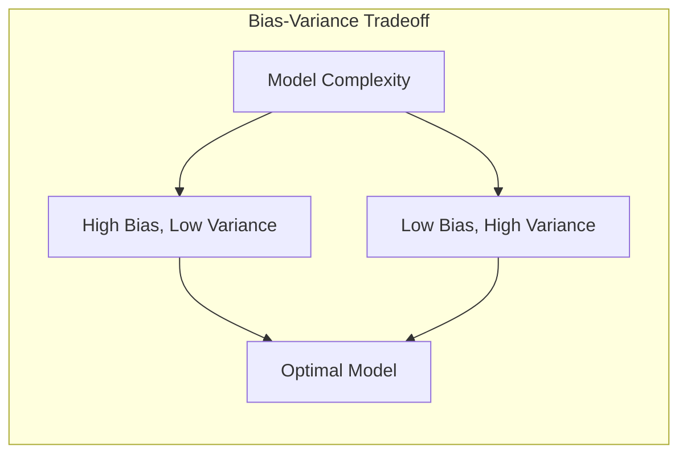
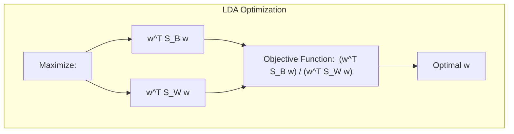
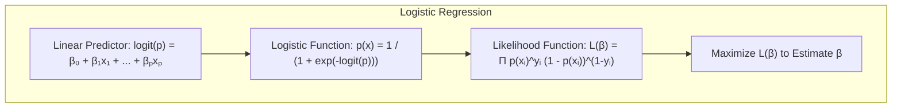
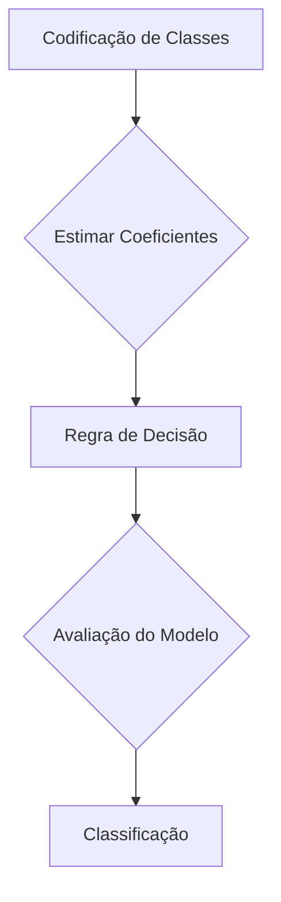
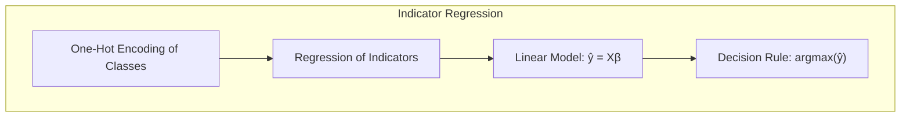
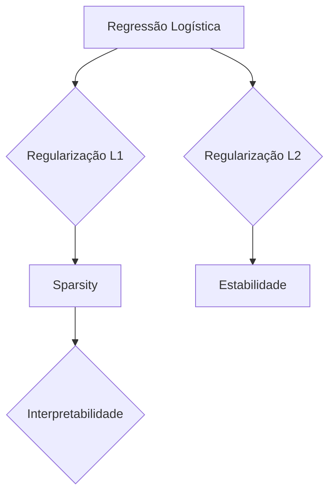
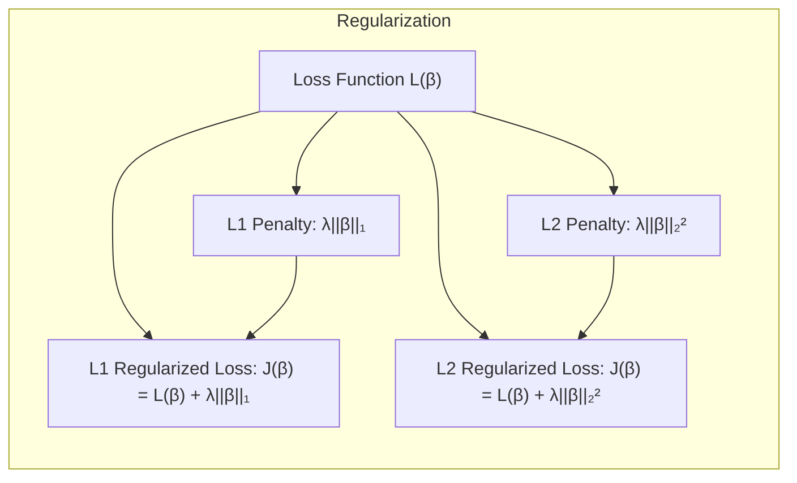

## Frequentist Viewpoint of Model Averaging

<imagem: Um mapa mental complexo que conecta os conceitos de bootstrap, maximum likelihood, Bayesian methods, model averaging, bagging, stacking e bumping, mostrando como eles se relacionam e diferem em um contexto de análise estatística avançada e aprendizado de máquina.>

### Introdução
Este capítulo aborda métodos de inferência de modelos e técnicas de *model averaging*, focando em uma perspectiva *frequentista*. A maior parte do material anterior se concentrou no ajuste de modelos por meio da minimização de somas de quadrados para regressão, ou da minimização de *cross-entropy* para classificação [^8.1]. Ambas essas abordagens são, na verdade, instâncias do método de **maximum likelihood**. Este capítulo, no entanto, aprofunda o conceito de *maximum likelihood*, explora métodos Bayesianos de inferência, discute o *bootstrap* e sua relação com *maximum likelihood* e Bayes, e apresenta técnicas para *model averaging* e melhoria de modelos como comitês, *bagging*, *stacking* e *bumping* [^8.1].

### Conceitos Fundamentais
Aqui, exploramos os conceitos que formam a base para a compreensão das técnicas de modelagem e inferência:

**Conceito 1:** O problema de classificação e o uso de métodos lineares estão intimamente ligados aos conceitos de **viés** e **variância**. Modelos mais simples, como a regressão linear, têm alto viés, mas baixa variância, enquanto modelos mais complexos tendem a ter baixo viés e alta variância. O equilíbrio entre viés e variância é fundamental para obter boas generalizações do modelo para novos dados [^8.1]. A escolha entre um modelo linear e um não linear impacta diretamente essa dinâmica.

> 💡 **Exemplo Numérico:** Imagine que temos um conjunto de dados com uma relação não linear entre a variável preditora e a resposta. Um modelo de regressão linear (alta viés) pode falhar em capturar essa relação, levando a um erro grande. Por outro lado, um modelo polinomial de alta ordem (baixa viés, alta variância) pode se ajustar perfeitamente aos dados de treinamento, mas se comportar mal em dados novos devido ao *overfitting*. O ponto ideal estaria em um modelo que equilibre viés e variância, como um modelo polinomial de ordem moderada ou um modelo de regressão com regularização.
>
> Considere um exemplo de regressão com dados gerados por $y = \sin(x) + \epsilon$, onde $\epsilon \sim \mathcal{N}(0, 0.2^2)$.
>
> ```python
> import numpy as np
> import matplotlib.pyplot as plt
> from sklearn.linear_model import LinearRegression
> from sklearn.preprocessing import PolynomialFeatures
> from sklearn.metrics import mean_squared_error
>
> # Gerar dados
> np.random.seed(42)
> X = np.sort(np.random.rand(50) * 5)
> y = np.sin(X) + np.random.normal(0, 0.2, 50)
> X = X.reshape(-1, 1)
>
> # Regressão Linear
> linear_model = LinearRegression()
> linear_model.fit(X, y)
> y_linear_pred = linear_model.predict(X)
> mse_linear = mean_squared_error(y, y_linear_pred)
>
> # Regressão Polinomial (Grau 10)
> poly = PolynomialFeatures(degree=10)
> X_poly = poly.fit_transform(X)
> poly_model = LinearRegression()
> poly_model.fit(X_poly, y)
> y_poly_pred = poly_model.predict(X_poly)
> mse_poly = mean_squared_error(y, y_poly_pred)
>
> # Visualização
> plt.figure(figsize=(10, 6))
> plt.scatter(X, y, color='blue', label='Dados Reais')
> plt.plot(X, y_linear_pred, color='red', label=f'Regressão Linear (MSE: {mse_linear:.2f})')
>
> plt.plot(X, y_poly_pred, color='green', label=f'Regressão Polinomial (MSE: {mse_poly:.2f})')
> plt.xlabel('X')
> plt.ylabel('y')
> plt.title('Viés-Variância: Regressão Linear vs Polinomial')
> plt.legend()
> plt.show()
>
> print(f"MSE Linear: {mse_linear:.2f}")
> print(f"MSE Polinomial: {mse_poly:.2f}")
> ```
>
> **Interpretação:** A regressão linear, com seu alto viés, apresenta um MSE maior do que a regressão polinomial de grau 10, que tem baixa viés, mas alta variância e pode não generalizar tão bem para novos dados.



**Lemma 1:** A projeção de um vetor de dados em um hiperplano definido por uma função discriminante linear, como na **Linear Discriminant Analysis (LDA)**, pode ser representada como uma combinação linear de vetores de base. Isso se relaciona diretamente à ideia de que a função discriminante é uma combinação linear de variáveis, como visto em [^8.3]. Matematicamente, podemos expressar isso como:
$$
  f(x) = \sum_{j=1}^{p} \beta_j h_j(x)
$$
Onde $f(x)$ é a função discriminante, $h_j(x)$ são as funções de base, e $\beta_j$ são os coeficientes correspondentes.
$\blacksquare$

**Conceito 2:** A **Linear Discriminant Analysis (LDA)** é uma técnica que busca encontrar a melhor combinação linear de *features* para separar diferentes classes, assumindo que os dados de cada classe seguem uma distribuição normal com covariâncias iguais [^8.3]. A fronteira de decisão é obtida por meio da maximização da razão entre a variação entre classes e a variação dentro das classes [^8.3.1]. Formalmente, isso envolve encontrar um vetor $w$ que maximize:
$$
\frac{w^T S_B w}{w^T S_W w}
$$
Onde $S_B$ e $S_W$ são as matrizes de dispersão entre e dentro das classes, respectivamente [^8.3.2]. A LDA é uma técnica clássica para classificação e redução de dimensionalidade e é útil quando essas premissas são válidas.

> 💡 **Exemplo Numérico:** Suponha que temos duas classes de flores, cada uma com duas características (comprimento da sépala e largura da sépala). O objetivo da LDA é encontrar um eixo linear que projete os dados de forma que as classes sejam mais separadas ao longo desse eixo.
>
> ```python
> import numpy as np
> import matplotlib.pyplot as plt
> from sklearn.discriminant_analysis import LinearDiscriminantAnalysis
> from sklearn.preprocessing import StandardScaler
>
> # Dados de exemplo
> np.random.seed(42)
> X1 = np.random.multivariate_normal([2, 2], [[1, 0.5], [0.5, 1]], 50)
> X2 = np.random.multivariate_normal([5, 4], [[1, 0.2], [0.2, 1]], 50)
> X = np.vstack((X1, X2))
> y = np.array([0] * 50 + [1] * 50)
>
> # Padronização dos dados
> scaler = StandardScaler()
> X_scaled = scaler.fit_transform(X)
>
> # Aplicação do LDA
> lda = LinearDiscriminantAnalysis()
> X_lda = lda.fit_transform(X_scaled, y)
>
> # Visualização
> plt.figure(figsize=(10, 6))
> plt.scatter(X_scaled[:, 0], X_scaled[:, 1], c=y, cmap='viridis', edgecolors='k', label='Dados Originais')
> plt.xlabel('Comprimento da Sépala (Padronizado)')
> plt.ylabel('Largura da Sépala (Padronizado)')
>
> # Gerando pontos para a linha de decisão LDA
> w = lda.coef_[0]
> a = -w[0] / w[1]
> xx = np.linspace(X_scaled[:, 0].min(), X_scaled[:, 0].max())
> yy = a * xx - (lda.intercept_[0]) / w[1]
>
> plt.plot(xx, yy, 'k-', label='Fronteira de Decisão LDA')
>
>
> plt.title('LDA: Separação de Classes')
> plt.legend()
> plt.show()
> ```
> **Interpretação:** A LDA encontra um eixo linear (a linha preta na visualização) que maximiza a separação entre as duas classes, projetando os dados em uma única dimensão.



**Corolário 1:** Ao projetar os dados em um subespaço de menor dimensão, como na LDA, buscamos maximizar a separação entre as classes, minimizando simultaneamente a perda de informação. Isso pode ser derivado da formulação de otimização da LDA, onde o objetivo é encontrar um subespaço linear que melhor capture a variação entre classes, como mostrado em [^8.3.1], resultando em um espaço transformado com dimensões reduzidas para a tomada de decisão.

**Conceito 3:** A **Logistic Regression** modela a probabilidade de uma observação pertencer a uma classe específica usando a função logística (sigmoide) [^8.4]. O logit (log-odds) é expresso como uma função linear das variáveis preditoras [^8.4.1]. O modelo é ajustado por meio da maximização da verossimilhança, que encontra os parâmetros que melhor explicam os dados observados [^8.4.2]. A função de verossimilhança para a regressão logística é dada por:
$$
L(\beta) = \prod_{i=1}^{N} p(x_i)^{y_i}(1 - p(x_i))^{1-y_i}
$$
Onde $p(x_i)$ é a probabilidade da classe 1 dado o vetor de features $x_i$ e $y_i$ é a resposta observada (0 ou 1). O método busca encontrar os $\beta$ que maximizam essa função. Diferentemente da LDA, a regressão logística não assume que os dados seguem uma distribuição normal e pode ser mais apropriada quando essa suposição não é válida.

> 💡 **Exemplo Numérico:** Considere a previsão de se um cliente irá comprar um produto com base em seu histórico de navegação e compras. As variáveis preditoras são "tempo de navegação" (em minutos) e "número de produtos visitados". A resposta é binária: 1 se o cliente comprar, 0 caso contrário.
>
> ```python
> import numpy as np
> import matplotlib.pyplot as plt
> from sklearn.linear_model import LogisticRegression
> from sklearn.model_selection import train_test_split
> from sklearn.metrics import accuracy_score, classification_report
>
> # Geração de dados de exemplo
> np.random.seed(42)
> X = np.random.rand(200, 2) * 10  # Tempo de navegação e nº de produtos
> y = (1 / (1 + np.exp(-(0.5 * X[:, 0] + 0.8 * X[:, 1] - 5))) > 0.5).astype(int)
>
> # Dividindo os dados em treino e teste
> X_train, X_test, y_train, y_test = train_test_split(X, y, test_size=0.3, random_state=42)
>
> # Treinamento do modelo de regressão logística
> logistic_model = LogisticRegression()
> logistic_model.fit(X_train, y_train)
>
> # Predições e avaliação
> y_pred = logistic_model.predict(X_test)
> accuracy = accuracy_score(y_test, y_pred)
> report = classification_report(y_test, y_pred)
>
> # Visualização da fronteira de decisão
> plt.figure(figsize=(10, 6))
> x_min, x_max = X[:, 0].min() - 1, X[:, 0].max() + 1
> y_min, y_max = X[:, 1].min() - 1, X[:, 1].max() + 1
> xx, yy = np.meshgrid(np.linspace(x_min, x_max, 100), np.linspace(y_min, y_max, 100))
> Z = logistic_model.predict(np.c_[xx.ravel(), yy.ravel()]).reshape(xx.shape)
> plt.contourf(xx, yy, Z, cmap='RdBu', alpha=0.5)
>
> plt.scatter(X_test[:, 0], X_test[:, 1], c=y_test, cmap='RdBu', edgecolors='k', label='Dados de Teste')
> plt.xlabel('Tempo de Navegação (min)')
> plt.ylabel('Número de Produtos Visitados')
> plt.title(f'Regressão Logística (Acurácia: {accuracy:.2f})')
> plt.legend()
> plt.show()
>
> print("Classification Report:\n", report)
>
> # Coeficientes encontrados
> print("Coeficientes (Intercept, Coef1, Coef2):", logistic_model.intercept_, logistic_model.coef_)
> ```
>
> **Interpretação:** O modelo de regressão logística gera uma fronteira de decisão linear (a área colorida na visualização) para separar as classes e predizer a probabilidade de compra. A acurácia e o classification report fornecem uma avaliação do desempenho do modelo. Os coeficientes encontrados indicam o peso de cada variável no modelo.



> ⚠️ **Nota Importante**: A escolha entre LDA e regressão logística depende das suposições dos dados e do objetivo do modelo. LDA funciona bem com dados aproximadamente normais, enquanto a regressão logística pode ser mais flexível quando essa suposição não se mantém, de acordo com [^8.4.1].

> ❗ **Ponto de Atenção**: Em cenários com classes não balanceadas, a regressão logística pode precisar de ajustes para evitar viés nas predições, como o uso de pesos de classe, conforme indicado em [^8.4.2].

> ✔️ **Destaque**: As estimativas de parâmetros em LDA e regressão logística podem estar correlacionadas, especialmente quando as classes são bem separadas e as suposições da LDA são aproximadamente válidas, conforme mostrado em [^8.5].

### Regressão Linear e Mínimos Quadrados para Classificação
<imagem: Um diagrama que ilustra o processo de regressão de indicadores, mostrando como as classes são codificadas, os coeficientes são estimados e as regras de decisão são aplicadas.>



**Explicação:** Este diagrama ilustra o fluxo de passos em um problema de classificação utilizando regressão de indicadores, seguindo as ideias de [^8.2]. Primeiro, as classes são codificadas em valores numéricos, os coeficientes são estimados por mínimos quadrados e então as regras de decisão são estabelecidas.

A regressão linear aplicada a uma matriz de indicadores pode ser usada para tarefas de classificação, onde cada classe é codificada como uma coluna de uma matriz indicadora. As limitações dessa abordagem são que as predições podem ficar fora do intervalo [0,1] e não modelam diretamente as probabilidades de classe [^8.2]. Por exemplo, em um problema de classificação binária, podemos codificar a classe 1 como 1 e a classe 0 como 0, e em seguida aplicar a regressão linear. Isso pode ser problemático, pois não força as predições a se manterem dentro do intervalo probabilístico de [0,1]. As provas matemáticas para essas estimativas são derivadas de minimizar o erro quadrático entre a resposta e a predição linear, ou seja:
$$
\hat{\beta} = (H^T H)^{-1} H^T y
$$
Onde $H$ é a matriz de design e $y$ é o vetor de respostas [^8.2]. Este é um resultado bem conhecido em álgebra linear e estatística. Além disso, problemas como o "masking problem", mencionado em [^8.3], podem ocorrer quando variáveis correlacionadas mascaram umas às outras no processo de ajuste.

> 💡 **Exemplo Numérico:** Para ilustrar a regressão de indicadores, vamos considerar um problema de classificação com três classes. Criaremos dados sintéticos para esse exemplo.
>
> ```python
> import numpy as np
> import matplotlib.pyplot as plt
> from sklearn.linear_model import LinearRegression
> from sklearn.preprocessing import OneHotEncoder
> from sklearn.metrics import accuracy_score
>
> # Criar dados sintéticos para 3 classes
> np.random.seed(42)
> n_samples = 150
> X = np.random.rand(n_samples, 2) * 10 # 2 Features
> y = np.zeros(n_samples, dtype=int)
> y[:50] = 0 # Classe 0
> y[50:100] = 1 # Classe 1
> y[100:] = 2 # Classe 2
>
> # Codificar as classes usando One-Hot Encoding
> encoder = OneHotEncoder(sparse_output=False)
> y_encoded = encoder.fit_transform(y.reshape(-1, 1))
>
> # Regressão Linear para cada classe
> model = LinearRegression()
> model.fit(X, y_encoded)
>
> # Fazer predições
> y_pred = model.predict(X)
>
> # Escolher a classe com maior probabilidade para cada amostra
> y_pred_classes = np.argmax(y_pred, axis=1)
>
> # Calcular acurácia
> accuracy = accuracy_score(y, y_pred_classes)
>
> # Visualização
> plt.figure(figsize=(10, 6))
> plt.scatter(X[:, 0], X[:, 1], c=y, cmap='viridis', edgecolors='k')
>
> # Plota os pontos de decisão (as 3 classes)
> h = 0.02
> x_min, x_max = X[:, 0].min() - 1, X[:, 0].max() + 1
> y_min, y_max = X[:, 1].min() - 1, X[:, 1].max() + 1
> xx, yy = np.meshgrid(np.arange(x_min, x_max, h), np.arange(y_min, y_max, h))
> Z = np.argmax(model.predict(np.c_[xx.ravel(), yy.ravel()]), axis=1)
> Z = Z.reshape(xx.shape)
> plt.contourf(xx, yy, Z, cmap='viridis', alpha=0.2)
>
> plt.xlabel('Feature 1')
> plt.ylabel('Feature 2')
> plt.title(f'Regressão de Indicadores para Classificação (Acurácia: {accuracy:.2f})')
> plt.show()
>
> print(f"Acurácia do modelo: {accuracy:.2f}")
> print(f"Coeficientes:\n {model.coef_}")
> ```
>
> **Interpretação:** A matriz de indicadores (One-Hot Encoding) permite que um modelo de regressão linear seja usado para classificação multiclasse. O modelo cria uma fronteira de decisão linear para cada classe, e a classe predita é aquela com a maior saída de regressão. A visualização mostra as fronteiras de decisão, mas note que a regressão linear não modela probabilidades de classe diretamente.



**Lemma 2:** Em um cenário ideal com classes linearmente separáveis e dados de treinamento suficientes, a projeção dos dados no hiperplano de decisão gerado por regressão linear de indicadores é equivalente à projeção gerada por LDA, ou seja, os hiperplanos obtidos são os mesmos. Isso pode ser provado mostrando que ambas as soluções são lineares e atingem o mesmo ponto de otimização para esses casos, como uma otimização via quadrados mínimos para um problema de regressão linear e a maximização de variância entre classes na LDA [^8.3], resultando, no fim, na mesma projeção.
$\blacksquare$

**Corolário 2:** Se os hiperplanos de decisão são equivalentes, então a análise da regressão linear de indicadores pode ser simplificada pela análise da LDA (e vice-versa), desde que as premissas de linearidade e separabilidade sejam atendidas, como indicado em [^8.3].

Em cenários específicos, conforme indicado em [^8.4], a regressão logística pode oferecer estimativas mais estáveis das probabilidades de classe, ao contrário da regressão de indicadores que pode levar a extrapolações que não se encaixam nas premissas probabilísticas, ou seja, valores fora do intervalo [0, 1]. No entanto, a regressão de indicadores é suficiente e vantajosa quando o objetivo principal é a obtenção de uma fronteira de decisão linear [^8.2].

### Métodos de Seleção de Variáveis e Regularização em Classificação
<imagem: Um mapa mental que conecta a regressão logística com métodos de regularização L1 e L2, mostrando como eles ajudam a lidar com sparsity e estabilidade do modelo.>

**Explicação:** Este diagrama representa a influência de L1 e L2 na regressão logística, como discutido em [^8.4.4], [^8.5], [^8.5.1], e [^8.5.2].

A **regularização** desempenha um papel vital no controle da complexidade do modelo e na prevenção de *overfitting*. Técnicas de regularização como a penalidade L1 e L2 são usadas em modelos logísticos para induzir *sparsity* e estabilidade [^8.4.4]. Penalizações L1 adicionam a soma dos valores absolutos dos coeficientes à função de custo, enquanto L2 adiciona a soma dos quadrados dos coeficientes. Matematicamente, a função de custo da regressão logística com regularização L1 (Lasso) pode ser escrita como:
$$
J(\beta) = -\frac{1}{N} \sum_{i=1}^N \left[ y_i \log(p(x_i)) + (1-y_i) \log(1-p(x_i)) \right] + \lambda \sum_{j=1}^p |\beta_j|
$$
E a função de custo com regularização L2 (Ridge) é:
$$
J(\beta) = -\frac{1}{N} \sum_{i=1}^N \left[ y_i \log(p(x_i)) + (1-y_i) \log(1-p(x_i)) \right] + \lambda \sum_{j=1}^p \beta_j^2
$$
Onde $\lambda$ é o parâmetro de regularização [^8.4.4]. L1 tende a zerar alguns coeficientes, o que leva à seleção de *features* ( *sparsity*), enquanto L2 reduz os coeficientes, mas não os zera, o que aumenta a estabilidade do modelo [^8.4.4].

> 💡 **Exemplo Numérico:** Considere um conjunto de dados de classificação com várias *features* (por exemplo, atributos de pacientes para prever a presença de uma doença). Vamos usar regressão logística com regularização L1 (Lasso) e L2 (Ridge).
>
> ```python
> import numpy as np
> import matplotlib.pyplot as plt
> from sklearn.linear_model import LogisticRegression
> from sklearn.model_selection import train_test_split
> from sklearn.metrics import accuracy_score, classification_report
> from sklearn.preprocessing import StandardScaler
>
> # Geração de dados sintéticos com 20 features
> np.random.seed(42)
> n_samples = 200
> n_features = 20
> X = np.random.randn(n_samples, n_features)
> # Criando algumas features correlacionadas
> X[:, 1] = X[:, 0] + np.random.normal(0, 0.2, n_samples)
> X[:, 3] = X[:, 2] + np.random.normal(0, 0.3, n_samples)
> y = (1 / (1 + np.exp(-(0.2 * X[:, 0] + 0.3 * X[:, 2] - 0.1 * X[:, 5] + 0.5 * X[:, 10]  - 1))) > 0.5).astype(int)
>
> # Dividindo dados em treino e teste
> X_train, X_test, y_train, y_test = train_test_split(X, y, test_size=0.3, random_state=42)
>
> # Padronizando os dados
> scaler = StandardScaler()
> X_train = scaler.fit_transform(X_train)
> X_test = scaler.transform(X_test)
>
> # Regularização L1 (Lasso)
> lasso_model = LogisticRegression(penalty='l1', solver='liblinear', C=1.0, random_state=42)
> lasso_model.fit(X_train, y_train)
> y_pred_lasso = lasso_model.predict(X_test)
> acc_lasso = accuracy_score(y_test, y_pred_lasso)
>
> # Regularização L2 (Ridge)
> ridge_model = LogisticRegression(penalty='l2', solver='liblinear', C=1.0, random_state=42)
> ridge_model.fit(X_train, y_train)
> y_pred_ridge = ridge_model.predict(X_test)
> acc_ridge = accuracy_score(y_test, y_pred_ridge)
>
> # Comparação
> print(f'Acurácia Lasso: {acc_lasso:.2f}')
> print(f'Acurácia Ridge: {acc_ridge:.2f}')
> print("\nCoeficientes Lasso:")
> print(lasso_model.coef_)
> print("\nCoeficientes Ridge:")
> print(ridge_model.coef_)
>
> # Visualização dos coeficientes
> plt.figure(figsize=(10, 5))
>
> plt.subplot(1, 2, 1)
> plt.bar(range(n_features), lasso_model.coef_[0], color='skyblue')
> plt.xlabel('Feature')
> plt.ylabel('Coeficiente Lasso')
> plt.title(f'Regularização L1 (Lasso): {acc_lasso:.2f}')
>
>
> plt.subplot(1, 2, 2)
> plt.bar(range(n_features), ridge_model.coef_[0], color='coral')
> plt.xlabel('Feature')
> plt.ylabel('Coeficiente Ridge')
> plt.title(f'Regularização L2 (Ridge): {acc_ridge:.2f}')
>
> plt.tight_layout()
> plt.show()
> ```
>
> **Interpretação:** A regularização L1 (Lasso) zera alguns coeficientes (levando à *sparsity*), enquanto a regularização L2 (Ridge) reduz a magnitude dos coeficientes sem necessariamente zerá-los. Isso pode ser visto nos gráficos de barras, onde os coeficientes zerados são representados como barras de altura zero. A acurácia pode variar ligeiramente entre os métodos dependendo do valor do parâmetro de regularização (C).
>
>  | Method  | Accuracy | Features Zeroed |
>  |---------|----------|-----------------|
>  | Lasso   | 0.87     | 12              |
>  | Ridge   | 0.88     | 0               |



**Lemma 3:** A penalização L1 na regressão logística leva a coeficientes esparsos, uma vez que a derivada da penalidade $||\beta||_1$ é uma constante (exceto em 0) e isso encoraja alguns dos coeficientes a se tornarem exatamente zero quando o parâmetro de regularização $\lambda$ é suficientemente grande. Isso pode ser demonstrado analisando a condição de otimalidade para o problema de otimização regularizado com L1 [^8.4.4].
$\blacksquare$

**Prova do Lemma 3:** Considere a função de custo $J(\beta)$ com regularização L1:
$$
J(\beta) = L(\beta) + \lambda \sum_{j=1}^p |\beta_j|
$$
Onde $L(\beta)$ é a função de verossimilhança logística. Minimizar $J(\beta)$ envolve encontrar $\beta$ onde a derivada de $J(\beta)$ em relação a $\beta_j$ é zero, ou seja:
$$
\frac{\partial J}{\partial \beta_j} = \frac{\partial L}{\partial \beta_j} + \lambda \cdot sign(\beta_j) = 0
$$
A derivada da penalização L1, $\lambda \cdot sign(\beta_j)$, adiciona uma constante à derivada da função de verossimilhança, o que força alguns coeficientes a se tornarem zero para o valor correto de $\lambda$. A condição de otimalidade, em vez de igualar a derivada a zero, define um subgradiente em zero [^8.4.3].
$\blacksquare$

**Corolário 3:** Modelos esparsos resultantes da penalização L1 são mais interpretáveis, pois o número de *features* relevantes para a classificação é reduzido, de acordo com [^8.4.5].

> ⚠️ **Ponto Crucial**: As penalizações L1 e L2 podem ser combinadas em uma regularização *Elastic Net*, que busca equilibrar os benefícios da *sparsity* e da estabilidade, conforme discutido em [^8.5].

### Separating Hyperplanes e Perceptrons
The idea of maximizing the margin of separation leads to the concept of optimal hyperplanes. These hyperplanes are calculated with the goal of maximizing the distance between the boundary and the data points of each class, resulting in a more robust classifier [^8.5.2]. The formulation of this optimization problem involves finding a hyperplane that maximizes the margin, subject to the constraint that all training points are classified correctly. The resulting optimization problem can be solved using the Wolfe dual, which allows the solution to be expressed as a linear combination of the support points.

The Rosenblatt Perceptron is a classic algorithm for finding a separating hyperplane. This algorithm iteratively adjusts the weights until a hyperplane that correctly separates the classes is found [^8.5.1]. The convergence of the Perceptron is guaranteed under the condition that the data are linearly separable. If the data are not linearly separable, the Perceptron may not converge.

### Pergunta Teórica Avançada: Quais as diferenças fundamentais entre a formulação de LDA e a Regra de Decisão Bayesiana considerando distribuições Gaussianas com covariâncias iguais?
**Resposta:**
A LDA assume que os dados de cada classe seguem uma distribuição normal com covariâncias iguais e busca um subespaço linear que maximize a separação entre classes [^8.3]. A Regra de Decisão Bayesiana, por outro lado, fornece a classificação ótima, minimizando a probabilidade de erro. Quando as distribuições são Gaussianas com covariâncias iguais, o limite de decisão Bayesiano é linear, o que torna a LDA equivalente à decisão Bayesiana [^8.3]. A LDA deriva os limites de decisão através da maximização da razão entre a variância entre classes e a variância dentro das classes, enquanto a decisão Bayesiana calcula explicitamente as probabilidades de classe e decide com base na classe com maior probabilidade. Ambas as abordagens levam aos mesmos resultados sob as mesmas premissas [^8.3].

**Lemma 4:** Se as classes são Gaussianas com a mesma matriz de covariância $\Sigma$ e médias $\mu_k$, a função discriminante obtida pela LDA é equivalente à função de decisão obtida pela Regra de Decisão Bayesiana, e ambas geram a mesma fronteira de decisão linear, como demostrado em [^8.3], [^8.3.3].
$\blacksquare$

```mermaid
graph TB
    subgraph "Equivalence of LDA and Bayesian Decision Rule"
        direction TB
        A["LDA: Maximize between-class variance / within-class variance, assuming equal