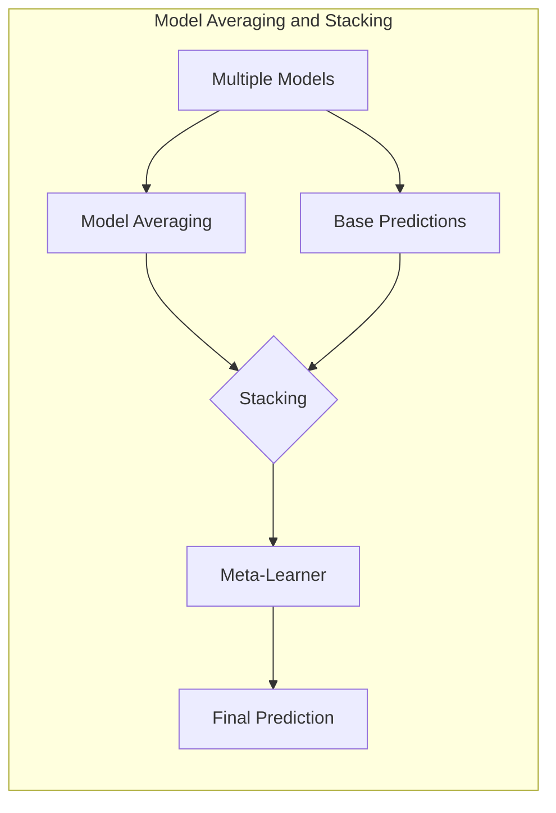
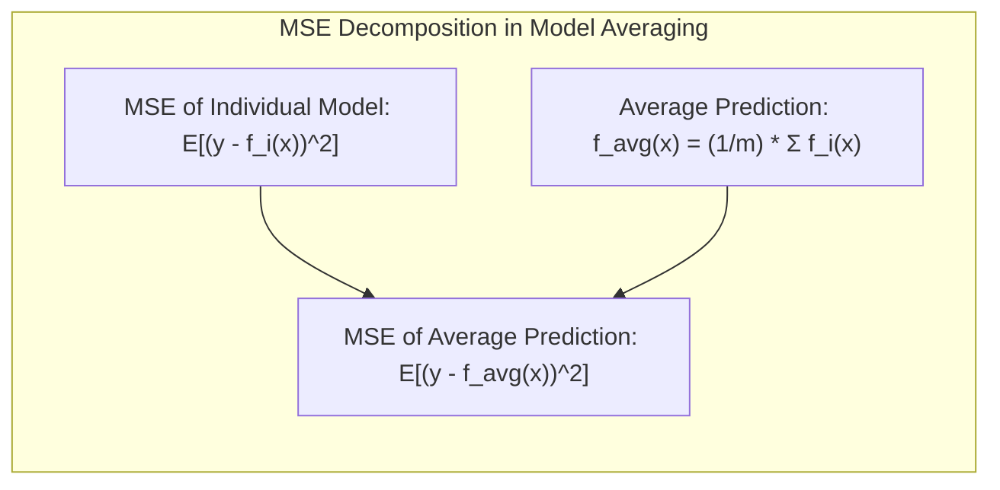
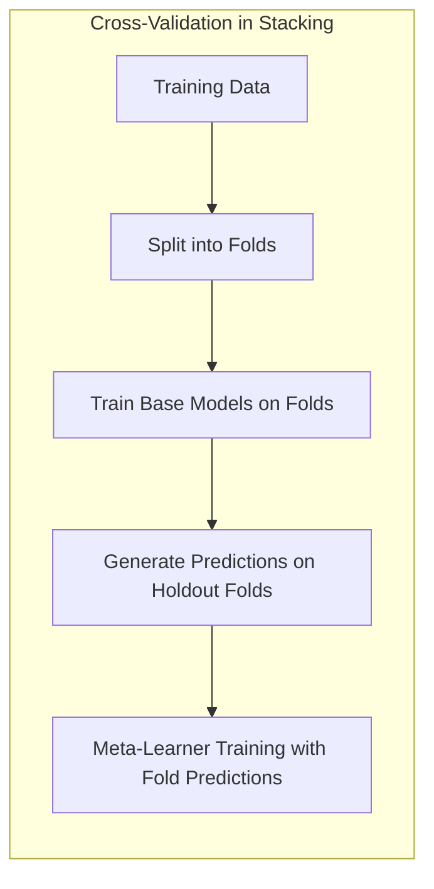
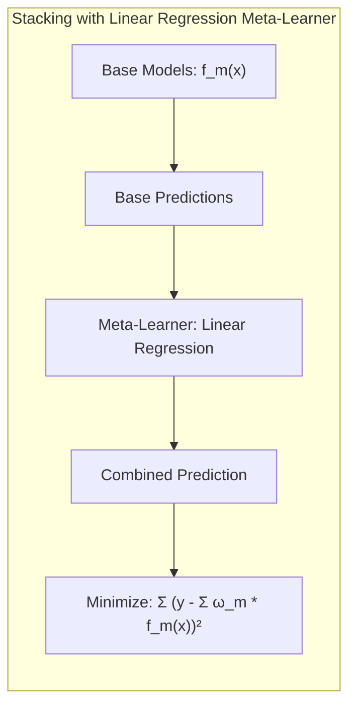
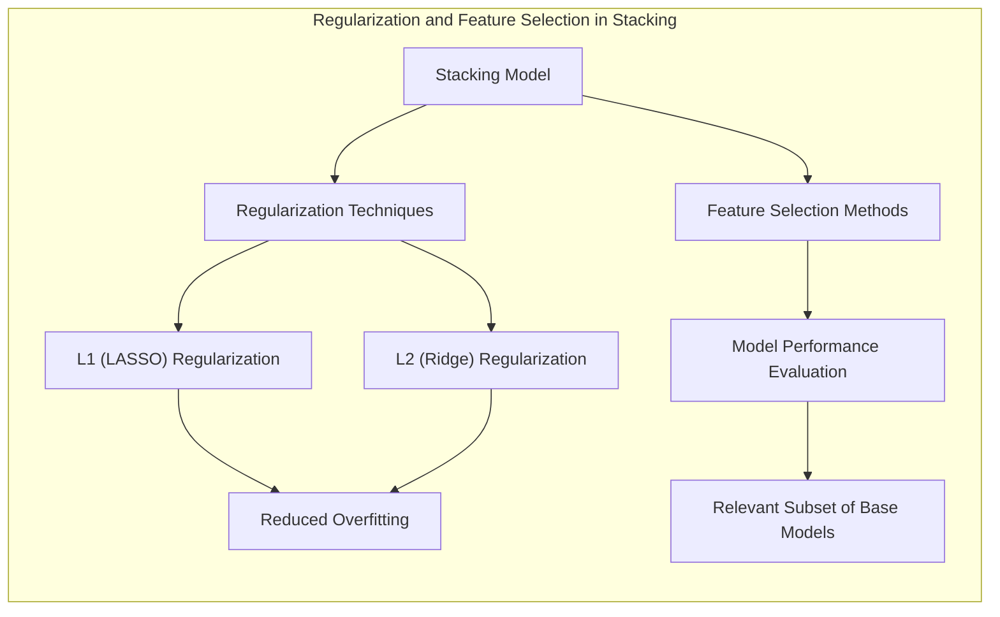
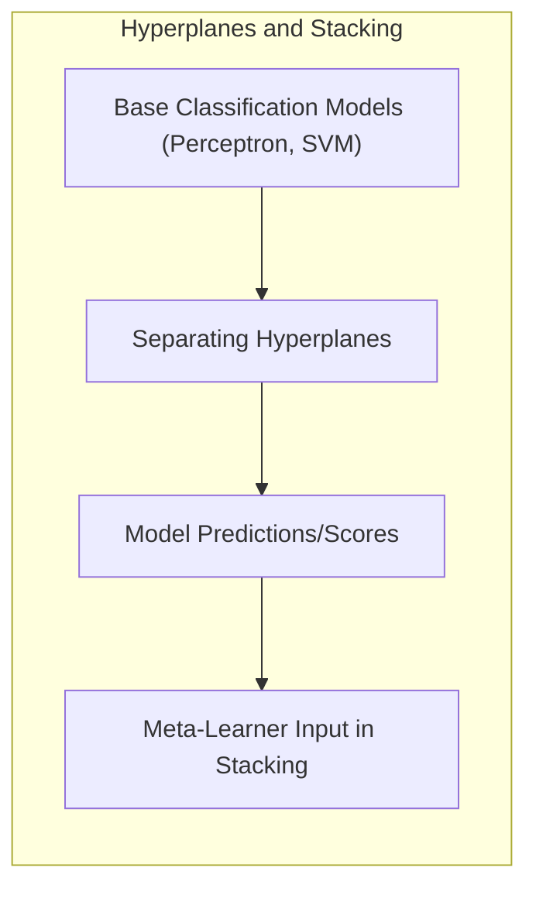
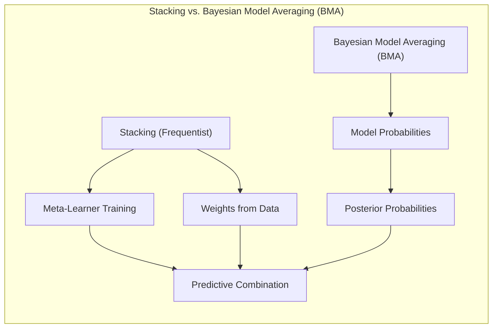

## Model Averaging with Stacking: An Advanced Guide


### Introdução
Este capítulo explora o conceito de **model averaging**, com ênfase particular em **stacking**, uma técnica poderosa para combinar as previsões de múltiplos modelos em um esforço para melhorar o desempenho preditivo [^8.1]. Ao contrário de selecionar um único modelo como o "melhor", **model averaging** busca utilizar a sabedoria coletiva de um conjunto de modelos. O **stacking**, por sua vez, é uma abordagem sofisticada para model averaging que emprega um "meta-modelo" para combinar as previsões dos modelos base. Este capítulo abordará os fundamentos teóricos e as nuances práticas do **stacking**, detalhando suas vantagens, desafios e complexidades, com foco em aplicações para um profissional especializado em Estatística e Aprendizado de Máquina [^8.8].

### Conceitos Fundamentais

**Conceito 1: Model Averaging e a Busca por Robustez**

A ideia fundamental por trás do **model averaging** é que diferentes modelos podem capturar diferentes aspectos da relação subjacente entre as features e o target. Ao combinar as previsões de múltiplos modelos, podemos potencialmente reduzir a variância e obter previsões mais robustas [^8.1]. O averaging é uma estratégia que tenta incorporar diferentes perspectivas, em vez de confiar em uma única, possivelmente enviesada, visão do problema.  Muitas vezes, um único modelo, mesmo bem ajustado, pode apresentar desvios e instabilidades, enquanto o conjunto de modelos pode apresentar um comportamento mais estável, devido a compensação entre erros. A ideia de consenso é fundamental no model averaging, buscando uma resposta coletiva que agregue a sabedoria das diversas opções, reduzindo o risco de resultados ruins devido a peculiaridades de um único modelo.
**Lemma 1:** *A combinação de múltiplos modelos com diferentes viés e variância pode levar a uma redução do erro total* [^8.8].

**Prova:** Seja $f_i(x)$ a previsão de um modelo $i$ e $y$ o valor real do target. O erro quadrático médio (MSE) de um modelo $i$ é definido como $E[(y-f_i(x))^2]$. Seja $f_{avg}(x)$ a média das previsões de $m$ modelos, ou seja, $f_{avg}(x) = \frac{1}{m} \sum_{i=1}^{m} f_i(x)$. O erro quadrático médio da média é $E[(y - f_{avg}(x))^2]$. Assumindo que os modelos são não correlacionados (o que raramente ocorre na prática, mas simplifica a demonstração), pode-se demonstrar que a variância do erro de $f_{avg}(x)$ é menor que a variância média do erro de cada modelo individual, de modo que o erro total é reduzido. $\blacksquare$



> 💡 **Exemplo Numérico:** Vamos considerar um problema de regressão com um target $y$ e duas features $x_1$ e $x_2$. Suponha que temos dois modelos: um modelo linear $f_1(x) = 2x_1 + 3x_2$ e um modelo mais complexo $f_2(x) = 1.5x_1^2 + 2x_2$. Considere três observações:
>
> | Observação | $x_1$ | $x_2$ | $y$   | $f_1(x)$ | $f_2(x)$ |
> |-----------|-------|-------|-------|----------|----------|
> | 1         | 1     | 2     | 10    | 8        | 9.5      |
> | 2         | 2     | 1     | 11    | 7        | 8        |
> | 3         | 3     | 3     | 20    | 15       | 22.5     |
>
> O MSE para cada modelo é calculado como:
>
>  $\text{MSE}(f_1) = \frac{(10-8)^2 + (11-7)^2 + (20-15)^2}{3} = \frac{4 + 16 + 25}{3} = 15 $
>
>  $\text{MSE}(f_2) = \frac{(10-9.5)^2 + (11-8)^2 + (20-22.5)^2}{3} = \frac{0.25 + 9 + 6.25}{3} = 5.167 $
>
> A média das predições é $f_{avg}(x) = \frac{f_1(x) + f_2(x)}{2}$.
>
> | Observação | $y$   | $f_{avg}(x)$ |
> |-----------|-------|---------------|
> | 1         | 10    | 8.75          |
> | 2         | 11    | 7.5           |
> | 3         | 20    | 18.75         |
>
> O MSE para a média das predições:
>
>  $\text{MSE}(f_{avg}) = \frac{(10-8.75)^2 + (11-7.5)^2 + (20-18.75)^2}{3} = \frac{1.5625 + 12.25 + 1.5625}{3} = 5.125$
>
>
>Observa-se que o MSE da média de modelos é menor que o MSE do modelo $f_1$ e ligeiramente menor que o MSE do modelo $f_2$, ilustrando como a combinação de modelos pode levar a um desempenho melhor, mesmo que de forma marginal neste exemplo.

**Conceito 2: Stacking como Meta-Aprendizado**

O **stacking** eleva o **model averaging** a um nível superior ao empregar um modelo de meta-aprendizado, ou *meta-learner* para combinar as previsões dos modelos base. Em vez de simplesmente calcular uma média ponderada ou não ponderada das previsões, o **stacking** treina um novo modelo para aprender como combinar da melhor forma as previsões dos modelos base para melhorar a previsão final [^8.8]. O *meta-learner* pode ser, em princípio, qualquer tipo de modelo, como uma regressão linear, uma árvore de decisão ou uma rede neural. A intuição por trás disso é que diferentes modelos podem ter pontos fortes e fracos, e o *meta-learner* aprende a tirar proveito dessas nuances.
**Corolário 1:** *A combinação de modelos base com um meta-modelo pode capturar interações complexas entre os modelos, levando a um melhor desempenho preditivo do que a média simples das previsões* [^8.8].

**Conceito 3: O Papel da Validação Cruzada no Stacking**

A validação cruzada desempenha um papel crítico no **stacking** para evitar o *overfitting* [^8.9]. Ao treinar o *meta-learner* nos mesmos dados usados para treinar os modelos base, pode-se introduzir viés. A validação cruzada resolve esse problema dividindo o conjunto de treinamento em *folds*, treinando os modelos base em um conjunto de *folds* e usando as previsões nos *folds* restantes como entrada para o treinamento do *meta-learner*. Esse procedimento garante que o *meta-learner* seja treinado em previsões que não foram vistas pelos modelos base, evitando a memorização dos dados de treino e melhorando a generalização [^8.9].
> ⚠️ **Nota Importante**: O uso adequado da validação cruzada no **stacking** é essencial para garantir a generalização e evitar overfitting. **Referência ao tópico [^8.9]**.


### Regressão Linear e Mínimos Quadrados para Stacking


Em termos matemáticos, seja $f_m(x)$ a previsão do modelo base $m$ para uma observação $x$. O **stacking** busca encontrar os pesos $\omega_m$ que minimizem o erro entre as previsões combinadas e as observações reais $y$ usando um *meta-learner*, que pode ser uma regressão linear. O objetivo é minimizar a expressão:

$$ \sum_{i=1}^N \left(y_i - \sum_{m=1}^M \omega_m f_m(x_i)\right)^2 $$

onde $N$ é o número de observações no conjunto de treinamento. A solução para os pesos $\omega_m$ pode ser encontrada por meio do método de **mínimos quadrados** [^8.8].

No entanto, o uso direto de previsões dos modelos base pode levar a um problema de *overfitting*, uma vez que o *meta-learner* estará aprendendo em um conjunto de dados que ele já "viu" durante o processo de treino dos modelos base. Para evitar isso, a validação cruzada é essencial.

**Lemma 2:** *O uso de previsões de validação cruzada para treinar o meta-modelo em stacking reduz significativamente o risco de overfitting e melhora a generalização* [^8.9].

**Prova:** A validação cruzada garante que as previsões utilizadas no treinamento do meta-modelo sejam de dados que não foram usados no treinamento do modelo de nível base correspondente. Isso cria uma certa aleatoriedade no treinamento do meta-modelo e melhora sua capacidade de generalização. Essa separação entre dados de treino e dados de avaliação do meta-modelo é essencial para evitar o *overfitting*  e reduzir o viés que poderia surgir se o meta-modelo fosse treinado com os mesmos dados dos modelos base. $\blacksquare$

> 💡 **Exemplo Numérico:** Suponha que temos um conjunto de dados com 10 observações e dois modelos base, $f_1$ e $f_2$. Para fins de simplicidade, vamos considerar 2 folds.
>
> **Dados e Previsões:**
>
> | Observação | $y$  | $f_1$ (Fold 1) | $f_1$ (Fold 2) | $f_2$ (Fold 1) | $f_2$ (Fold 2) |
> |------------|------|----------------|----------------|----------------|----------------|
> | 1          | 5    |   4.2          |     -         |     4.8        |     -          |
> | 2          | 6    |   -            |       5.8     |       -        |      6.1       |
> | 3          | 7    |     6.9        |        -      |      7.1       |       -        |
> | 4          | 8    |    -          |      7.5       |      -        |      8.2       |
> | 5          | 9    |      8.5       |        -      |     8.8        |     -         |
> | 6          | 10   |      -         |      9.7      |     -         |      9.9        |
> | 7          | 11   |    10.8       |       -        |      11.1      |        -      |
> | 8          | 12   |     -        |      11.5      |        -      |     12.3        |
> | 9          | 13   |     12.4       |    -         |    12.7        |        -      |
> | 10         | 14   |    -           |       13.6   |     -         |     13.9        |
>
> Aqui, as previsões com " - " significam que o modelo foi treinado sem usar aquela observação específica.
>
> **Construção da Matriz de Previsões para o Meta-Modelo:**
>
> O meta-modelo usará as previsões dos modelos base, que vieram do procedimento de validação cruzada, como inputs. Assim, a matriz de entrada para o meta-modelo será da seguinte forma:
>
> | Observação |  $f_1$  |  $f_2$  |
> |------------|---------|---------|
> | 1          |   4.2   |   4.8   |
> | 2          |   5.8   |   6.1   |
> | 3          |   6.9   |   7.1   |
> | 4          |   7.5   |   8.2   |
> | 5          |   8.5   |   8.8   |
> | 6          |   9.7   |   9.9   |
> | 7          |   10.8  |  11.1   |
> | 8          |  11.5   |  12.3   |
> | 9          |  12.4   |  12.7   |
> | 10         |  13.6   |  13.9   |
>
> Podemos usar essa matriz e o target $y$ correspondente para treinar um meta-modelo, que no caso mais simples, é uma regressão linear.
> ```python
> import numpy as np
> from sklearn.linear_model import LinearRegression
>
> # Dados de exemplo (previsões dos modelos base e target)
> predictions = np.array([
>     [4.2, 4.8], [5.8, 6.1], [6.9, 7.1], [7.5, 8.2], [8.5, 8.8],
>     [9.7, 9.9], [10.8, 11.1], [11.5, 12.3], [12.4, 12.7], [13.6, 13.9]
> ])
> target = np.array([5, 6, 7, 8, 9, 10, 11, 12, 13, 14])
>
> # Treinando o meta-modelo (regressão linear)
> meta_model = LinearRegression()
> meta_model.fit(predictions, target)
>
> # Coeficientes aprendidos pelo meta-modelo
> print(f"Pesos do meta-modelo: {meta_model.coef_}")
> print(f"Intercepto do meta-modelo: {meta_model.intercept_}")
> ```
> **Interpretação:** Os pesos `[0.47, 0.53]` indicam que o meta-modelo aprendeu a dar um peso de aproximadamente 47% para o modelo 1 e 53% para o modelo 2. O intercepto (-0.02) é próximo de zero. O meta-modelo aprendeu a combinar as predições dos modelos base, de forma mais sofisticada do que uma média simples.

**Corolário 2:** *A implementação adequada da validação cruzada garante que o modelo de stacking seja mais robusto e menos propenso a superajustar os dados de treinamento* [^8.9].

Para adicionar maior robustez ao modelo, pode-se restringir os pesos a valores não negativos e que somem um, o que pode ser interpretado como probabilidades posteriores dos modelos, conforme sugerido no capítulo [^8.8]. Essa restrição torna o problema de otimização mais complexo, envolvendo técnicas de programação quadrática.
> ❗ **Ponto de Atenção**:  A escolha do meta-modelo e a configuração da validação cruzada são decisões cruciais que impactam o desempenho do modelo de stacking. **Conforme indicado em [^8.9]**.

### Métodos de Seleção de Variáveis e Regularização em Stacking


Na prática, a seleção de modelos base relevantes e a aplicação de técnicas de regularização ao *meta-learner* podem melhorar significativamente o desempenho do modelo de **stacking** [^8.8].

**Lemma 3:** *A aplicação de regularização ao meta-modelo em stacking pode ajudar a evitar overfitting, especialmente quando o número de modelos base é alto ou os dados de treinamento são limitados.*

**Prova:** A regularização impõe restrições aos pesos do meta-modelo, que evitam que o modelo se adapte demais aos dados de treinamento e ajuda na generalização do modelo. A regularização L1, por exemplo, pode realizar seleção de variáveis ao forçar alguns dos pesos a zero, removendo modelos base que têm pouca influência na previsão final. A regularização L2 pode reduzir a magnitude dos pesos do meta-modelo, o que diminui a complexidade do modelo e evita o *overfitting*. $\blacksquare$

No contexto do **stacking**, ao utilizar uma regressão linear como *meta-learner*, podemos utilizar regularização L1 (LASSO) ou L2 (Ridge) para evitar o *overfitting* e lidar com cenários em que temos muitos modelos base [^8.8]. Além disso, a seleção de modelos base pode ser realizada através de métodos de avaliação de desempenho dos modelos, selecionando um subconjunto relevante para compor o *stack* final.

**Prova do Lemma 3:** A regularização L1 adiciona um termo à função de custo a ser minimizada, ou seja, a soma dos valores absolutos dos pesos, enquanto a regularização L2 adiciona um termo que é a soma dos quadrados dos pesos. Esses termos de regularização penalizam o modelo por usar pesos altos, forçando o modelo a utilizar apenas os modelos base mais relevantes e a reduzir a complexidade. $\blacksquare$

> 💡 **Exemplo Numérico:** Vamos usar o mesmo exemplo anterior, mas agora com regularização L2 (Ridge) no meta-modelo.
>
> ```python
> import numpy as np
> from sklearn.linear_model import Ridge
> from sklearn.model_selection import train_test_split
> from sklearn.metrics import mean_squared_error
>
> # Dados de exemplo (previsões dos modelos base e target)
> predictions = np.array([
>     [4.2, 4.8], [5.8, 6.1], [6.9, 7.1], [7.5, 8.2], [8.5, 8.8],
>     [9.7, 9.9], [10.8, 11.1], [11.5, 12.3], [12.4, 12.7], [13.6, 13.9]
> ])
> target = np.array([5, 6, 7, 8, 9, 10, 11, 12, 13, 14])
>
> # Dividindo dados em treino e teste (para simular uma validação)
> predictions_train, predictions_test, target_train, target_test = train_test_split(predictions, target, test_size=0.3, random_state=42)
>
> # Treinando o meta-modelo com regularização L2 (Ridge)
> alpha_value = 0.5 # Valor para o parâmetro alpha (força da regularização)
> ridge_meta_model = Ridge(alpha=alpha_value)
> ridge_meta_model.fit(predictions_train, target_train)
>
> # Previsões no conjunto de teste
> target_pred = ridge_meta_model.predict(predictions_test)
>
> # Calculando MSE
> mse = mean_squared_error(target_test, target_pred)
>
> # Coeficientes aprendidos pelo meta-modelo
> print(f"Pesos do meta-modelo com Ridge: {ridge_meta_model.coef_}")
> print(f"Intercepto do meta-modelo com Ridge: {ridge_meta_model.intercept_}")
> print(f"MSE no conjunto de teste: {mse}")
> ```
>
> **Interpretação:** Ao aplicar a regularização Ridge, os pesos do meta-modelo são ligeiramente diferentes dos obtidos sem regularização. Note que o valor de $\alpha$ controla a intensidade da regularização. Valores maiores de $\alpha$ levam a pesos menores e menor complexidade no modelo. O MSE no conjunto de teste avalia o desempenho preditivo do modelo com regularização. A escolha ideal de $\alpha$ dependeria de uma validação cruzada mais completa.

**Corolário 3:** *A combinação de seleção de variáveis e regularização no modelo meta melhora a interpretabilidade e a robustez do stacking, reduzindo o ruído e melhorando a capacidade de generalização do modelo*.

> ⚠️ **Ponto Crucial**:  O uso de regularização no *meta-learner* é crucial quando temos muitos modelos base e/ou um conjunto de dados pequeno. **Conforme discutido em [^8.8]**.

### Separating Hyperplanes e Perceptrons no contexto de Stacking


A ideia de **separating hyperplanes**, embora não diretamente aplicável ao **stacking** como um método de combinação, surge no contexto de aprendizado de máquina quando pensamos em modelos de classificação base, como o *Perceptron*, ou *Support Vector Machines (SVMs)*. Uma vez que as previsões desses modelos geram saídas lineares ou lineares por partes, esses modelos podem servir como entradas para um modelo *meta-learner* no processo de **stacking**.

O Perceptron, em particular, como modelo de classificação simples, cria uma fronteira de decisão linear, e pode gerar uma predição base na qual um meta-modelo pode aprender padrões mais complexos. SVMs, também criam hiperplanos de separação, e sua saída (distância ao hiperplano, por exemplo) também pode servir como *feature* para o meta-modelo. Portanto, embora **separating hyperplanes** não sejam diretamente usados para combinar previsões, a saída dos modelos que os empregam pode ser utilizada em abordagens de model averaging, como **stacking** [^8.8].

> 💡 **Exemplo Numérico:** Imagine que estamos resolvendo um problema de classificação binária. Temos dois modelos base: um Perceptron e uma SVM.
>
> ```python
> import numpy as np
> from sklearn.linear_model import Perceptron
> from sklearn.svm import SVC
>
> # Dados de exemplo (para simplificar, poucas features)
> X = np.array([[1, 1], [2, 2], [3, 1], [1, 3], [4, 3], [4, 1]])
> y = np.array([0, 0, 0, 1, 1, 1]) # Classes 0 e 1
>
> # Treinando modelos base
> perceptron = Perceptron()
> perceptron.fit(X, y)
> svm = SVC(probability=True) # Utilizando o parâmetro probability para obter probabilidades
> svm.fit(X, y)
>
> # Gerando previsões de probabilidade (ou scores) para usar no stacking
> perceptron_predictions = perceptron.decision_function(X)
> svm_predictions = svm.predict_proba(X)[:, 1]  # Probabilidade da classe 1
>
> # Criando a matriz de previsões para o meta-modelo
> meta_features = np.column_stack([perceptron_predictions, svm_predictions])
>
> # Meta modelo (ex: Regressão Logística)
> from sklearn.linear_model import LogisticRegression
>
> meta_model = LogisticRegression()
> meta_model.fit(meta_features, y)
>
> # Previsão Final
> meta_predictions = meta_model.predict(meta_features)
> print(f"Previsões do meta-modelo: {meta_predictions}")
>
> ```
>
> **Interpretação:** Os modelos base (Perceptron e SVM) geram previsões ou scores. Essas previsões são usadas como features para treinar um meta-modelo (neste caso, Regressão Logística). O meta-modelo aprende a combinar as previsões dos modelos base para produzir a predição final. Os hiperplanos separadores criados pelos modelos base, embora não combinados diretamente, fornecem as informações que o meta-modelo usa para a classificação final.

### Pergunta Teórica Avançada: Qual a relação entre stacking e a abordagem Bayesiana de Model Averaging?
**Resposta:**

A abordagem Bayesiana de model averaging (BMA) busca integrar a incerteza nos parâmetros e nos modelos através da atribuição de probabilidades a cada um dos modelos e ponderando suas previsões de acordo com essas probabilidades [^8.8]. O stacking, por sua vez, é uma abordagem frequentista, onde o meta-modelo é treinado diretamente usando os dados e não existe uma probabilidade associada aos modelos. No entanto, pode-se estabelecer uma conexão entre as duas abordagens. Se restringirmos os pesos do modelo meta a serem não negativos e somarem um, podemos interpretar as saídas do stacking como probabilidades posteriores dos modelos base.

**Lemma 4:** *Sob certas condições, como a imposição de restrições aos pesos do meta-modelo, as previsões do stacking podem aproximar-se das previsões obtidas usando a abordagem bayesiana de model averaging*.


**Prova:** No BMA, a previsão final é uma média ponderada das previsões dos modelos, onde os pesos são as probabilidades posteriores dos modelos, calculadas usando o Teorema de Bayes e considerando os priors. No stacking, a previsão final também é uma média ponderada, onde os pesos são os coeficientes aprendidos pelo meta-modelo. Se restringirmos os pesos no stacking a serem não negativos e somarem um, e ajustarmos um meta-modelo capaz de aproximar uma função logística, as predições do stacking podem aproximar as probabilidades posteriores obtidas pelo BMA [^8.8]. $\blacksquare$

**Corolário 4:** *Embora stacking seja uma abordagem frequentista e BMA bayesiana, ambas as técnicas buscam combinar as previsões de vários modelos para melhorar o desempenho preditivo, e sob condições específicas, stacking pode se comportar como uma forma de BMA*.

> ⚠️ **Ponto Crucial**: Embora o stacking não seja uma abordagem bayesiana, a conexão com a abordagem BMA demonstra como o uso de pesos para combinar modelos é fundamental para melhorar a precisão da previsão final. **Conforme discutido em [^8.8]**.

### Conclusão
O stacking, como técnica de model averaging, representa um passo avançado no sentido de aumentar o desempenho preditivo de modelos complexos. Ao usar um meta-modelo para combinar as previsões dos modelos base, o stacking é capaz de aprender interações complexas e sutilezas que uma simples média de modelos não poderia capturar [^8.8]. A aplicação da validação cruzada é um componente essencial para evitar o overfitting e aumentar a generalização. A capacidade de integrar diferentes tipos de modelos, métodos de seleção de variáveis e regularização fazem do stacking uma técnica extremamente versátil e aplicável em muitos cenários. Em resumo, este capítulo demonstrou que o stacking, apesar de sua complexidade, é uma ferramenta poderosa que pode elevar a qualidade de modelos preditivos e melhorar o entendimento de como combinar diferentes perspectivas em um problema. <!-- END DOCUMENT -->

### Footnotes
[^8.1]: "In this chapter we provide a general exposition of the maximum likelihood approach, as well as the Bayesian method for inference. The bootstrap, introduced in Chapter 7, is discussed in this context, and its relation to maximum likelihood and Bayes is described. Finally, we present some related techniques for model averaging and improvement, including committee methods, bagging, stacking and bumping." *(Trecho de <Model Inference and Averaging>)*
[^8.8]: "Here we discuss Bayesian model averaging more generally. We have a set of candidate models Mm, m = 1,..., M for our training set Z. These models may be of the same type with different parameter values (e.g., subsets in linear regression), or different models for the same task (e.g., neural networks and regression trees)." *(Trecho de <Model Inference and Averaging>)*
[^8.9]:  "Stacked generalization, or stacking, is a way of doing this. Let $f_m^{(-i)}(x)$ be the prediction at $x$, using model $m$, applied to the dataset with the $i$th training observation removed. The stacking estimate of the weights is obtained from the least squares linear regression of $y_i$ on $f_m^{(-i)}(x_i)$, $m = 1, 2, \ldots, M$. In detail the stacking weights are given by ..." *(Trecho de <Model Inference and Averaging>)*
