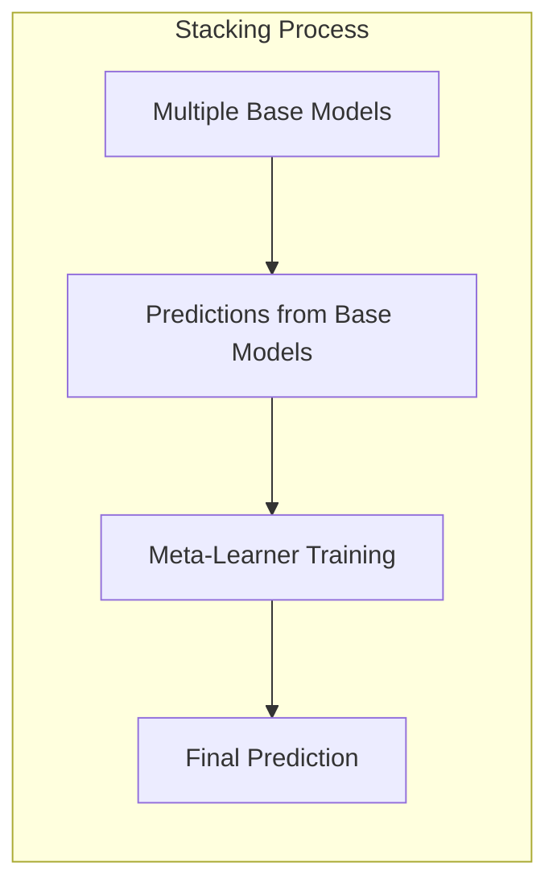
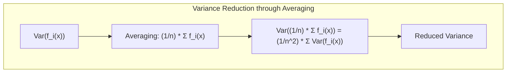
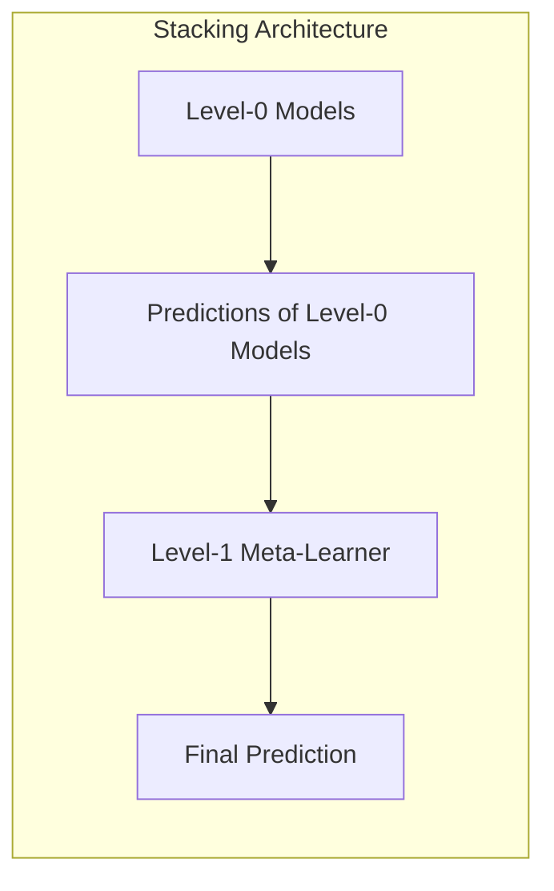
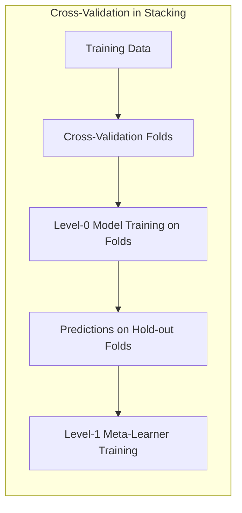
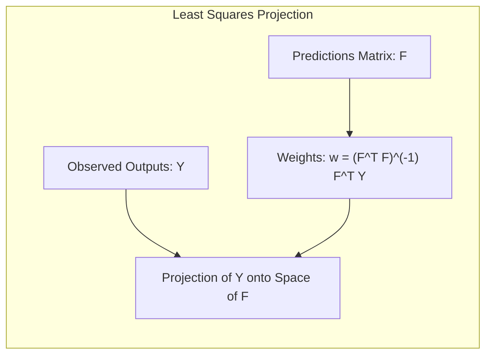
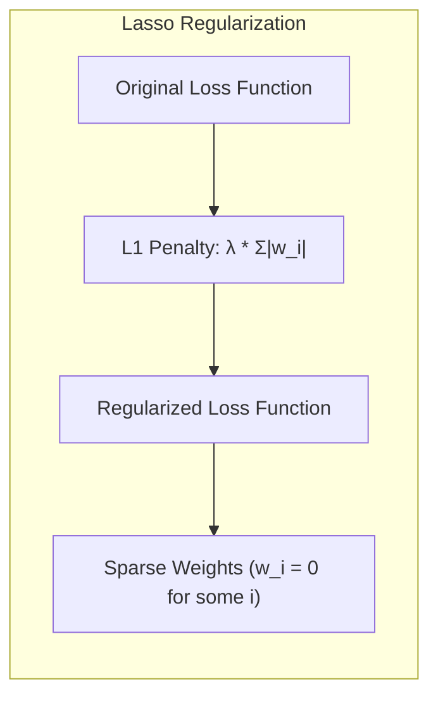
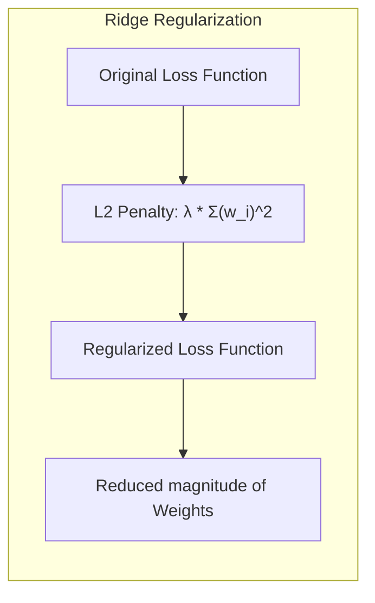
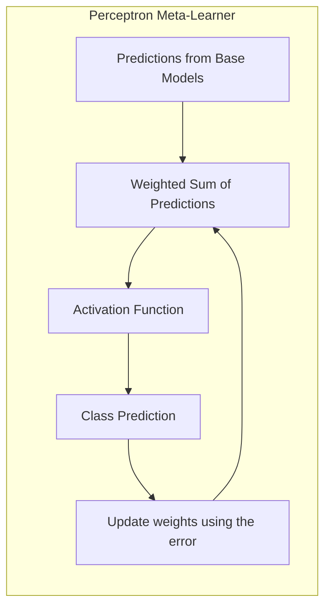

## Stacking para Seleção de Modelos

<imagem: Um diagrama que ilustra o processo de stacking. A imagem pode conter várias camadas, representando diferentes modelos de aprendizado de máquina, com um modelo de nível superior (meta-learner) combinando suas predições.>

### Introdução
A seleção de modelos é um passo crítico no desenvolvimento de qualquer solução de aprendizado de máquina. O objetivo é identificar o modelo que melhor se ajusta aos dados e generaliza bem para dados não vistos. Em vez de escolher um único modelo, o *stacking* combina as predições de múltiplos modelos base, com o objetivo de obter uma performance superior. Esta abordagem é uma forma de *model averaging* mais sofisticada, que, ao invés de simplesmente calcular a média das predições, treina um modelo (o *meta-learner*) para aprender como melhor combinar as predições dos modelos base. O *stacking* busca, portanto, explorar as forças de cada modelo, mitigando suas fraquezas [^8.8].



### Conceitos Fundamentais

**Conceito 1: Ensemble Learning e Model Averaging**
*Ensemble learning* refere-se à prática de treinar múltiplos modelos e combinar suas predições para obter uma performance superior à que um único modelo poderia alcançar. Uma forma simples de ensemble learning é o *model averaging*, onde as predições de múltiplos modelos são combinadas por meio de uma média simples ou ponderada [^8.8]. O *stacking* é uma forma mais complexa de ensemble learning, que tenta aprender a melhor forma de combinar as predições dos modelos base.

**Lemma 1:** A média de predições de modelos com bias e variância distintos pode resultar em um modelo com menor variância e bias mais controlado, conforme discutido em [^8.7].
**Prova:** Dado que a variância de um estimador é reduzida ao se calcular a média de várias realizações independentes do mesmo, e o bias é preservado, ao usar modelos variados, com diferentes vieses, a média tende a balancear esses vieses.
$$\text{Var}\left(\frac{1}{n}\sum_{i=1}^n \hat{f}_i(x)\right) = \frac{1}{n^2}\sum_{i=1}^n \text{Var}(\hat{f}_i(x))$$
Se as predições dos modelos forem independentes, a variância da média é menor do que a variância de qualquer um dos modelos individuais $\blacksquare$.



> 💡 **Exemplo Numérico:** Suponha que temos três modelos, cujas predições para um dado ponto $x$ têm as seguintes variâncias: $\text{Var}(\hat{f}_1(x)) = 0.8$, $\text{Var}(\hat{f}_2(x)) = 0.6$, e $\text{Var}(\hat{f}_3(x)) = 0.9$. Ao calcular a média dessas predições, a variância da média seria:
> $$\text{Var}\left(\frac{1}{3}\sum_{i=1}^3 \hat{f}_i(x)\right) = \frac{1}{3^2} (0.8 + 0.6 + 0.9) = \frac{2.3}{9} \approx 0.256$$
> A variância da média (0.256) é menor do que a variância de cada modelo individual, demonstrando a redução de variância proporcionada pelo *model averaging*.

**Conceito 2: A Arquitetura do Stacking**
O *stacking* envolve duas camadas de modelos:
1.  **Modelos base (level-0 models):** Um conjunto de modelos de aprendizado de máquina é treinado usando os dados de treinamento. Esses modelos podem variar em tipo (e.g., árvores de decisão, regressão logística, redes neurais) e complexidade, e geralmente operam de forma independente.
2. **Meta-learner (level-1 model):** Um novo modelo é treinado utilizando as predições dos modelos base como entradas. O meta-learner aprende a combinar essas predições de forma ótima, para realizar a predição final [^8.8].



**Corolário 1:** A escolha do meta-learner é crucial para o sucesso do *stacking*. Modelos lineares (e.g. regressão linear ou logística) são frequentemente usados, pois são capazes de aprender pesos que refletem a importância de cada modelo base, como discutido em [^8.8]. Em casos mais complexos, outros modelos podem ser mais apropriados.

**Conceito 3: Cross-Validation no Stacking**
Um cuidado importante ao aplicar o *stacking* é evitar *data leakage*. Para isso, a cross-validation é usada durante o treinamento dos modelos base, e a predição para cada fold é usada como input para treinar o meta-learner. Isso garante que o meta-learner não veja as mesmas amostras usadas no treinamento dos modelos base, prevenindo overfitting [^8.8]. A ideia é que, se os modelos base foram treinados usando apenas parte dos dados, o meta-learner pode ser treinado usando o restante do conjunto de dados, de forma a evitar o *data leakage*.



> ⚠️ **Nota Importante**: O uso de cross-validation no *stacking* é essencial para evitar overfitting e garantir que a generalização do modelo seja adequada, conforme descrito em [^8.8].

### Regressão Linear e Mínimos Quadrados para Stacking

<imagem: Diagrama de fluxo que representa o processo de stacking: 1) treinamento dos modelos base (level-0), 2) geração das predições dos modelos base, 3) treinamento do meta-learner (level-1) usando as predições dos modelos base como inputs, e 4) predição final combinando as predições dos modelos base com os pesos aprendidos pelo meta-learner.>

A regressão linear pode ser utilizada no *stacking* como um método para combinar as predições dos modelos base, conforme mencionado em [^8.8]. As predições dos modelos base são tratadas como variáveis de entrada, e o meta-learner aprende os coeficientes de regressão que melhor combinam essas predições. O método de mínimos quadrados é usado para encontrar os coeficientes que minimizam o erro quadrático médio entre as predições e os valores reais.

**Lemma 2:** Em um problema de regressão, a solução de mínimos quadrados para combinar predições de modelos base equivale à projeção ortogonal das saídas observadas no espaço gerado pelas predições dos modelos base.
**Prova:**  Seja $Y$ o vetor de saídas, e $F$ a matriz onde cada coluna representa as predições de um dos modelos base. A solução de mínimos quadrados para os coeficientes $w$ é dada por:
$$w = (F^T F)^{-1} F^T Y$$
Esta fórmula representa a projeção ortogonal de $Y$ no espaço gerado pelas colunas de $F$, conforme descrito em [^8.8].  $\blacksquare$



> 💡 **Exemplo Numérico:** Suponha que temos três modelos base e um conjunto de treinamento com 5 amostras. As predições dos modelos base e as saídas reais são as seguintes:
>
> | Amostra | Modelo 1 ($f_1$) | Modelo 2 ($f_2$) | Modelo 3 ($f_3$) | Saída Real ($y$) |
> |---|---|---|---|---|
> | 1 | 2.1 | 1.8 | 2.5 | 2.3 |
> | 2 | 3.0 | 2.7 | 3.2 | 3.1 |
> | 3 | 1.5 | 1.6 | 1.9 | 1.8 |
> | 4 | 2.8 | 2.5 | 3.0 | 2.9 |
> | 5 | 2.2 | 2.0 | 2.4 | 2.3 |
>
> A matriz $F$ das predições e o vetor $Y$ das saídas são:
>
> $$F = \begin{bmatrix} 2.1 & 1.8 & 2.5 \\ 3.0 & 2.7 & 3.2 \\ 1.5 & 1.6 & 1.9 \\ 2.8 & 2.5 & 3.0 \\ 2.2 & 2.0 & 2.4 \end{bmatrix} \qquad Y = \begin{bmatrix} 2.3 \\ 3.1 \\ 1.8 \\ 2.9 \\ 2.3 \end{bmatrix}$$
>
> Usando a fórmula de mínimos quadrados, podemos calcular os pesos $w$. Primeiro, calculamos $F^T F$:
>
> $$F^T F = \begin{bmatrix} 25.64 & 23.46 & 27.66 \\ 23.46 & 21.4 & 25.2 \\ 27.66 & 25.2 & 29.82 \end{bmatrix}$$
>
> Em seguida, calculamos $(F^T F)^{-1}$:
>
> $$(F^T F)^{-1} \approx \begin{bmatrix} 1.60 & -1.82 & 0.93 \\ -1.82 & 2.57 & -1.31 \\ 0.93 & -1.31 & 0.72 \end{bmatrix}$$
>
> Agora, calculamos $F^T Y$:
>
> $$F^T Y = \begin{bmatrix} 25.9 \\ 23.6 \\ 27.9 \end{bmatrix}$$
>
> Finalmente, calculamos os pesos $w$:
>
> $$w = (F^T F)^{-1} F^T Y = \begin{bmatrix} 1.60 & -1.82 & 0.93 \\ -1.82 & 2.57 & -1.31 \\ 0.93 & -1.31 & 0.72 \end{bmatrix} \begin{bmatrix} 25.9 \\ 23.6 \\ 27.9 \end{bmatrix} \approx \begin{bmatrix} 0.5 \\ 0.3 \\ 0.2 \end{bmatrix}$$
>
> Os pesos obtidos (aproximadamente 0.5, 0.3 e 0.2) indicam que o modelo 1 tem um peso maior na predição final do meta-learner.
>
> ```python
> import numpy as np
> from numpy.linalg import inv
>
> F = np.array([[2.1, 1.8, 2.5],
>               [3.0, 2.7, 3.2],
>               [1.5, 1.6, 1.9],
>               [2.8, 2.5, 3.0],
>               [2.2, 2.0, 2.4]])
> Y = np.array([2.3, 3.1, 1.8, 2.9, 2.3])
>
> w = inv(F.T @ F) @ F.T @ Y
> print(w)
> ```
>
> Este exemplo ilustra como a regressão linear pode ser usada para combinar as predições de diferentes modelos base, onde os pesos são otimizados para minimizar o erro quadrático médio.

**Corolário 2:** A solução de mínimos quadrados para o *stacking* (ou seja, o meta-learner) minimiza o erro quadrático médio, mas não impõe nenhuma restrição sobre os coeficientes, que podem ser negativos ou maiores que 1. Isto pode levar a resultados contra-intuitivos [^8.8].

A utilização da regressão linear como meta-learner tem a vantagem de ser computacionalmente eficiente e facilmente interpretável. Os coeficientes de regressão indicam a importância de cada modelo base na predição final. No entanto, a regressão linear pode não capturar relações complexas entre os modelos base, limitando o desempenho do *stacking*.

> ❗ **Ponto de Atenção**: Embora a regressão linear seja simples, ela pode não ser a melhor escolha como meta-learner para todos os problemas, especialmente aqueles onde as predições dos modelos base têm relações não lineares, como sugerido em [^8.8].

### Métodos de Seleção de Variáveis e Regularização em Stacking

A seleção de variáveis e a regularização são importantes no *stacking* para evitar overfitting e melhorar a generalização do modelo. Quando o número de modelos base é alto, o meta-learner pode ter dificuldade em aprender a melhor combinação, sendo importante aplicar técnicas de seleção de modelos ou regularização, como discutido em [^8.8].
O meta-learner é construído como uma combinação linear de todos os modelos base, e portanto, se torna necessário aplicar técnicas para selecionar quais modelos devem ter um peso maior e quais devem ser negligenciados.

**Lemma 3:** A regularização L1 (Lasso) em um modelo linear (como o meta-learner em *stacking*) promove a esparsidade de parâmetros, ou seja, faz com que alguns coeficientes de regressão sejam exatamente zero, efetivamente selecionando os modelos base mais relevantes.
**Prova:** A regularização L1 adiciona a penalidade da norma L1 aos coeficientes da regressão. A penalidade $ \lambda \sum |w_i|$, onde  $w_i$ é o $i$-ésimo coeficiente, leva a que alguns coeficientes sejam exatamente zero durante a minimização, selecionando os modelos base mais relevantes, conforme descrito em [^8.8] $\blacksquare$.



> 💡 **Exemplo Numérico:** Suponha que, ao aplicar regressão linear como meta-learner, obtivemos os seguintes pesos para 5 modelos base:  $w = [0.4, -0.2, 0.7, 0.1, -0.3]$.  Ao aplicar a regularização L1 (Lasso) com um parâmetro $\lambda$ adequado,  alguns desses pesos podem ser zerados. Por exemplo, se $\lambda$ for suficientemente grande, poderíamos obter $w_{lasso} = [0.5, 0, 0.8, 0, -0.1]$, indicando que os modelos base 2 e 4 foram considerados menos importantes e seus pesos foram definidos como zero.
>
> ```python
> import numpy as np
> from sklearn.linear_model import Lasso
>
> # Predições dos modelos base (simuladas)
> F = np.random.rand(100, 5)
> # Saídas reais (simuladas)
> Y = np.random.rand(100)
>
> # Regressão linear simples
> w_ols = np.linalg.inv(F.T @ F) @ F.T @ Y
>
> # Regressão Lasso com alpha = 0.1
> lasso = Lasso(alpha=0.1)
> lasso.fit(F, Y)
> w_lasso = lasso.coef_
>
> print(f"Pesos OLS: {w_ols}")
> print(f"Pesos Lasso: {w_lasso}")
>
> ```
>
> Este exemplo ilustra como a regularização L1 (Lasso) pode realizar a seleção de modelos base, atribuindo pesos nulos aos menos relevantes.

**Corolário 3:** A regularização L2 (Ridge) em um modelo linear reduz a magnitude dos coeficientes de regressão, mas não os leva a zero. Isso pode melhorar a estabilidade do meta-learner e reduzir o overfitting, como indicado em [^8.8].



> 💡 **Exemplo Numérico:** Usando o mesmo exemplo anterior, ao aplicar a regularização L2 (Ridge) com um parâmetro $\lambda$ adequado, os pesos dos modelos base seriam reduzidos, mas não zerados. Por exemplo, se $\lambda$ for apropriado, poderíamos obter $w_{ridge} = [0.3, -0.1, 0.6, 0.05, -0.2]$. Isso indica que todos os modelos base ainda contribuem para a predição final, mas seus pesos são menores em magnitude, o que ajuda a prevenir overfitting.
>
> ```python
> import numpy as np
> from sklearn.linear_model import Ridge
>
> # Predições dos modelos base (simuladas)
> F = np.random.rand(100, 5)
> # Saídas reais (simuladas)
> Y = np.random.rand(100)
>
> # Regressão Ridge com alpha = 0.1
> ridge = Ridge(alpha=0.1)
> ridge.fit(F, Y)
> w_ridge = ridge.coef_
>
> print(f"Pesos Ridge: {w_ridge}")
> ```
>
>  Este exemplo demonstra como a regularização L2 (Ridge) pode reduzir a magnitude dos pesos, melhorando a estabilidade do meta-learner.

> ⚠️ **Ponto Crucial**: As penalizações L1 (Lasso) e L2 (Ridge) podem ser combinadas em uma regularização Elastic Net, que combina as vantagens de ambas as abordagens, promovendo a esparsidade dos modelos e controlando o overfitting, conforme mencionado em [^8.8].

### Separating Hyperplanes e Perceptrons no Stacking

O conceito de *separating hyperplanes* pode ser usado na construção do meta-learner para problemas de classificação. Em vez de fazer uma combinação linear das predições dos modelos base, o meta-learner pode ser um classificador que aprende a fronteira de decisão linear ou não linear no espaço das predições dos modelos base.

O Perceptron, um algoritmo de classificação linear, pode ser utilizado para construir o meta-learner, buscando aprender o hiperplano que melhor separa as classes no espaço das predições dos modelos base [^8.8]. A ideia é aprender os pesos que melhor combinam os resultados das predições dos modelos base, de forma a classificar as amostras corretamente, com base em [^8.8].



**Pergunta Teórica Avançada:**
Como a arquitetura e os parâmetros do meta-learner afetam a complexidade do modelo de *stacking* e o risco de overfitting? Como podemos ajustar esses aspectos para obter um bom desempenho de generalização?
**Resposta:**
A complexidade do modelo de *stacking* é afetada pela complexidade dos modelos base e pela complexidade do meta-learner. Se os modelos base forem muito complexos e/ou o meta-learner for um modelo não linear complexo (e.g., redes neurais profundas), o modelo resultante de *stacking* pode ter um alto risco de overfitting.

**Lemma 4:** A capacidade de generalização de um modelo de *stacking* depende da diversidade entre os modelos base, da capacidade de generalização de cada modelo base, e da complexidade do meta-learner.  Modelos base muito correlacionados podem levar a um meta-learner instável e com baixa capacidade de generalização.
**Prova:** A diversidade entre os modelos base reduz a probabilidade do modelo de *stacking* se adequar a ruídos ou peculiaridades específicas do conjunto de treinamento. Um meta-learner mais simples, como uma regressão logística ou linear, pode mitigar o overfitting, penalizando pesos excessivos atribuídos a alguns modelos base.

**Corolário 4:** A regularização e a seleção de variáveis no meta-learner são formas de controlar sua complexidade e mitigar o risco de overfitting. Escolher um meta-learner com complexidade adequada ao número de modelos base e ao tamanho do conjunto de treinamento também é essencial para garantir a generalização do modelo [^8.8].

> ✔️ **Destaque**: A escolha do meta-learner e a aplicação de técnicas de regularização são fundamentais para equilibrar a complexidade do modelo de *stacking* e seu desempenho de generalização.

### Conclusão

O *stacking* é uma técnica poderosa para combinar as predições de múltiplos modelos de aprendizado de máquina, buscando obter um desempenho superior ao de um único modelo. Esta abordagem requer um planejamento cuidadoso na escolha dos modelos base, do meta-learner e da estratégia de cross-validation para evitar o overfitting. Embora modelos lineares tenham um papel fundamental como meta-learners, é preciso reconhecer que eles podem não ser suficientes para problemas complexos, sendo necessário recorrer a outros modelos, regularização, e seleção de modelos. A flexibilidade do *stacking* o torna uma ferramenta valiosa na construção de soluções de aprendizado de máquina, mas é importante compreender suas nuances para aplicá-lo corretamente.
<!-- END DOCUMENT -->
### Footnotes
[^8.8]: "In Section 8.4 we viewed bootstrap values of an estimator as approximate posterior values of a corresponding parameter, from a kind of nonparamet-ric Bayesian analysis. Viewed in this way, the bagged estimate (8.51) is an approximate posterior Bayesian mean. In contrast, the training sample estimate f(x) corresponds to the mode of the posterior. Since the posterior mean (not mode) minimizes squared-error loss, it is not surprising that bagging can often reduce mean squared-error. Here we discuss Bayesian model averaging more generally. We have a set of candidate models Mm, m = 1,..., M for our training set Z. These models may be of the same type with different parameter values (e.g., subsets in linear regression), or different models for the same task (e.g., neural networks and regression trees). Suppose ζ is some quantity of interest, for example, a prediction f(x) at some fixed feature value x. The posterior distribution of ζ is" *(Trecho de <Model Inference and Averaging>)*
[^8.7]: "Earlier we introduced the bootstrap as a way of assessing the accuracy of a parameter estimate or a prediction. Here we show how to use the bootstrap to improve the estimate or prediction itself. In Section 8.4 we investigated the relationship between the bootstrap and Bayes approaches, and found that the bootstrap mean is approximately a posterior average. Bagging further exploits this connection. Consider first the regression problem. Suppose we fit a model to our training data Z = {(x1, y1), (x2, y2), ..., (xn, yn)}, obtaining the predic-tion f(x) at input x. Bootstrap aggregation or bagging averages this predic-tion over a collection of bootstrap samples, thereby reducing its variance. For each bootstrap sample Z*b, b = 1, 2, ..., B, we fit our model, giving prediction f*b(x). The bagging estimate is defined by" *(Trecho de <Model Inference and Averaging>)*
