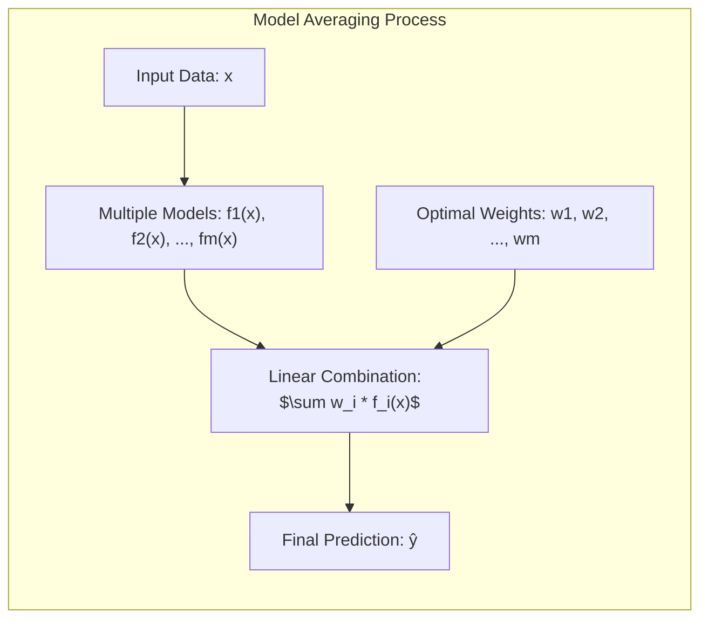
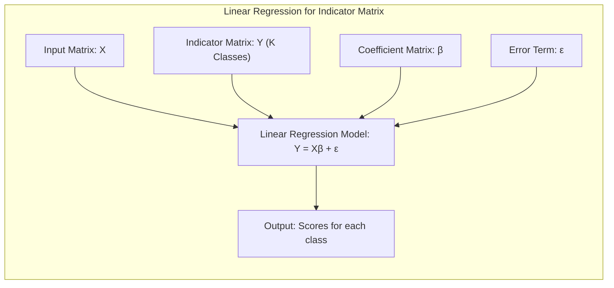
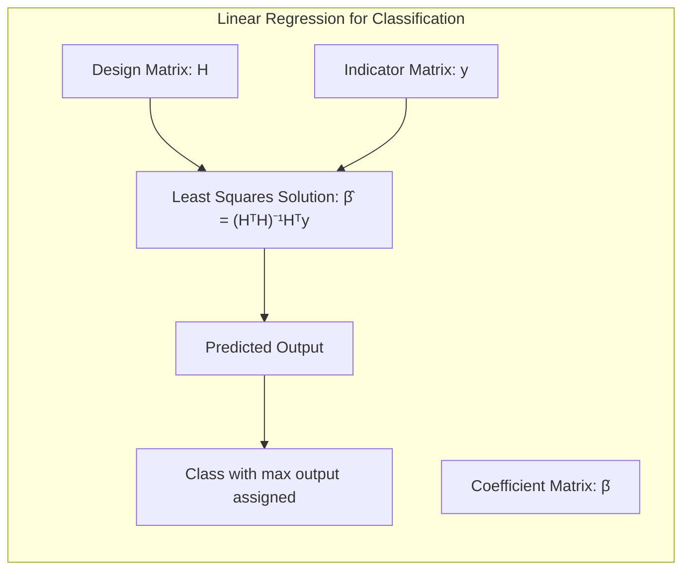
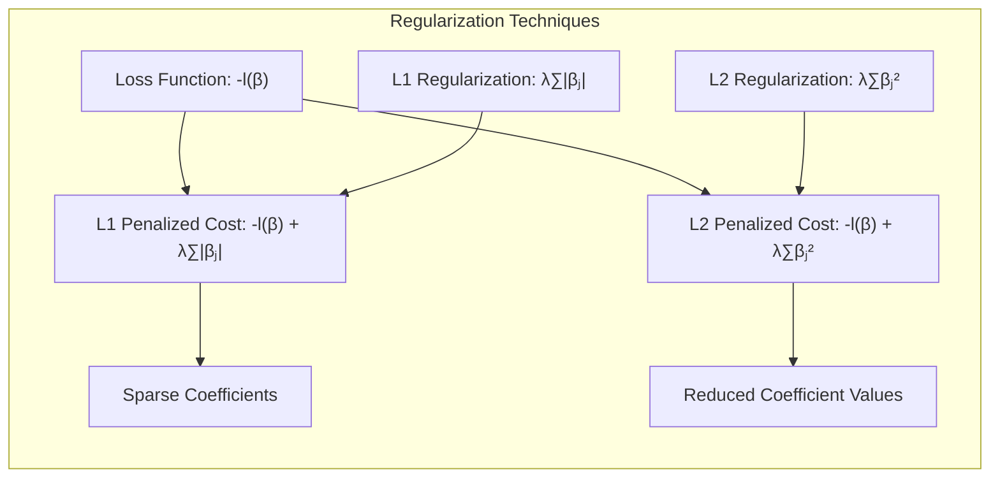
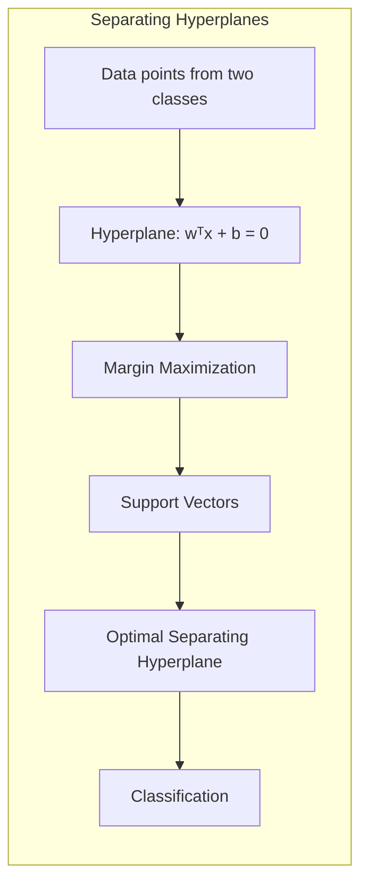
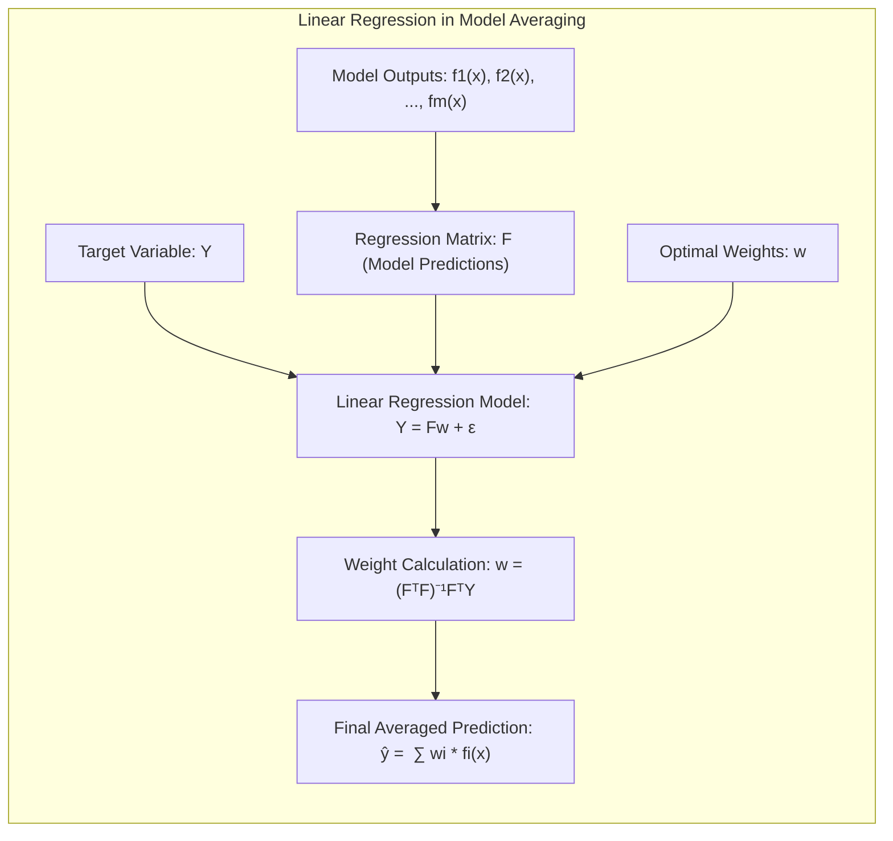

## Linear Regression in Model Averaging



### Introdução
O conceito de **model averaging**, ou média de modelos, é uma poderosa ferramenta no aprendizado estatístico que busca melhorar a precisão e a robustez das previsões através da combinação de múltiplos modelos. Em vez de depender de um único modelo para fazer previsões, o model averaging combina as previsões de vários modelos, muitas vezes com diferentes estruturas ou parâmetros, para produzir uma estimativa final mais precisa. [^8.1] A ideia central é que, ao combinar as perspectivas de diversos modelos, podemos reduzir tanto o viés quanto a variância, levando a um desempenho preditivo superior. Modelos de regressão linear, devido a sua simplicidade e interpretabilidade, são componentes fundamentais em diversas abordagens de model averaging e são extensamente explorados no contexto fornecido [^8.8].

### Conceitos Fundamentais
**Conceito 1:** O **problema de classificação** busca, dado um conjunto de dados de treinamento, aprender uma função que mapeia entradas para classes ou categorias. Métodos lineares, como regressão linear, são frequentemente empregados devido à sua simplicidade computacional e interpretabilidade. No entanto, podem apresentar *viés* em relação a classificadores não lineares e apresentar problemas de variância se não forem usados com cautela [^8.2].

> 💡 **Exemplo Numérico:** Considere um problema de classificação binária com duas classes (0 e 1). Temos duas variáveis de entrada, $x_1$ e $x_2$, e 5 pontos de dados. Usamos regressão linear para classificar os dados. A matriz de design $X$ é:
> ```python
> import numpy as np
> X = np.array([[1, 2], [1.5, 1.8], [5, 8], [8, 8], [1, 0.6]])
> ```
> A matriz indicadora $Y$ (onde 0 é codificado como [1,0] e 1 como [0,1]) é
> ```python
> Y = np.array([[1, 0], [1, 0], [0, 1], [0, 1], [1, 0]])
> ```
> Calculamos os coeficientes $\beta$ usando a fórmula dos mínimos quadrados: $\hat{\beta} = (X^TX)^{-1}X^TY$. Os outputs podem ser interpretados como *scores* para cada classe, e a classe com maior *score* é selecionada.

**Lemma 1:** Em um contexto de classificação, a regressão linear pode ser aplicada através da **regressão de uma matriz indicadora**. Se tivermos *K* classes, podemos representar cada observação através de um vetor de *K* dimensões, onde a componente correspondente à classe correta é 1, e as demais são 0. Uma regressão linear dessas matrizes indicadoras, realizada separadamente para cada classe, resulta em funções lineares que podem ser usadas para decisão. A decisão é dada através da escolha da classe cujo output seja o maior. A matriz indicadora também pode ser interpretada como um conjunto de *k* regressões lineares que estimam a probabilidade da observação pertencer a cada classe. Embora seja simples, o método pode ser instável em algumas situações [^8.2].

$$
Y = X\beta + \epsilon
$$
Onde $Y$ é a matriz indicadora, $X$ é a matriz de entrada, $\beta$ são os coeficientes e $\epsilon$ é o erro.



**Conceito 2:** A **Linear Discriminant Analysis (LDA)** assume que as classes têm distribuições gaussianas com a mesma matriz de covariância. A função discriminante de LDA é linear e pode ser derivada da regra de decisão Bayesiana sob essas suposições. LDA pode ser visto como um caso especial de regressão linear quando os parâmetros são estimados com covariâncias iguais [^8.3]. A função discriminante em LDA é construída para projetar os dados em uma direção que maximize a separação entre as classes, usando médias de classe e a covariância comum.

**Corolário 1:** Dado o Lemma 1, a equivalência entre a regressão linear com matriz indicadora e o LDA sob as suposições de normalidade e covariância comum, mostra que a função discriminante de LDA pode ser vista como uma forma de regressão linear que é orientada pela estrutura das classes no espaço de entrada, onde os coeficientes da regressão são afetados pela covariância comum, garantindo uma separação linear otimizada. [^8.3.1]

**Conceito 3:** **Logistic Regression** modela a probabilidade de uma observação pertencer a uma determinada classe usando uma função logística da combinação linear das entradas. A função *logit* transforma probabilidades em log-odds, que são modeladas linearmente. Logistic Regression é amplamente utilizado devido à sua flexibilidade e capacidade de gerar estimativas de probabilidade.  O modelo é estimado através de maximização da verossimilhança [^8.4].

> ⚠️ **Nota Importante**: A Regressão Logística é um modelo probabilístico linear usado para problemas de classificação binária, onde a probabilidade de um evento ocorrer é modelada usando uma função logística. **Referência ao tópico [^8.4.1]**.

> ❗ **Ponto de Atenção**: A regressão logística, assim como o LDA, são sensíveis a classes não-balanceadas, sendo necessário cuidado extra na modelagem quando há desbalanceamento. **Conforme indicado em [^8.4.2]**.

> ✔️ **Destaque**: Tanto o LDA quanto a Regressão Logística, são modelos lineares que visam encontrar uma fronteira linear que separa as classes, embora seus mecanismos de estimação de parâmetros sejam diferentes. **Baseado no tópico [^8.5]**.

### Regressão Linear e Mínimos Quadrados para Classificação


A regressão linear com matriz de indicadores é uma abordagem simples para classificação. Em vez de ajustar uma única função de regressão para uma resposta contínua, é construído um modelo de regressão linear para cada classe, onde a variável resposta é um indicador (0 ou 1) da pertinência da observação àquela classe [^8.2]. Em essência, essa abordagem estima probabilidades ou scores que podem ser interpretados como indicadores de pertinência à classe. O modelo é estimado usando mínimos quadrados. Seja $H$ a matriz de design, onde cada linha representa um vetor de características de uma observação, e $y$ é a matriz de indicadores, a solução para os parâmetros $\beta$ é dada por:

$$
\hat{\beta} = (H^TH)^{-1}H^Ty
$$

Onde $\hat{\beta}$ é a matriz de coeficientes, que contém um vetor de coeficientes para cada classe. A previsão para uma nova observação é obtida calculando $H_{new}\hat{\beta}$, onde $H_{new}$ representa o vetor de features da observação, e atribuindo a classe com maior valor de saída. Apesar de sua simplicidade, essa abordagem pode ser sensível a outliers e problemas de *multicolinearidade*.  O modelo de regressão linear não tem restrições sobre os outputs, que podem ficar fora do intervalo \[0, 1], o que pode resultar em previsões sem significado em algumas aplicações.

> 💡 **Exemplo Numérico:** Vamos considerar um conjunto de dados com três amostras e duas features, com duas classes (0 e 1). A matriz de design $H$ (incluindo um intercepto) e a matriz de indicadores $Y$ podem ser representadas como:
>
> ```python
> import numpy as np
> # Matriz de design H com 3 amostras, 2 features e intercepto
> H = np.array([[1, 2, 3],
>               [1, 4, 5],
>               [1, 6, 7]])
>
> # Matriz indicadora Y (3 amostras, 2 classes)
> Y = np.array([[1, 0],  # Classe 0
>               [0, 1],  # Classe 1
>               [1, 0]]) # Classe 0
> ```
>
> Para calcular $\hat{\beta}$, primeiro calculamos $H^T H$:
>
> ```python
> HT_H = np.dot(H.T, H)
> print("HT_H:\n", HT_H)
> ```
>
> Em seguida, calculamos a inversa de $(H^T H)$:
>
> ```python
> HT_H_inv = np.linalg.inv(HT_H)
> print("Inversa de HT_H:\n", HT_H_inv)
> ```
>
> Agora, calculamos $H^T Y$:
>
> ```python
> HT_Y = np.dot(H.T, Y)
> print("HT_Y:\n", HT_Y)
> ```
>
> Finalmente, calculamos $\hat{\beta}$:
>
> ```python
> beta_hat = np.dot(HT_H_inv, HT_Y)
> print("Beta_hat:\n", beta_hat)
> ```
> O resultado é uma matriz de coeficientes $\hat{\beta}$, onde cada coluna contém os coeficientes para a regressão linear de cada classe. Podemos obter previsões para novas amostras usando esses coeficientes. Note que os outputs da regressão podem não ser diretamente interpretáveis como probabilidades, já que não estão restritos ao intervalo [0, 1].

**Lemma 2:** Dada a matriz de design $H$ e a matriz de indicadores $Y$, o resultado da aplicação da regressão linear através de mínimos quadrados pode ser visto como uma projeção dos dados em um subespaço que é definido pelos vetores coluna de $H$. Essa projeção busca minimizar a distância entre a matriz indicadora e a sua projeção nesse subespaço, de modo que a decisão de classe é feita através da comparação de distâncias projetadas [^8.2].

**Corolário 2:**  Se o subespaço definido por $H$ for bem escolhido, tal projeção pode resultar em um conjunto de scores que permite uma separação linear eficaz das classes, o que significa que podemos usar uma regra de decisão linear simples (e.g., escolher a classe cujo valor projetado é o maior) para classificar novas observações. No entanto, o Lemma 2 destaca que a escolha da matriz $H$ é crucial, e a regressão de indicadores pode não funcionar bem se os dados não forem adequadamente representados no espaço definido por $H$. O tópico [^8.3] também menciona que as covariâncias entre classes podem confundir o resultado, o que leva à necessidade de abordagens mais robustas como a LDA, que leva em consideração a estrutura das classes e sua variância.

>  “Em alguns cenários, conforme apontado em [^8.4], a regressão logística pode fornecer estimativas mais estáveis de probabilidade, enquanto a regressão de indicadores pode levar a extrapolações fora de [0,1].”

>  “No entanto, há situações em que a regressão de indicadores, de acordo com [^8.2], é suficiente e até mesmo vantajosa quando o objetivo principal é a fronteira de decisão linear.”

### Métodos de Seleção de Variáveis e Regularização em Classificação


Em problemas de classificação, a regularização é essencial para evitar o *overfitting* e melhorar a generalização dos modelos. As técnicas de regularização mais comuns são L1 (Lasso) e L2 (Ridge). Na regularização L1, um termo de penalização proporcional ao valor absoluto dos coeficientes é adicionado à função de custo [^8.4.4]. Isso leva à esparsidade dos coeficientes, selecionando automaticamente as variáveis mais relevantes. Na regularização L2, o termo de penalização é proporcional ao quadrado dos coeficientes, o que reduz o valor dos coeficientes, mas não necessariamente os leva a zero [^8.4.4].
No contexto de regressão logística, a função de custo é a *log-likelihood* negativa, que é modificada da seguinte forma com a regularização L1:

$$
-l(\beta) + \lambda \sum_{j=1}^{p}|\beta_j|
$$

E com regularização L2:

$$
-l(\beta) + \lambda \sum_{j=1}^{p}\beta_j^2
$$

Onde *$l(\beta)$* é a log-likelihood, *$\beta$* são os coeficientes, *$\lambda$* é o parâmetro de regularização, e *p* é o número de features.
A escolha do parâmetro *$\lambda$* é crucial para obter um modelo com bom desempenho, e é normalmente feita através de cross-validation.

> 💡 **Exemplo Numérico:** Considere um problema de classificação binária com regressão logística com 3 variáveis de entrada ($x_1, x_2, x_3$) e 100 amostras. Ajustamos o modelo com diferentes valores de regularização L1 (Lasso) e L2 (Ridge):
>
> ```python
> import numpy as np
> from sklearn.linear_model import LogisticRegression
> from sklearn.model_selection import train_test_split
> from sklearn.metrics import accuracy_score
>
> # Gerar dados de exemplo
> np.random.seed(42)
> X = np.random.rand(100, 3)
> y = np.random.randint(0, 2, 100)
>
> # Dividir em treino e teste
> X_train, X_test, y_train, y_test = train_test_split(X, y, test_size=0.3, random_state=42)
>
> # Regularização L1 (Lasso) com diferentes valores de lambda
> for C in [0.1, 0.5, 1.0]: # C = 1/lambda
>     model_l1 = LogisticRegression(penalty='l1', solver='liblinear', C=C, random_state=42)
>     model_l1.fit(X_train, y_train)
>     y_pred_l1 = model_l1.predict(X_test)
>     accuracy_l1 = accuracy_score(y_test, y_pred_l1)
>     print(f"L1 (lambda={1/C:.2f}) - Accuracy: {accuracy_l1:.4f}, Coeficientes: {model_l1.coef_}")
>
> # Regularização L2 (Ridge) com diferentes valores de lambda
> for C in [0.1, 0.5, 1.0]: # C = 1/lambda
>     model_l2 = LogisticRegression(penalty='l2', C=C, random_state=42)
>     model_l2.fit(X_train, y_train)
>     y_pred_l2 = model_l2.predict(X_test)
>     accuracy_l2 = accuracy_score(y_test, y_pred_l2)
>     print(f"L2 (lambda={1/C:.2f}) - Accuracy: {accuracy_l2:.4f}, Coeficientes: {model_l2.coef_}")
>
>
> ```
>
> A saída do código acima mostrará a acurácia e os coeficientes para cada valor de $\lambda$. Observamos que a regularização L1 tende a zerar alguns coeficientes, enquanto a L2 reduz o valor dos coeficientes, mas não necessariamente os leva a zero. A escolha do valor ideal de $\lambda$ é geralmente feita usando validação cruzada.

**Lemma 3:** A penalização L1 em modelos logísticos introduz uma tendência à esparsidade nos coeficientes, devido à natureza não diferenciável do valor absoluto em zero, o que faz com que os coeficientes sejam levados a zero quando a regularização é forte o suficiente.  Este efeito não é obtido através da regularização L2 [^8.4.4].

**Prova do Lemma 3:** A penalidade L1 introduz um termo que é linear nos coeficientes, o que corresponde a um prior de Laplace sobre os coeficientes. A otimização da log-verossimilhança com uma penalidade L1 corresponde à busca do máximo a posteriori (MAP) sob este prior. Devido à forma da distribuição de Laplace (com pico em zero), os coeficientes que não contribuem significativamente para a verossimilhança são levados a zero na solução ótima. Este efeito é muito mais forte do que na regularização L2, que penaliza de forma quadrática os coeficientes, sendo também mais propenso à esparsidade [^8.4.3] [^8.4.4]. $\blacksquare$

**Corolário 3:** A esparsidade introduzida pela regularização L1 melhora a interpretabilidade do modelo, pois os coeficientes que são zero implicam que suas respectivas variáveis não têm impacto sobre a probabilidade de pertencimento à classe. Isso não acontece na regularização L2, onde os coeficientes podem ser pequenos, mas raramente exatamente zero, dificultando a interpretação do modelo. A esparsidade também tem um efeito de seleção de variáveis, sendo que modelos com regularização L1 são capazes de selecionar automaticamente um subconjunto das variáveis originais [^8.4.5].

> ⚠️ **Ponto Crucial**: L1 e L2 podem ser combinadas (Elastic Net) para aproveitar vantagens de ambos os tipos de regularização, conforme discutido em [^8.5].
### Separating Hyperplanes e Perceptrons



O conceito de *separating hyperplanes* emerge da ideia de encontrar uma fronteira linear que melhor separa os dados de diferentes classes. A ideia é maximizar a margem entre os pontos mais próximos ao hiperplano, os vetores de suporte [^8.5.2]. A formulação do problema de otimização para encontrar esses hiperplanos envolve o uso de multiplicadores de Lagrange e a dualidade de Wolfe, para encontrar a solução. O resultado final é que os hiperplanos de decisão são formados por combinações lineares dos vetores de suporte, ou seja, os dados que são mais relevantes para a definição da fronteira de decisão.
Os Perceptrons, como o Perceptron de Rosenblatt, são uma forma antiga e simples de encontrar separadores lineares. Eles ajustam os pesos iterativamente, utilizando as classificações erradas. O algoritmo do perceptron converge sob condições específicas de separabilidade linear, mas pode não encontrar a margem máxima entre as classes [^8.5.1].
O SVM (Support Vector Machine) é uma extensão do conceito de *separating hyperplane* que é mais sofisticado, e não é mencionado no contexto.

### Pergunta Teórica Avançada: Quais as diferenças fundamentais entre a formulação de LDA e a Regra de Decisão Bayesiana considerando distribuições Gaussianas com covariâncias iguais?
**Resposta:**
A Linear Discriminant Analysis (LDA) e a Regra de Decisão Bayesiana, sob a suposição de que as classes têm distribuições gaussianas com a mesma matriz de covariância, são essencialmente equivalentes [^8.3].
A Regra de Decisão Bayesiana atribui uma observação à classe que possui a maior probabilidade *a posteriori*, dadas as observações. Essa regra pode ser escrita como:
$$
arg \, max_k \, P(C_k | x) = arg \, max_k \frac{p(x|C_k)P(C_k)}{p(x)}
$$
Onde $P(C_k|x)$ é a probabilidade *a posteriori* da classe *k*, dado o vetor de entrada $x$. $p(x|C_k)$ é a função de verossimilhança da entrada $x$ dada a classe $k$, $P(C_k)$ é a probabilidade *a priori* da classe $k$ e $p(x)$ é a probabilidade marginal de $x$, que não depende de *k* e pode ser ignorada na decisão.

Sob a suposição de que a classe k tem uma distribuição normal com média $\mu_k$ e covariância $\Sigma$ (a mesma para todas as classes), a função de verossimilhança se torna:

$$
p(x|C_k) = \frac{1}{(2\pi)^{p/2} |\Sigma|^{1/2}} exp(-\frac{1}{2}(x-\mu_k)^T\Sigma^{-1}(x-\mu_k))
$$

Se substituirmos essa expressão na regra de decisão Bayesiana e tomarmos o logaritmo, e desprezarmos termos que não dependem de *k*, o resultado é uma função linear:

$$
\delta_k(x) =  x^T\Sigma^{-1}\mu_k - \frac{1}{2}\mu_k^T\Sigma^{-1}\mu_k + log \, P(C_k)
$$

Esta função é linear em $x$ e, portanto, tem a mesma forma da função discriminante da LDA. A LDA, por sua vez, estima os parâmetros a partir dos dados de treino, enquanto que a regra de decisão Bayesiana, em geral, assume que esses parâmetros são conhecidos. No entanto, quando os parâmetros são estimados através de métodos de máxima verossimilhança, o resultado é que o LDA coincide com a regra de decisão bayesiana sob as mesmas condições [^8.3.3].
O detalhe crucial é que a escolha das médias e covariâncias influencia o resultado. Quando assumimos covariâncias iguais para todas as classes, as fronteiras de decisão tornam-se lineares, conforme descrito na LDA. A derivação dos limites de decisão, as projeções lineares e a forma como a escolha das médias e da covariância influenciam o resultado são exatamente as mesmas para os dois métodos [^8.3.1].

**Lemma 4:** Sob a suposição de distribuições gaussianas com covariâncias iguais, a função discriminante da LDA pode ser vista como a implementação da regra de decisão Bayesiana, utilizando a estimativa de máxima verossimilhança dos parâmetros e usando as mesmas projeções lineares [^8.3].

**Corolário 4:** Quando a suposição de covariâncias iguais é relaxada, a regra de decisão bayesiana leva a fronteiras quadráticas, e não lineares. Isso significa que, embora a regra bayesiana continue aplicável, a forma da função discriminante e os limites de decisão podem mudar drasticamente. O QDA (Quadratic Discriminant Analysis) é uma generalização do LDA que leva em conta que cada classe pode ter sua própria matriz de covariância, o que resulta em fronteiras de decisão mais flexíveis [^8.3].

> ⚠️ **Ponto Crucial**: A adoção ou não de covariâncias iguais impacta fortemente o tipo de fronteira de decisão (linear vs. quadrática), conforme discutido em [^8.3.1].

### Linear Regression para Model Averaging


Em model averaging, o objetivo é combinar as previsões de múltiplos modelos para obter uma previsão final mais precisa. Uma forma de fazer isso é através da regressão linear, onde cada modelo é tratado como uma variável explicativa na regressão. O valor final é dado pela combinação linear dos outputs dos modelos [^8.8]. Essa abordagem, conhecida como *stacking*, busca encontrar os melhores pesos para combinar os modelos.

A regressão linear é utilizada para aprender esses pesos a partir dos dados de treinamento, de forma que o output do modelo combinado minimize o erro de previsão. Os pesos da regressão linear representam a importância relativa de cada modelo na previsão final.
Seja $f_1(x), f_2(x), \ldots, f_m(x)$ o output de M modelos diferentes em um ponto de entrada $x$. O objetivo do *model averaging* é encontrar os pesos $w_1, w_2, \ldots, w_m$ tal que a previsão final $\hat{y}$ seja:
$$
\hat{y} = \sum_{i=1}^m w_i f_i(x)
$$
Onde o objetivo é obter valores de $w_i$ que minimizem a função de custo no conjunto de treinamento. A solução para os pesos é dada por:
$$
w = (F^T F)^{-1} F^T Y
$$

Onde $F$ é uma matriz com as saídas dos modelos no conjunto de treinamento, cada coluna sendo o vetor de previsões de um modelo, e $Y$ é o vetor dos valores alvo.

> 💡 **Exemplo Numérico:** Considere um cenário de model averaging com 3 modelos. Temos um conjunto de dados de treino com 5 observações e o valor alvo $Y$:
>
> ```python
> import numpy as np
>
> # Saídas dos modelos para 5 observações
> F = np.array([[2.1, 3.2, 1.8],
>               [1.9, 3.0, 2.2],
>               [2.5, 3.5, 2.5],
>               [2.3, 3.3, 2.7],
>               [2.8, 3.8, 2.9]])
>
> # Valores alvo correspondentes
> Y = np.array([2.5, 2.1, 3.0, 2.8, 3.2])
> ```
>
> Para calcular os pesos $w$, primeiro calculamos $F^T F$:
> ```python
> FT_F = np.dot(F.T, F)
> print("FT_F:\n", FT_F)
> ```
> Em seguida, calculamos a inversa de $(F^T F)$:
> ```python
> FT_F_inv = np.linalg.inv(FT_F)
> print("Inversa de FT_F:\n", FT_F_inv)
> ```
> Agora, calculamos $F^T Y$:
> ```python
> FT_Y = np.dot(F.T, Y)
> print("FT_Y:\n", FT_Y)
> ```
> Finalmente, calculamos os pesos $w$:
> ```python
> w = np.dot(FT_F_inv, FT_Y)
> print("Pesos (w):\n", w)
> ```
> Os pesos $w$ são os coeficientes da regressão linear que combina os outputs dos modelos. Para prever um novo exemplo, basta obter as predições de cada modelo no novo exemplo e usar esses pesos para obter a previsão final combinada. Por exemplo, se as previsões de um novo exemplo são \[2.2, 3.1, 2.0], a previsão combinada será dada por:
> ```python
> new_x = np.array([2.2, 3.1, 2.0])
> y_hat = np.dot(new_x, w)
> print("Previsão combinada:", y_hat)
> ```
> Este exemplo numérico ilustra como a regressão linear é usada para combinar as previsões dos modelos, de forma que o resultado final seja uma média ponderada das previsões individuais.

Em particular, esta abordagem é descrita no contexto da seção 8.8: *Model Averaging and Stacking*.

### Desafios Teóricos do Model Averaging com Regressão Linear
A regressão linear, embora simples, apresenta alguns desafios teóricos quando usada no contexto de *model averaging*. Um dos desafios é a escolha do conjunto de modelos a serem combinados. A escolha inadequada dos modelos pode levar a resultados piores do que o uso de um único modelo.  Além disso, a regressão linear pode dar pesos muito altos a modelos que se ajustam bem aos dados de treinamento mas generalizam mal para novos dados (*overfitting*). Para lidar com este problema, métodos como *cross-validation* e *regularização* são utilizados.  A seção 8.8 demonstra que *stacked generalization* busca usar *cross-validation* para avaliar as previsões dos modelos que serão combinadas, minimizando o efeito de modelos que são bons apenas nos dados de treino.  Um problema em potencial é que a matriz $F^TF$ pode ser mal condicionada, o que dificulta a obtenção de pesos estáveis.

### Conclusão
A regressão linear é uma ferramenta flexível e útil no contexto de model averaging, permitindo a combinação de diversos modelos para melhorar a precisão das previsões. No entanto, é essencial considerar os desafios teóricos associados a este método, como a seleção de modelos, o risco de *overfitting* e a estabilidade dos pesos. Uma compreensão profunda desses conceitos é crucial para a aplicação eficaz de técnicas de model averaging em problemas reais.

### Referências
[^8.1]: "For most of this book, the fitting (learning) of models has been achieved by minimizing a sum of squares for regression, or by minimizing cross-entropy for classification. In fact, both of these minimizations are instances of the maximum likelihood approach to fitting." *(Trecho de Model Inference and Averaging)*
[^8.2]: "Denote the training data by Z = {z1,2,...,zN}, with zi = (xi, yi), i = 1,2,..., N. Here xi is a one-dimensional input, and yᵢ the outcome, either continuous or categorical. As an example, consider the N = 50 data points shown in the left panel of Figure 8.1." *(Trecho de Model Inference and Averaging)*
[^8.3]: "There is actually a close connection between the least squares estimates (8.2) and (8.3), the bootstrap, and maximum likelihood. Suppose we further assume that the model errors are Gaussian," *(Trecho de Model Inference and Averaging)*
[^8.3.1]: "Suppose we divide to fit a cubic spline to the data, with three knots placed at the quartiles of the X values. This is a seven-dimensional linear space of functions, and can be represented, for example, by a linear expansion of B-spline basis functions (see Section 5.9.2):" *(Trecho de Model Inference and Averaging)*
[^8.3.2]: "Here the h;(x), j = 1, 2, ..., 7 are the seven functions shown in the right panel of Figure 8.1. We can think of μ(x) as representing the conditional mean E(Y|X = x)." *(Trecho de Model Inference and Averaging)*
[^8.3.3]: "Let H be the N×7 matrix with ijth element hj(xi). The usual estimate of ẞ, obtained by minimizing the squared error over the training set, is given by" *(Trecho de Model Inference and Averaging)*
[^8.4]: "It turns out that the parametric bootstrap agrees with least squares in the previous example because the model (8.5) has additive Gaussian errors. In general, the parametric bootstrap agrees not with least squares but with maximum likelihood, which we now review." *(Trecho de Model Inference and Averaging)*
[^8.4.1]: "We begin by specifying a probability density or probability mass function for our observations" *(Trecho de Model Inference and Averaging)*
[^8.4.2]: "In this expression 0 represents one or more unknown parameters that govern the distribution of Z. This is called a parametric model for Z. As an example, if Z has a normal distribution with mean µ and variance σ², then" *(Trecho de Model Inference and Averaging)*
[^8.4.3]: "and" *(Trecho de Model Inference and Averaging)*
[^8.4.4]: "Maximum likelihood is based on the likelihood function, given by" *(Trecho de Model Inference and Averaging)*
[^8.4.5]: "the probability of the observed data under the model ge. The likelihood is defined only up to a positive multiplier, which we have taken to be one." *(Trecho de Model Inference and Averaging)*
[^8.5]: "The likelihood function can be used to assess the precision of θ. We need a few more definitions. The score function is defined by" *(Trecho de Model Inference and Averaging)*
[^8.5.1]: "When I(0) is evaluated at 0 = 0, it is often called the observed information. The Fisher information (or expected information) is" *(Trecho de Model Inference and Averaging)*
[^8.5.2]: "Finally, let θ₀ denote the true value of 0." *(Trecho de Model Inference and Averaging)*
[^8.8]: "Here we discuss Bayesian model averaging more generally. We have a set of candidate models Mm, m = 1,..., M for our training set Z. These models may be of the same type with different parameter values (e.g., subsets in linear regression), or different models for the same task (e.g., neural networks and regression trees)." *(Trecho de Model Inference and Averaging)*
