Okay, I will add practical numerical examples to the text where appropriate, while preserving all existing content, using the specified format, and keeping all mathematical notation and references intact.

## Flexibility of Stacking: A Comprehensive Guide to Model Averaging and Improvement

<imagem: Mapa mental abrangente conectando Model Averaging, Stacking, Bagging, Bumping, MCMC e EM algorithm, destacando as inter-relações e a flexibilidade do stacking dentro deste contexto. O mapa deve mostrar que todos os métodos fazem parte do tema mais amplo de Model Inference and Averaging, e que o stacking é uma forma flexível de usar o model averaging, conectando-se com a ideia de que o stacking pode ser usado para combinar modelos de natureza diferente.>
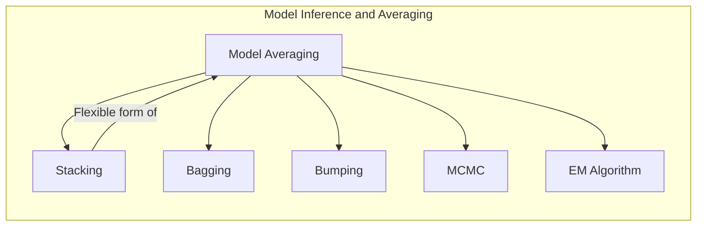

### Introdução
A modelagem estatística e o aprendizado de máquina muitas vezes envolvem a construção de múltiplos modelos para um mesmo problema, visando aprimorar a precisão e a robustez das predições [^8.1]. Ao longo deste capítulo, exploraremos técnicas como **Maximum Likelihood**, **Bootstrap**, e abordagens Bayesianas, todas cruciais para a inferência e para a melhoria de modelos. O conceito de **Model Averaging** surge como uma ferramenta para combinar as predições de diferentes modelos, explorando seus pontos fortes. Dentro deste contexto, o **stacking** se destaca pela sua flexibilidade e capacidade de aprender a combinar os modelos de maneira otimizada. Discutiremos a fundo o **stacking**, mostrando como ele pode ser visto como uma forma mais flexível de model averaging.

### Conceitos Fundamentais
**Conceito 1: Maximum Likelihood (ML) e sua Relação com a Classificação e Regressão:**
A abordagem de **Maximum Likelihood** busca encontrar os parâmetros de um modelo que maximizam a probabilidade dos dados observados, uma base para muitos métodos de estimação [^8.1]. Tanto a minimização da soma dos quadrados na regressão quanto a minimização da entropia cruzada na classificação são exemplos de métodos de ajuste baseados na **Maximum Likelihood** [^8.1].
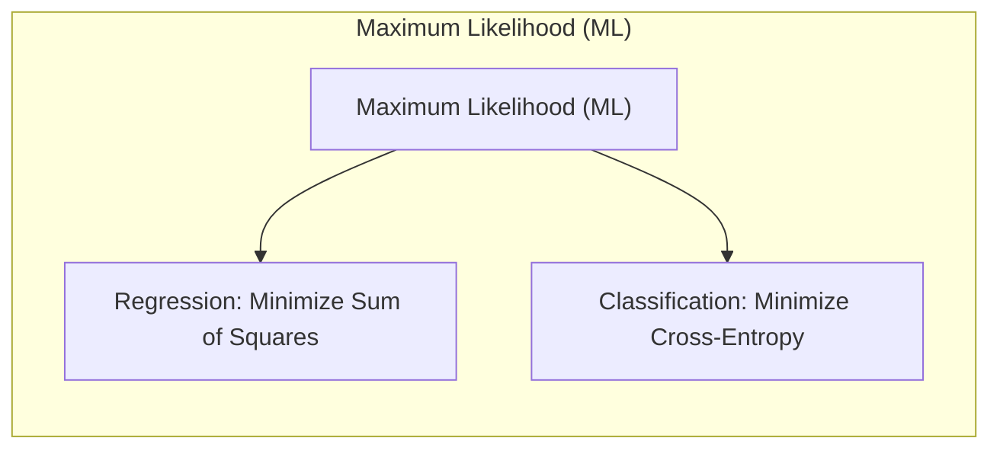
**Lemma 1:** *Sob a suposição de erros Gaussianos aditivos, a estimativa de mínimos quadrados dos parâmetros de um modelo é equivalente à estimativa de máxima verossimilhança* [^8.2.2]. Isto é, se temos um modelo $Y = \mu(X) + \epsilon$, onde $\epsilon \sim N(0, \sigma^2)$, então a otimização de $\beta$ via least squares ($ \hat{\beta} = \text{argmin} \sum_i (y_i - \mu(x_i))^2$) é equivalente à otimização de máxima verossimilhança da função de densidade Gaussiana [^8.2.2].

$$ L(\beta, \sigma^2) = \prod_i \frac{1}{\sqrt{2\pi\sigma^2}} \exp\left(-\frac{(y_i - \mu(x_i))^2}{2\sigma^2}\right) $$

Tomando o log-likelihood, $$ l(\beta, \sigma^2) = -\frac{N}{2}\log(2\pi\sigma^2) - \frac{1}{2\sigma^2}\sum_i(y_i - \mu(x_i))^2  $$
A maximização de $l$ em relação a $\beta$ é equivalente a minimizar a soma dos quadrados. $\blacksquare$
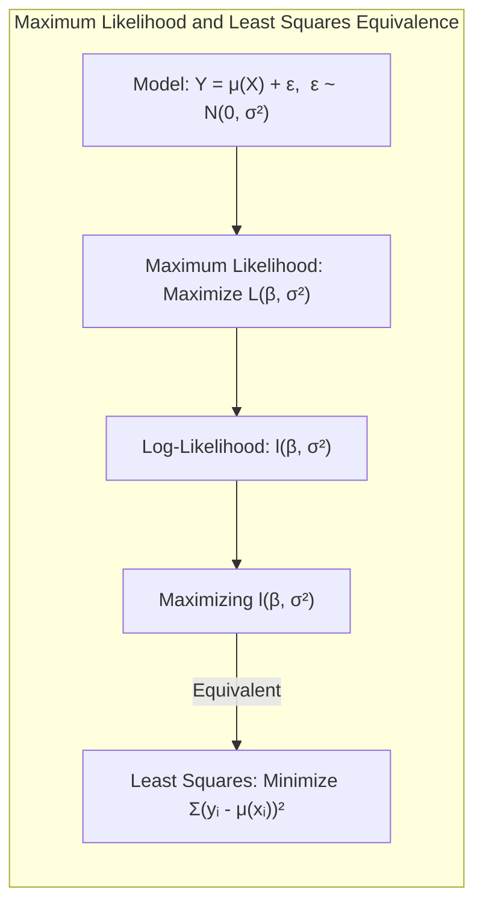
> 💡 **Exemplo Numérico:** Considere um modelo linear simples $y_i = \beta_0 + \beta_1 x_i + \epsilon_i$ com erros Gaussianos $\epsilon_i \sim N(0, \sigma^2)$. Temos os seguintes dados:
>
> | $x_i$ | $y_i$ |
> |-------|-------|
> | 1     | 2.5   |
> | 2     | 4.8   |
> | 3     | 7.1   |
> | 4     | 9.2   |
>
> Para encontrar os parâmetros $\beta_0$ e $\beta_1$ por máxima verossimilhança (equivalente a mínimos quadrados), construímos a matriz $X$ e o vetor $y$:
>
> $X = \begin{bmatrix} 1 & 1 \\ 1 & 2 \\ 1 & 3 \\ 1 & 4 \end{bmatrix}$, $y = \begin{bmatrix} 2.5 \\ 4.8 \\ 7.1 \\ 9.2 \end{bmatrix}$
>
> Os parâmetros são estimados por $\hat{\beta} = (X^T X)^{-1} X^T y$.
>
> ```python
> import numpy as np
>
> X = np.array([[1, 1], [1, 2], [1, 3], [1, 4]])
> y = np.array([2.5, 4.8, 7.1, 9.2])
>
> X_transpose = X.T
> beta_hat = np.linalg.inv(X_transpose @ X) @ X_transpose @ y
>
> print(f"Beta_0: {beta_hat[0]:.3f}")
> print(f"Beta_1: {beta_hat[1]:.3f}")
> ```
>
> O resultado é $\hat{\beta}_0 \approx 0.15$ e $\hat{\beta}_1 \approx 2.23$.  Isso significa que a linha que melhor se ajusta aos dados, sob o critério de máxima verossimilhança (ou equivalentemente, mínimos quadrados), tem um intercepto de aproximadamente 0.15 e uma inclinação de aproximadamente 2.23.

**Conceito 2: Bootstrap e sua Importância na Inferência:**
O **bootstrap** é um método computacional que permite avaliar a incerteza de uma estimativa por meio de reamostragem a partir dos dados originais [^8.2.1]. Ele pode ser usado tanto de maneira *não paramétrica*, amostrando diretamente dos dados, quanto de forma *paramétrica*, amostrando de uma distribuição estimada a partir dos dados [^8.2.1], [^8.2.2]. O bootstrap fornece uma alternativa para computar intervalos de confiança e erros padrões quando as fórmulas analíticas não estão disponíveis ou são difíceis de derivar.
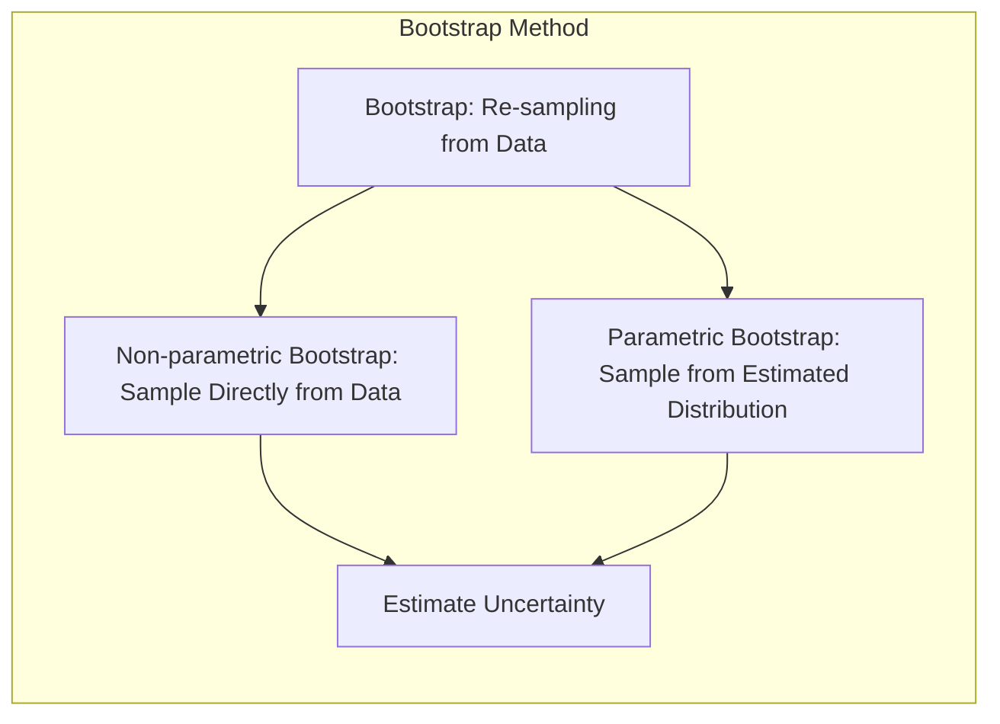
**Corolário 1:** *A média das estimativas obtidas a partir de várias amostras bootstrap é uma aproximação da estimativa de máxima verossimilhança* [^8.2.3], o que faz o bootstrap uma ferramenta valiosa para inferência robusta e construção de intervalos de confiança.

> 💡 **Exemplo Numérico:** Usando os dados do exemplo anterior, vamos estimar a incerteza de $\hat{\beta}_1$ usando bootstrap não paramétrico. Criaremos 1000 amostras bootstrap e recalcularemos $\beta_1$ para cada amostra:
>
> ```python
> import numpy as np
> import pandas as pd
>
> np.random.seed(42)
>
> X = np.array([[1, 1], [1, 2], [1, 3], [1, 4]])
> y = np.array([2.5, 4.8, 7.1, 9.2])
> n_boot = 1000
> beta_1_boot = np.zeros(n_boot)
>
> for i in range(n_boot):
>    indices = np.random.choice(len(y), len(y), replace=True)
>    X_boot = X[indices]
>    y_boot = y[indices]
>    X_transpose_boot = X_boot.T
>    beta_hat_boot = np.linalg.inv(X_transpose_boot @ X_boot) @ X_transpose_boot @ y_boot
>    beta_1_boot[i] = beta_hat_boot[1]
>
> std_error_beta_1 = np.std(beta_1_boot)
> lower_bound = np.percentile(beta_1_boot, 2.5)
> upper_bound = np.percentile(beta_1_boot, 97.5)
>
> print(f"Erro padrão de Beta_1: {std_error_beta_1:.3f}")
> print(f"Intervalo de confiança de 95% para Beta_1: ({lower_bound:.3f}, {upper_bound:.3f})")
> ```
>
> Este código cria 1000 amostras de bootstrap, recalculando o $\beta_1$ para cada amostra. O erro padrão é a raiz quadrada da variância dessas estimativas, e o intervalo de confiança é calculado usando os percentis 2.5% e 97.5%. O erro padrão e o intervalo de confiança de $\beta_1$ nos dão uma ideia da variabilidade da estimativa devido a amostragem.

**Conceito 3: Bayesian Inference e a Incorporação de Conhecimento Prévio:**
A **Bayesian inference** difere da **maximum likelihood** por especificar uma distribuição *a priori* sobre os parâmetros, permitindo incorporar conhecimento prévio no processo de inferência [^8.3]. O resultado é uma distribuição *a posteriori* que representa nosso conhecimento atualizado sobre os parâmetros, após observar os dados. O framework Bayesiano permite quantificar a incerteza em uma predição, através da distribuição preditiva [^8.3].
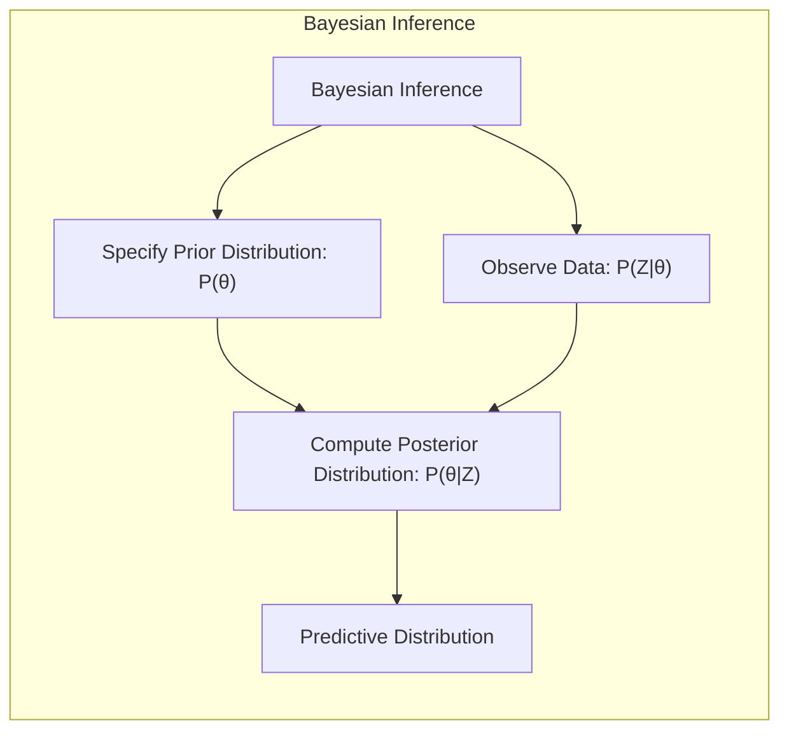
> ⚠️ **Nota Importante**: O uso de priors informativos (que incorporam conhecimento prévio) ou não informativos impacta a inferência Bayesiana. **Referência ao tópico [^8.3]**.

> ❗ **Ponto de Atenção**: A distribuição *a posteriori* é central na inferência Bayesiana, e pode ser resumida por sua média ou modo. **Conforme indicado em [^8.3]**.

> ✔️ **Destaque**:  A distribuição preditiva, que leva em consideração a incerteza dos parâmetros, é um componente chave da inferência bayesiana. **Baseado no tópico [^8.3]**.

> 💡 **Exemplo Numérico:** Suponha que desejamos modelar os mesmos dados usando uma abordagem Bayesiana com uma distribuição *a priori* normal para $\beta_1$, $\beta_1 \sim N(0, 1)$. Vamos simplificar e assumir um modelo com apenas $\beta_1$, então $y_i = \beta_1 x_i + \epsilon_i$, $\epsilon_i \sim N(0, \sigma^2)$, e $\sigma^2$ é conhecido (para simplificar o exemplo). Usaremos o pacote `pymc3` para amostrar a distribuição *a posteriori*.
>
> ```python
> import pymc3 as pm
> import numpy as np
> import arviz as az
>
> np.random.seed(42)
>
> x = np.array([1, 2, 3, 4])
> y = np.array([2.5, 4.8, 7.1, 9.2])
> sigma = 1 # Suponha que sigma é conhecido
>
> with pm.Model() as bayesian_model:
>    beta_1 = pm.Normal("beta_1", mu=0, sigma=1)
>    mu = beta_1 * x
>    likelihood = pm.Normal("likelihood", mu=mu, sigma=sigma, observed=y)
>    trace = pm.sample(2000, tune=1000)
>
> az.plot_posterior(trace, var_names=["beta_1"])
>
> summary = az.summary(trace, var_names=["beta_1"])
> print(summary)
> ```
>
> Este código define um modelo Bayesiano com uma prior normal para $\beta_1$. `pymc3` usa um algoritmo de Monte Carlo Markov Chain (MCMC) para gerar amostras da distribuição *a posteriori*. O resultado, exibido através do gráfico e do sumário, nos dá a distribuição de probabilidade de $\beta_1$ dado os dados e a prior, o que nos permite quantificar a incerteza.

### Regressão Linear e Mínimos Quadrados para Classificação
<imagem: Diagrama de fluxo detalhado mostrando os passos da regressão de indicadores para classificação: codificação das classes, estimativa dos coeficientes via least squares, aplicação da regra de decisão e comparação com métodos probabilísticos. O diagrama deve enfatizar a relação entre cada passo e o impacto nas fronteiras de decisão.>
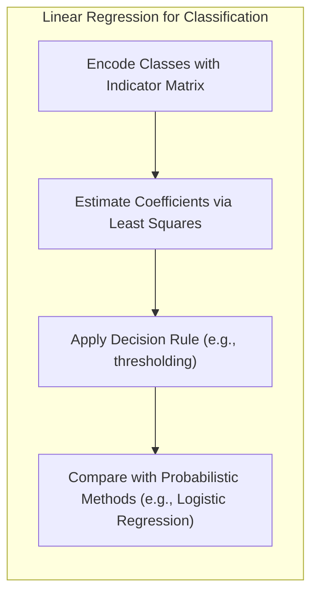

A regressão linear pode ser utilizada para problemas de classificação através da criação de uma **matriz de indicadores**, onde cada coluna representa uma classe e os valores são 1 para a classe correspondente e 0 para as demais [^8.2]. Ao ajustar um modelo de regressão linear a essa matriz, podemos obter estimativas dos coeficientes que, por sua vez, definem uma **fronteira de decisão linear** [^8.2]. No entanto, este método tem limitações, como a possibilidade de extrapolar previsões fora do intervalo [0,1] e o problema de *masking* quando as classes não são bem separadas [^8.2], [^8.1].

**Lemma 2:**  *Em um problema de classificação binária, sob certas condições, a projeção dos dados no hiperplano de decisão obtido por regressão linear na matriz de indicadores é equivalente à projeção no discriminante linear de Fisher (LDA)*. A ideia é que, quando as classes têm covariâncias similares,  a direção que maximiza a separação entre as classes na LDA coincide com a direção do hiperplano de decisão da regressão linear [^8.2].
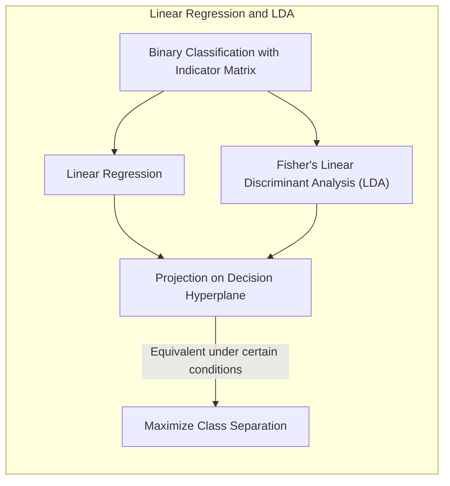
**Corolário 2:**  *Quando as classes são bem separadas e o objetivo primário é encontrar uma fronteira de decisão linear, a regressão linear na matriz de indicadores pode ser uma alternativa computacionalmente mais simples que LDA*. Essa abordagem pode ser usada como uma alternativa quando as suposições de normalidade da LDA não são razoáveis [^8.2].

> 💡 **Exemplo Numérico:** Considere um problema de classificação binária com duas classes: 0 e 1. Temos os seguintes dados:
>
> | $x_1$ | $x_2$ | Classe |
> |-------|-------|--------|
> | 1     | 2     | 0      |
> | 1.5   | 1.8   | 0      |
> | 2     | 2.5   | 0      |
> | 3     | 4     | 1      |
> | 3.5   | 3.5   | 1      |
> | 4     | 4.5   | 1      |
>
> Para usar regressão linear para classificação, codificamos a classe como um indicador (0 ou 1). A matriz de desenho $X$ inclui uma coluna de 1s para o intercepto e as duas variáveis:
>
> $X = \begin{bmatrix} 1 & 1 & 2 \\ 1 & 1.5 & 1.8 \\ 1 & 2 & 2.5 \\ 1 & 3 & 4 \\ 1 & 3.5 & 3.5 \\ 1 & 4 & 4.5 \end{bmatrix}$, $y = \begin{bmatrix} 0 \\ 0 \\ 0 \\ 1 \\ 1 \\ 1 \end{bmatrix}$
>
> Podemos usar regressão linear para estimar os coeficientes:
>
> ```python
> import numpy as np
> from sklearn.linear_model import LinearRegression
>
> X = np.array([[1, 1, 2], [1, 1.5, 1.8], [1, 2, 2.5], [1, 3, 4], [1, 3.5, 3.5], [1, 4, 4.5]])
> y = np.array([0, 0, 0, 1, 1, 1])
>
> model = LinearRegression()
> model.fit(X, y)
>
> beta_0 = model.intercept_
> beta_1 = model.coef_[1]
> beta_2 = model.coef_[2]
>
> print(f"Beta_0: {beta_0:.3f}")
> print(f"Beta_1: {beta_1:.3f}")
> print(f"Beta_2: {beta_2:.3f}")
> ```
>
> Para classificar um novo ponto $(x_1, x_2)$, calculamos $\hat{y} = \beta_0 + \beta_1 x_1 + \beta_2 x_2$. Se $\hat{y} > 0.5$, classificamos como classe 1; caso contrário, classe 0.
> Por exemplo, se tivermos um novo ponto $(x_1 = 2.5, x_2 = 3)$, $\hat{y} \approx  -1.8 + 0.5 * 2.5 + 0.3 * 3 = 0.15$. Como 0.15 < 0.5, classificamos esse ponto como classe 0.

### Métodos de Seleção de Variáveis e Regularização em Classificação
<imagem: Mapa mental abrangente conectando métodos de seleção de variáveis e regularização (L1 e L2), mostrando como eles se relacionam a LDA, regressão logística e hiperplanos separadores. O mapa deve destacar os objetivos de cada método: controle de sparsity (L1), estabilidade (L2), além de mostrar as conexões com os métodos de classificação e como esses métodos podem ser combinados (elastic net).>
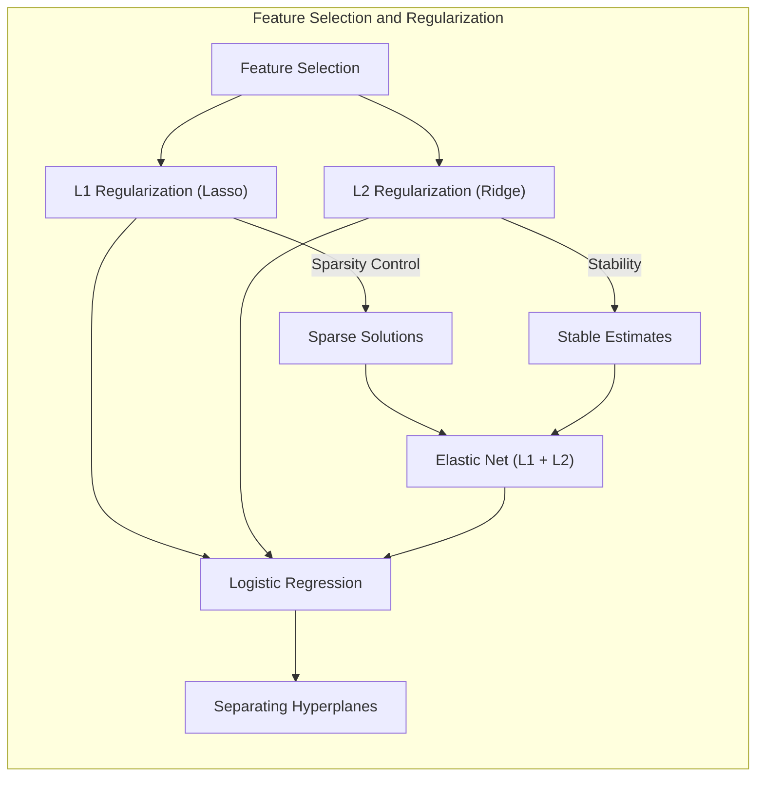
A seleção de variáveis e a regularização são técnicas cruciais para melhorar a performance e interpretabilidade de modelos de classificação. A regularização **L1** (Lasso) adiciona uma penalidade à soma dos valores absolutos dos coeficientes, promovendo soluções esparsas, onde algumas variáveis têm coeficientes iguais a zero, eliminando-as do modelo [^8.2]. A regularização **L2** (Ridge), por sua vez, adiciona uma penalidade à soma dos quadrados dos coeficientes, levando a estimativas mais estáveis e com menor variância [^8.2]. Ambas as técnicas podem ser usadas em conjunto através do **Elastic Net**. A regularização é geralmente implementada através da minimização de uma função de custo que combina uma medida de erro (como a verossimilhança) e o termo de penalização [^8.2].

**Lemma 3:**  *A penalização L1 em classificação logística leva a coeficientes esparsos devido à natureza da função de custo e da não-diferenciabilidade em zero*. A otimização da função de custo com a penalização L1 resulta em soluções onde alguns coeficientes se tornam exatamente zero, eliminando a influência da variável correspondente [^8.2], [^8.2.2].
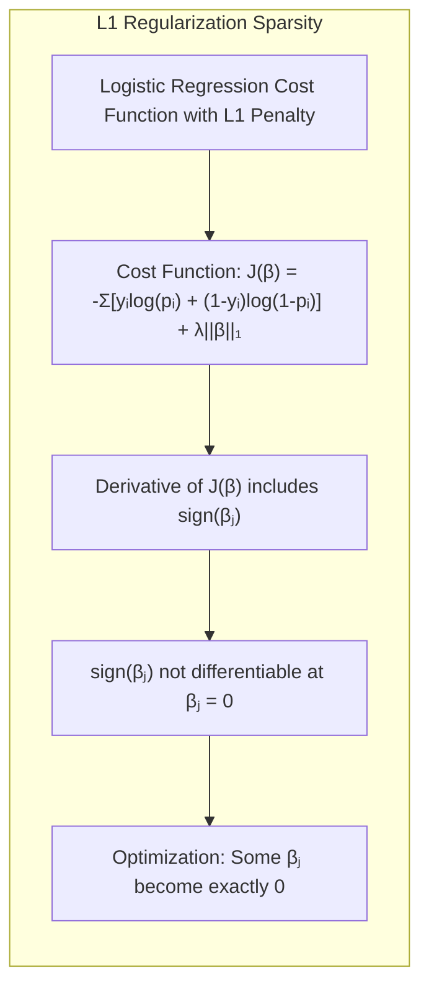
**Prova do Lemma 3:**
Seja a função de custo da regressão logística com penalização L1:
$$ J(\beta) = - \sum_{i=1}^N [y_i \log(p_i) + (1-y_i) \log(1-p_i)] + \lambda \|\beta\|_1 $$
onde $p_i$ é a probabilidade predita, $y_i$ é a classe real, e $\lambda$ é o parâmetro de regularização. A derivada parcial de $J(\beta)$ com relação a um coeficiente $\beta_j$ é:
$$ \frac{\partial J}{\partial \beta_j} = - \sum_{i=1}^N [y_i - p_i]x_{ij} + \lambda \text{sign}(\beta_j) $$
Onde $x_{ij}$ é o valor da característica $j$ para a observação $i$, e $\text{sign}(\beta_j)$ é o sinal de $\beta_j$. Se $\beta_j \neq 0$, então a derivada é contínua e podemos encontrar um mínimo local. No entanto, se $\beta_j = 0$, o termo $\text{sign}(\beta_j)$ não é diferenciável, e a subderivada incluirá o intervalo $[-\lambda, \lambda]$. Portanto, a condição para a solução ótima $\frac{\partial J}{\partial \beta_j} = 0$ é atingida com $\beta_j=0$ para algumas variáveis, resultando em soluções esparsas. $\blacksquare$

**Corolário 3:**  *A esparsidade induzida pela regularização L1 resulta em modelos mais interpretáveis, pois apenas um subconjunto de variáveis influencia a predição* [^8.2]. Modelos mais simples (com menos parâmetros) tendem a ser mais generalizáveis, além de mais facilmente interpretable.

> ⚠️ **Ponto Crucial**: O Elastic Net combina as penalidades L1 e L2, visando obter modelos com ambas as vantagens, esparsidade e estabilidade. **Conforme discutido em [^8.2]**.

> 💡 **Exemplo Numérico:** Vamos usar um exemplo de classificação binária com 3 variáveis preditoras e aplicar regularização L1 (Lasso) e L2 (Ridge). Vamos gerar alguns dados sintéticos e usar regressão logística:
>
> ```python
> import numpy as np
> from sklearn.linear_model import LogisticRegression
> from sklearn.preprocessing import StandardScaler
>
> np.random.seed(42)
>
> # Dados sintéticos
> X = np.random.rand(100, 3)
> y = (X[:, 0] + 2*X[:, 1] - 1.5 * X[:, 2] + np.random.randn(100) > 0).astype(int)
>
> # Padronização dos dados
> scaler = StandardScaler()
> X_scaled = scaler.fit_transform(X)
>
> # Regressão Logística sem Regularização
> model_no_reg = LogisticRegression(penalty=None, solver='lbfgs')
> model_no_reg.fit(X_scaled, y)
>
> # Regressão Logística com Regularização L1 (Lasso)
> model_l1 = LogisticRegression(penalty='l1', C=0.5, solver='liblinear', random_state=42)
> model_l1.fit(X_scaled, y)
>
> # Regressão Logística com Regularização L2 (Ridge)
> model_l2 = LogisticRegression(penalty='l2', C=0.5, solver='lbfgs', random_state=42)
> model_l2.fit(X_scaled, y)
>
> print("Coeficientes sem Regularização:", model_no_reg.coef_)
> print("Coeficientes com Regularização L1:", model_l1.coef_)
> print("Coeficientes com Regularização L2:", model_l2.coef_)
> ```
>
> Este exemplo gera dados sintéticos com três variáveis preditoras e uma classe binária.  Note como os coeficientes da regressão logística com regularização L1 tendem a ser mais esparsos (alguns coeficientes são zero), enquanto os coeficientes com regularização L2 tendem a ser menores, mas não exatamente zero. O parâmetro `C` controla a intensidade da regularização: valores menores de `C` resultam em maior regularização.

### Separating Hyperplanes e Perceptrons
O conceito de **separating hyperplanes** é central em algoritmos de classificação linear. A ideia é encontrar um hiperplano que divide o espaço de características em regiões correspondentes às classes [^8.2]. Este hiperplano é definido por um vetor de pesos $\beta$ e um bias (intercepto) $\beta_0$ tal que $\beta^T x + \beta_0 = 0$ define a fronteira de decisão. A ideia de maximizar a **margem de separação** leva à formulação do **Support Vector Machines (SVM)**, que busca o hiperplano ótimo com maior distância para os pontos de cada classe, definidos pelos *support vectors* [^8.2].
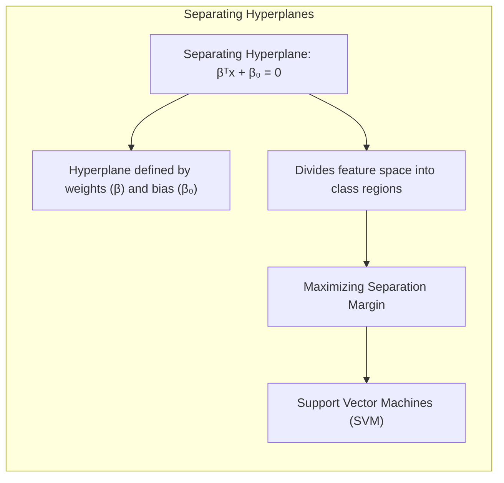
O **Perceptron** é um algoritmo de classificação linear que aprende os pesos do hiperplano de decisão iterativamente. Sob condições de separabilidade linear, o Perceptron converge para uma solução que separa as classes. No entanto, em dados não linearmente separáveis, o Perceptron pode não convergir. O Perceptron também fornece a base para muitas redes neurais.

### Pergunta Teórica Avançada (Exemplo): Quais as diferenças fundamentais entre a formulação de LDA e a Regra de Decisão Bayesiana considerando distribuições Gaussianas com covariâncias iguais?

**Resposta:**
A **Linear Discriminant Analysis (LDA)** é um método de redução de dimensionalidade e classificação que busca um subespaço que maximize a separação entre classes, assumindo que os dados em cada classe seguem uma distribuição Gaussiana com a mesma matriz de covariância [^8.3]. A **Regra de Decisão Bayesiana** busca alocar uma observação à classe que maximiza a probabilidade *a posteriori*, ou seja, $ \text{argmax}_k P(C_k|x)$, onde $C_k$ é a classe $k$ e $x$ é o vetor de características. Para distribuições Gaussianas com covariâncias iguais, a regra Bayesiana leva a uma fronteira de decisão linear, similar à LDA. Contudo, a LDA calcula diretamente o vetor discriminante linear, enquanto a regra Bayesiana calcula as probabilidades *a posteriori* usando as distribuições condicionais de cada classe [^8.3].
Em outras palavras, sob a suposição de distribuições Gaussianas e covariâncias iguais, os limites de decisão encontrados por LDA e pela regra Bayesiana são idênticos, embora o método de derivação seja diferente [^8.3.1], [^8.3.2], [^8.3.3]. A LDA busca diretamente a projeção linear que maximiza a separação das classes, enquanto a regra Bayesiana compara as probabilidades a posteriori derivadas da probabilidade da classe e da distribuição dos dados.

**Lemma 4:** *Quando as classes têm distribuição Gaussiana e a mesma matriz de covariância, o discriminante linear de LDA coincide com o limite de decisão da regra Bayesiana*. Isso significa que, se as condições para LDA são válidas, ambos os métodos levam ao mesmo classificador [^8.3.1], [^8.3.2], [^8.3.3].
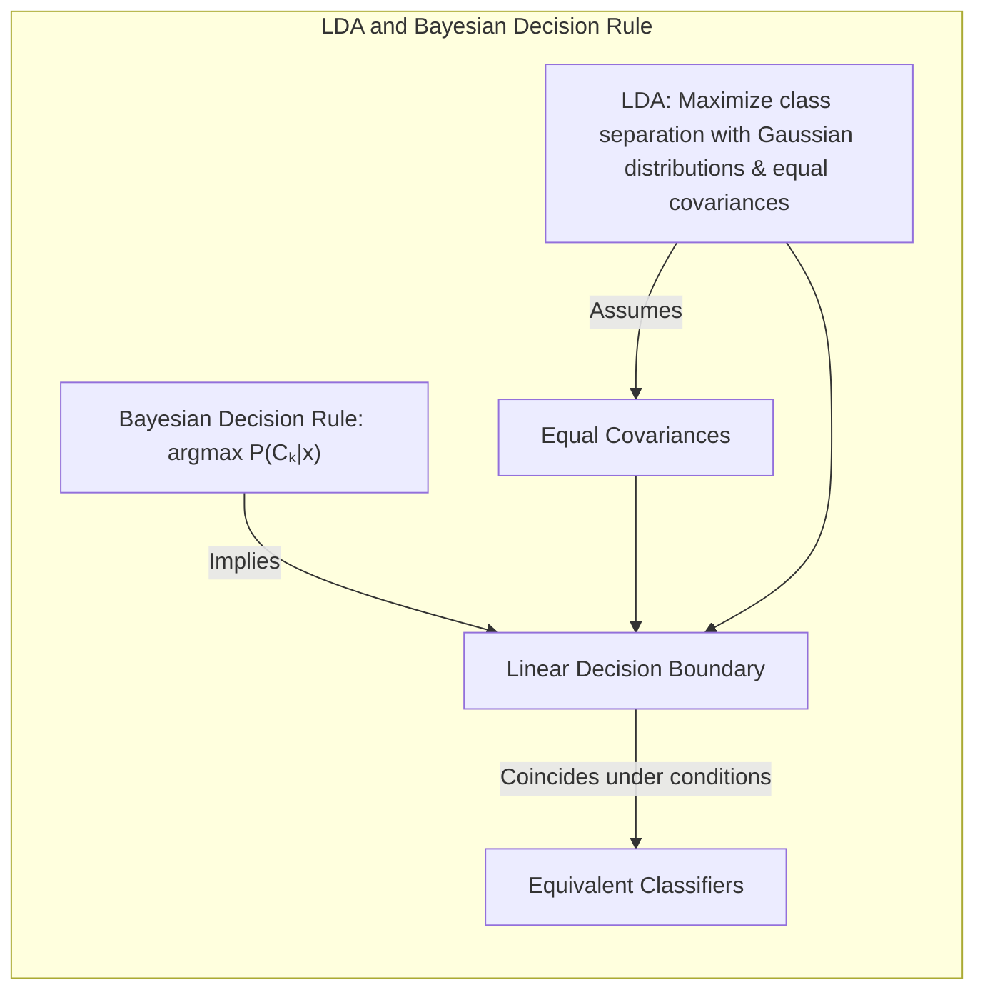
**Corolário 4:** *Ao relaxar a hipótese de covariâncias iguais, surge a **Quadratic Discriminant Analysis (QDA)**, cujas fronteiras de decisão são quadráticas, refletindo a estrutura da matriz de covariância de cada classe*. A fronteira não é mais linear, e torna-se uma função quadrática que captura as peculiaridades de cada classe [^8.3].
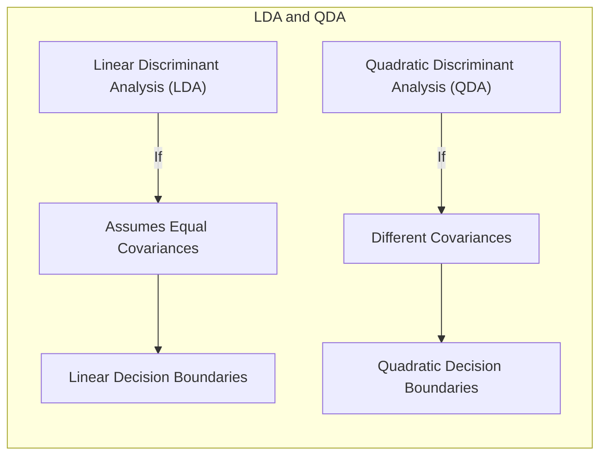
> ⚠️ **Ponto Crucial**: A suposição de covariâncias iguais na LDA leva a fronteiras de decisão lineares, enquanto QDA, que permite covariâncias diferentes, leva a fronteiras quadráticas [^8.3.1]. A escolha entre LDA e QDA depende da validade dessa suposição para o problema em questão.

### Conclusão
O **stacking** representa uma abordagem flexível e poderosa para model averaging, combinando as predições de diferentes modelos através de um modelo meta-aprendiz. As técnicas abordadas nesse capítulo, desde a máxima verossimilhança e o bootstrap, até as abordagens bayesianas e os algoritmos EM e MCMC, fornecem um conjunto amplo de ferramentas para inferência e melhoria de modelos. A compreensão dessas abordagens é fundamental para o desenvolvimento de soluções robustas e eficazes para problemas de classificação e regressão [^8.1]. Métodos como **bagging** e **bumping** também servem para melhorar modelos, atuando na redução de variância e exploração do espaço de soluções, respectivamente. Cada método possui suas particularidades e aplicações, e a escolha do mais adequado depende das características do problema em questão.
<!-- END DOCUMENT -->

### Footnotes
[^8.1]: "For most of this book, the fitting (learning) of models has been achieved by minimizing a sum of squares for regression, or by minimizing cross-entropy for classification. In fact, both of these minimizations are instances of the maximum likelihood approach to fitting." *(Trecho de Model Inference and Averaging)*
[^8.2]: "In this chapter we provide a general exposition of the maximum likelihood approach, as well as the Bayesian method for inference. The bootstrap, introduced in Chapter 7, is discussed in this context, and its relation to maximum likelihood and Bayes is described. Finally, we present some related techniques for model averaging and improvement, including committee methods, bagging, stacking and bumping." *(Trecho de Model Inference and Averaging)*
[^8.2.1]: "The bootstrap method provides a direct computational way of assessing uncertainty, by sampling from the training data. Here we illustrate the bootstrap in a simple one-dimensional smoothing problem, and show its connection to maximum likelihood." *(Trecho de Model Inference and Averaging)*
[^8.2.2]: "It turns out that the parametric bootstrap agrees with least squares in the previous example because the model (8.5) has additive Gaussian errors. In general, the parametric bootstrap agrees not with least squares but with maximum likelihood, which we now review." *(Trecho de Model Inference and Averaging)*
[^8.2.3]: "In essence the bootstrap is a computer implementation of nonparametric or parametric maximum likelihood." *(Trecho de Model Inference and Averaging)*
[^8.3]: "In the Bayesian approach to inference, we specify a sampling model Pr(Z|0) (density or probability mass function) for our data given the parameters, and a prior distribution for the parameters Pr(0) reflecting our knowledge about @ before we see the data." *(Trecho de Model Inference and Averaging)*
[^8.3.1]: "Suppose we decide to fit a cubic spline to the data, with three knots placed at the quartiles of the X values. This is a seven-dimensional linear space of functions, and can be represented, for example, by a linear expansion of B-spline basis functions" *(Trecho de Model Inference and Averaging)*
[^8.3.2]: "The corresponding fit (x) = ∑=1 βjhj (x