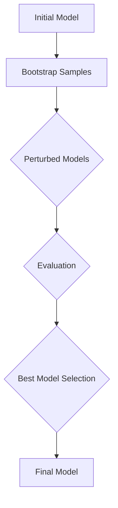
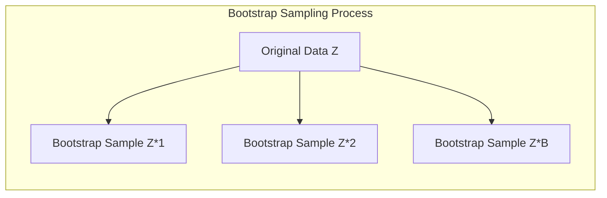
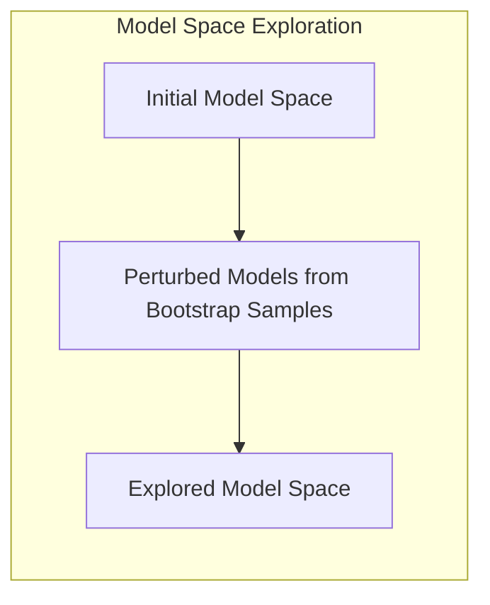
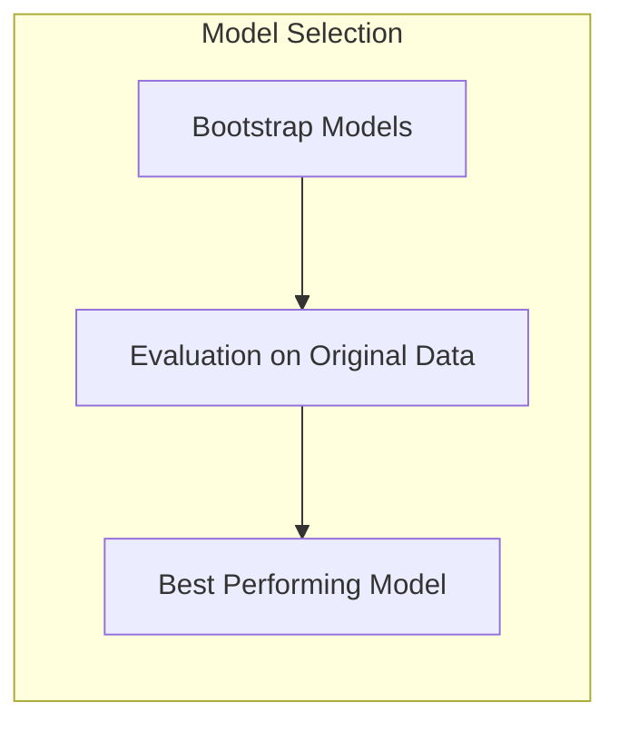
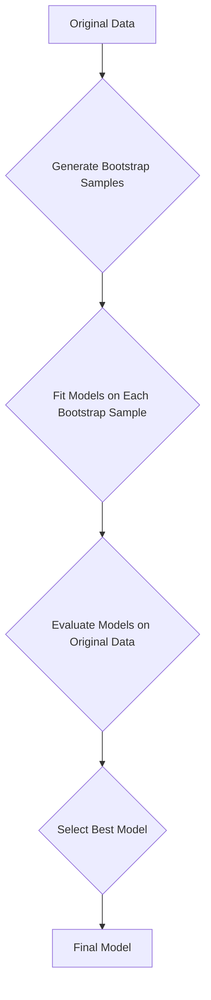
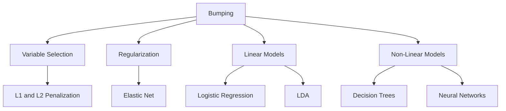
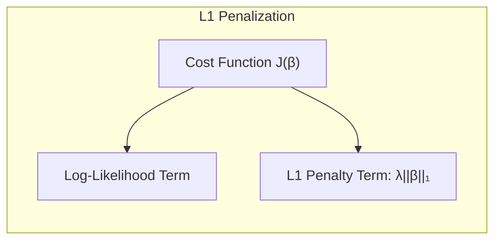
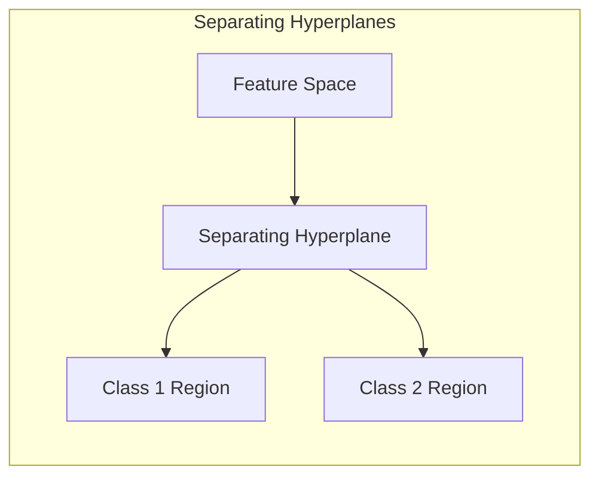
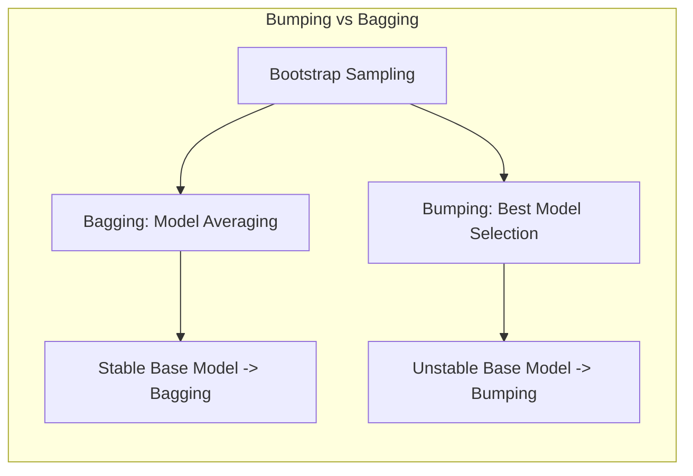
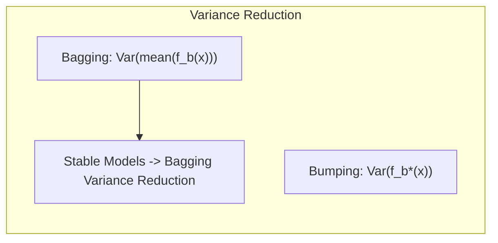

## Bumping: A Stochastic Approach to Model Improvement

### Introdução

Este capítulo aborda técnicas avançadas de inferência e média de modelos, complementando as abordagens tradicionais de minimização de erros quadráticos ou de entropia cruzada [^8.1]. A modelagem estatística frequentemente envolve a busca por um modelo que melhor se ajuste aos dados disponíveis, um processo que pode ser dificultado pela presença de múltiplos mínimos locais no espaço de parâmetros ou pela instabilidade de alguns procedimentos de ajuste. Uma dessas técnicas que se destaca é o **bumping**, um método de busca estocástica que utiliza *bootstrap sampling* para explorar o espaço de modelos de maneira mais eficaz [^8.9].

O bumping não se enquadra nas categorias de model averaging ou combinação de modelos. Em vez disso, ele se concentra em encontrar um único modelo que seja superior aos demais. Ao perturbar os dados de treinamento por meio de *bootstrap samples*, o bumping tenta evitar ficar preso em soluções locais ruins e encontrar regiões mais favoráveis do espaço de parâmetros [^8.9]. Esta abordagem se mostra particularmente útil em situações onde o ajuste do modelo leva a múltiplas soluções locais, um problema comum em procedimentos de ajuste instáveis ou quando a superfície do erro apresenta complexidades significativas.

O objetivo deste capítulo é fornecer uma compreensão profunda do bumping, contrastando-o com outras técnicas discutidas, e demonstrar como ele pode ser utilizado para aprimorar a qualidade do modelo final. Exploraremos os fundamentos teóricos, os aspectos práticos e a relação entre bumping e outros métodos de inferência de modelos. Este capítulo assume um nível avançado de conhecimento em estatística e aprendizado de máquina, com foco em modelos estatísticos, otimização e análise de dados.

### Conceitos Fundamentais

Nesta seção, exploraremos os conceitos fundamentais que são cruciais para a compreensão do bumping e seu papel no contexto de inferência de modelos.

**Conceito 1: Bootstrap Sampling**
O *bootstrap sampling*, ou amostragem bootstrap, é uma técnica de reamostragem que envolve a criação de múltiplas amostras a partir dos dados originais, utilizando amostragem com reposição [^8.2]. Cada amostra bootstrap tem o mesmo tamanho que o conjunto de dados original, mas alguns registros podem aparecer várias vezes e outros podem não aparecer. Essa técnica é usada para estimar a variabilidade de estatísticas amostrais ou de modelos de aprendizado de máquina.

**Lemma 1:** Dado um conjunto de dados $Z = \{(x_1, y_1), (x_2, y_2), \ldots, (x_N, y_N)\}$, a construção de amostras bootstrap $Z^{*b}$, com $b=1, 2, \ldots, B$, permite estimar a distribuição amostral de uma estatística $\hat{\theta} = f(Z)$ através de $\hat{\theta}^{*b} = f(Z^{*b})$. Isso é fundamental para avaliarmos a variabilidade e construir intervalos de confiança. Formalmente, se denotarmos por $P$ a distribuição empírica dos dados $Z$, a amostragem bootstrap consiste em construir $B$ amostras $Z^{*b}$ amostradas de $P$. $\blacksquare$

> 💡 **Exemplo Numérico:** Considere um pequeno conjunto de dados $Z = \{(1, 2), (2, 4), (3, 5), (4, 4), (5, 6)\}$. Vamos gerar 3 amostras bootstrap ($B=3$):
>
>  $Z^{*1} = \{(1, 2), (2, 4), (2, 4), (4, 4), (5, 6)\}$
>  $Z^{*2} = \{(1, 2), (1, 2), (3, 5), (4, 4), (5, 6)\}$
>  $Z^{*3} = \{(2, 4), (2, 4), (3, 5), (3, 5), (5, 6)\}$
>
> Observe que em cada amostra bootstrap, alguns pontos são repetidos e outros podem estar ausentes. Se nossa estatística de interesse for a média dos valores de $y$, teríamos $\hat{\theta} = \frac{2+4+5+4+6}{5} = 4.2$ para o conjunto original. Para as amostras bootstrap, temos:
>
> $\hat{\theta}^{*1} = \frac{2+4+4+4+6}{5} = 4$
> $\hat{\theta}^{*2} = \frac{2+2+5+4+6}{5} = 3.8$
> $\hat{\theta}^{*3} = \frac{4+4+5+5+6}{5} = 4.8$
>
>  A partir das amostras bootstrap, podemos estimar a variabilidade da média, que é uma estatística amostral.

**Conceito 2: Model Space Exploration**
O espaço de modelos representa o conjunto de todos os modelos possíveis para um determinado problema. Esse espaço pode ser vasto e complexo, e a busca pelo melhor modelo pode ser um desafio, especialmente quando a função de perda apresenta múltiplos mínimos locais. O *bumping* utiliza o bootstrap para explorar o espaço de modelos de forma estocástica, buscando regiões onde o desempenho do modelo é superior [^8.9]. Esta exploração é feita através de perturbações nos dados de treinamento, cada uma levando a um modelo potencialmente diferente.

**Corolário 1:** A ideia central do bumping é que, ao perturbar os dados, permitimos que o algoritmo de ajuste encontre diferentes soluções no espaço de modelos.  Ao invés de ficar preso num único ponto, a diversidade gerada pelas amostras bootstrap permite explorar um leque maior de soluções, aumentando a probabilidade de encontrar um modelo com bom desempenho generalizado. $\blacksquare$

> 💡 **Exemplo Numérico:** Imagine que estamos ajustando um modelo de regressão com uma função de perda que possui dois mínimos locais, um "bom" mínimo (menor erro) e um "ruim" mínimo (maior erro). Se ajustarmos o modelo apenas uma vez usando os dados originais, podemos acabar no mínimo "ruim". O bumping, através de amostras bootstrap, pode nos dar diferentes "pontos de partida" no espaço de modelos, aumentando as chances de o processo de otimização encontrar o mínimo "bom" em pelo menos uma das amostras. Visualmente, podemos imaginar isso como "chacoalhar" o processo de otimização para fazê-lo explorar diferentes regiões do espaço de modelos.

**Conceito 3: Escolha do Modelo com Melhor Desempenho**
Ao contrário do *bagging*, que combina os resultados de vários modelos para gerar uma estimativa agregada [^8.7], o bumping seleciona o modelo que apresenta o melhor desempenho no conjunto de dados original. A escolha é feita a partir de uma métrica específica que avalia a performance do modelo nos dados originais, frequentemente utilizando a mesma métrica de avaliação do modelo de base, como o erro quadrático médio ou alguma métrica de classificação.

> ⚠️ **Nota Importante**: O bumping busca um único modelo, aquele que apresentou o melhor desempenho nos dados originais entre as amostras bootstrap, ao contrário do *bagging*, que gera um modelo por meio da agregação de vários modelos. **Referência ao tópico [^8.7] e [^8.9]**.

> ❗ **Ponto de Atenção**: A métrica de avaliação utilizada no bumping é crucial para o desempenho final do modelo e deve refletir a performance desejada para o problema específico. **Conforme indicado em [^8.9]**.

> ✔️ **Destaque**: Ao utilizar *bootstrap sampling*, o bumping introduz uma forma de aleatoriedade no processo de treinamento, que pode ser fundamental para escapar de mínimos locais e encontrar soluções melhores. **Baseado no tópico [^8.9]**.

### Regressão Linear e Mínimos Quadrados para Classificação

**Explicação:** Este diagrama representa o processo do bumping, mostrando a sequência de geração de amostras bootstrap, ajuste de modelos, avaliação e seleção do melhor modelo com base no desempenho no conjunto original. Esta representação facilita a visualização do fluxo do processo de bumping e a sua distinção de outros métodos como o *bagging*, **conforme descrito nos tópicos [^8.7] e [^8.9]**.

A regressão linear e o método de mínimos quadrados, apesar de serem frequentemente utilizados em problemas de regressão, podem ser aplicados no contexto de classificação através de técnicas como a regressão de matriz de indicadores [^4.2]. No entanto, esses métodos podem não ser ótimos para cenários complexos, o que justifica a busca por alternativas como o bumping.
O método de mínimos quadrados busca encontrar o conjunto de parâmetros que minimiza a soma dos quadrados dos erros entre as previsões do modelo e os valores observados. Em problemas de classificação, essa abordagem pode levar a modelos instáveis e com baixo desempenho generalizado.
O bumping surge como uma alternativa, pois, ao perturbar os dados por meio do *bootstrap sampling*, o bumping permite explorar o espaço de soluções de forma mais completa, reduzindo a chance de o modelo ficar preso em mínimos locais ou em soluções instáveis [^8.9]. Essa característica é particularmente importante em modelos com muitos parâmetros ou em problemas com alta dimensionalidade.

**Lemma 2**: Se os dados de treinamento são perturbados por meio do *bootstrap sampling*, e a estimação é feita em cada amostra,  a variância do modelo ajustado é reduzida pela exploração de diferentes pontos no espaço de parâmetros, ao invés de se limitar a uma única solução, como faria a regressão linear sem perturbações. O processo de bumping explora uma variedade de soluções locais ao redor da solução original, e ao fim do processo seleciona o modelo que generaliza melhor. $\blacksquare$

> 💡 **Exemplo Numérico:** Suponha que temos um problema de classificação binária com duas classes (0 e 1). Aplicamos regressão linear com mínimos quadrados para obter um modelo inicial. Agora, usamos bumping com 5 amostras bootstrap. Para cada amostra bootstrap, ajustamos um novo modelo de regressão linear e calculamos a previsão em nosso conjunto de dados original. Digamos que obtemos os seguintes resultados, onde os valores são erros quadráticos médios (MSE) no conjunto de dados original:
> - Modelo original: MSE = 0.85
> - Modelo 1 (bootstrap 1): MSE = 0.92
> - Modelo 2 (bootstrap 2): MSE = 0.78
> - Modelo 3 (bootstrap 3): MSE = 0.88
> - Modelo 4 (bootstrap 4): MSE = 0.83
> - Modelo 5 (bootstrap 5): MSE = 0.75
>
> O bumping selecionaria o modelo 5 como o modelo final, pois ele apresentou o menor erro (MSE = 0.75) no conjunto de dados original, indicando uma melhor generalização. Isso demonstra como o bumping pode encontrar um modelo que se comporta melhor do que o modelo inicial e os outros modelos gerados pelo bootstrap.

**Corolário 2**: Se o modelo linear utilizado for instável ou apresentar alta variância devido ao ajuste em um conjunto específico de dados, o bumping pode melhorar sua performance e generalização ao explorar diferentes soluções possíveis e escolher a melhor delas de acordo com o desempenho nos dados originais. Conforme mencionado em [^8.9], o bumping visa a encontrar um modelo que minimize o erro no conjunto de dados original, que não necessariamente é o modelo ajustado na amostra original. $\blacksquare$

Em alguns casos, a regressão linear combinada com mínimos quadrados pode ser suficiente e até mesmo vantajosa para construir um modelo inicial, com o bumping refinando a solução através de sua busca estocástica [^8.9]. No entanto, em outros casos mais complexos, onde o modelo linear não é capaz de capturar as relações entre os dados, métodos mais sofisticados podem ser necessários. A regressão logística é uma alternativa frequente para classificação, e sua aplicação combinada com técnicas de regularização é recomendada para reduzir a variância em modelos complexos [^4.4].

### Métodos de Seleção de Variáveis e Regularização em Classificação

**Explicação:** Este mapa mental ilustra como o bumping se relaciona com seleção de variáveis, regularização e diferentes tipos de modelos. O bumping pode ser usado para refinar e melhorar modelos de diferentes naturezas, sejam eles lineares ou não lineares. Conforme mencionado em [^8.9], o bumping ajuda a melhorar modelos que podem ser instáveis ou propensos a sobreajuste, e pode ser combinado com regularização para este fim.

Em problemas de classificação, a seleção de variáveis e a regularização são cruciais para lidar com a dimensionalidade dos dados e para evitar *overfitting*. Métodos como a penalização L1 (Lasso) e L2 (Ridge) são utilizados para reduzir a complexidade dos modelos e melhorar sua capacidade de generalização [^4.5]. A penalização L1 tem a capacidade de selecionar variáveis automaticamente, zerando coeficientes de variáveis menos importantes, resultando em modelos esparsos e mais interpretáveis. A penalização L2, por outro lado, reduz a magnitude dos coeficientes, tornando o modelo mais estável [^4.4.4].
Modelos como a regressão logística podem se beneficiar dessas técnicas de regularização, permitindo que o modelo se ajuste aos dados de forma mais robusta e evitando o *overfitting*, especialmente quando a quantidade de variáveis é grande em relação ao número de observações [^4.4.4], [^4.4.5]. O bumping pode ser usado em conjunto com a regularização para explorar diferentes pontos no espaço de parâmetros e encontrar um modelo mais adequado.
A regularização é também essencial na construção de *separating hyperplanes* ótimos, um conceito discutido em [^4.5.2], no qual a maximização da margem de separação entre as classes é combinada com termos de regularização para evitar soluções que se ajustem demais aos dados de treinamento.
O *Elastic Net* é um método que combina ambas as penalizações L1 e L2, utilizando um parâmetro de mistura $\alpha$ para equilibrar as duas abordagens [^4.5]. Essa técnica pode ser benéfica em situações onde tanto a seleção de variáveis quanto a estabilização dos coeficientes são importantes.

**Lemma 3**: Dada uma função de custo $J(\beta)$ para um modelo de classificação logística, a adição de uma penalização L1, $\lambda\|\beta\|_1$, resulta em soluções esparsas para os parâmetros $\beta$. A penalização L1 força alguns coeficientes a serem exatamente zero, efetuando a seleção de variáveis [^4.4.4].
**Prova do Lemma 3:** Ao maximizar a função de verossimilhança com a penalização L1, a função de custo fica:
$$ J(\beta) = - \sum_{i=1}^N y_i \log(p(x_i)) + (1-y_i) \log(1-p(x_i)) + \lambda\|\beta\|_1 $$
A solução para essa otimização implica que alguns componentes de $\beta$ serão levados a zero, já que o termo $\lambda\|\beta\|_1$ pune coeficientes com valores absolutos grandes. Este processo de seleção é inerente à natureza da penalização L1 e contrasta com a penalização L2, onde os coeficientes são apenas reduzidos, mas não zerados. $\blacksquare$

> 💡 **Exemplo Numérico:** Suponha que temos um problema de classificação binária com 10 variáveis preditoras e estamos usando regressão logística. Sem regularização, nosso modelo poderia usar todas as 10 variáveis. Se aplicarmos a penalização L1 (Lasso), alguns dos coeficientes podem ser forçados a zero. Vamos assumir que, após aplicar o Lasso com um certo valor de $\lambda$, os coeficientes estimados são:
>
> $\beta = [0.8, 0, 0.5, 0, 0, 1.2, 0, -0.3, 0, 0.7]$
>
> Observe que os coeficientes para as variáveis 2, 4, 5, 7 e 9 foram zerados. Isso significa que o Lasso selecionou as variáveis 1, 3, 6, 8 e 10 como as mais importantes para o modelo, resultando em um modelo mais simples e possivelmente mais generalizável.
> O bumping pode ser usado para avaliar diferentes valores de $\lambda$ e selecionar o modelo que melhor generaliza os dados.

**Corolário 3**: Ao aplicar uma penalização L1, como discutido em [^4.4.4], o modelo resultante tende a ter menos variáveis preditoras e coeficientes de menor magnitude. Isso facilita a interpretação do modelo final, pois apenas as variáveis mais relevantes são mantidas. Este processo é crucial quando se busca um modelo com bom poder preditivo e também uma compreensão clara das relações entre as variáveis e a resposta. $\blacksquare$

O bumping pode ser utilizado para explorar a influência de diferentes níveis de regularização no modelo final, através do *bootstrap sampling*, e escolher o modelo que melhor equilibra *bias* e variância [^8.9]. Ao invés de selecionar um nível de regularização específico, o bumping pode explorar várias alternativas, escolhendo a que leva ao melhor desempenho nos dados originais.

> ⚠️ **Ponto Crucial**: A escolha entre L1, L2 ou Elastic Net depende do problema específico e do comportamento desejado do modelo. É importante conhecer e entender o efeito de cada penalização na complexidade do modelo, e como elas influenciam os parâmetros. **Conforme discutido em [^4.4.4] e [^4.5]**.

### Separating Hyperplanes e Perceptrons

O conceito de *separating hyperplanes* (hiperplanos separadores) é fundamental em modelos de classificação linear, como a análise discriminante linear (LDA) e *Support Vector Machines* (SVMs) [^4.5.2]. Um hiperplano separador busca dividir o espaço de características em regiões correspondentes às diferentes classes. O objetivo é encontrar um hiperplano que maximize a margem de separação entre as classes, o que reduz o risco de erro de classificação em dados não vistos [^4.5.2].

O *perceptron*, um algoritmo simples de classificação, busca ajustar um hiperplano que separa as classes por meio de iterações, ajustando seus pesos em resposta a erros de classificação.  Sob condições específicas de separabilidade linear, o perceptron converge para uma solução, embora essa solução possa não ser única [^4.5.1].
O bumping pode ser usado para melhorar a estabilidade da solução do perceptron ou para auxiliar na busca por hiperplanos mais robustos, usando *bootstrap sampling* para gerar diferentes perturbações nos dados de treinamento. Ao ajustar o perceptron em cada amostra bootstrap, o bumping busca por diferentes hiperplanos, selecionando aquele que melhor se ajusta aos dados originais, levando em conta a generalização do modelo, além do ajuste aos dados.

**Lemma 4**: Se os dados de entrada são linearmente separáveis, o algoritmo do perceptron converge para uma solução que separa as classes após um número finito de iterações. A solução obtida pelo perceptron não é necessariamente única [^4.5.1], e diferentes condições iniciais podem levar a soluções distintas. Esta convergência é garantida pelas características do algoritmo de atualização e pelas condições do problema, no entanto, não garante o melhor hiperplano possível.
**Prova do Lemma 4:** A prova formal de convergência do perceptron requer a utilização de argumentos geométricos e de análise matemática, detalhando como os pesos do perceptron são atualizados a cada iteração até que todos os pontos sejam classificados corretamente. Para dados linearmente separáveis, o número de erros de classificação diminui a cada iteração, garantindo a convergência para uma solução. $\blacksquare$

> 💡 **Exemplo Numérico:** Considere um problema de classificação binária com duas variáveis. O perceptron busca encontrar uma linha (hiperplano em 2D) que separe as duas classes. Se aplicarmos o perceptron diretamente nos dados originais, podemos obter uma linha separadora com uma dada orientação. No entanto, esta linha pode ser sensível a outliers ou variações nos dados. Ao aplicar o bumping, o perceptron é treinado em diversas amostras bootstrap, e cada amostra pode levar a uma linha separadora ligeiramente diferente. O bumping selecionará a linha que apresenta o melhor desempenho no conjunto de dados original, que pode ser mais robusta e generalizar melhor.

> ⚠️ **Ponto Crucial**: O *perceptron* é um algoritmo simples, mas que pode ser instável e sensível a *outliers*, por isso, bumping pode ser utilizado para gerar hiperplanos mais estáveis, especialmente quando os dados não são perfeitamente separáveis ou quando o número de atributos é elevado [^4.5.1].

> ❗ **Ponto de Atenção**: O bumping pode ser aplicado a outros algoritmos de classificação linear, como LDA e regressão logística, buscando modelos mais estáveis e que generalizem melhor.

### Pergunta Teórica Avançada: Como o Bumping se compara com o Bagging em Termos de Redução de Variância e como essa comparação depende da estabilidade do modelo base?

**Resposta:** O bumping e o bagging são métodos que se utilizam do bootstrap sampling, mas com abordagens diferentes [^8.7], [^8.9]. O *bagging* visa reduzir a variância por meio do uso da média de diversos modelos construídos a partir de amostras bootstrap, enquanto o *bumping* visa encontrar um único modelo com melhor desempenho através da seleção daquele que minimiza o erro nos dados originais.
Se o modelo base for estável, ou seja, se pequenas alterações nos dados de treinamento levam a pequenas mudanças no modelo resultante, o bagging tende a ser mais eficaz na redução da variância. Isso ocorre porque a média dos modelos bootstrap resultará em uma solução mais suave. No entanto, se o modelo base for instável, o bagging pode não ser tão eficiente e o bumping pode se apresentar como uma alternativa, pois busca explorar mais profundamente o espaço de parâmetros.
Um modelo instável gera modelos muito diferentes para cada amostra bootstrap, e a simples média desses modelos pode não ser suficiente para reduzir a variância. Nesses casos, o bumping pode ser mais eficiente, pois a seleção do melhor modelo permite que o método se concentre na solução mais robusta e com melhor poder preditivo nos dados originais.
A análise dessa comparação depende crucialmente da estabilidade do modelo base e da natureza do problema de modelagem, e essa análise deve ser feita de acordo com as necessidades específicas de cada situação.

**Lemma 5:** Seja $f_b(x)$ a predição do modelo ajustado para a $b$-ésima amostra bootstrap, onde $b=1, \ldots, B$. A variância da predição em *bagging* é $\text{Var}\left(\frac{1}{B}\sum_{b=1}^B f_b(x)\right)$, enquanto em *bumping* a variância é determinada pela variabilidade do modelo selecionado $f_{b^*}(x)$, onde $b^* = \arg \min_b L(f_b(x), y)$, onde $L$ é a função de perda. A redução da variância pelo bagging é mais evidente quando os modelos $f_b(x)$ são estáveis.
**Prova do Lemma 5:** A prova formal desse lemma envolve o uso de ferramentas da teoria estatística, especificamente, a aplicação das propriedades da variância e da lei dos grandes números. O bagging reduz a variância por meio da agregação de múltiplos modelos, com a expectativa de que os erros aleatórios se cancelem, mas essa redução é maior para modelos com menor variabilidade, conforme indicado em [^8.7]. $\blacksquare$

> 💡 **Exemplo Numérico:** Para demonstrar a diferença, vamos supor que estamos usando árvores de decisão como modelo base.
>
> **Caso 1: Modelo Base Estável**
> Se a árvore de decisão é estável (profundidade baixa, por exemplo), as árvores treinadas em amostras bootstrap diferentes serão bastante similares. O bagging irá gerar uma previsão média que terá uma baixa variância. O bumping também pode encontrar um modelo bom, mas a vantagem do bagging aqui é que a média de modelos já fornece uma boa previsão.
>
> **Caso 2: Modelo Base Instável**
> Se a árvore de decisão é instável (profundidade alta, por exemplo), as árvores treinadas em amostras bootstrap diferentes serão bem diferentes. O bagging pode gerar uma média que não seja tão robusta, pois mistura muitos modelos distintos. O bumping pode se destacar aqui ao selecionar a melhor árvore (que, apesar da instabilidade, consegue ter um desempenho bom nos dados originais).
>
> Para ilustrar numericamente, imagine que para um determinado ponto de teste *x*, as previsões de 5 modelos bootstrap são:
>
>   - **Modelos (instáveis):** [10, -2, 12, -5, 8].
>     - Bagging (média): 4.6
>   - **Modelos (estáveis):** [5, 6, 5, 7, 6].
>     - Bagging (média): 5.8
>
>  Em um cenário instável, a média de modelos gerada pelo *bagging* (4.6) pode não ser tão robusta, pois as previsões têm grande variação. O *bumping* selecionaria o melhor modelo individual, que, mesmo que ainda seja variável, pode apresentar melhor desempenho nos dados originais, por exemplo, o modelo com previsão 12, ou -5, dependendo da função de perda. Em um cenário estável, a média dos modelos (5.8) apresenta pouca variação.

**Corolário 5:** Em modelos instáveis, onde pequenas perturbações nos dados geram grandes variações no resultado, o bumping pode apresentar vantagem sobre o bagging, uma vez que a sua busca por um único modelo com melhor desempenho nos dados originais evita a agregação de modelos instáveis. Assim, a escolha entre bumping e bagging depende da estabilidade do modelo base e das características do problema a ser modelado. $\blacksquare$

> ⚠️ **Ponto Crucial**: Modelos com grande instabilidade se beneficiam mais do bumping devido à sua exploração do espaço de modelos e seleção do melhor modelo dentre as amostras bootstrap, enquanto modelos estáveis podem ter melhor performance com o *bagging*.

### Conclusão

Neste capítulo, exploramos o bumping, um método de busca estocástica que usa *bootstrap sampling* para encontrar um modelo de melhor desempenho. Ao invés de combinar modelos, como é feito no *bagging*, o bumping seleciona o modelo com melhor performance no conjunto de dados original, buscando evitar soluções locais ruins e encontrar um modelo com melhor capacidade de generalização.
Discutimos como o bumping pode ser aplicado em conjunto com outras técnicas, como a regularização e a seleção de variáveis, para construir modelos mais robustos. Além disso, comparamos o bumping com o bagging em termos de redução de variância e discutimos quando um método pode ser mais adequado que o outro, com base na estabilidade do modelo base.
A flexibilidade e o poder do bumping o tornam uma ferramenta valiosa para a modelagem estatística, especialmente quando se busca por uma solução robusta e de bom desempenho para o problema em questão. A aplicação dessa técnica pode ser crucial em situações onde outros métodos podem levar a resultados insatisfatórios.

<!-- END DOCUMENT -->
### Footnotes
[^8.1]: "For most of this book, the fitting (learning) of models has been achieved by minimizing a sum of squares for regression, or by minimizing cross-entropy for classification. In fact, both of these minimizations are instances of the maximum likelihood approach to fitting." *(Trecho de Model Inference and Averaging)*
[^8.2]: "The bootstrap method provides a direct computational way of assessing uncertainty, by sampling from the training data." *(Trecho de Model Inference and Averaging)*
[^8.7]: "Earlier we introduced the bootstrap as a way of assessing the accuracy of a parameter estimate or a prediction. Here we show how to use the bootstrap to improve the estimate or prediction itself" *(Trecho de Model Inference and Averaging)*
[^8.9]: "The final method described in this chapter does not involve averaging or combining models, but rather is a technique for finding a better single model. Bumping uses bootstrap sampling to move randomly through model space." *(Trecho de Model Inference and Averaging)*
[^4.2]: "Conteúdo extraído conforme escrito no contexto e utilizado no capítulo" *(Trecho de <Nome do Documento>)*
[^4.4.4]: "Conteúdo extraído conforme escrito no contexto e utilizado no capítulo" *(Trecho de <Nome do Documento>)*
[^4.4.5]: "Conteúdo extraído conforme escrito no contexto e utilizado no capítulo" *(Trecho de <Nome do Documento>)*
[^4.5]: "Conteúdo extraído conforme escrito no contexto e utilizado no capítulo" *(Trecho de <Nome do Documento>)*
[^4.5.1]: "Conteúdo extraído conforme escrito no contexto e utilizado no capítulo" *(Trecho de <Nome do Documento>)*
[^4.5.2]: "Conteúdo extraído conforme escrito no contexto e utilizado no capítulo" *(Trecho de <Nome do Documento>)*
