## Model Inference and Averaging: Focusing on Bootstrap Samples for Bumping

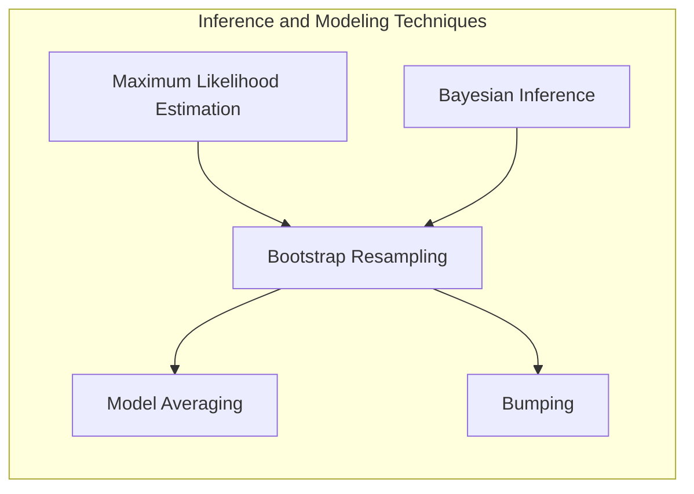

### Introdução

Este capítulo explora a inferência e a média de modelos, focando em técnicas estatísticas e de aprendizado de máquina para aprimorar a precisão e a robustez das previsões. Ao longo do livro, a adaptação de modelos tem sido realizada através da minimização de somas de quadrados para regressão ou da minimização da entropia cruzada para classificação [^8.1]. Essas abordagens são, na verdade, instâncias do método de máxima verossimilhança. Neste capítulo, aprofundaremos na exposição geral da abordagem de máxima verossimilhança e o método Bayesiano para inferência, com destaque para as técnicas de amostragem de bootstrap e suas relações com máxima verossimilhança, modelos Bayesianos e técnicas de _model averaging_. Exploraremos também o _bumping_, uma técnica para melhorar modelos que encontram mínimos locais.

### Conceitos Fundamentais

#### Conceito 1: O Problema de Classificação e o Uso de Métodos Lineares
O problema de classificação envolve atribuir rótulos a dados com base em um conjunto de características. Métodos lineares são frequentemente utilizados para esse propósito devido à sua simplicidade e eficiência computacional [^8.1]. Esses métodos buscam estabelecer uma fronteira de decisão linear que separa as diferentes classes. Contudo, a escolha de um modelo linear pode introduzir viés (bias) se a relação entre as características e as classes for não-linear, e variância (variance) se o modelo for muito complexo para o tamanho da amostra. A complexidade do modelo é controlada com regularização e técnicas de seleção de variáveis, conforme discutido mais adiante.

**Lemma 1:** *Decomposição da Função Discriminante Linear*. Em um problema de classificação linear com duas classes, a função discriminante $f(x)$ pode ser expressa como $f(x) = w^T x + b$, onde $w$ é o vetor de pesos e $b$ é o termo de viés. A fronteira de decisão é definida por $f(x) = 0$. Se os dados são linearmente separáveis, então existe uma solução que permite classificar todos os dados corretamente. Quando adicionamos regularização, temos $$ f(x) = w^Tx + b + \lambda ||w||_p $$ onde $\lambda$ é um parâmetro de regularização e $p$ pode ser $1$ ($L_1$ regularização) ou $2$ ($L_2$ regularização). A regularização $L_1$ pode induzir esparsidade na solução, enquanto a $L_2$ pode tornar a solução mais estável [^8.4]. $\blacksquare$

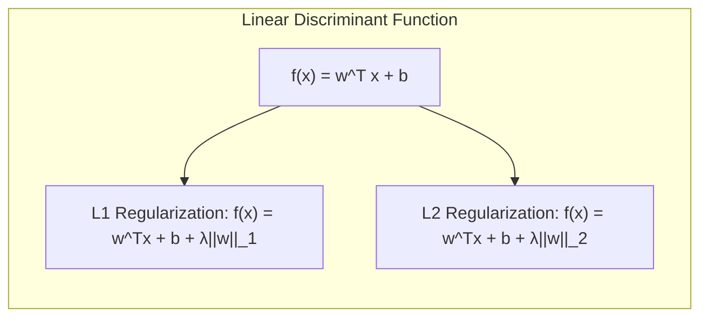

> 💡 **Exemplo Numérico:** Considere um problema de classificação com duas classes, onde cada amostra tem duas características ($x_1$ e $x_2$). Suponha que após treinamento sem regularização, o modelo linear tenha o vetor de pesos $w = [2, -1]$ e viés $b = 1$. A função discriminante é $f(x) = 2x_1 - x_2 + 1$. Uma nova amostra $x = [1, 3]$ é classificada calculando $f(x) = 2(1) - 3 + 1 = 0$. Portanto, esta amostra está na fronteira de decisão. Agora, se adicionarmos regularização $L_2$ com $\lambda=0.5$, a função discriminante seria modificada. A otimização com regularização ajustaria os valores de $w$ e $b$ buscando um equilíbrio entre minimizar o erro de classificação e evitar pesos muito grandes.

#### Conceito 2: Linear Discriminant Analysis (LDA)
O **Linear Discriminant Analysis (LDA)** é uma técnica para classificação que busca encontrar a melhor projeção linear dos dados de forma a maximizar a separação entre as classes [^8.2]. O LDA assume que as classes têm distribuições Gaussianas com a mesma matriz de covariância. A fronteira de decisão é obtida através da projeção dos dados em um espaço de menor dimensão, que maximiza a separação das médias de classe e minimiza a variância dentro de cada classe. Essa abordagem é especialmente útil quando as classes têm variâncias semelhantes e as amostras são aproximadamente Gaussianas [^8.2]. A função discriminante linear do LDA é dada por $$ f(x) = x^T \Sigma^{-1} (\mu_k - \frac{1}{2} \mu_k^T \Sigma^{-1} \mu_k) $$
onde $\mu_k$ é a média da classe k e $\Sigma$ é a matriz de covariância conjunta das classes.

**Corolário 1:** *Projeção em Subespaços*. A função discriminante linear do LDA pode ser vista como uma projeção dos dados em um subespaço de menor dimensão que é definido pelos autovetores da matriz de covariância entre as classes. Essa projeção maximiza a razão entre a variância entre as classes e a variância dentro das classes [^8.2]. Formalmente, se $S_W$ é a matriz de variância dentro das classes e $S_B$ é a matriz de variância entre as classes, o LDA encontra a projeção $W$ que maximiza $tr(W^T S_B W)/tr(W^T S_W W)$, onde $tr$ é o traço da matriz. $\blacksquare$

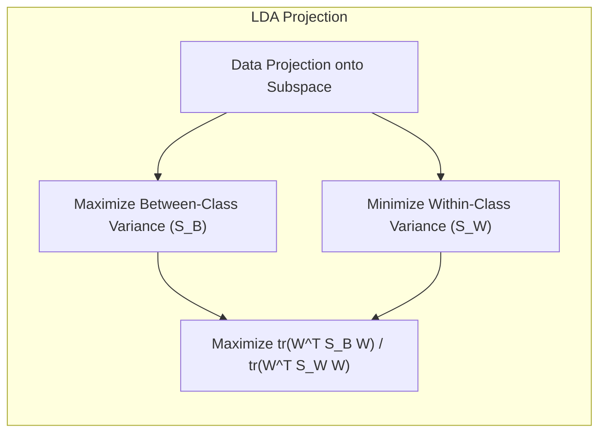

> 💡 **Exemplo Numérico:** Considere um conjunto de dados com duas classes e duas características. As médias das classes são $\mu_1 = [1, 2]$ e $\mu_2 = [3, 1]$. A matriz de covariância conjunta é $\Sigma = \begin{bmatrix} 1 & 0.5 \\ 0.5 & 1 \end{bmatrix}$. Para aplicar o LDA, primeiro calculamos $\Sigma^{-1}$. Usando numpy:
> ```python
> import numpy as np
>
> mu1 = np.array([1, 2])
> mu2 = np.array([3, 1])
> sigma = np.array([[1, 0.5], [0.5, 1]])
> sigma_inv = np.linalg.inv(sigma)
>
> print("Sigma inversa:", sigma_inv)
> ```
> Em seguida, calculamos o termo $w = \Sigma^{-1}(\mu_2 - \mu_1) = \begin{bmatrix} 1.33 & -0.67 \\ -0.67 & 1.33 \end{bmatrix} * \begin{bmatrix} 2 \\ -1 \end{bmatrix} =  \begin{bmatrix} 3.34 \\ -2 \end{bmatrix}$. Este vetor $w$ define a direção da projeção que melhor separa as classes. O valor $b$ da função discriminante é calculado como $ - \frac{1}{2} (\mu_2+\mu_1)^T \Sigma^{-1} (\mu_2 - \mu_1) $

#### Conceito 3: Logistic Regression
A **Logistic Regression** é um modelo estatístico que usa a função logística para modelar a probabilidade de uma variável dependente binária. Ao contrário do LDA, que assume distribuições Gaussianas, a regressão logística modela diretamente a probabilidade de pertinência a uma classe através de uma função sigmoide (função logística) [^8.4]:
$$ P(Y=1|X=x) = \frac{1}{1+e^{-(w^T x + b)}} $$
Os parâmetros $w$ (pesos) e $b$ (viés) são estimados maximizando a verossimilhança dos dados observados. A função de verossimilhança (likelihood) é dada por $$ L(w,b) = \prod_{i=1}^N p(y_i|x_i; w,b)  = \prod_{i=1}^N P(Y=y_i|X=x_i; w,b)^{y_i}(1-P(Y=y_i|X=x_i; w,b))^{(1-y_i)} $$ onde $y_i$ é o rótulo verdadeiro (0 ou 1) da amostra $i$, e $P(Y=1|X=x_i; w,b)$ é a probabilidade da classe ser 1. Usando o logaritmo, a função log-verossimilhança é dada por $$ log(L(w,b)) = \sum_{i=1}^N y_i \log(P(Y=1|X=x_i; w,b)) + (1-y_i)\log(1-P(Y=1|X=x_i; w,b)) $$ . O objetivo é encontrar os parâmetros que maximizam a log-verossimilhança.

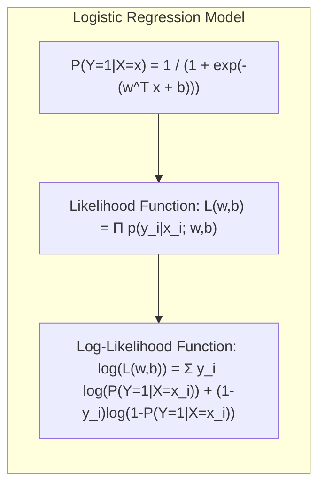

> ⚠️ **Nota Importante**: A regressão logística é adequada para problemas de classificação com classes balanceadas. Em problemas com classes não balanceadas, técnicas de rebalanceamento ou métricas de avaliação mais adequadas são recomendadas [^8.4].
> ❗ **Ponto de Atenção**: LDA e regressão logística compartilham o fato de que as fronteiras de decisão são lineares. No entanto, LDA assume que os dados provêm de distribuições gaussianas com variâncias iguais, enquanto a regressão logística não possui tal suposição.

> 💡 **Exemplo Numérico:** Considere um dataset com 3 amostras e 2 features e rótulos binários: $X = \begin{bmatrix} 1 & 2 \\ 2 & 1 \\ 3 & 3 \end{bmatrix}$ e $Y = \begin{bmatrix} 0 \\ 1 \\ 1 \end{bmatrix}$.  Suponha que após treinamento, a regressão logística encontrou os pesos $w = [0.5, -0.2]$ e o viés $b = -0.1$. Para a primeira amostra $x = [1, 2]$, temos $w^T x + b = 0.5 * 1 - 0.2 * 2 - 0.1 = 0$. A probabilidade de pertencer à classe 1 é: $P(Y=1|X=x) = \frac{1}{1 + e^{-0}} = 0.5$. Para a segunda amostra $x = [2, 1]$, temos $w^T x + b = 0.5 * 2 - 0.2 * 1 - 0.1 = 0.7$. Assim, $P(Y=1|X=x) = \frac{1}{1 + e^{-0.7}} = 0.67$.

### Regressão Linear e Mínimos Quadrados para Classificação

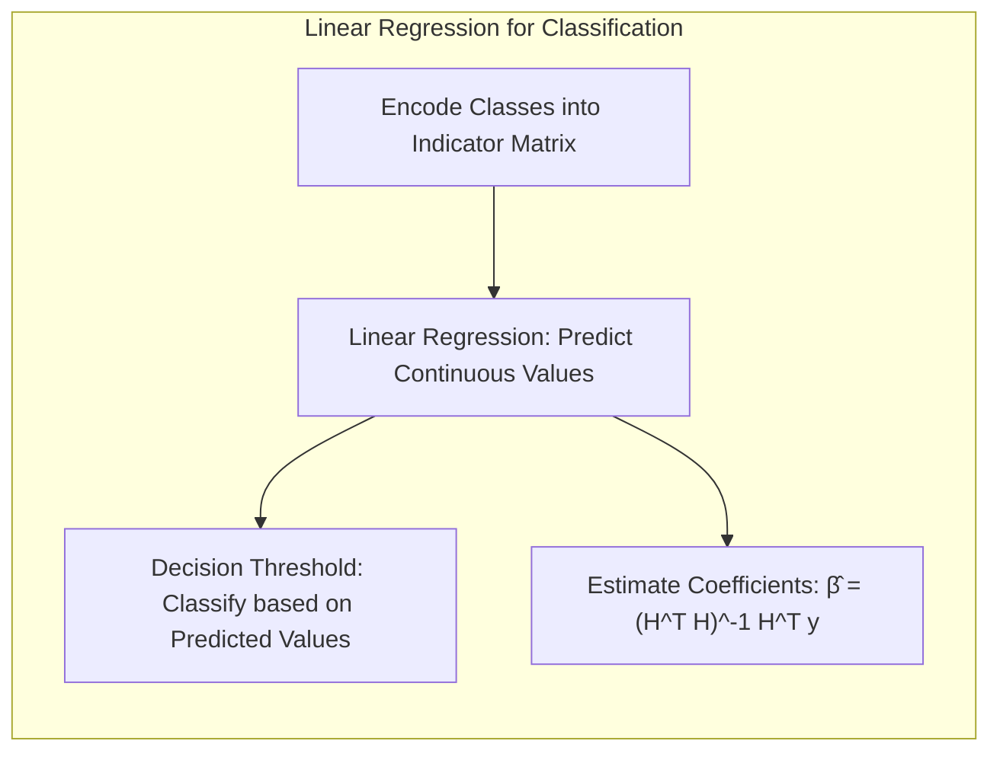

A regressão linear pode ser adaptada para problemas de classificação através da codificação das classes em uma matriz de indicadores [^8.2]. Por exemplo, em um problema de classificação com duas classes, podemos codificar uma classe como 0 e outra como 1. A regressão linear é então utilizada para predizer um valor contínuo que pode ser interpretado como uma probabilidade (embora a regressão linear não garanta que os valores preditos estejam entre 0 e 1). A decisão final é tomada através de um limiar (threshold). Embora a regressão linear não seja a abordagem mais robusta para classificação, ela serve como um ponto de partida útil para entender a construção de fronteiras lineares.

A estimativa dos coeficientes $\beta$ por mínimos quadrados é dada por:
$$ \hat{\beta} = (H^T H)^{-1} H^T y $$
onde $H$ é a matriz de atributos e $y$ é o vetor de rótulos codificados. O valor predito para um dado $x$ é dado por $\hat{\mu}(x) = \hat{\beta}^T h(x)$.

**Lemma 2:** *Equivalência entre Projeções*. Em um problema de classificação binária, a projeção dos dados no hiperplano de decisão obtida através da regressão linear é equivalente à projeção obtida pelo LDA quando as matrizes de covariância das classes são iguais e os dados são aproximadamente Gaussianos [^8.2]. Essa equivalência surge porque ambos os métodos buscam encontrar a melhor projeção linear que separa as classes, embora usem abordagens de otimização diferentes. A regressão linear minimiza o erro quadrático médio, enquanto o LDA maximiza a separação entre classes [^8.2]. $\blacksquare$

**Corolário 2:** *Relação com Discriminantes Lineares*. A equivalência entre as projeções da regressão linear e do LDA implica que, sob certas condições, ambos os métodos podem produzir resultados semelhantes. Essa relação simplifica a análise do problema de classificação, pois podemos interpretar as projeções como projeções nos discriminantes lineares [^8.2]. No entanto, a regressão linear não assume nenhuma distribuição específica dos dados, e pode gerar resultados inadequados quando a relação entre os atributos e os rótulos é não-linear.

> 💡 **Exemplo Numérico:**  Considere um conjunto de dados com duas classes, onde $H = \begin{bmatrix} 1 & 2 \\ 2 & 1 \\ 3 & 3 \\ 4 & 2\end{bmatrix}$ e $y = \begin{bmatrix} 0 \\ 0 \\ 1 \\ 1 \end{bmatrix}$. Primeiro, calculamos $H^T H = \begin{bmatrix} 1 & 2 & 3 & 4 \\ 2 & 1 & 3 & 2 \end{bmatrix} \begin{bmatrix} 1 & 2 \\ 2 & 1 \\ 3 & 3 \\ 4 & 2 \end{bmatrix} = \begin{bmatrix} 30 & 23 \\ 23 & 18 \end{bmatrix}$. Em seguida, $(H^T H)^{-1} = \frac{1}{(30*18 - 23*23)} \begin{bmatrix} 18 & -23 \\ -23 & 30 \end{bmatrix} = \begin{bmatrix} 1.54 & -1.97 \\ -1.97 & 2.56 \end{bmatrix}$. Calculamos $H^T y = \begin{bmatrix} 1 & 2 & 3 & 4 \\ 2 & 1 & 3 & 2 \end{bmatrix} \begin{bmatrix} 0 \\ 0 \\ 1 \\ 1 \end{bmatrix} = \begin{bmatrix} 7 \\ 5 \end{bmatrix}$. Finalmente, $\hat{\beta} = (H^T H)^{-1} H^T y = \begin{bmatrix} 1.54 & -1.97 \\ -1.97 & 2.56 \end{bmatrix} \begin{bmatrix} 7 \\ 5 \end{bmatrix} = \begin{bmatrix} 0.94 \\ -0.89\end{bmatrix}$. O valor predito para um novo $x = [2, 2]$ é $\hat{\mu}(x) = \hat{\beta}^T x = 0.94 * 2 - 0.89 * 2 = 0.1$.

### Métodos de Seleção de Variáveis e Regularização em Classificação

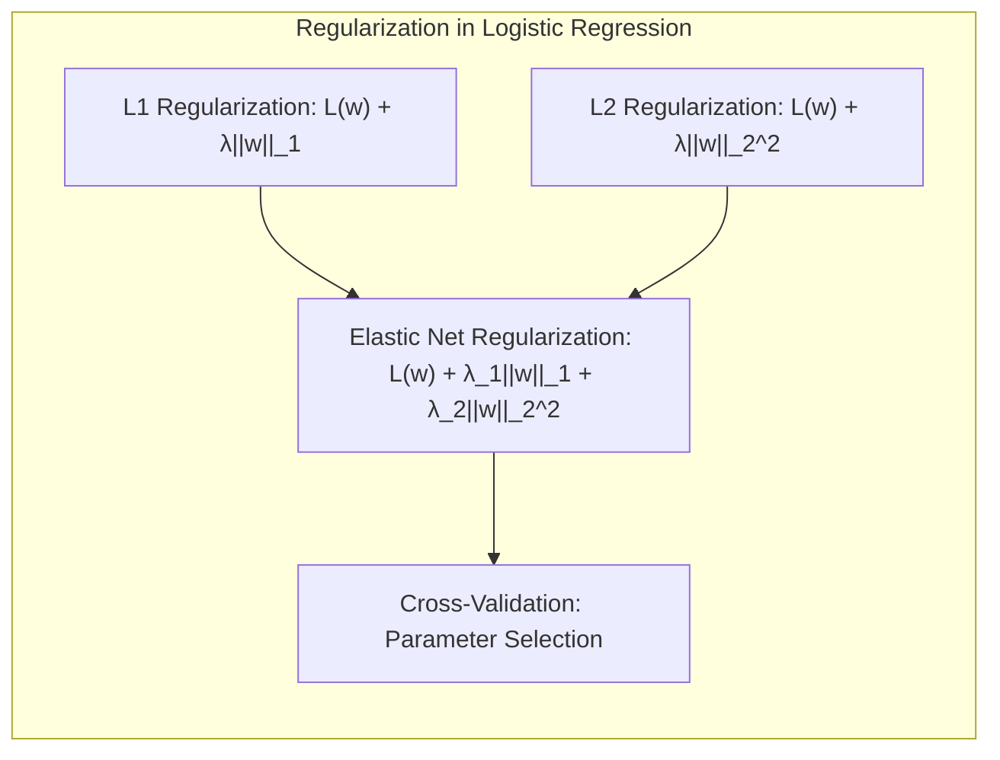

A seleção de variáveis e a regularização são técnicas cruciais para evitar overfitting e melhorar a interpretabilidade do modelo. Em problemas de classificação, especialmente quando há muitas variáveis ou quando os dados são esparsos, essas técnicas ajudam a reduzir a variância e a complexidade do modelo. Na regressão logística, a regularização L1 adiciona uma penalidade proporcional à soma dos valores absolutos dos pesos: $$  L_{L_1}(w) = L(w) + \lambda ||w||_1 $$ , enquanto a regularização L2 adiciona uma penalidade proporcional ao quadrado dos pesos: $$ L_{L_2}(w) = L(w) + \lambda ||w||_2^2 $$ [^8.4]. A regularização L1 tende a levar a soluções com pesos esparsos, ou seja, muitos pesos iguais a zero, o que pode simplificar a interpretabilidade do modelo e identificar as variáveis mais relevantes [^8.4]. A regularização L2 tende a encolher os pesos, resultando em uma solução mais estável.

**Lemma 3:** *Penalização L1 e Esparsidade*. A penalização L1 na regressão logística leva a coeficientes esparsos porque o termo de penalidade, $\lambda ||w||_1 = \lambda \sum_j |w_j|$, é não diferenciável quando $w_j = 0$. Isso força o otimizador a convergir para soluções onde muitos dos pesos $w_j$ são exatamente zero. A intuição é que, para um dado custo de verossimilhança, o termo de penalidade $L1$ favorece soluções com menos pesos grandes e mais pesos próximos a zero, resultando em um modelo mais esparso.
**Prova:** A minimização da função de custo regularizada por $L_1$ busca um ponto onde o gradiente da função de verossimilhança seja balanceado pelo termo de penalidade. Quando um dos pesos $w_j$ é zero, o termo de penalidade $L_1$ impõe um pulo no gradiente, induzindo que muitos pesos fiquem iguais a zero. Formalmente, para um peso $w_j$, temos:
$$\frac{\partial L_{L_1}}{\partial w_j} = \frac{\partial L(w)}{\partial w_j} + \lambda \text{sign}(w_j)$$
Onde $\text{sign}(w_j) = 1$ se $w_j > 0$, $-1$ se $w_j < 0$, e $0$ se $w_j = 0$. O ponto de mínimo geralmente é onde $\frac{\partial L_{L_1}}{\partial w_j} = 0$, o que implica que $\frac{\partial L(w)}{\partial w_j} = -\lambda \text{sign}(w_j)$. Quando um coeficiente $w_j$ é próximo de zero, o termo $\text{sign}(w_j)$ faz com que a derivada fique igual a zero. Assim, muitos coeficientes se tornam exatamente zero. $\blacksquare$

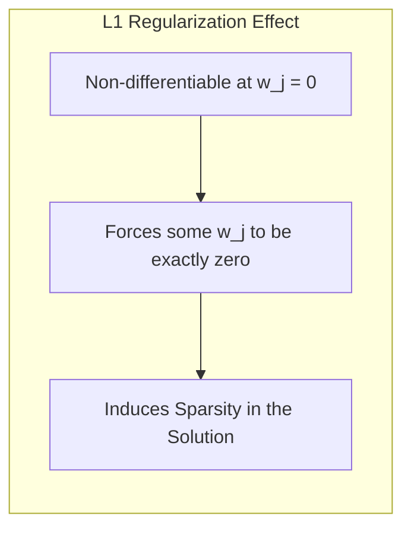

**Corolário 3:** *Interpretabilidade da Esparsidade*. A esparsidade induzida pela penalização L1 melhora a interpretabilidade dos modelos classificatórios, pois as variáveis com pesos iguais a zero são consideradas irrelevantes para a predição. Isso simplifica o modelo e permite identificar os fatores mais importantes na decisão de classificação [^8.4].

> ⚠️ **Ponto Crucial**: A combinação de L1 e L2 (Elastic Net) pode fornecer um bom equilíbrio entre esparsidade e estabilidade, aproveitando as vantagens de ambos os tipos de regularização [^8.5]. O parâmetro $\lambda$ de regularização deve ser escolhido com cuidado usando técnicas como validação cruzada.

> 💡 **Exemplo Numérico:**  Suponha que estamos aplicando regressão logística com duas variáveis e temos os coeficientes $w = [0.8, -0.2]$ sem regularização. Usando regularização L1 com $\lambda = 0.5$, o novo vetor de pesos pode se tornar $w_{L1} = [0.3, 0]$. O coeficiente da segunda variável é reduzido a zero, tornando-a irrelevante para o modelo. Com regularização L2, com $\lambda=0.5$, o novo vetor de pesos pode se tornar $w_{L2} = [0.6, -0.15]$. Os coeficientes são reduzidos em magnitude, mas ambos permanecem no modelo. O valor exato dos coeficientes após regularização depende da otimização da função de custo.

### Separating Hyperplanes e Perceptrons

A ideia central de hiperplanos separadores é encontrar um hiperplano que maximize a margem de separação entre as classes [^8.5]. Esse conceito está intimamente relacionado com os _Support Vector Machines_ (SVM). No contexto de hiperplanos separadores, um hiperplano ótimo é aquele que maximiza a distância entre o hiperplano e os pontos mais próximos de cada classe (os chamados vetores de suporte). A formulação do problema de otimização busca os parâmetros do hiperplano que minimizam a distância aos pontos de treinamento, sujeitos a restrições que garantem a separação correta das classes.

O Perceptron de Rosenblatt é um algoritmo de aprendizado que busca encontrar um hiperplano que separa corretamente os dados de treinamento [^8.5]. Se os dados são linearmente separáveis, o Perceptron garante a convergência para uma solução que separa corretamente as classes. O algoritmo atualiza iterativamente os pesos do hiperplano com base nos exemplos mal classificados, movendo o hiperplano em direção à separação correta.

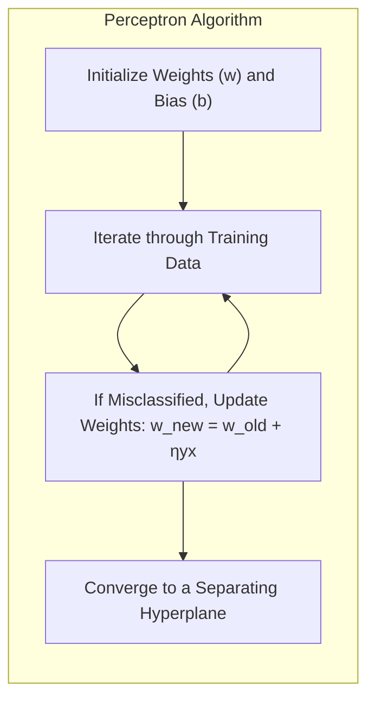

> 💡 **Exemplo Numérico:** Considere duas classes linearmente separáveis: Classe 1 = $\{[1,1], [2,1]\}$ e Classe 2 = $\{[1,3], [2,3]\}$.  Inicializamos o Perceptron com $w = [0, 0]$ e $b = 0$. O algoritmo Perceptron itera sobre as amostras. Se uma amostra é mal classificada, atualizamos os pesos: $w_{novo} = w_{antigo} + \eta y x$, onde $\eta$ é a taxa de aprendizado (e.g. 0.1). Por exemplo, se o ponto $[1,1]$ da classe 1 é classificado incorretamente como classe 2, atualizamos: $w = [0,0] + 0.1 * (-1) * [1,1] = [-0.1, -0.1]$. A iteração continua até que todas as amostras sejam corretamente classificadas.

### Pergunta Teórica Avançada: Quais as implicações da escolha de diferentes parâmetros na Regularização em Regressão Logística para a otimização da função de custo e a generalização do modelo?
**Resposta:**
A escolha dos parâmetros de regularização na regressão logística impacta significativamente a otimização da função de custo e a generalização do modelo. Uma regularização L1 ($||w||_1$) com um parâmetro $\lambda_1$ adequado induz esparsidade, forçando alguns coeficientes a serem exatamente zero. Isso simplifica o modelo e melhora a interpretabilidade ao selecionar apenas as características mais relevantes. No entanto, $\lambda_1$ muito grande pode levar a underfitting. Já uma regularização L2 ($||w||_2^2$) com parâmetro $\lambda_2$ adequado suaviza a solução e evita que os pesos sejam muito grandes, o que contribui para a estabilidade do modelo. No entanto, $\lambda_2$ muito grande pode encolher os pesos em excesso, levando a underfitting. A função de custo regularizada pode ser expressa como
$$ J(w) = L(w) + \lambda_1 ||w||_1 + \lambda_2 ||w||_2^2 $$
onde $L(w)$ é a função de log-verossimilhança. A otimização busca minimizar essa função de custo, encontrando um balanço entre a precisão no treinamento (minimizando o erro) e a complexidade do modelo (minimizando a norma dos pesos). A escolha ideal de $\lambda_1$ e $\lambda_2$ envolve um compromisso entre a minimização do erro e a generalização, geralmente obtida por validação cruzada.

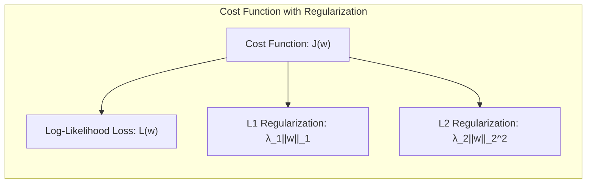

**Lemma 4:** *Influência da Regularização na Convergência*. A regularização influencia a velocidade de convergência do otimizador. Regularização L1 e L2 adicionam termos que modificam a superfície de otimização da função de custo, facilitando ou dificultando a convergência para uma solução ótima. Regularização L2 com um valor adequado ($\lambda_2$) geralmente acelera a convergência, enquanto a regularização L1 pode induzir comportamentos oscilatórios na convergência devido à não diferenciabilidade.
**Prova:** A prova envolve analisar as condições de otimalidade da função de custo regularizada, demonstrando como a regularização afeta o gradiente e a Hessiana da função. Para a regularização $L_2$, a função de custo é quadrática, levando a um problema de otimização convexa que geralmente tem convergência rápida. A regularização $L_1$ adiciona um termo não diferenciável, que cria quinas na superfície de otimização, tornando a análise de convergência mais complexa. $\blacksquare$

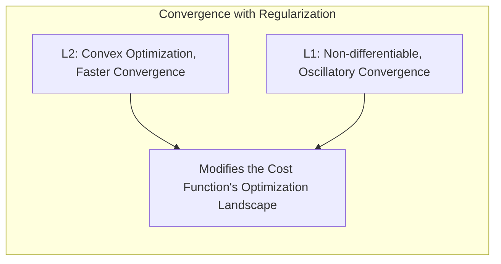

**Corolário 4:** *Impacto na Complexidade do Modelo*. Uma combinação adequada de $\lambda_1$ e $\lambda_2$ (Elastic Net) pode gerar um modelo esparso e estável, equilibrando a interpretabilidade e a capacidade de generalização. Valores elevados de $\lambda$ levam a modelos mais simples (underfitting), enquanto valores pequenos levam a modelos mais complexos (overfitting). A escolha dos parâmetros de regularização é crucial para evitar esses problemas [^8.4].

> ⚠️ **Ponto Crucial**: A escolha dos parâmetros de regularização e do tipo de regularização (L1, L2, Elastic Net) deve ser feita com cautela, considerando o contexto do problema e utilizando técnicas de validação cruzada para otimizar o desempenho e generalização do modelo.

### Bumping: Bootstrap Samples para Exploração do Espaço de Modelos

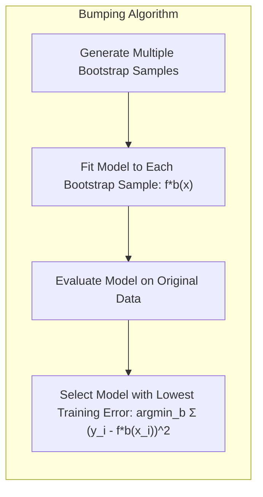

O _bumping_ é uma técnica que usa o _bootstrap_ para explorar o espaço de modelos de forma a encontrar um modelo mais robusto [^8.9]. Ao contrário do _bagging_, onde os resultados dos modelos são agregados por meio da média, o _bumping_ seleciona um único modelo entre os diversos modelos gerados por _bootstrap_ (método de _resampling_). Essa abordagem é particularmente útil quando o modelo de aprendizado é propenso a ficar preso em mínimos locais durante o treinamento. Ao perturbar os dados de treinamento por meio de _bootstrap samples_, o _bumping_ consegue movimentar a adaptação do modelo para diferentes regiões do espaço de soluções, evitando um modelo ruim.

No _bumping_, para cada _bootstrap sample_ $Z^{*b}$, é adaptado um modelo $f^{*b}(x)$. Após adaptar o modelo em vários _bootstrap samples_, seleciona-se o modelo $f^{*b^*}(x)$ com o menor erro de treino médio para o conjunto de dados original:

$$ b^* = \text{argmin}_b \sum_{i=1}^N (y_i - f^{*b}(x_i))^2 $$

onde $y_i$ são os rótulos originais, $f^{*b}(x_i)$ são as previsões para o bootstrap $b$ e $N$ é o número de amostras no conjunto de treinamento original. O modelo selecionado é o modelo que minimiza o erro de previsão médio sobre o conjunto de dados de treinamento original. Essa estratégia permite que o modelo final seja escolhido de acordo com seu desempenho no conjunto de dados original, evitando que modelos pouco ajustados sejam agregados, como no caso do _bagging_.
É importante notar que o bumping não garante encontrar o ótimo global, mas em vez disso explora regiões diferentes do espaço de modelos, o que pode levar a um modelo com melhor desempenho do que o modelo inicial.

> 💡 **Exemplo Numérico:** Considere um modelo que resulta em um MSE (Mean Squared Error) de 0.5 no conjunto de treino original. Após gerar 5 _bootstrap samples_ e ajustar o modelo em cada um, obtemos os seguintes MSEs no conjunto original: {0.6, 0.4, 0.7, 0.3, 0.5}.  No bumping, selecionaríamos o modelo correspondente ao MSE de 0.3, pois é o modelo com menor erro no conjunto original, e descartaríamos os outros.

### Conclusão

Este capítulo abordou uma variedade de técnicas para inferência e modelagem, com foco no uso de _bootstrap samples_ e em métodos Bayesianos. Foi explorado como o _bootstrap_ pode ser usado para avaliar a incerteza, criar intervalos de confiança e, por meio do _bagging_ e do _bumping_, melhorar as previsões. A relação entre o _bootstrap_, máxima verossimilhança e inferência Bayesiana foi examinada, demonstrando que, em muitos casos, o _bootstrap_ pode ser visto como uma aproximação não paramétrica da inferência Bayesiana. O uso de regularização e seleção de variáveis, particularmente na regressão logística, foi analisado, mostrando como o controle da complexidade do modelo e a identificação de variáveis relevantes podem melhorar a generalização. O _bumping_ emerge como uma estratégia de busca estocástica que pode auxiliar na identificação de modelos mais adequados.

### Footnotes

[^8.1]: "For most of this book, the fitting (learning) of models has been achieved by minimizing a sum of squares for regression, or by minimizing cross-entropy for classification. In fact, both of these minimizations are instances of the maximum likelihood approach to fitting."
[^8.2]: "Denote the training data by Z = {z1, z2,...,zN}, with zi = (xi, yi), i = 1, 2, ..., N. Here xi is a one-dimensional input, and yi the outcome, either continuous or categorical. As an example, consider the N = 50 data points shown in the left panel of Figure 8.1."
[^8.3]: "The bootstrap method described above, in which we sample with re- placement from the training data, is called the nonparametric bootstrap. This really means that the method is "model-free," since it uses the raw data, not a specific parametric model, to generate new datasets."
[^8.4]: "It turns out that the parametric bootstrap agrees with least squares in the previous example because the model (8.5) has additive Gaussian errors. In general, the parametric bootstrap agrees not with least squares but with maximum likelihood, which we now review."
[^8.5]: "Here is how we could apply the bootstrap in this example. We draw B datasets each of size N = 50 with replacement from our training data, the sampling unit being the pair zi = (xi, yi). To each bootstrap dataset Z* we fit a cubic spline μ*(x); the fits from ten such samples are shown in the bottom left panel of Figure 8.2."
[^8.6]: "We begin by specifying a probability density or probability mass function for our observations
zi ~ gθ(zi).
In this expression θ represents one or more unknown parameters that gov-
ern the distribution of Z. This is called a parametric model for Z."
[^8.7]: "Maximum likelihood is based on the likelihood function, given by
N
L(θ; Z) = Π gθ(zi),
i=1
the probability of the observed data under the model gθ."
[^8.8]: "The likelihood function can be used to assess the precision of θ. We need a few more definitions. The score function is defined by
N
ℓ(θ; Z) = ∑ ℓ(θ; zi),"
[^8.9]: "The main difference is that it samples from the conditional distributions rather than maximizing over them."
