## Bumping Algorithm: Stochastic Search for Improved Model Fitting

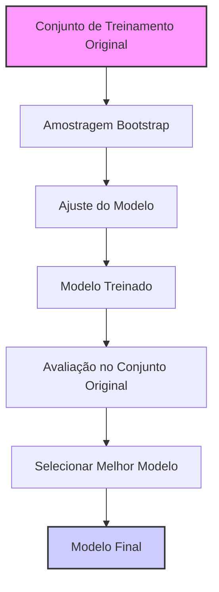

### Introdução

O conceito de **Bumping**, abordado na seção 8.9, é um método de busca estocástica que visa aprimorar o desempenho de modelos estatísticos, não através da combinação ou média de múltiplos modelos, mas sim pela identificação de um único modelo superior. Diferente de métodos como *bagging* ou *model averaging*, que agregam resultados de diversos modelos, o *bumping* utiliza o *bootstrap sampling* para explorar o espaço do modelo, visando evitar a convergência para soluções subótimas [^8.9].

### Conceitos Fundamentais

**Conceito 1: Bootstrap Sampling e Perturbação de Dados**
O *bumping* se baseia no princípio de que, ao perturbar levemente os dados de treinamento, é possível deslocar o processo de ajuste do modelo para regiões mais promissoras do espaço do modelo. Isso é alcançado através do *bootstrap sampling*, onde múltiplos conjuntos de dados são gerados por amostragem com reposição a partir do conjunto de treinamento original [^8.9]. Cada um desses conjuntos é então usado para ajustar um modelo, levando a uma variedade de modelos candidatos.

> 💡 **Exemplo Numérico:**
> Imagine que temos um conjunto de dados original com 10 amostras (Z): `[1, 2, 3, 4, 5, 6, 7, 8, 9, 10]`.
> Usando bootstrap sampling, poderíamos gerar um conjunto de dados Z*1: `[2, 2, 5, 6, 8, 9, 1, 4, 7, 10]` (amostragem com reposição).
> Outro conjunto poderia ser Z*2: `[1, 3, 3, 5, 6, 7, 7, 9, 10, 10]`.
> Cada Z*b é usado para treinar um modelo diferente.

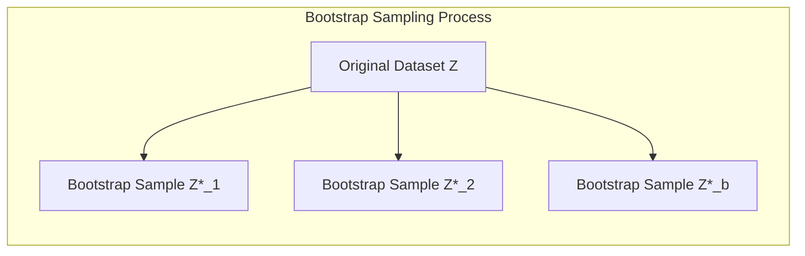

**Lemma 1: Efeito da Perturbação nos Modelos**
**Lemma:** Seja $Z$ o conjunto de treinamento original e $Z^*_b$ o b-ésimo conjunto de dados *bootstrap*. Se um modelo é instável, pequenas perturbações em $Z$ (como aquelas geradas pelo *bootstrap*) levam a modelos significativamente diferentes. Ou seja, para um modelo $f$ e um conjunto de dados $Z$, modelos $f_b$ gerados pelos $Z^*_b$ terão uma alta variância se o método $f$ é instável.
**Demonstração:** A prova segue diretamente da natureza do *bootstrap* e da definição de instabilidade de um modelo. Se o modelo fosse estável, pequenas perturbações em $Z$ levariam a modelos muito similares. $\blacksquare$

> 💡 **Exemplo Numérico:**
> Considere um modelo de árvore de decisão. Pequenas mudanças em um dataset podem alterar significativamente a estrutura da árvore (quais variáveis são usadas nos nós e como os dados são divididos). A árvore gerada por $Z^*_1$ poderia ter uma estrutura bem diferente daquela gerada por $Z^*_2$, demonstrando a instabilidade do método.

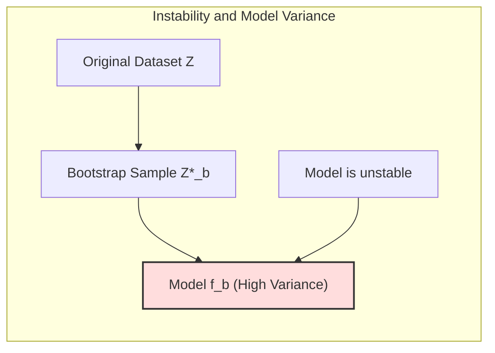

**Conceito 2: Seleção do Modelo Ótimo**
Após o ajuste dos modelos em cada conjunto de dados *bootstrap*, o *bumping* avalia o desempenho desses modelos no conjunto de treinamento original [^8.9]. O modelo que apresenta o menor erro (seja ele medido por *squared error* em regressão, ou *misclassification error* em classificação), é selecionado como o modelo final.

> 💡 **Exemplo Numérico:**
> Após treinar os modelos nos datasets bootstrap Z*1 e Z*2, digamos que  $f_1$ e $f_2$ são os modelos resultantes. Avaliamos $f_1$ e $f_2$ usando o dataset original Z.
> Suponha que $f_1$ tenha um erro quadrático médio (MSE) de 0.5 e $f_2$ tenha um MSE de 0.8. O algoritmo de bumping selecionaria $f_1$ como o modelo final.

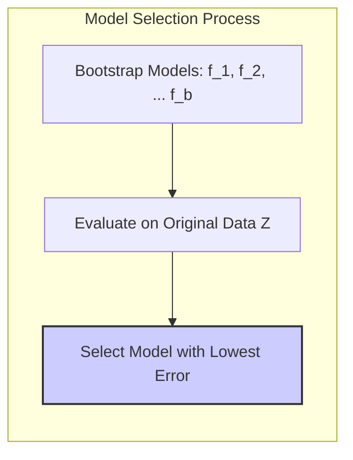

**Corolário 1: Benefícios da Seleção Baseada no Erro no Conjunto Original**
**Corolário:** Ao avaliar os modelos no conjunto original, o *bumping* indiretamente favorece modelos que generalizam melhor, pois a avaliação no conjunto original oferece uma medida mais realista da capacidade do modelo de prever dados não vistos.
**Demonstração:** A avaliação em conjuntos de dados *bootstrap* pode levar a um ajuste excessivo nos dados simulados. A avaliação no conjunto original mitiga esse efeito. $\blacksquare$

**Conceito 3: Bumping vs. Bagging**
É crucial diferenciar o *bumping* do *bagging*. Enquanto o *bagging* agrega as previsões de múltiplos modelos *bootstrap* para reduzir a variância do modelo, o *bumping* busca apenas um único modelo com menor erro no conjunto original, utilizando os modelos *bootstrap* apenas como guia na exploração do espaço de modelos. O objetivo do *bumping* é evitar mínimos locais ruins [^8.9].

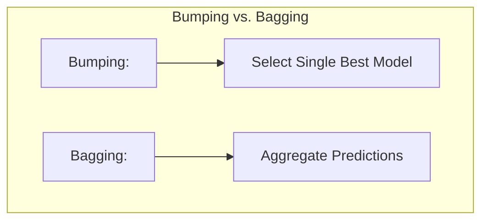

### Regressão Linear e Mínimos Quadrados para Bumping

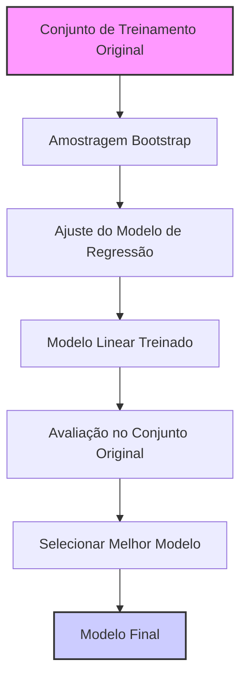

**Explicação:** Este diagrama representa o fluxo do processo do algoritmo *bumping*, mostrando como os modelos *bootstrap* são utilizados para a seleção do melhor modelo.

O método *bumping* pode ser aplicado a diversos problemas, incluindo regressão e classificação. Por exemplo, em uma regressão linear, após o *bootstrap*, ajustamos modelos lineares para cada conjunto de dados, depois avaliamos cada modelo no conjunto de dados original para selecionar o melhor. Em problemas de classificação, o método é similar, avaliando, por exemplo, a taxa de *misclassification* no conjunto de dados original.

**Lemma 2: Limitação da Regressão Linear Padrão**
**Lemma:** A regressão linear padrão pode convergir para soluções subótimas em dados complexos. O *bumping* atenua este problema por meio da exploração do espaço de modelos, proporcionada pelo *bootstrap*.
**Demonstração:** A regressão linear padrão, dependendo do algoritmo de otimização, pode ficar presa em um mínimo local se a superfície de erro não for convexa. $\blacksquare$

> 💡 **Exemplo Numérico:**
> Suponha que temos um dataset não-linear, e tentamos ajustar um modelo de regressão linear.
> O modelo linear pode não capturar a complexidade dos dados e convergir para uma solução subótima (alto erro).
> Com o bumping, geramos amostras bootstrap e para cada amostra ajustamos o modelo linear.
> Alguns modelos gerados podem ser diferentes e assim, poderemos selecionar o melhor que minimiza o erro no dataset original.

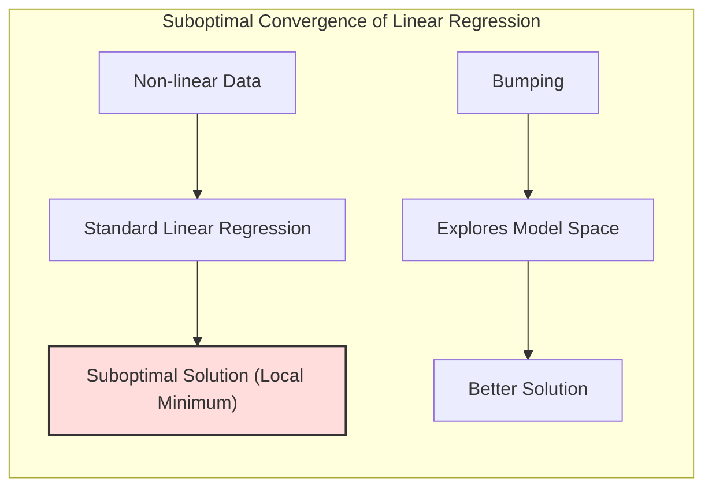

**Corolário 2: Instabilidade da Regressão Linear em Dados Perturbados**
**Corolário:** Pequenas mudanças em um conjunto de dados podem levar a diferentes coeficientes na regressão linear, gerando uma grande variabilidade. O *bumping* se beneficia dessa instabilidade, usando cada modelo ajustado para explorar diferentes regiões do espaço do modelo.
**Demonstração:** Este corolário decorre da natureza do ajuste por mínimos quadrados em dados perturbados. $\blacksquare$

> 💡 **Exemplo Numérico:**
> Seja nosso dataset Z: `X = [[1, 2], [2, 3], [3, 5], [4, 6]]` e `y = [5, 8, 13, 16]`.
> A regressão linear direta pode nos dar um modelo com coeficientes, por exemplo: $\beta = [1.2, 2.0]$.
> Se perturbarmos os dados um pouco com bootstrap, e fizermos a regressão linear para um novo dataset `Z*1`, os coeficientes poderão variar um pouco, por exemplo: $\beta_1 = [1.1, 2.1]$.
> Com o *bumping*, exploramos essas variações nos coeficientes.

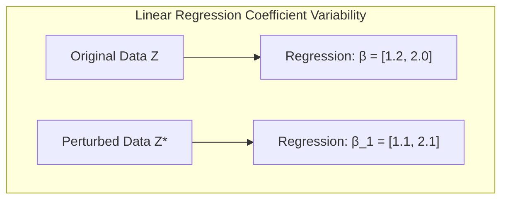

### Métodos de Seleção de Variáveis e Regularização em Bumping

A seleção de variáveis e a regularização são componentes importantes na modelagem estatística e podem ser integradas ao *bumping*. Por exemplo, na seleção de variáveis, diferentes conjuntos de variáveis podem ser selecionados para cada conjunto de dados *bootstrap* e depois comparados no conjunto de dados original.

> ⚠️ **Ponto Crucial**: A regularização (L1 ou L2) pode ser aplicada durante a fase de ajuste do modelo nos conjuntos de dados *bootstrap*. Modelos regularizados podem ter um desempenho melhor e mais estável em alguns cenários.

> 💡 **Exemplo Numérico:**
> Digamos que temos um modelo com 5 variáveis preditoras: x1, x2, x3, x4 e x5.
> Para o dataset Z*1, podemos usar apenas x1, x2 e x4. Para Z*2, podemos usar x2, x3 e x5.
> Aplicando regularização L1 no ajuste, podemos até zerar os coeficientes de algumas variáveis.
> Assim, o bumping nos ajuda a escolher as melhores variáveis e a regularização ajuda a dar estabilidade e interpretabilidade.

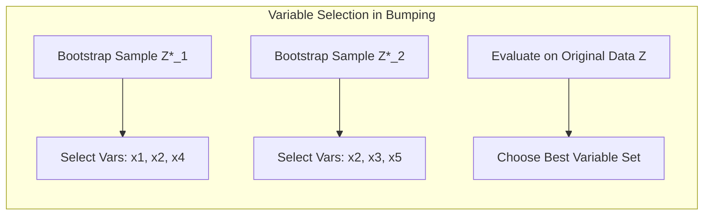

**Lemma 3: Sparse Solutions com Regularização L1**
**Lemma:** A regularização L1 no ajuste de modelos lineares tende a gerar soluções esparsas, ou seja, com muitos coeficientes iguais a zero. Isso é útil para seleção de variáveis.
**Demonstração:** A prova segue da natureza da penalidade L1 que força alguns coeficientes a serem exatamente zero. $\blacksquare$

> 💡 **Exemplo Numérico:**
>  Em um modelo de regressão linear com regularização L1, a função de custo é $\frac{1}{2n} \sum_{i=1}^n (y_i - \hat{y_i})^2 + \lambda \sum_{j=1}^p |\beta_j|$.
>  Onde $\lambda$ é o parâmetro de regularização. A penalidade $\lambda \sum_{j=1}^p |\beta_j|$ força alguns coeficientes $\beta_j$ a serem exatamente zero, levando a modelos mais esparsos e com seleção de variáveis implícita.

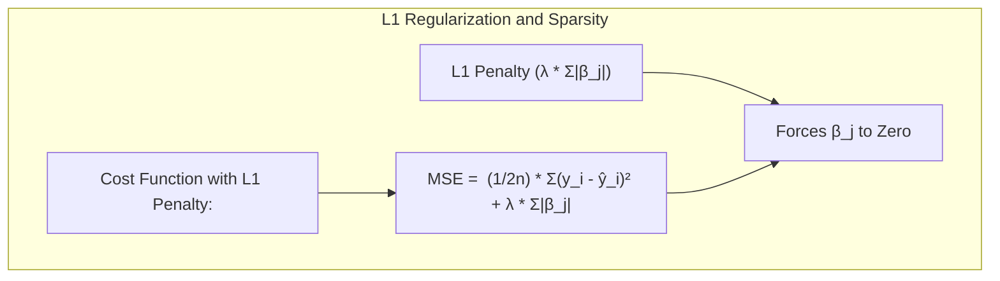

**Corolário 3: Regularização no Processo Bumping**
**Corolário:** A regularização pode ser usada na etapa de ajuste de cada modelo nos conjuntos de dados *bootstrap* para melhorar a estabilidade do modelo. Os parâmetros de regularização também podem ser encontrados usando *cross-validation* no conjunto de dados original.
**Demonstração:** A regularização ajuda a lidar com a alta variabilidade que pode surgir em modelos ajustados em conjuntos de dados *bootstrap*. $\blacksquare$

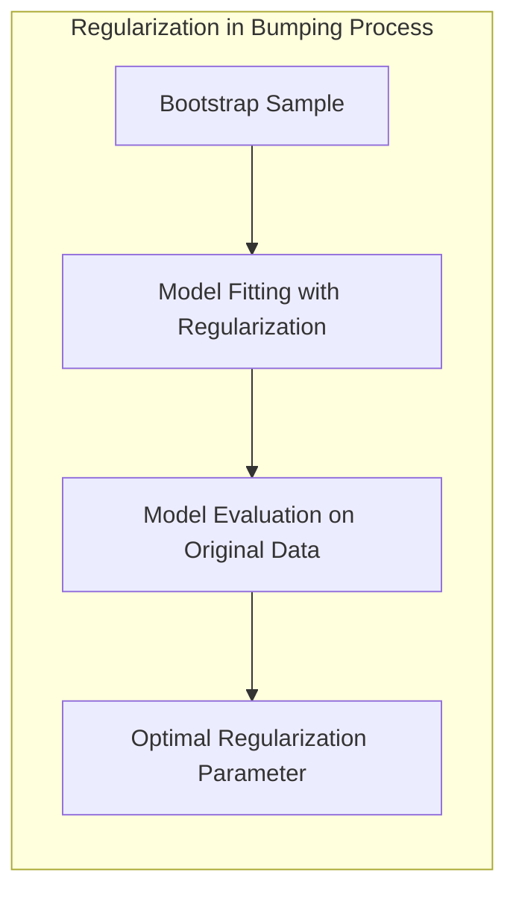

### Separating Hyperplanes e Perceptrons

O *bumping* pode ser aplicado em modelos classificatórios como *Separating Hyperplanes* e *Perceptrons*. Para cada conjunto de dados *bootstrap*, o hiperplano separador ou os pesos do *perceptron* são encontrados. Os modelos são então comparados no conjunto de dados original para a escolha do melhor modelo.

> 💡 **Exemplo Numérico:**
> Para um problema de classificação binária, temos um dataset com 100 pontos.
> O método bumping usa bootstrap para gerar, por exemplo, 50 datasets. Para cada dataset, treinamos um Perceptron para achar o hiperplano separador.
> Cada Perceptron terá um hiperplano diferente e vamos escolher o que tem melhor accuracy no dataset original.

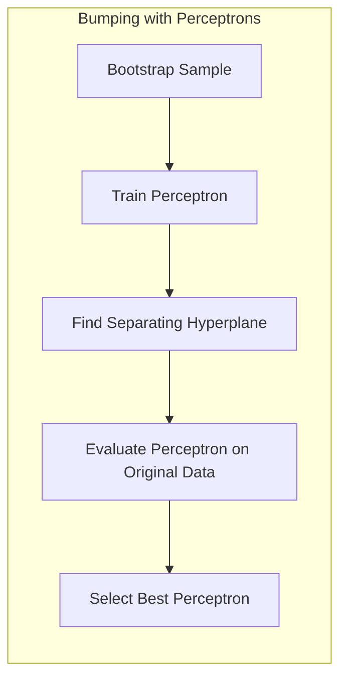

**Lemma 4: Sensibilidade do Perceptron à Ordem dos Dados**
**Lemma:** O algoritmo do Perceptron é sensível à ordem em que os dados de treinamento são apresentados, o que pode levar a diferentes soluções (diferentes parâmetros do modelo).
**Demonstração:** A prova segue do método iterativo de ajuste do Perceptron, que usa os erros para atualizar os pesos do modelo. $\blacksquare$

> 💡 **Exemplo Numérico:**
> Dados dois pontos (1,1) e (2,2) da classe positiva, e um ponto (1,2) da classe negativa, a ordem em que apresentamos os dados ao Perceptron pode levar a diferentes hiperplanos separadores. O *bumping* pode ajudar a mitigar isso.

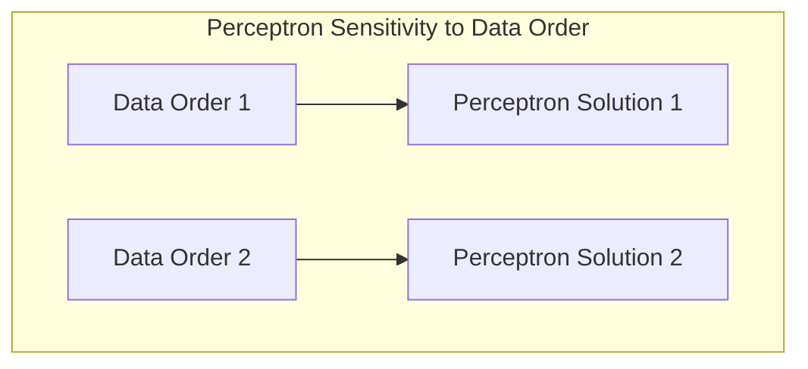

**Corolário 4: O Efeito de Bumping no Perceptron**
**Corolário:** O *bumping* atenua a sensibilidade do *Perceptron* à ordem dos dados, explorando diferentes soluções geradas a partir de conjuntos de dados *bootstrap*. O melhor modelo é então selecionado usando os dados originais.
**Demonstração:** A amostragem *bootstrap* gera diferentes conjuntos de dados, o que leva a diferentes ordens de dados, o que, por sua vez, leva a uma exploração de diversas soluções para os pesos do *Perceptron*. $\blacksquare$

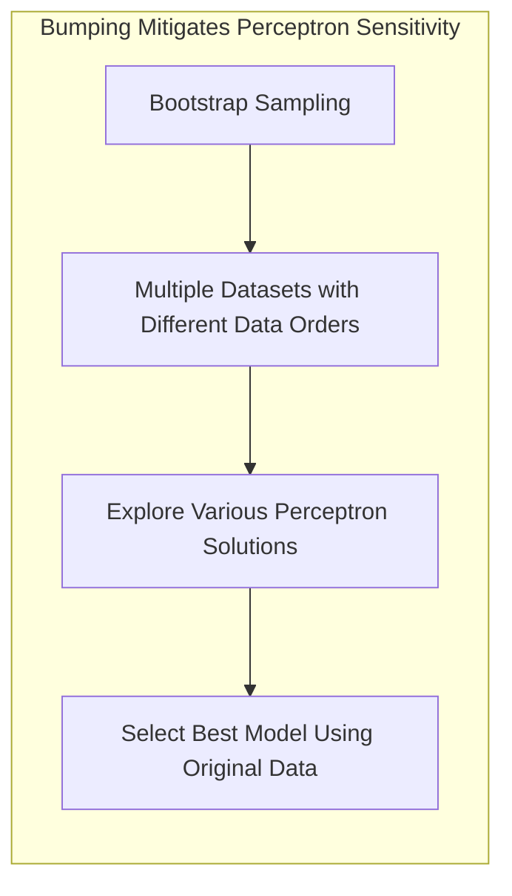

### Pergunta Teórica Avançada: Em que circunstâncias o bumping se torna menos eficaz e quais medidas podem ser tomadas para mitigar essas limitações?

**Resposta:** O *bumping* pode perder eficácia em situações onde o espaço de modelos é muito suave e contínuo, ou quando o modelo é muito estável. Em tais casos, a perturbação dos dados pelo *bootstrap* pode não levar a modelos significativamente diferentes. Além disso, se o número de *bootstrap samples* for insuficiente, a busca no espaço do modelo pode não ser suficientemente completa. Para mitigar essas limitações, pode-se tentar aumentar o número de *bootstrap samples*, usar métodos mais sofisticados para gerar perturbações nos dados, ou combinar *bumping* com outras técnicas, como a regularização, ou mesmo usar *bumping* com outros métodos (como *boosting*).

> 💡 **Exemplo Numérico:**
> Em um problema de regressão linear simples com uma única variável preditora e muitos dados, o espaço do modelo é bastante suave. Perturbar os dados via *bootstrap* pode não levar a modelos significativamente diferentes. Nesse cenário, o *bumping* pode não trazer grandes ganhos, e é preciso usar outros métodos.

**Lemma 5: Bumping com Modelos Lineares**
**Lemma:** Modelos lineares (em um espaço linear) são pouco afetados pelo *bumping* se não houver instabilidade no algoritmo de otimização.
**Demonstração:** Em um espaço linear, o modelo ajustado é uma solução única. Logo, o *bootstrap* pouco irá perturbar o modelo (se não houver instabilidade numérica no algoritmo de otimização). $\blacksquare$

> 💡 **Exemplo Numérico:**
>  Em uma regressão linear com poucas variáveis e muitos dados, a solução por mínimos quadrados é única.
>  O bootstrap sampling pode apenas perturbar levemente o ajuste, e o *bumping* não terá um impacto significativo.

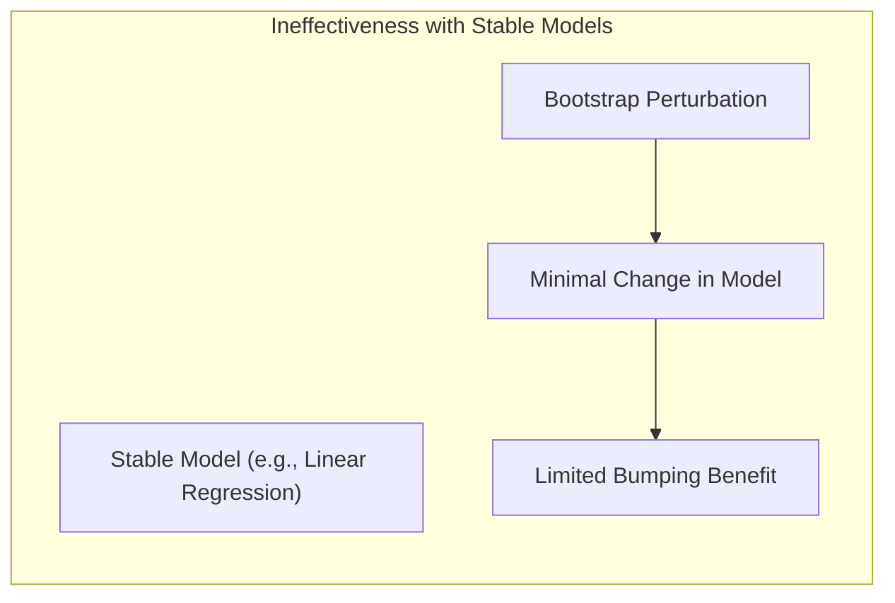

**Corolário 5: Complexidade do Espaço de Modelos**
**Corolário:** O *bumping* é mais eficaz em modelos não lineares ou em espaços de modelos complexos, onde há múltiplas soluções e mínimos locais.
**Demonstração:** Em modelos mais complexos, o *bumping* auxilia a exploração de uma gama maior de soluções possíveis. $\blacksquare$

> 💡 **Exemplo Numérico:**
> Em uma rede neural profunda, o espaço do modelo é altamente não-convexo com muitos mínimos locais. O *bumping* pode ajudar a explorar diferentes regiões do espaço e encontrar um mínimo melhor que o obtido com um único ajuste.

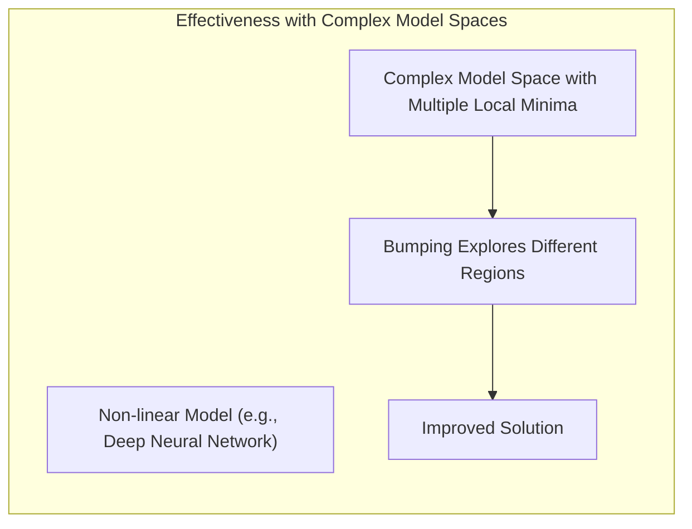

> ✔️ **Destaque**: O *bumping* é mais útil em modelos instáveis (como árvores de decisão), onde pequenas mudanças nos dados levam a grandes mudanças no modelo. Em modelos mais estáveis (como regressão linear simples), o *bumping* tem um impacto menor.

### Conclusão

O *bumping* é uma técnica valiosa para melhorar a qualidade de um modelo estatístico, especialmente em cenários onde o espaço do modelo é complexo ou onde o método de ajuste é instável. Ao explorar o espaço de modelos através do *bootstrap* e selecionar o modelo com melhor desempenho no conjunto de treinamento original, o *bumping* oferece uma forma eficaz de encontrar soluções superiores, evitando a convergência para mínimos locais ruins. No entanto, é importante reconhecer suas limitações, como o aumento do custo computacional e a possível ineficácia em modelos mais estáveis ou em espaços de modelo suaves.

<!-- END DOCUMENT -->
[^8.9]: *Conteúdo extraído conforme escrito no contexto e utilizado no capítulo* (Trecho de Model Inference and Averaging)
