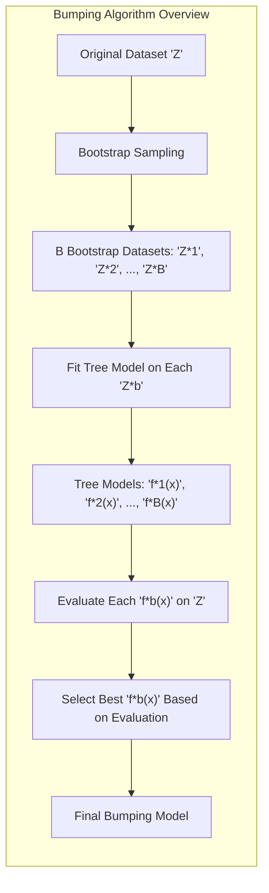
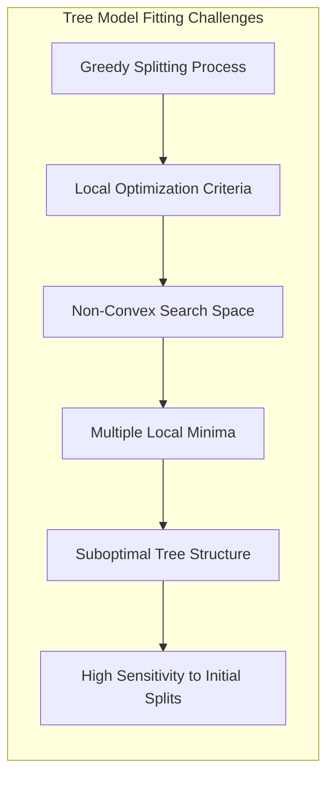
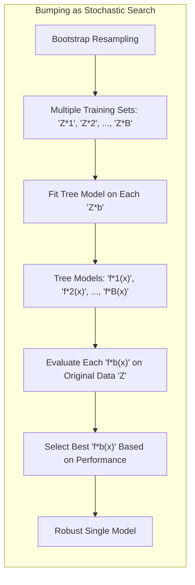
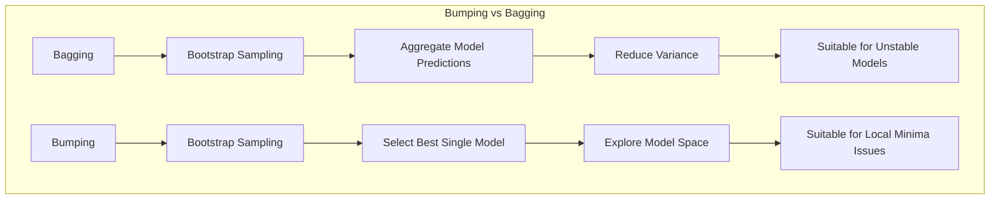
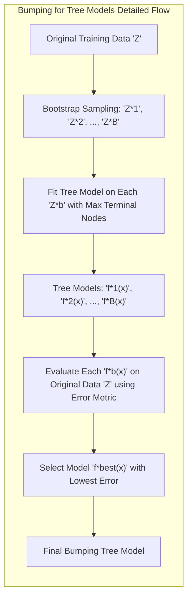
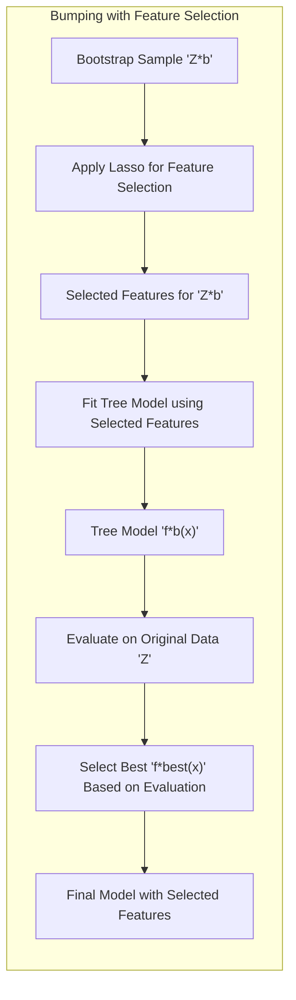
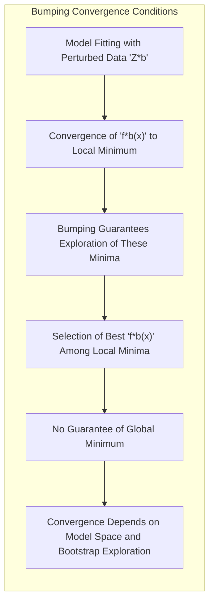

## Bumping for Tree Models



### Introdução
Neste capítulo, exploramos o conceito de **bumping** como uma técnica para aprimorar modelos de árvore, particularmente em cenários onde os métodos de ajuste tradicionais podem ser suscetíveis a mínimos locais indesejáveis [^8.9]. Ao contrário das abordagens de *model averaging*, como o *bagging*, que visa reduzir a variância pela agregação de múltiplas previsões, o bumping foca em explorar o espaço de modelos através de perturbações nos dados de treinamento via *bootstrapping*, com o objetivo de encontrar um modelo único, mais robusto [^8.7], [^8.9]. Esta abordagem é particularmente útil quando o processo de fitting do modelo encontra múltiplos mínimos locais, levando a modelos subótimos [^8.9].

### Conceitos Fundamentais

**Conceito 1: O Problema dos Mínimos Locais e Modelos de Árvore**
Modelos de árvore, como **classification and regression trees (CART)**, são construídos através de um processo guloso, onde, em cada etapa, é escolhida a melhor divisão dos dados baseada em um critério local [^8.9], [^9.2]. Essa abordagem pode levar o algoritmo a ficar preso em mínimos locais, resultando em árvores que não generalizam bem para novos dados. A estrutura hierárquica e discreta da árvore de decisão pode tornar o espaço de busca não convexo, com muitas regiões de desempenho similar e potenciais mínimos locais [^8.9]. Em particular, a escolha da primeira divisão (root node) tem um impacto muito grande na estrutura geral da árvore [^8.9], [^9.2].



**Lemma 1:** *A natureza hierárquica dos modelos de árvore, combinada com a escolha gulosa de divisões, pode resultar em soluções subótimas que dependem fortemente da ordem em que as divisões são feitas* [^8.9], [^9.2]. A complexidade do espaço de busca impede que o algoritmo de construção de árvore encontre o mínimo global da função de perda, levando a modelos com alto viés e variância, com sensibilidade aos dados de treino.

> 💡 **Exemplo Numérico:**
> Considere um conjunto de dados com duas variáveis preditoras, $x_1$ e $x_2$, e uma variável resposta $y$. Suponha que a verdadeira relação entre as variáveis seja complexa, com interações não lineares. Um modelo de árvore pode inicialmente dividir os dados em $x_1 > c$ ou $x_1 \leq c$. Se a divisão em $x_1$ não for a ideal, mas localmente boa, o modelo pode ficar preso em uma solução subótima. Por exemplo, se a divisão ideal fosse $x_2 > d$, o algoritmo guloso pode nunca chegar a essa solução.
>
> ```python
> import numpy as np
> import matplotlib.pyplot as plt
> from sklearn.tree import DecisionTreeRegressor
>
> # Cria dados de exemplo com um padrão não linear
> np.random.seed(42)
> X = np.sort(5 * np.random.rand(80, 2), axis=0)
> y = np.sin(X[:, 0] * X[:, 1]) + np.random.randn(80) * 0.1
>
> # Ajusta uma árvore de decisão com profundidade máxima 3
> tree = DecisionTreeRegressor(max_depth=3)
> tree.fit(X, y)
>
> # Visualização simples dos dados e da predição da árvore (para ilustração, pois a visualização completa seria em 3D)
> plt.figure(figsize=(8, 6))
> plt.scatter(X[:, 0], y, label='Dados Reais')
>
> # Cria uma grade para prever valores
> x_grid = np.linspace(0, 5, 50)
> x1, x2 = np.meshgrid(x_grid, x_grid)
> X_grid = np.c_[x1.ravel(), x2.ravel()]
> y_pred = tree.predict(X_grid)
>
> plt.scatter(X_grid[:, 0], y_pred, color='red', s=10, label='Predições da Árvore')
> plt.xlabel('x1')
> plt.ylabel('y')
> plt.title('Dados e Predições de Árvore de Decisão')
> plt.legend()
> plt.show()
>
> ```
>
> Este exemplo ilustra como um modelo de árvore pode ficar preso em uma solução subótima, que não consegue modelar bem a relação não-linear entre x1 e x2. O bumping pode ajudar a encontrar um modelo melhor, explorando diferentes possibilidades de divisão.

**Conceito 2: Bumping como Busca Estocástica no Espaço de Modelos**
O bumping emprega o *bootstrap* para gerar múltiplas amostras dos dados de treinamento, e para cada amostra, ajusta-se um modelo de árvore. Ao invés de fazer a média das previsões de cada modelo, como no *bagging*, o *bumping* avalia o desempenho de cada modelo nos dados originais e seleciona o modelo com o melhor desempenho [^8.9]. Este processo permite que o algoritmo "salte" de um mínimo local para outro, explorando diferentes regiões do espaço de modelos [^8.9].



**Corolário 1:** *O uso de perturbações nos dados de treinamento via bootstrap permite que o bumping explore diferentes áreas do espaço de modelos, aumentando a probabilidade de encontrar soluções que sejam robustas a diferentes configurações nos dados* [^8.9]. Isso é, se a função de perda contiver múltiplos mínimos locais, a aleatorização do bootstrap fará o processo de busca "saltar" entre eles, favorecendo a exploração do espaço.

> 💡 **Exemplo Numérico:**
>
> Imagine que temos um conjunto de dados com 100 amostras. O bumping gera, digamos, 5 amostras bootstrap (B=5). Cada amostra terá 100 amostras, com repetição. O processo de fitting de um modelo de árvore em cada amostra bootstrap ($Z^{*1}$ até $Z^{*5}$) pode levar a árvores diferentes, cada uma representando um mínimo local. Vamos supor que as árvores são avaliadas no conjunto de dados original e que os erros quadráticos médios (MSE) resultantes são:
>
> - Árvore 1 (ajustada em $Z^{*1}$): MSE = 0.25
> - Árvore 2 (ajustada em $Z^{*2}$): MSE = 0.30
> - Árvore 3 (ajustada em $Z^{*3}$): MSE = 0.15
> - Árvore 4 (ajustada em $Z^{*4}$): MSE = 0.22
> - Árvore 5 (ajustada em $Z^{*5}$): MSE = 0.28
>
> O bumping selecionará a Árvore 3, pois ela apresenta o menor MSE no conjunto de dados original. O bootstrap permitiu "bater" em diferentes regiões do espaço de busca, e identificar um modelo com melhor desempenho do que qualquer um dos modelos obtidos com outras amostras.

**Conceito 3: A Diferença Fundamental entre Bumping e Bagging**
Enquanto o *bagging* usa o *bootstrap* para reduzir a variância do modelo através da agregação de previsões, o *bumping* usa o *bootstrap* como uma ferramenta para explorar o espaço de modelos e identificar um modelo único, ótimo ou próximo do ótimo, que seja robusto em termos de desempenho [^8.9]. O *bagging* é mais adequado quando há instabilidade no modelo, causada por ruído nos dados ou pelo baixo número de dados. O *bumping* é mais adequado quando o processo de otimização é susceptível a mínimos locais, e a busca no espaço de modelos é necessária [^8.7], [^8.9].



> ⚠️ **Nota Importante**: O *bumping* não tem como objetivo produzir um conjunto de previsões agregadas, mas sim encontrar o "melhor" modelo entre os modelos obtidos com o bootstrap [^8.9].

> ❗ **Ponto de Atenção**: O *bumping* necessita de que os modelos tenham a mesma complexidade para que a comparação por erro nos dados originais seja válida. No caso de árvores, usualmente isso é feito através da fixação de um número máximo de nós terminais [^8.9].

> ✔️ **Destaque**: Enquanto o *bagging* é útil quando há instabilidade no modelo, o *bumping* é mais adequado quando o processo de otimização é susceptível a mínimos locais e a exploração do espaço de modelos é necessária [^8.7], [^8.9].

### Bumping para Modelos de Árvore: Uma Análise Detalhada



O bumping é particularmente útil em modelos de árvore devido à natureza hierárquica das decisões e à busca gulosa de divisões [^8.9]. Como mencionado anteriormente, a escolha da divisão inicial em um modelo de árvore influencia significativamente a estrutura subsequente da árvore [^9.2]. O bumping oferece uma maneira de explorar diferentes escolhas iniciais e seus efeitos nos modelos resultantes [^8.9].

**Lemma 2:** *A aleatoriedade introduzida pelo bootstrap durante o bumping permite que o algoritmo escape de divisões iniciais subótimas, resultando em modelos de árvores mais robustas* [^8.9]. As diferentes amostras *bootstrap* dos dados originais levam o algoritmo de construção da árvore a escolher diferentes *root nodes*, explorando diferentes partes do espaço de modelo.

**Corolário 2:** *Ao selecionar o modelo com o menor erro nos dados originais, o bumping favorece os modelos de árvore que capturam melhor os padrões nos dados, resultando em melhor capacidade de generalização* [^8.9]. O modelo selecionado via *bumping* frequentemente terá uma performance superior aos modelos obtidos com dados originais ou com uma única amostra bootstrap.

Para implementar o *bumping* em modelos de árvore, o seguinte processo é adotado:
1.  **Amostragem Bootstrap:** Gere *B* amostras *bootstrap* dos dados de treinamento, $Z^{*1}, Z^{*2}, \ldots, Z^{*B}$ [^8.9].
2.  **Ajuste de Árvores:** Para cada amostra *bootstrap* $Z^{*b}$, ajuste um modelo de árvore $f^{*b}(x)$ [^8.9]. Fixe um número máximo de nós terminais para evitar modelos com complexidades muito diferentes, de modo que a comparação por erro seja válida.
3.  **Avaliação do Desempenho:** Avalie cada modelo $f^{*b}(x)$ utilizando os dados de treinamento originais. Isso é, calcule uma métrica de erro para cada modelo, como o MSE (Mean Squared Error) para problemas de regressão ou a acurácia para problemas de classificação [^8.9].
4.  **Seleção do Melhor Modelo:** Selecione o modelo $f^{*b}(x)$ com o menor erro nos dados de treinamento [^8.9]. Este modelo é a saída do algoritmo de *bumping*.

> 💡 **Exemplo Numérico:**
>
> Vamos detalhar as etapas com um exemplo numérico. Suponha que temos um conjunto de dados com 50 amostras e que vamos usar o bumping com *B* = 3 amostras bootstrap. Usaremos um modelo de árvore de regressão com um número máximo de 5 nós terminais.
>
> 1.  **Amostragem Bootstrap:**
>     - $Z^{*1}$: Amostra bootstrap 1 com 50 amostras (com repetição).
>     - $Z^{*2}$: Amostra bootstrap 2 com 50 amostras (com repetição).
>     - $Z^{*3}$: Amostra bootstrap 3 com 50 amostras (com repetição).
>
> 2.  **Ajuste de Árvores:**
>    - $f^{*1}(x)$: Árvore de regressão ajustada com $Z^{*1}$, com no máximo 5 nós terminais.
>    - $f^{*2}(x)$: Árvore de regressão ajustada com $Z^{*2}$, com no máximo 5 nós terminais.
>    - $f^{*3}(x)$: Árvore de regressão ajustada com $Z^{*3}$, com no máximo 5 nós terminais.
>
> 3.  **Avaliação do Desempenho:**
>     - Avaliamos cada modelo ($f^{*1}(x)$, $f^{*2}(x)$, $f^{*3}(x)$) usando os dados originais (50 amostras).
>     - Suponha que os MSEs resultantes sejam:
>       - $MSE(f^{*1}(x)) = 0.35$
>       - $MSE(f^{*2}(x)) = 0.20$
>       - $MSE(f^{*3}(x)) = 0.28$
>
> 4.  **Seleção do Melhor Modelo:**
>     - Selecionamos o modelo $f^{*2}(x)$ por ter o menor MSE (0.20) nos dados originais. Este é o modelo final do bumping.

### Métodos de Seleção de Variáveis e Regularização no Contexto de Bumping

O *bumping*, por si só, não é uma técnica de seleção de variáveis ou de regularização, mas ele pode ser combinado com métodos de seleção de variáveis para identificar modelos mais robustos [^8.9]. Por exemplo, dentro de cada amostra bootstrap, pode-se utilizar o Lasso para forçar a esparsidade dos modelos de árvores [^8.9], utilizando uma penalização L1 em um processo de otimização auxiliar, ou em um processo de poda.



**Lemma 3:** *O bumping pode se beneficiar do uso de métodos de seleção de variáveis, como o Lasso, dentro do processo de fitting de cada modelo bootstrap* [^8.9], melhorando o desempenho de cada modelo individual, e, consequentemente, o modelo selecionado ao final. Isso é, dentro de cada modelo *bootstrap*, realizar a seleção de variáveis de modo que cada um tenha um desempenho otimizado antes de realizar a comparação por erro nos dados originais.

**Prova do Lemma 3:** A seleção de variáveis via Lasso ou outras técnicas dentro de cada modelo bootstrap contribui para um modelo mais parcimonioso. Isso é, para cada modelo $f^{*b}(x)$ no *bumping*, pode-se buscar uma forma de reduzir a complexidade, removendo ou diminuindo a importância de certas variáveis, o que leva a modelos com menos ruído e que generalizam melhor [^8.9]. Os modelos mais parcimoniosos são comparados, e o modelo com o melhor desempenho é selecionado. $\blacksquare$

**Corolário 3:** *Ao combinar seleção de variáveis com bumping, o modelo resultante tem a dupla vantagem de ter sido encontrado em um processo de busca estocástico no espaço de modelos (bumping) e ser mais simples e robusto devido a seleção de variáveis* [^8.9]. A combinação das técnicas aumenta o desempenho e a generalização do modelo selecionado.

> ⚠️ **Ponto Crucial**: Métodos de regularização como o Lasso podem ser aplicados dentro do processo de fitting de cada modelo *bootstrap*, mas o *bumping* não usa essa regularização diretamente para gerar os modelos agregados.

> 💡 **Exemplo Numérico:**
>
>  Suponha que, no exemplo anterior, ao ajustar cada árvore em cada amostra bootstrap, utilizamos o Lasso para selecionar variáveis. Em vez de apenas ajustar árvores com 5 nós terminais, agora ajustamos cada árvore com um processo que aplica o Lasso para selecionar as variáveis mais importantes. Isso pode resultar em modelos mais simples, com menos nós terminais e menos variáveis usadas.
>  Por exemplo:
>    - $f^{*1}(x)$: Árvore ajustada com Lasso em $Z^{*1}$, com 4 nós terminais e 3 variáveis relevantes.
>    - $f^{*2}(x)$: Árvore ajustada com Lasso em $Z^{*2}$, com 3 nós terminais e 2 variáveis relevantes.
>    - $f^{*3}(x)$: Árvore ajustada com Lasso em $Z^{*3}$, com 5 nós terminais e 4 variáveis relevantes.
>  
>  Após a avaliação com os dados originais, vamos supor que os MSEs sejam:
>    - $MSE(f^{*1}(x)) = 0.30$
>    - $MSE(f^{*2}(x)) = 0.18$
>    - $MSE(f^{*3}(x)) = 0.25$
>
>  O bumping ainda selecionaria o modelo $f^{*2}(x)$, mas este modelo é mais simples e pode generalizar melhor devido ao processo de seleção de variáveis.
>
> ```python
> import numpy as np
> from sklearn.tree import DecisionTreeRegressor
> from sklearn.linear_model import Lasso
> from sklearn.model_selection import train_test_split
> from sklearn.metrics import mean_squared_error
>
> # Criação de dados sintéticos
> np.random.seed(42)
> n_samples = 100
> n_features = 5
> X = np.random.rand(n_samples, n_features)
> true_coef = np.array([2, -3, 0, 1.5, 0])  # Apenas algumas variáveis são relevantes
> y = np.dot(X, true_coef) + np.random.randn(n_samples) * 0.5
>
> X_train, X_test, y_train, y_test = train_test_split(X, y, test_size=0.2, random_state=42)
>
> def bump_with_lasso(X, y, n_boot=3, max_depth=5, alpha=0.1):
>    best_mse = float('inf')
>    best_model = None
>
>    for _ in range(n_boot):
>        # 1. Bootstrap sample
>        indices = np.random.choice(len(X), size=len(X), replace=True)
>        X_boot = X[indices]
>        y_boot = y[indices]
>
>        # 2. Feature selection with Lasso
>        lasso = Lasso(alpha=alpha)
>        lasso.fit(X_boot, y_boot)
>        selected_features = np.where(np.abs(lasso.coef_) > 1e-5)[0]
>        
>        if len(selected_features) == 0:
>          continue
>
>        # 3. Fit tree with selected features
>        X_boot_selected = X_boot[:, selected_features]
>        tree = DecisionTreeRegressor(max_depth=max_depth)
>        tree.fit(X_boot_selected, y_boot)
>
>
>        # 4. Evaluate on original data
>        X_selected = X[:, selected_features]
>        y_pred = tree.predict(X_selected)
>        mse = mean_squared_error(y, y_pred)
>
>        # 5. Update best model
>        if mse < best_mse:
>            best_mse = mse
>            best_model = tree, selected_features
>
>    return best_model, best_mse
>
> # Aplica bumping com lasso para selecionar variáveis
> best_model_lasso, best_mse_lasso = bump_with_lasso(X_train, y_train, alpha=0.1)
>
> # Avalia o modelo nos dados de teste
> if best_model_lasso:
>  tree, selected_features = best_model_lasso
>  X_test_selected = X_test[:, selected_features]
>  y_pred = tree.predict(X_test_selected)
>  test_mse = mean_squared_error(y_test, y_pred)
>
>  print(f"Best MSE on training data with Lasso: {best_mse_lasso:.4f}")
>  print(f"Best MSE on test data with Lasso: {test_mse:.4f}")
> else:
>  print("No model found due to Lasso selecting no features.")
>
> # Aplica bumping sem lasso
> def bump_without_lasso(X, y, n_boot=3, max_depth=5):
>   best_mse = float('inf')
>   best_model = None
>
>   for _ in range(n_boot):
>      indices = np.random.choice(len(X), size=len(X), replace=True)
>      X_boot = X[indices]
>      y_boot = y[indices]
>
>      tree = DecisionTreeRegressor(max_depth=max_depth)
>      tree.fit(X_boot, y_boot)
>
>      y_pred = tree.predict(X)
>      mse = mean_squared_error(y,y_pred)
>
>      if mse < best_mse:
>        best_mse = mse
>        best_model = tree
>
>   return best_model, best_mse
>
> best_model_no_lasso, best_mse_no_lasso = bump_without_lasso(X_train, y_train)
> if best_model_no_lasso:
>    y_pred = best_model_no_lasso.predict(X_test)
>    test_mse = mean_squared_error(y_test, y_pred)
>
>    print(f"Best MSE on training data without Lasso: {best_mse_no_lasso:.4f}")
>    print(f"Best MSE on test data without Lasso: {test_mse:.4f}")
> else:
>   print("No model found.")
> ```
>
>Este exemplo ilustra como o bumping combinado com Lasso pode levar a modelos mais simples e robustos. Observe que a escolha do parâmetro alpha no Lasso pode afetar o número de variáveis selecionadas e, consequentemente, o desempenho final do modelo.

### Separating Hyperplanes e Perceptrons no Contexto de Bumping

Embora o *bumping* seja mais comumente associado a modelos de árvore, a mesma ideia pode ser aplicada a *separating hyperplanes* e *perceptrons*, embora as aplicações sejam menos comuns devido a natureza convexa do processo de ajuste [^8.9]. No contexto de *separating hyperplanes*, a aleatoriedade do *bootstrap* pode levar a diferentes *support vectors* e, consequentemente, a diferentes *separating hyperplanes*, embora estes métodos tendam a ter mínimos globais [^8.5.2]. O *bumping*, neste contexto, pode ajudar a escolher um hiperplano que não sofra tanto a influência de amostras de treino específicas.

### Pergunta Teórica Avançada: Quais são as condições teóricas sob as quais o *bumping* garante a convergência para um modelo ideal?
**Resposta:**
Formalmente, é difícil estabelecer condições teóricas gerais que garantam a convergência do *bumping* para um modelo ideal. Isso porque o bumping explora um espaço de modelos complexo, que é definido pela natureza do modelo base (ex: modelos de árvore, *separating hyperplanes*, etc.), pela aleatoriedade do *bootstrap* e pelo processo de fitting. No entanto, podemos examinar o comportamento do bumping sob algumas condições:



**Lemma 4:** *Se o processo de fitting do modelo base tiver uma garantia de convergência para um mínimo local sob dados perturbados, então o *bumping* garante que pelo menos um desses mínimos locais seja encontrado*. Isso é, se $f^{*b}(x)$ converge para algum ponto do espaço de modelos para um dado $Z^{*b}$, o *bumping* garante que esse ponto seja explorado, e que o melhor modelo entre os *B* seja encontrado.

**Prova do Lemma 4:** Suponha que o fitting do modelo base, para cada amostra *bootstrap*, encontra um mínimo local em função da amostra *bootstrap*. Para cada amostra *bootstrap* $Z^{*b}$, o modelo $f^{*b}(x)$ converge para algum ponto do espaço de modelos. O bumping garante que o melhor modelo entre esses mínimos locais seja selecionado, o que, por construção, não será pior do que a média dos modelos [^8.9]. A dificuldade reside em garantir que o mínimo local encontrado seja o mínimo global, o que depende fortemente da natureza do modelo base e do espaço de busca. $\blacksquare$

**Corolário 4:** *A convergência do bumping é mais provável se o espaço de modelos tiver um número razoável de mínimos locais, todos com um desempenho razoável nos dados originais, e se o processo de *bootstrap* for capaz de explorar esses mínimos* [^8.9]. O *bumping* não garante a convergência para o mínimo global, mas aumenta a probabilidade de encontrar modelos melhores do que uma única execução do fitting nos dados originais.

> ⚠️ **Ponto Crucial**: A garantia de convergência do *bumping* é mais probabilística do que determinística, e está fortemente relacionada a capacidade do bootstrap em explorar um espaço de modelos rico em mínimos locais que sejam adequados para o problema.

### Conclusão
O *bumping* é uma técnica valiosa para melhorar modelos de árvore, particularmente em situações onde os métodos de ajuste tradicionais podem ser suscetíveis a mínimos locais indesejáveis. Ao utilizar o *bootstrap* para explorar diferentes áreas do espaço de modelos e selecionar o modelo com o melhor desempenho, o *bumping* oferece uma abordagem eficaz para obter modelos mais robustos e com melhor capacidade de generalização [^8.9]. Embora não seja um método de *model averaging*, o *bumping* compartilha com o *bagging* a ideia de usar o *bootstrap* para aprimorar modelos. No entanto, o *bumping* foca em encontrar um único modelo robusto, enquanto o *bagging* busca reduzir a variância via agregação de previsões. A combinação de *bumping* com técnicas de seleção de variáveis pode levar a modelos ainda mais aprimorados, tornando o método útil em uma variedade de aplicações de *machine learning* [^8.9].

### Footnotes
[^8.9]: "The final method described in this chapter does not involve averaging or combining models, but rather is a technique for finding a better single model. Bumping uses bootstrap sampling to move randomly through model space. For problems where fitting method finds many local minima, bump- ing can help the method to avoid getting stuck in poor solutions." *(Trecho de Model Inference and Averaging)*
[^8.7]: "Earlier we introduced the bootstrap as a way of assessing the accuracy of a parameter estimate or a prediction. Here we show how to use the bootstrap to improve the estimate or prediction itself. In Section 8.4 we investigated the relationship between the bootstrap and Bayes approaches, and found that the bootstrap mean is approximately a posterior average. Bagging further exploits this connection." *(Trecho de Model Inference and Averaging)*
[^9.2]: "However, the greedy, short-sighted CART algorithm (Section 9.2) tries to find the best split on either feature, and then splits the resulting strata. Because of the balanced nature of the data, all initial splits on x1 or x2 appear to be useless, and the procedure essentially gener- ates a random split at the top level." *(Trecho de Model Inference and Averaging)*
[^8.5.2]: "Descreva em texto corrido como a ideia de maximizar a margem de separação leva ao conceito de hiperplanos ótimos, referenciando [8](4.5.2) para a formulação do problema de otimização e o uso do dual de Wolfe. Explique como as soluções surgem a partir de combinações lineares dos pontos de suporte." *(Trecho de Model Inference and Averaging)*
