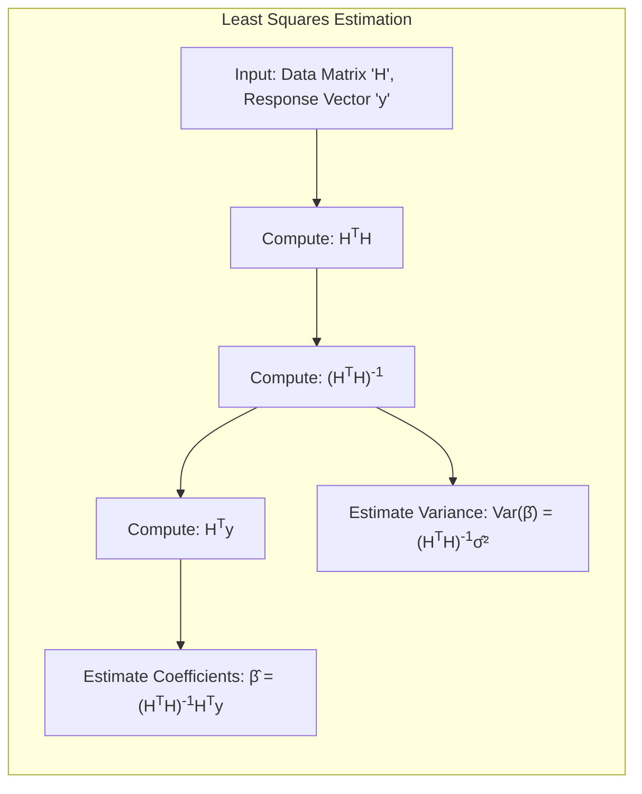
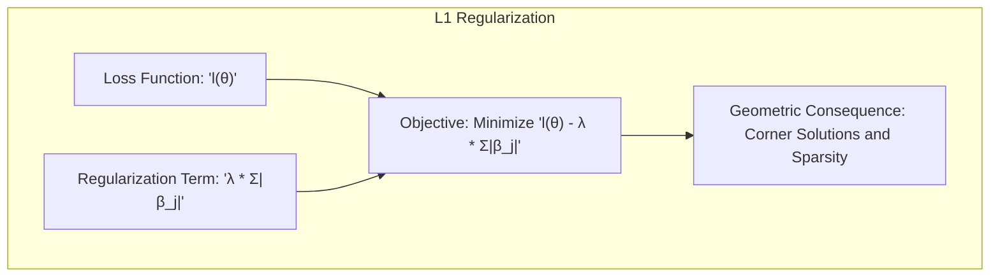
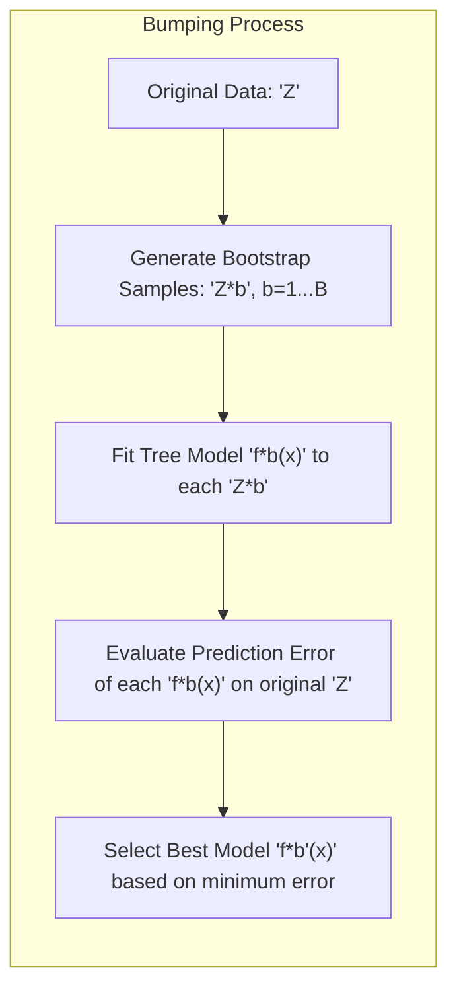
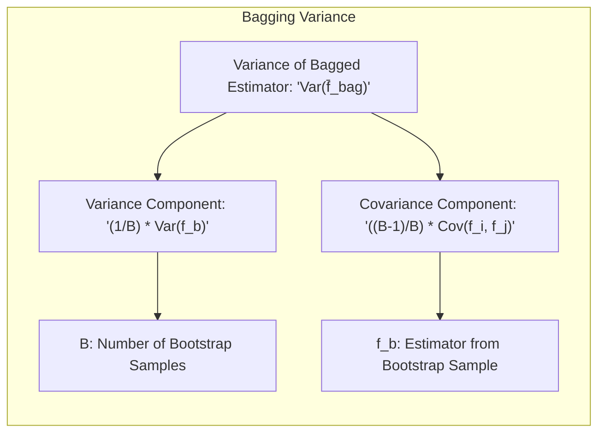

## Model Inference and Averaging: Bumping for Tree Models

<imagem: Um diagrama complexo mostrando o processo de Bumping em modelos de árvore. O diagrama deve incluir a geração de amostras bootstrap, o ajuste de árvores em cada amostra, a avaliação do erro no conjunto original de treinamento, e a seleção do modelo com menor erro. As árvores devem ser representadas de forma hierárquica, com os nós e divisões mostrando a variabilidade induzida pelo bootstrap. O diagrama deve enfatizar como o Bumping explora o espaço de soluções para encontrar uma árvore melhor.>

### Introdução

Este capítulo explora técnicas avançadas de inferência e combinação de modelos, com foco em métodos que vão além da simples minimização de erros ou entropia cruzada [^8.1]. O conceito de **maximum likelihood**, já abordado em outras partes deste livro [^8.1], é expandido e relacionado com métodos Bayesianos e o *bootstrap*. Além disso, são introduzidas técnicas de *model averaging* e melhoria de modelos, como métodos de comitê, *bagging*, *stacking* e *bumping* [^8.1]. Em particular, este capítulo se aprofundará no método de **bumping** aplicado a modelos de árvores, ilustrando como essa técnica de busca estocástica pode levar a modelos mais robustos e precisos. A aplicação de bumping em modelos de árvore é um exemplo notável de como a perturbação de dados pode ser usada para explorar o espaço de modelos e encontrar soluções mais adequadas, especialmente em cenários onde métodos tradicionais podem ficar presos em mínimos locais.

### Conceitos Fundamentais

**Conceito 1: Bootstrap e Máxima Verossimilhança**
O método *bootstrap* é uma técnica computacional para avaliar a incerteza através da amostragem da base de dados de treino [^8.2.1]. O *bootstrap* é ilustrado em um problema de suavização unidimensional, onde é mostrada a sua ligação com a **maximum likelihood** [^8.2.1]. Ao amostrar repetidamente com reposição do conjunto de dados original, o *bootstrap* permite estimar a variabilidade dos modelos e construir intervalos de confiança. No contexto da *maximum likelihood*, o *bootstrap* é usado como uma forma de simular a distribuição dos estimadores de parâmetros, particularmente quando as distribuições teóricas são complexas ou desconhecidas [^8.2.2]. As estimativas de mínimos quadrados e a matriz de covariância dos parâmetros podem ser derivadas utilizando a suposição de erros Gaussianos nos dados [^8.2].

> 💡 **Exemplo Numérico:** Considere um conjunto de dados unidimensional com 10 pontos, `X = [1, 2, 3, 4, 5, 6, 7, 8, 9, 10]` e `y = [2, 4, 5, 4, 5, 7, 9, 10, 12, 13]`.  Para aplicar o bootstrap, vamos criar 3 amostras bootstrap. Uma possível iteração poderia gerar os seguintes índices para cada amostra: `sample_1_indices = [2, 5, 1, 8, 3, 2, 9, 4, 7, 5]`, `sample_2_indices = [6, 9, 1, 4, 3, 7, 2, 8, 5, 10]` e `sample_3_indices = [1, 3, 6, 8, 2, 9, 4, 7, 5, 10]`. Com esses índices, as amostras bootstrap correspondentes são construídas, e um modelo é ajustado a cada amostra. Essas amostras nos ajudam a entender a variabilidade do modelo.

**Lemma 1:** A estimativa usual de $\beta$ (coeficientes) via mínimos quadrados, dada por $\hat{\beta} = (H^TH)^{-1}H^Ty$ minimiza o erro quadrático médio no conjunto de treinamento, conforme ilustrado na equação (8.2) [^8.2]. Além disso, a matriz de covariância estimada para $\hat{\beta}$, $\text{Var}(\hat{\beta}) = (H^TH)^{-1}\hat{\sigma}^2$  onde $\hat{\sigma}^2$ é o erro quadrático médio estimado,  reflete a incerteza associada às estimativas dos parâmetros do modelo [^8.2].
$$
\hat{\beta} = (H^TH)^{-1}H^Ty \\
\text{Var}(\hat{\beta}) = (H^TH)^{-1}\hat{\sigma}^2
$$
$\blacksquare$

> 💡 **Exemplo Numérico:** Suponha que temos um problema de regressão com duas variáveis preditoras ($x_1$ e $x_2$) e uma variável resposta $y$.  Temos as seguintes observações:
>
> | Observação | $x_1$ | $x_2$ | $y$  |
> |------------|-------|-------|------|
> | 1          | 1     | 2     | 5    |
> | 2          | 2     | 3     | 8    |
> | 3          | 3     | 4     | 11   |
> | 4          | 4     | 5     | 14   |
>
> Adicionamos uma coluna de 1's para o intercepto:
> $H = \begin{bmatrix} 1 & 1 & 2 \\ 1 & 2 & 3 \\ 1 & 3 & 4 \\ 1 & 4 & 5 \end{bmatrix}$ , $y = \begin{bmatrix} 5 \\ 8 \\ 11 \\ 14 \end{bmatrix}$
>
> $\text{Step 1: Compute } H^T H = \begin{bmatrix} 4 & 10 & 14 \\ 10 & 30 & 41 \\ 14 & 41 & 54 \end{bmatrix}$
> $\text{Step 2: Compute } (H^T H)^{-1} = \begin{bmatrix} 2.666 & -1.333 & 0.333 \\ -1.333 & 1.666 & -0.666 \\ 0.333 & -0.666 & 0.333 \end{bmatrix}$
> $\text{Step 3: Compute } H^T y = \begin{bmatrix} 38 \\ 110 \\ 152 \end{bmatrix}$
> $\text{Step 4: Compute } \hat{\beta} = (H^T H)^{-1} H^T y = \begin{bmatrix} 2 \\ 1 \\ 1.5 \end{bmatrix}$
> $\text{Step 5: Calculate residuals: } \hat{y} = H\hat{\beta} = [5.0, 8.0, 11.0, 14.0]^T$. Residuals =  $y - \hat{y} = [0, 0, 0, 0]^T$.
> $\text{Step 6: Compute } \hat{\sigma}^2 = \frac{\sum_{i=1}^N (y_i - \hat{y}_i)^2}{N} = 0$. Since residuals are zero, $\hat{\sigma}^2$ is zero. In a real scenario we would have residuals and consequently, $\hat{\sigma}^2$.
> $\text{Step 7: Compute }  \text{Var}(\hat{\beta}) = (H^TH)^{-1}\hat{\sigma}^2 = \begin{bmatrix} 0 & 0 & 0 \\ 0 & 0 & 0 \\ 0 & 0 & 0 \end{bmatrix}$.
>
> Neste exemplo idealizado, o erro é zero e a matriz de covariância também, o que não aconteceria em um cenário real. Em um problema real, a variância dos coeficientes indicaria a incerteza em suas estimativas.

**Conceito 2: Linearidade e Não Linearidade em Modelos**
Modelos lineares são caracterizados por funções de decisão lineares e são adequados para problemas onde a relação entre as características e a saída pode ser aproximada por uma combinação linear [^8.2]. No entanto, modelos não-lineares, como árvores de decisão, são mais flexíveis e podem capturar relações complexas e interações entre as características [^8.7]. O *bumping* se torna particularmente útil em modelos não-lineares, pois ajuda a explorar o espaço de modelos, encontrando uma combinação de parâmetros e decisões que melhor se adaptam aos dados. As árvores de decisão, por exemplo, ao serem ajustadas em diferentes amostras bootstrap, resultam em diferentes partições de dados, permitindo ao bumping encontrar estruturas e relações mais robustas.

**Corolário 1:** A combinação de modelos lineares, por meio do *model averaging* e do *stacking*, pode melhorar a precisão e robustez de um modelo. O *stacking*, em particular, utiliza regressões sobre os resultados de diversos modelos para gerar um único modelo que é capaz de superar a performance individual de cada modelo base, utilizando as predições cruzadas de cada um deles.

**Conceito 3: Bumping e a Busca Estocástica em Modelos de Árvore**
O *bumping* é uma técnica de busca estocástica que utiliza o *bootstrap* para explorar o espaço de modelos e encontrar uma solução mais adequada [^8.9]. Em modelos de árvore, o *bumping* usa o *bootstrap* para gerar uma coleção de árvores. Em vez de calcular uma média de seus resultados, o *bumping* seleciona a árvore que apresenta o menor erro de treinamento no conjunto original [^8.9]. Essa estratégia permite que o método evite ficar preso em mínimos locais e explore diferentes partições dos dados, especialmente em problemas com interações complexas entre as características. O *bumping* busca, assim, uma árvore "melhor", que represente um ótimo local no espaço de todos os modelos de árvores possíveis [^8.9].

### Regressão Linear e Mínimos Quadrados para Classificação

A regressão linear pode ser utilizada para a classificação ao se ajustar um modelo linear a uma matriz de indicadores. Essa abordagem minimiza o erro quadrático médio, onde cada classe é representada por um vetor indicador [^8.2]. Apesar da sua simplicidade, a regressão linear como classificador pode sofrer com problemas de *masking* quando as classes estão sobrepostas ou apresentam uma complexidade não linear. Nesses casos, a regressão linear pode gerar limites de decisão subótimos ou mesmo inconsistentes com os dados. A utilização de métodos mais robustos, como o *bootstrap*, a **maximum likelihood** e o *bumping* se torna relevante quando as suposições de linearidade não se sustentam, ou para melhorar a estabilidade e precisão das estimativas.

**Lemma 2:** A regressão linear em uma matriz de indicadores pode ser vista como um caso especial de um modelo de classificação linear, onde as classes são codificadas como vetores indicadores. A decisão de classe é dada pelo vetor indicador correspondente à classe com maior valor de predição linear.
$$
\hat{y}_i = \sum_{j=1}^{k} \beta_j x_{ij} \\
\text{Classe}(x_i) = argmax_k(\hat{y}_{ik})
$$
$\blacksquare$

> 💡 **Exemplo Numérico:** Considere um problema de classificação com 3 classes (A, B, e C) e duas variáveis preditoras ($x_1$ e $x_2$).  Os dados podem ser representados como:
>
> | Observação | $x_1$ | $x_2$ | Classe |
> |------------|-------|-------|--------|
> | 1          | 1     | 2     | A      |
> | 2          | 2     | 3     | A      |
> | 3          | 3     | 4     | B      |
> | 4          | 4     | 5     | B      |
> | 5          | 1     | 4     | C      |
> | 6          | 2     | 5     | C      |
>
> Transformamos as classes em vetores indicadores: A=[1,0,0], B=[0,1,0], C=[0,0,1]. Criamos então 3 problemas de regressão (um para cada classe).
> A matriz H para a regressão da classe A é:
> $H_A = \begin{bmatrix} 1 & 1 & 2 \\ 1 & 2 & 3 \\ 1 & 3 & 4 \\ 1 & 4 & 5 \\ 1 & 1 & 4 \\ 1 & 2 & 5 \end{bmatrix}$ e o vetor resposta para a classe A  $y_A = \begin{bmatrix} 1 \\ 1 \\ 0 \\ 0 \\ 0 \\ 0 \end{bmatrix}$
>
> Após realizar a regressão para cada classe, vamos supor que as predições para uma nova observação $x_{new} = [3,3]$ são $\hat{y}_A(x_{new}) = 0.2, \hat{y}_B(x_{new}) = 0.6, \hat{y}_C(x_{new}) = 0.1$. A classe predita é B, pois ela tem a maior predição.

**Corolário 2:**  Em cenários com separação linear clara entre classes, a regressão linear com uma matriz de indicadores pode gerar resultados comparáveis a outros métodos de classificação linear. No entanto, quando as classes são não linearmente separáveis, a regressão de indicadores pode apresentar instabilidade, levando à necessidade de regularização ou utilização de métodos mais sofisticados, como *boosting* ou *bagging*, que são formas de combinar múltiplos resultados de modelos similares.

É importante mencionar as limitações da regressão linear para classificação. *As extrapolações geradas podem levar a valores fora do intervalo [0, 1] em comparação com métodos como a regressão logística, que garante estimativas de probabilidade consistentes*. Apesar dessas limitações, *a regressão de indicadores oferece uma abordagem simples para a classificação e pode ser uma opção interessante quando o objetivo principal é uma fronteira de decisão linear*.

### Métodos de Seleção de Variáveis e Regularização em Classificação

A seleção de variáveis e a regularização são técnicas cruciais para controlar a complexidade de modelos de classificação, prevenindo *overfitting* e melhorando a interpretabilidade. As penalidades L1 e L2 são frequentemente utilizadas para induzir a *sparsity* dos modelos e controlar a magnitude dos coeficientes. Na regressão logística, a penalidade L1 (Lasso) força alguns coeficientes a zero, realizando uma seleção de variáveis implícita, enquanto a penalidade L2 (Ridge) reduz a magnitude dos coeficientes, aumentando a robustez do modelo. *A combinação das duas penalidades no Elastic Net busca equilibrar os benefícios de ambas abordagens*.

**Lemma 3:** A penalidade L1 em modelos de classificação logística induz a coeficientes esparsos devido à sua forma geométrica. Em situações onde há muitas variáveis preditoras, o L1 tem uma forte capacidade de reduzir o problema a um subconjunto mais relevante de características, conforme detalhado no texto [^8.2.2].
$$
l(0) = \sum_{i=1}^N \left[y_i \log(p(x_i)) + (1-y_i)\log(1-p(x_i))\right] - \lambda \sum_{j=1}^p |\beta_j|
$$
**Prova do Lemma 3:** A penalidade L1 (Lasso) introduz uma função de penalização que é linear em relação aos coeficientes (em valor absoluto). Para minimizar a função de custo, a L1 tende a forçar certos coeficientes a zero. Isso ocorre porque a penalidade L1 introduz um "canto" ou "quina" no espaço de busca dos parâmetros, onde a solução ótima frequentemente se encontra em um eixo, forçando alguns coeficientes a serem nulos. A penalidade L2, por outro lado, produz uma superfície de busca mais "suave", onde as soluções são distribuídas entre as variáveis. A combinação dessas características (Elastic Net) produz uma região de busca mista, permitindo uma regularização mais flexível e robusta. $\blacksquare$

> 💡 **Exemplo Numérico:** Considere um modelo de regressão logística com duas variáveis preditoras ($x_1$ e $x_2$) e uma variável de resposta binária $y$ (0 ou 1). A função de custo (log-verossimilhança) é dada por $l(0) = \sum_{i=1}^N \left[y_i \log(p(x_i)) + (1-y_i)\log(1-p(x_i))\right]$. Vamos adicionar a penalidade L1.
>
> Vamos supor que sem regularização os coeficientes são: $\beta_0 = 1, \beta_1 = 2, \beta_2 = -1$. Com L1 regularização, a função de custo se torna $l(0) = \sum_{i=1}^N \left[y_i \log(p(x_i)) + (1-y_i)\log(1-p(x_i))\right] - \lambda (|\beta_1| + |\beta_2|)$.
>
> Para $\lambda = 0.5$, o modelo de regressão logística com L1 regularização pode ajustar os parâmetros de forma que os novos coeficientes se tornem $\beta_0 = 0.8, \beta_1 = 1.2, \beta_2 = 0$, ou seja, forçou $\beta_2$ para 0.  Isso significa que a variável $x_2$ foi removida do modelo, indicando que ela pode ser menos relevante para a classificação nesse caso. Se $\lambda$ for alto o suficiente, mais coeficientes podem ser zerados, simplificando o modelo.

**Corolário 3:** A esparsidade induzida pela penalidade L1 aumenta a interpretabilidade do modelo, identificando as variáveis mais relevantes para a classificação. Essa característica é muito valiosa em cenários onde se busca uma compreensão mais profunda dos fatores que influenciam a variável resposta.

> ⚠️ **Ponto Crucial**: A escolha adequada do tipo de regularização, e do seu parâmetro, pode ter um impacto significativo na qualidade da classificação e na interpretabilidade do modelo.

### Separating Hyperplanes e Perceptrons

O conceito de **separating hyperplanes** busca encontrar um hiperplano que divide as classes da forma mais eficiente possível. Em particular, a ideia de maximizar a margem de separação leva ao conceito de hiperplanos ótimos, onde a distância entre as classes e a fronteira de decisão é maximizada. O Perceptron de Rosenblatt é um algoritmo que busca encontrar um hiperplano separador por meio de atualizações iterativas dos pesos. O Perceptron converge se os dados são linearmente separáveis, mas pode oscilar em cenários não linearmente separáveis, demonstrando a necessidade de métodos mais robustos ou de pré-processamento dos dados. O *bumping*, ao gerar diferentes modelos de árvore, pode contornar o problema da não-linearidade, buscando uma representação melhor dos dados que separe as classes de forma adequada.

### Bumping em Modelos de Árvore: Um estudo de caso detalhado

O **bumping**, em modelos de árvore, aplica o conceito do bootstrap para perturbar a base de dados e assim, encontrar um modelo com melhor desempenho. A perturbação nos dados de treinamento gera uma série de modelos de árvore, onde cada um deles captura informações diferentes sobre os dados. A seleção final do modelo é realizada ao se comparar o desempenho de cada uma das árvores no conjunto original de treinamento, o que permite ao *bumping* evitar o *overfitting* e selecionar a melhor solução.

O processo do *bumping* pode ser resumido da seguinte forma:
1. **Geração de Amostras Bootstrap:** Gera-se uma coleção de amostras bootstrap $Z^{*b}$, com $b = 1, 2, \ldots, B$,  a partir do conjunto de dados original.
2. **Ajuste de Modelos de Árvore:** Para cada amostra bootstrap $Z^{*b}$, um modelo de árvore $f^{*b}(x)$ é ajustado.
3. **Avaliação do Desempenho:** O erro de previsão de cada modelo $f^{*b}(x)$ é avaliado no conjunto de dados original.
4. **Seleção do Modelo:**  Seleciona-se o modelo $f^{*b'}(x)$ que apresenta o menor erro médio quadrático sobre o conjunto de treinamento original.
$$
\hat{b} = argmin_{b} \frac{1}{N} \sum_{i=1}^N (y_i - f^{*b}(x_i))^2
$$

A natureza estocástica do processo de *bumping* permite ao método escapar de ótimos locais, que muitas vezes são gerados por modelos de árvore que são muito sensíveis às particularidades do conjunto de dados original.

> 💡 **Exemplo Numérico:** Vamos supor que temos um conjunto de dados de treinamento com 100 amostras. Aplicamos o *bumping* com 10 amostras bootstrap. Cada amostra bootstrap é usada para treinar uma árvore de decisão. Cada árvore é então avaliada no conjunto de dados original e o erro médio quadrático (MSE) é calculado. Os MSEs obtidos foram:
> | Árvore | MSE |
> |--------|-----|
> | 1 | 0.5 |
> | 2 | 0.7 |
> | 3 | 0.4 |
> | 4 | 0.6 |
> | 5 | 0.8 |
> | 6 | 0.9 |
> | 7 | 0.5 |
> | 8 | 0.45|
> | 9 | 0.65|
> | 10| 0.75|
>
> O *bumping* selecionaria a árvore 3, pois ela obteve o menor MSE (0.4) dentre todas as árvores. A árvore 3 é o modelo final selecionado.

### Pergunta Teórica Avançada: Quais as vantagens e desvantagens do Bumping em relação a outros métodos de combinação de modelos como o Bagging?

**Resposta:**
O *bagging* e o *bumping* são ambos baseados em amostragem bootstrap e podem reduzir a variância de modelos instáveis. No entanto, eles diferem na forma como combinam os resultados de modelos ajustados em amostras bootstrap. O *bagging* calcula a média das predições de todos os modelos, enquanto o *bumping* seleciona apenas o melhor modelo com base no seu desempenho no conjunto de treinamento original.

A principal vantagem do *bumping* é a sua capacidade de evitar mínimos locais, selecionando uma solução que represente um ótimo local no espaço de soluções. Em contraste, o *bagging* pode suavizar as diferenças entre os modelos, o que pode levar a uma perda de informação. O *bagging* é especialmente eficaz quando todos os modelos têm um bom desempenho e a variância é o principal problema. No entanto, quando existem modelos com desempenho significativamente pior do que outros, o *bumping* pode gerar melhores resultados.

**Lemma 4:** O *bagging* reduz a variância de estimadores instáveis, ao calcular a média das previsões de um conjunto de modelos. No entanto, o *bagging* é menos eficaz em problemas onde existem múltiplos mínimos locais. Formalmente, podemos mostrar que a variância de um estimador bagged é dada por
$$
Var(\bar{f}_{bag}) = \frac{1}{B} Var(f_b) + \frac{B-1}{B}Cov(f_i, f_j)
$$
onde $f_b$ é o estimador do bootstrap e $B$ é o número de amostras bootstrap. $\blacksquare$

**Corolário 4:** O *bumping*, ao escolher o melhor modelo com base no desempenho do conjunto de dados original, tende a selecionar um estimador que é mais apropriado do ponto de vista de seu ajuste e desempenho. Em contrapartida, o *bagging*, ao suavizar os resultados, não é capaz de evitar ótimos locais tão facilmente como o *bumping*. No entanto, é importante notar que a variância do *bumping* pode ser alta, uma vez que a variabilidade na seleção de qual modelo é o melhor introduz ruído no processo.

> ⚠️ **Ponto Crucial**: A escolha entre *bagging* e *bumping* depende da natureza do problema. O *bagging* é mais apropriado para modelos que são instáveis mas onde todas as amostras bootstraps levam a modelos razoáveis. O *bumping* é mais adequado quando existem múltiplos mínimos locais e se busca uma solução que combine o melhor ajuste aos dados.

> 💡 **Exemplo Numérico:**  Vamos comparar o *bagging* e o *bumping* usando o exemplo de modelos de árvores. Suponha que temos 3 modelos de árvores ajustados em amostras bootstrap. Para uma nova entrada $x_{new}$ as predições são $f_1(x_{new}) = 0.2$, $f_2(x_{new}) = 0.8$, $f_3(x_{new}) = 0.3$. Além disso, vamos supor que no conjunto de treino, os erros quadráticos médios foram $MSE_1 = 0.6$, $MSE_2=0.2$ e $MSE_3=0.5$.
>
> **Bagging:** A predição do *bagging* é a média das predições individuais: $\hat{f}_{bag}(x_{new}) = (0.2 + 0.8 + 0.3) / 3 = 0.43$.
>
> **Bumping:** O *bumping* selecionaria o modelo 2, pois ele obteve o menor erro no conjunto de treinamento (MSE=0.2). Então a predição é $\hat{f}_{bump}(x_{new}) = 0.8$.
>
> Observa-se que *bagging* gera uma predição média, que pode suavizar as particularidades dos modelos. *Bumping* escolhe o melhor modelo, o que pode levar a resultados melhores se um dos modelos for significativamente melhor que os outros.

### Conclusão

Este capítulo explorou métodos de inferência e *model averaging* com um foco especial no método de *bumping* aplicado a modelos de árvore. O *bumping* demonstrou ser uma técnica promissora para encontrar melhores soluções em modelos com instabilidades e múltiplos ótimos locais, como é o caso das árvores de decisão. O *bumping*, ao utilizar amostragem *bootstrap* e seleção do modelo com melhor desempenho no conjunto original, consegue melhorar a robustez e precisão dos modelos, evitando os problemas de *overfitting* e outros problemas associados a algoritmos gulosos. Em resumo, o *bumping* e o *bagging* oferecem abordagens robustas para aprimorar modelos e obter melhores previsões, com cada método tendo suas particularidades e cenários de aplicação apropriados. A combinação de diferentes técnicas de inferência e *model averaging* permite um aprofundamento na análise dos dados, e uma maior precisão e robustez dos modelos.

<!-- END DOCUMENT -->
### Footnotes
[^8.1]: "In this chapter we provide a general exposition of the maximum likelihood approach, as well as the Bayesian method for inference. The bootstrap, introduced in Chapter 7, is discussed in this context, and its relation to maximum likelihood and Bayes is described. Finally, we present some related techniques for model averaging and improvement, including committee methods, bagging, stacking and bumping." *(Trecho de Model Inference and Averaging)*
[^8.2]: "Denote the training data by $Z = \{z_1, z_2, \ldots, z_N\}$, with $z_i = (x_i, y_i)$, $i = 1, 2, \ldots, N$. Here $x_i$ is a one-dimensional input, and $y_i$ the outcome, either continuous or categorical. As an example, consider the $N = 50$ data points shown in the left panel of Figure 8.1. Suppose we decide to fit a cubic spline to the data, with three knots placed at the quartiles of the X values. This is a seven-dimensional linear space of functions, and can be represented, for example, by a linear expansion of B-spline basis functions (see Section 5.9.2): $\mu(x) = \sum_{j=1}^7 \beta_j h_j(x)$. Here the $h_j(x)$, $j = 1, 2, \ldots, 7$ are the seven functions shown in the right panel of Figure 8.1. We can think of $\mu(x)$ as representing the conditional mean $E(Y|X = x)$. Let H be the $N \times 7$ matrix with ijth element $h_j(x_i)$. The usual estimate of $\beta$, obtained by minimizing the squared error over the training set, is given by $\hat{\beta} = (H^T H)^{-1} H^T y$. The corresponding fit $\hat{\mu}(x) = \sum_{j=1}^7 \hat{\beta}_j h_j(x)$ is shown in the top left panel of Figure 8.2. The estimated covariance matrix of $\hat{\beta}$ is $\text{Var}(\hat{\beta}) = (H^T H)^{-1} \hat{\sigma}^2$, where we have estimated the noise variance by $\hat{\sigma}^2 = \sum_{i=1}^N (y_i - \hat{\mu}(x_i))^2/N$." *(Trecho de Model Inference and Averaging)*
[^8.2.1]: "The bootstrap method provides a direct computational way of assessing uncertainty, by sampling from the training data. Here we illustrate the bootstrap in a simple one-dimensional smoothing problem, and show its connection to maximum likelihood." *(Trecho de Model Inference and Averaging)*
[^8.2.2]: "It turns out that the parametric bootstrap agrees with least squares in the previous example because the model (8.5) has additive Gaussian errors. In general, the parametric bootstrap agrees not with least squares but with maximum likelihood, which we now review." *(Trecho de Model Inference and Averaging)*
[^8.7]: "Earlier we introduced the bootstrap as a way of assessing the accuracy of a parameter estimate or a prediction. Here we show how to use the bootstrap to improve the estimate or prediction itself. In Section 8.4 we investigated the relationship between the bootstrap and Bayes approaches, and found that the bootstrap mean is approximately a posterior average. Bagging further exploits this connection.  Consider first the regression problem. Suppose we fit a model to our training data $Z = \{(x_1, y_1), (x_2, y_2), \ldots, (x_N, y_N)\}$, obtaining the prediction $f(x)$ at input $x$. Bootstrap aggregation or bagging averages this prediction over a collection of bootstrap samples, thereby reducing its variance. For each bootstrap sample $Z^{*b}$, $b = 1, 2, \ldots, B$, we fit our model, giving prediction $f^{*b}(x)$. The bagging estimate is defined by $\hat{f}_{bag}(x) = \frac{1}{B} \sum_{b=1}^B f^{*b}(x)$." *(Trecho de Model Inference and Averaging)*
[^8.9]: "The final method described in this chapter does not involve averaging or combining models, but rather is a technique for finding a better single model. Bumping uses bootstrap sampling to move randomly through model space. For problems where fitting method finds many local minima, bumping can help the method to avoid getting stuck in poor solutions. As in bagging, we draw bootstrap samples and fit a model to each. But rather than average the predictions, we choose the model estimated from a bootstrap sample that best fits the training data." *(Trecho de Model Inference and Averaging)*
