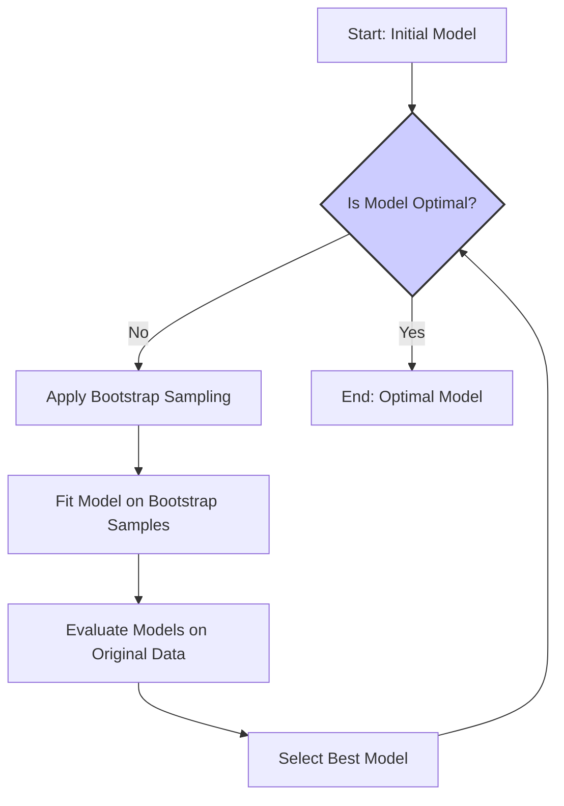
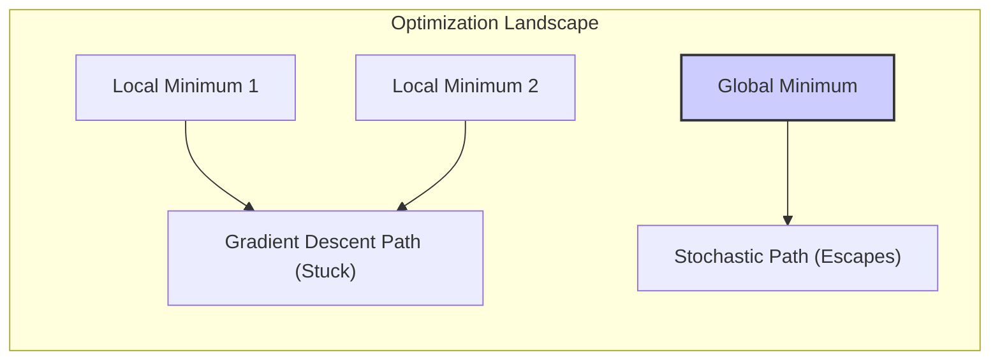
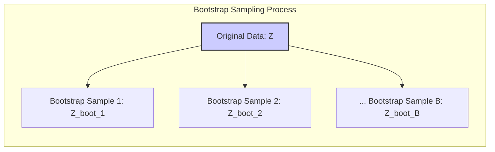
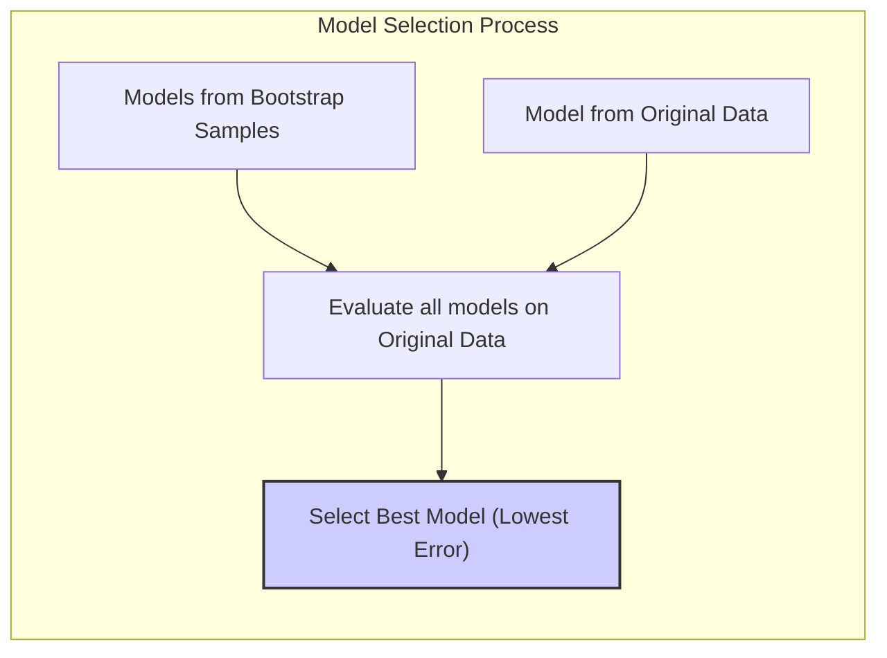
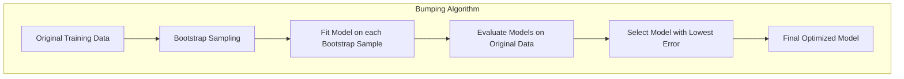
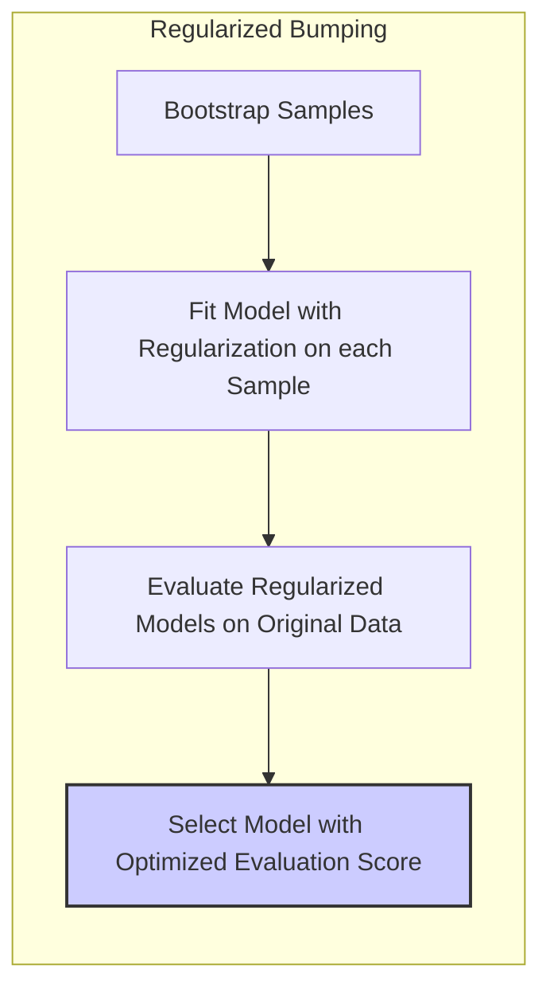
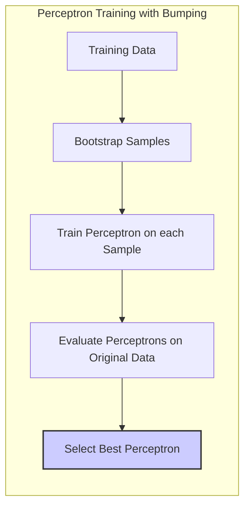
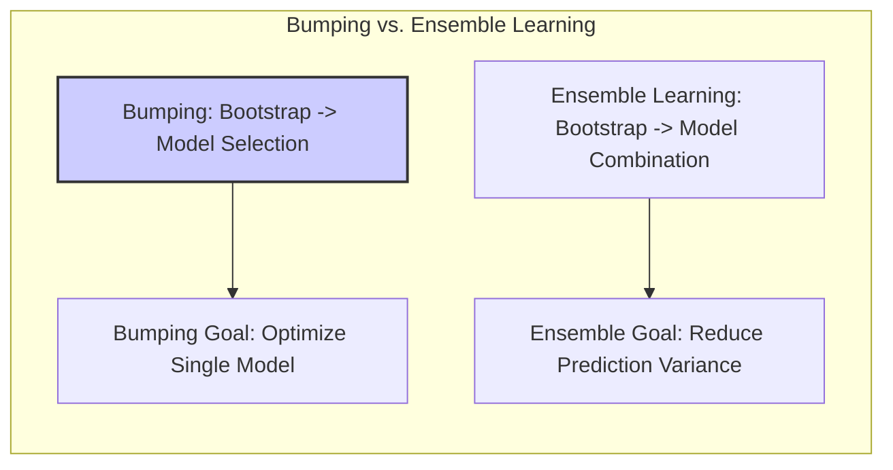

Okay, here's the enhanced text with all mathematical expressions formatted using LaTeX notation:

## Bumping e Otimização: Uma Abordagem Estocástica para Busca de Modelos

### Introdução
Neste capítulo, exploraremos uma abordagem para melhoria de modelos denominada **bumping**, um método de busca estocástica que utiliza a amostragem bootstrap para explorar o espaço de modelos [^8.9]. Em vez de nos concentrarmos em técnicas de *model averaging* ou *combining*, o bumping busca encontrar um modelo único, mas melhorado. Veremos como essa técnica se aplica especialmente a cenários onde os métodos de ajuste tradicionais podem ficar presos em mínimos locais e como ela se relaciona com o processo de otimização [^8.9]. O bumping, ao introduzir aleatoriedade através do bootstrap, tem o potencial de revelar regiões do espaço de modelos que de outra forma poderiam ser negligenciadas.

### Conceitos Fundamentais

**Conceito 1: Busca no Espaço de Modelos**
O problema de ajuste de um modelo pode ser visto como uma busca em um espaço de modelos [^8.9]. Cada modelo possível é associado a um conjunto de parâmetros que determinam suas características, e o objetivo é encontrar o modelo que melhor se ajusta aos dados. Métodos tradicionais de otimização podem ser bem-sucedidos se o espaço de modelos for bem comportado, mas, na prática, frequentemente encontramos paisagens de erro com muitos mínimos locais. Nesses casos, um método estocástico como o bumping pode ser mais eficaz, pois ele tem a capacidade de escapar desses mínimos locais.

**Lemma 1:** Em cenários com múltiplos mínimos locais, um método de otimização determinístico, como gradient descent, pode convergir para um mínimo local inferior ao ótimo global, enquanto um método estocástico tem a possibilidade de escapar desses mínimos locais, através da exploração de regiões diferentes do espaço de parâmetros.

> 💡 **Exemplo Numérico:** Imagine que estamos ajustando um modelo de regressão com dois parâmetros, $\beta_1$ e $\beta_2$. O espaço de erro pode ter a forma de uma bacia com vários vales (mínimos locais). Um método de descida do gradiente pode ficar preso em um desses vales, resultando em valores subótimos para $\beta_1$ e $\beta_2$. Por exemplo, o algoritmo pode convergir para $\beta_1 = 1.2$, $\beta_2 = 0.8$, com um erro quadrático médio de 2.5, enquanto o mínimo global seria em $\beta_1 = 1.5$, $\beta_2 = 1.0$ com um erro quadrático médio de 1.8. O bumping, através da amostragem bootstrap, pode "pular" para fora desse vale e explorar outras regiões do espaço de parâmetros, tendo a chance de encontrar o mínimo global.

**Conceito 2: Amostragem Bootstrap**
O bumping utiliza a amostragem bootstrap para perturbar os dados de treinamento e, com isso, o processo de ajuste do modelo [^8.9]. O bootstrap cria versões perturbadas do conjunto de dados original por meio de reamostragem com reposição. Ao ajustar o modelo em cada um desses conjuntos de dados bootstrapped, temos uma coleção de modelos ligeiramente diferentes [^8.9]. Esta coleção oferece a oportunidade de explorar o espaço de modelos de maneira aleatória e diversificada, permitindo que o algoritmo explore regiões do espaço de parâmetros que um método determinístico não alcançaria.

> 💡 **Exemplo Numérico:** Suponha que temos um conjunto de dados com 5 pontos:  `Z = [(1, 2), (2, 4), (3, 5), (4, 4), (5, 6)]`. Uma amostra bootstrap possível poderia ser `Z_boot_1 = [(1, 2), (2, 4), (2, 4), (4, 4), (5, 6)]`, enquanto outra poderia ser `Z_boot_2 = [(1, 2), (1, 2), (3, 5), (4, 4), (5, 6)]`.  Note que alguns pontos do conjunto original podem aparecer repetidas vezes, enquanto outros podem não aparecer na amostra bootstrap.  Ao ajustar um modelo linear em cada um desses conjuntos bootstrapped, obtemos modelos com parâmetros ligeiramente diferentes, cada um explorando uma região específica do espaço de parâmetros.

**Corolário 1:** Ao criar um conjunto de amostras bootstrap e ajustar o modelo em cada amostra, criamos uma coleção de modelos que são potencialmente diferentes. O bagging, como visto na seção 8.7, utiliza uma abordagem similar, buscando melhorar as predições agregando modelos, ao passo que o bumping busca o modelo mais adequado.

**Conceito 3: Seleção do Melhor Modelo**
Após gerar uma coleção de modelos bootstrapped, o bumping não os combina ou faz uma média como em *model averaging*. Em vez disso, seleciona o modelo que melhor se ajusta aos dados de treinamento originais, avaliando cada modelo bootstrapped com base em uma função de avaliação (por exemplo, erro quadrático médio para regressão ou precisão para classificação) [^8.9]. O bumping inclui o modelo ajustado com os dados de treinamento originais como um dos candidatos a serem avaliados, para que a busca não se restrinja aos modelos modificados pelo bootstrap.

> 💡 **Exemplo Numérico:** Continuando com o exemplo anterior, suponha que ajustamos um modelo linear aos dados originais (`Z`) e às duas amostras bootstrap (`Z_boot_1` e `Z_boot_2`). Suponha que obtivemos os seguintes modelos com os respectivos erros quadráticos médios (MSE) quando avaliados nos dados originais (`Z`):
> - Modelo ajustado em `Z`: $\hat{y} = 1.2 + 0.9x$, MSE = 0.6
> - Modelo ajustado em `Z_boot_1`: $\hat{y} = 1.1 + 1.0x$, MSE = 0.4
> - Modelo ajustado em `Z_boot_2`: $\hat{y} = 1.3 + 0.85x$, MSE = 0.7
> O bumping selecionaria o modelo ajustado em `Z_boot_1` ($\hat{y} = 1.1 + 1.0x$) como o modelo final, pois ele tem o menor MSE nos dados originais.

> ⚠️ **Nota Importante**: A função de avaliação utilizada para selecionar o melhor modelo deve ser coerente com o objetivo do problema.
> ❗ **Ponto de Atenção**: O bumping depende do número de amostras bootstrap. Um número insuficiente pode não levar à exploração adequada do espaço de modelos, enquanto um número excessivo pode ser computacionalmente dispendioso.
> ✔️ **Destaque**: A escolha do modelo final não é feita a partir de um único passo de otimização, mas pela avaliação comparativa de diversos modelos construídos em amostras bootstrap.

### Regressão Linear e Mínimos Quadrados para Classificação

**Explicação:** O diagrama acima representa os passos do algoritmo de bumping, desde a amostragem bootstrap até a seleção do melhor modelo. Este diagrama ajuda a visualizar o processo de exploração do espaço de modelos por meio da perturbação dos dados de treinamento e a escolha do modelo ótimo.

O processo de bumping, conforme descrito em [^8.9], inicia-se com a amostragem bootstrap do conjunto de dados original. O objetivo não é criar um ensemble de modelos, como ocorre no bagging, mas sim utilizar cada amostra bootstrap para explorar diferentes caminhos na busca por uma solução melhor [^8.7], [^8.9]. O método se diferencia do bagging na maneira como os modelos gerados são usados: enquanto o bagging combina as predições de todos os modelos, o bumping seleciona o melhor modelo.

A geração de cada amostra bootstrap implica na perturbação do conjunto de dados original, de forma que cada amostra é uma versão ligeiramente diferente dos dados originais [^8.9]. Essa perturbação pode levar a modelos distintos, com diferentes parâmetros, e é justamente essa diversidade que o bumping explora. Ao ajustar o modelo em cada amostra bootstrapped, o algoritmo explora diferentes caminhos no espaço de modelos.

**Lemma 2:** Ao amostrar com reposição, o bootstrap introduz uma perturbação controlada nos dados, que leva à exploração de diferentes regiões do espaço de modelos, possibilitando o escape de mínimos locais.

**Corolário 2:** O bumping não combina ou faz a média dos modelos gerados em cada amostra bootstrap, mas os avalia separadamente nos dados de treinamento originais e seleciona o que produz o menor erro, que corresponde à melhor performance.

### Métodos de Seleção de Variáveis e Regularização em Classificação

O bumping pode ser usado em conjunto com métodos de seleção de variáveis e regularização [^8.9]. Após ajustar um modelo em cada amostra bootstrap, a avaliação feita nos dados originais poderia também levar em consideração termos de regularização. O objetivo aqui seria não apenas encontrar o modelo com melhor ajuste, mas também um modelo que seja mais parcimonioso ou robusto [^8.9]. Por exemplo, poderíamos penalizar modelos com muitos parâmetros ou modelos que sejam muito sensíveis a pequenas perturbações nos dados.

**Lemma 3:** Ao incluir um termo de regularização na função de avaliação do bumping, é possível direcionar a busca para modelos mais parcimoniosos ou robustos.

**Prova do Lemma 3:**
Seja $L(\hat{\theta}; Z)$ a função de log-verossimilhança para os parâmetros $\hat{\theta}$ dados os dados $Z$. Seja $P(\hat{\theta})$ uma função que penaliza modelos com muitos parâmetros ou muito complexos. A função de avaliação do bumping, em sua forma regularizada, passa a ser
$$
A(\hat{\theta}; Z) = L(\hat{\theta}; Z) - \lambda P(\hat{\theta}),
$$
onde $\lambda$ é um parâmetro que controla o quanto o modelo deve ser penalizado. O bumping seleciona o modelo que maximiza $A(\hat{\theta}; Z)$, considerando tanto a aderência aos dados (dada por $L(\hat{\theta}; Z)$) quanto a complexidade do modelo (dada por $P(\hat{\theta})$).
Dessa forma, ao comparar modelos na etapa de avaliação, um modelo com um bom ajuste aos dados, mas que não seja muito complexo ou sensível a perturbações, será favorecido. $\blacksquare$

> 💡 **Exemplo Numérico:** Suponha que estamos ajustando um modelo de regressão linear com vários preditores, e a função de avaliação que usamos é o erro quadrático médio (MSE), juntamente com uma penalidade L1 (Lasso) para evitar overfitting:
>
> $A(\hat{\beta}; Z) = MSE(\hat{\beta}; Z) + \lambda \sum_{i=1}^p |\beta_i|$
>
> onde $\beta$ são os coeficientes do modelo, e $\lambda$ é um parâmetro de regularização.
>
> - Modelo 1 (sem bumping): $\hat{y} = 0.5 + 1.2x_1 + 0.8x_2 + 0.2x_3 $, MSE = 0.4, penalidade L1 = 2.2,  $A(\hat{\beta}; Z)$ = 0.4 + $\lambda * 2.2$
> - Modelo 2 (bumping, amostra bootstrap 1): $\hat{y} = 0.6 + 1.1x_1 + 0.6x_2 + 0.1x_3$, MSE = 0.3, penalidade L1 = 1.8,  $A(\hat{\beta}; Z)$ = 0.3 + $\lambda * 1.8$
> - Modelo 3 (bumping, amostra bootstrap 2): $\hat{y} = 0.4 + 1.3x_1 + 0.9x_2 + 0.1x_3$, MSE = 0.35, penalidade L1 = 2.3, $A(\hat{\beta}; Z)$ = 0.35 + $\lambda * 2.3$
>
> Se $\lambda = 0.1$, então:
>
> - Modelo 1: $A(\hat{\beta}; Z)$ = 0.4 + 0.1 * 2.2 = 0.62
> - Modelo 2: $A(\hat{\beta}; Z)$ = 0.3 + 0.1 * 1.8 = 0.48
> - Modelo 3: $A(\hat{\beta}; Z)$ = 0.35 + 0.1 * 2.3 = 0.58
>
>  O bumping com regularização escolheria o Modelo 2. Este exemplo mostra como a regularização, combinada com o bumping, favorece modelos mais parcimoniosos e evita o overfitting.

**Corolário 3:** O uso da regularização no bumping permite evitar overfitting e encontrar soluções mais generalizáveis.

> ⚠️ **Ponto Crucial**: A regularização pode ser usada para equilibrar o ajuste aos dados com a complexidade do modelo.

### Separating Hyperplanes e Perceptrons

O bumping pode ser aplicado em problemas de classificação, como encontrar *separating hyperplanes*, buscando uma melhor combinação de pesos para classificar os dados [^8.9]. A ideia central é a mesma: gerar amostras bootstrap e ajustar o classificador (por exemplo, um perceptron) em cada amostra, depois selecionar o classificador que melhor performa nos dados de treinamento originais. Isso pode levar a melhorias na generalização do classificador, especialmente em casos onde o espaço de modelos é difícil de otimizar.

> 💡 **Exemplo Numérico:** Considere um problema de classificação binária com duas features, $x_1$ e $x_2$. Um perceptron busca encontrar um hiperplano que separe as classes.
>
> Suponha que temos os seguintes dados de treinamento:
> - Classe 0: `[(1, 1), (2, 1), (1, 2)]`
> - Classe 1: `[(3, 3), (3, 2), (2, 3)]`
>
>
> 1.  **Perceptron sem bumping**: Um perceptron treinado nos dados originais pode encontrar um hiperplano com os pesos $w = [-1.5, 1.0]$, e bias $b = 0.5$, resultando em uma taxa de erro de treinamento de 1/6.
> 2.  **Perceptron com bumping**:
>     - Amostra bootstrap 1: `[(1, 1), (2, 1), (3, 3), (3, 2), (2, 3), (2, 1)]`
>     - Amostra bootstrap 2: `[(1, 2), (3, 2), (2, 3), (1, 1), (2, 1), (3, 3)]`
>
>     - Perceptron treinado na amostra 1: $w_1 = [-2.0, 1.5]$, $b_1 = 0.7$, taxa de erro nos dados originais = 0/6.
>     - Perceptron treinado na amostra 2: $w_2 = [-1.8, 1.2]$, $b_2 = 0.6$, taxa de erro nos dados originais = 1/6.
>
>  O bumping selecionaria o perceptron treinado na amostra 1, pois tem uma taxa de erro menor nos dados originais (0/6). Este exemplo ilustra como o bumping pode auxiliar na procura de um melhor classificador, através da exploração do espaço de parâmetros com o uso do bootstrap.

### Pergunta Teórica Avançada: Qual a relação entre o Bumping e os métodos de *Ensemble Learning*?

**Resposta:**
O *ensemble learning* é um conjunto de métodos que busca criar e combinar múltiplos modelos, enquanto o bumping busca um único modelo otimizado. Apesar de utilizarem a ideia do bootstrap como ponto de partida, o bumping e o *ensemble learning* possuem objetivos distintos. Métodos como bagging e random forests usam a amostragem bootstrap para gerar diversos modelos que são combinados, seja por meio de voto ou média, conforme o caso. No bumping, cada modelo bootstrapped é utilizado como um explorador do espaço de modelos, e apenas o melhor modelo é selecionado [^8.7], [^8.9]. O bumping pode ser visto como um processo de busca estocástica de modelos, enquanto que o *ensemble learning* é um processo de combinação de modelos.

**Lemma 4:** Métodos de *Ensemble Learning*, como bagging, visam reduzir a variância das predições, combinando modelos, enquanto o bumping usa o bootstrap para explorar o espaço de modelos, com o objetivo de selecionar um único modelo ótimo.

**Corolário 4:** Enquanto os métodos de *ensemble learning* procuram diminuir o erro através da combinação de múltiplos modelos, o bumping procura um modelo que, individualmente, tenha melhor performance, usando o bootstrap para otimizar a busca.

> ⚠️ **Ponto Crucial**: A principal diferença entre bumping e *ensemble learning* reside no objetivo: o bumping busca um único modelo otimizado, enquanto o *ensemble learning* busca melhorar a performance através da combinação de múltiplos modelos.

### Conclusão
Em resumo, o bumping oferece uma abordagem interessante para otimização de modelos ao explorar o espaço de modelos com o uso de bootstrap, permitindo que o algoritmo escape de mínimos locais. A seleção do melhor modelo, ao invés da combinação de modelos, como ocorre no *ensemble learning*, faz com que o bumping seja um método útil e complementar às demais técnicas de ajuste e otimização de modelos.

### Footnotes
[^8.9]: "The final method described in this chapter does not involve averaging or combining models, but rather is a technique for finding a better single model. Bumping uses bootstrap sampling to move randomly through model space. For problems where fitting method finds many local minima, bumping can help the method to avoid getting stuck in poor solutions." *(Trecho de <Nome do Documento>)*
[^8.7]: "Earlier we introduced the bootstrap as a way of assessing the accuracy of a parameter estimate or a prediction. Here we show how to use the bootstrap to improve the estimate or prediction itself. In Section 8.4 we investigated the relationship between the bootstrap and Bayes approaches, and found that the bootstrap mean is approximately a posterior average. Bagging further exploits this connection." *(Trecho de <Nome do Documento>)*
<!-- END DOCUMENT -->
