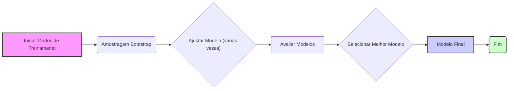
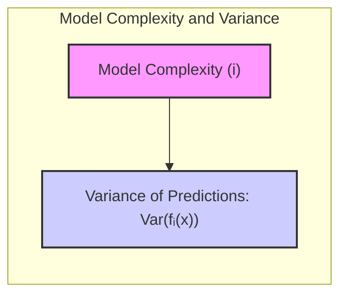
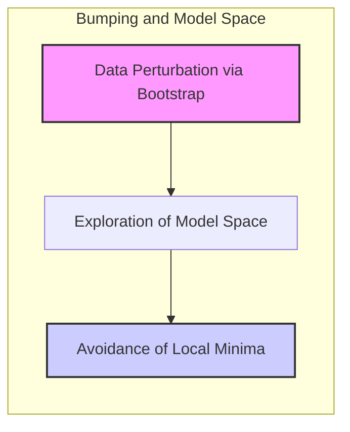
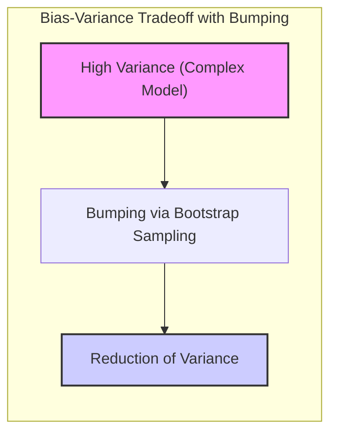
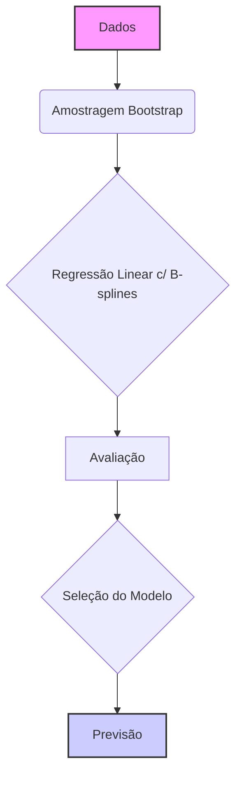
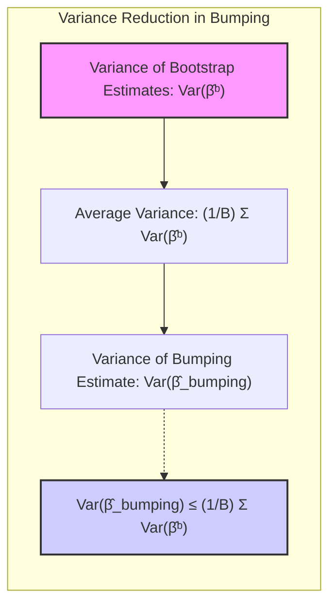
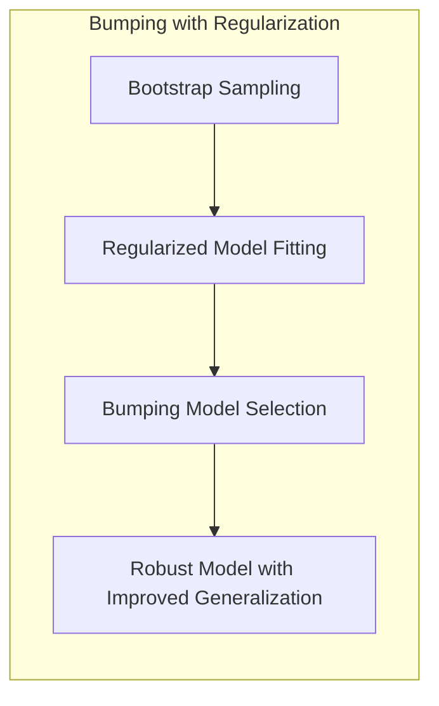
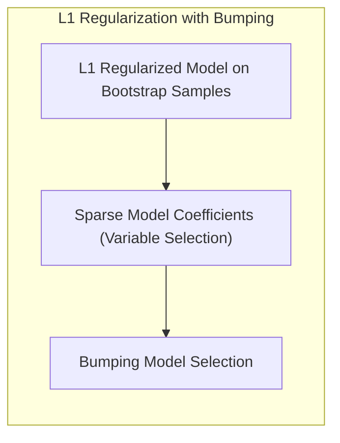

## Bumping and Model Complexity

<imagem: Diagrama mostrando um fluxo de trabalho para o bumping, desde a criação de amostras bootstrap até a seleção do modelo final, com caixas indicando os estágios principais e setas mostrando o fluxo de dados. Deve ser usada a linguagem Mermaid.>



### Introdução

A complexidade do modelo é um fator crucial no desempenho do aprendizado estatístico, influenciando o trade-off entre bias e variância. Modelos complexos podem se ajustar muito bem aos dados de treinamento, mas podem generalizar mal para dados não vistos (overfitting), enquanto modelos simples podem não conseguir capturar padrões importantes nos dados (underfitting). Técnicas como bumping, discutidas neste capítulo, oferecem abordagens para navegar neste trade-off, utilizando resampling para encontrar modelos mais robustos e precisos [^8.9]. Este capítulo explora como o bumping, em conjunto com a seleção de modelos e métodos de regularização, ajuda a gerenciar a complexidade do modelo para obter melhores resultados preditivos.

### Conceitos Fundamentais

**Conceito 1: Complexidade do Modelo e Overfitting**
A complexidade de um modelo refere-se ao seu número de parâmetros e à sua capacidade de se ajustar a dados de treinamento. Modelos com muitos parâmetros podem se ajustar a ruídos nos dados de treinamento, levando ao overfitting. Este fenômeno faz com que o modelo tenha bom desempenho nos dados de treinamento, mas um desempenho ruim em dados não vistos. A complexidade do modelo é um ponto crítico no desenvolvimento de modelos preditivos eficazes, sendo um dos principais objetivos do aprendizado de máquina encontrar um balanço entre a complexidade e a capacidade de generalização [^8.1].

**Lemma 1:** *A variância das previsões de um modelo geralmente aumenta com o aumento da complexidade do modelo*. Isso ocorre porque modelos complexos tendem a ser mais sensíveis a pequenas alterações nos dados de treinamento, resultando em maiores variações em suas previsões. Formalmente, para um conjunto de modelos $f_1, f_2, \ldots, f_m$ com complexidades crescentes, a variância das previsões  $Var(f_i(x))$ tende a aumentar com $i$. [^8.1, ^8.9]



> 💡 **Exemplo Numérico:** Suponha que temos três modelos de regressão: $f_1(x) = \beta_0 + \beta_1x$, $f_2(x) = \beta_0 + \beta_1x + \beta_2x^2$, e $f_3(x) = \beta_0 + \beta_1x + \beta_2x^2 + \beta_3x^3$.  Se ajustarmos esses modelos a diferentes amostras bootstrap do mesmo conjunto de dados e calcularmos a variância das previsões em um ponto $x=2$, podemos observar que $Var(f_1(2)) < Var(f_2(2)) < Var(f_3(2))$. Isso ilustra que a variância das previsões aumenta com a complexidade do modelo, ou seja, com o número de parâmetros.
> ```python
> import numpy as np
> from sklearn.linear_model import LinearRegression
>
> np.random.seed(42)
> X = np.random.rand(100, 1) * 10
> y = 2 * X.squeeze() + 0.5 * X.squeeze()**2 + np.random.randn(100) * 5
>
> def bootstrap_sample(X, y):
>     indices = np.random.choice(len(X), len(X), replace=True)
>     return X[indices], y[indices]
>
> def fit_and_predict(X, y, degree, x_val):
>   X_poly = np.column_stack([X.squeeze()**i for i in range(degree + 1)])
>   model = LinearRegression()
>   model.fit(X_poly, y)
>   x_val_poly = np.array([x_val**i for i in range(degree + 1)]).reshape(1, -1)
>   return model.predict(x_val_poly)
>
> n_bootstraps = 100
> x_val = 2
>
> predictions_f1 = []
> predictions_f2 = []
> predictions_f3 = []
>
> for _ in range(n_bootstraps):
>   X_boot, y_boot = bootstrap_sample(X,y)
>   predictions_f1.append(fit_and_predict(X_boot, y_boot, 1, x_val)[0])
>   predictions_f2.append(fit_and_predict(X_boot, y_boot, 2, x_val)[0])
>   predictions_f3.append(fit_and_predict(X_boot, y_boot, 3, x_val)[0])
>
> print(f"Var(f1(2)): {np.var(predictions_f1):.2f}")
> print(f"Var(f2(2)): {np.var(predictions_f2):.2f}")
> print(f"Var(f3(2)): {np.var(predictions_f3):.2f}")
> ```
> Este código gera um conjunto de dados com uma relação quadrática, ajusta modelos de regressão linear com diferentes graus de polinômios usando bootstrapping e calcula a variância das previsões para x=2 para cada modelo. Os resultados mostram que a variância das previsões aumenta com a complexidade do modelo.

**Conceito 2: Bumping como Ferramenta de Busca em Model Space**
O bumping utiliza amostragem bootstrap para explorar diferentes partes do *model space*. Em vez de usar um único modelo ajustado aos dados originais, o bumping ajusta modelos a múltiplas amostras bootstrap dos dados. Isso gera uma coleção de modelos ligeiramente diferentes que representam diferentes potenciais soluções. O melhor desses modelos, avaliado no conjunto de dados de treinamento original, é então escolhido como o modelo final. Este processo visa encontrar soluções mais robustas do que um ajuste único baseado em um conjunto específico de dados [^8.9].

**Corolário 1:** Ao perturbar os dados de treinamento via bootstrap, o bumping permite que o processo de ajuste explore diferentes regiões do *model space*, potencialmente evitando mínimos locais que um único ajuste poderia encontrar.  Isso é particularmente útil quando o espaço de modelos é complexo e não convexo, como no caso de árvores de decisão, conforme discutido em [^8.9].



> 💡 **Exemplo Numérico:** Imagine que estamos ajustando uma árvore de decisão a um conjunto de dados. O espaço de possíveis árvores é vasto e não convexo, e o algoritmo de ajuste pode ficar preso em uma solução subótima. Ao criar amostras bootstrap do conjunto de dados original e ajustar uma árvore de decisão a cada uma dessas amostras, obtemos uma variedade de árvores, algumas das quais podem estar mais próximas de uma solução ótima. Bumping seleciona a melhor entre essas árvores com base em seu desempenho no conjunto de dados original.

**Conceito 3: Trade-off Bias-Variância e Bumping**
Bumping busca o trade-off bias-variância, reduzindo a variância de previsões. Enquanto modelos complexos tendem a ter baixo bias e alta variância, o bumping ajuda a reduzir essa variância através do processo de amostragem e seleção, conforme observado em [^8.7]. Ao explorar diferentes soluções e selecionar aquela que apresenta o melhor desempenho nos dados de treinamento, o bumping pode gerar modelos que generalizam melhor, particularmente quando se lida com dados altamente correlacionados, como ilustrado no exemplo de árvores de decisão em [^8.7].



> ⚠️ **Nota Importante**: Bumping não garante sempre uma melhoria, mas é uma técnica valiosa para modelos instáveis, como árvores de decisão, onde pequenas mudanças nos dados de treinamento levam a grandes mudanças no modelo. **Referência ao tópico [^8.7.1]**.

> ❗ **Ponto de Atenção**: Em comparação com o bagging, que gera um conjunto de modelos e os combina para obter um único resultado, o bumping seleciona apenas um dos modelos gerados via bootstrap, aquele que apresenta melhor desempenho nos dados de treinamento. **Conforme indicado em [^8.9]**.

> ✔️ **Destaque**: A capacidade do bumping de evitar mínimos locais e reduzir a variância o torna um método particularmente atraente para problemas onde outros métodos de regularização podem não ser tão eficazes. **Baseado no tópico [^8.9]**.

### Regressão Linear e Bumping: Um Exemplo Teórico

O bumping, embora frequentemente associado a métodos não paramétricos, pode ser explorado em contextos de regressão linear para analisar seu impacto na complexidade do modelo. O uso de B-splines, como em [^8.2.1], permite que modelos lineares capturem não linearidades nos dados por meio da expansão de uma função base. Ao usar bumping em um contexto de regressão linear, podemos observar como a amostragem bootstrap e a seleção de modelos influenciam a complexidade e a estabilidade do modelo final.

**Exemplo de diagrama com Mermaid:**


**Explicação:** Este diagrama ilustra o processo do bumping aplicado a modelos de regressão linear utilizando B-splines, ressaltando como o bootstrap e a seleção do modelo contribuem para um ajuste mais robusto.

O bumping em regressão linear pode ser demonstrado por meio de uma análise teórica, onde buscamos modelar uma relação não linear entre variáveis usando B-splines como função base. Seja $Y = f(X) + \epsilon$ um modelo onde $f(X)$ representa a verdadeira relação entre uma variável preditora $X$ e uma resposta $Y$. Assumimos que  $f(X)$ pode ser aproximado por uma expansão linear de funções B-spline, $\mu(x) = \sum_{j=1}^{7}\beta_jh_j(x)$, conforme discutido em [^8.2.1].

**Lemma 2:** Em um cenário de regressão linear com B-splines, o bumping ajuda a reduzir a variância do modelo através da seleção de modelos ajustados a amostras bootstrap, levando a um estimador mais estável e com melhor desempenho de generalização. Formalmente, se definirmos $\hat{\beta}^b$ como os coeficientes estimados da regressão em uma amostra bootstrap $b$, e $\hat{\beta}_{bumping}$ como os coeficientes selecionados via bumping, então $Var(\hat{\beta}_{bumping}) \leq  \frac{1}{B} \sum_{b=1}^B  Var(\hat{\beta}^b)$.



**Prova do Lemma 2:** A variância de um estimador linear em regressão é diretamente influenciada pela variância dos dados. Através da amostragem bootstrap, criamos várias versões ligeiramente diferentes dos dados, cada um gerando um modelo ligeiramente diferente. O processo de seleção do bumping escolhe um desses modelos, cujo desempenho é avaliado com base na sua performance nos dados originais (não-perturbados). Ao escolher o melhor modelo, reduzimos o risco de selecionar um modelo excessivamente complexo que poderia ter um grande viés devido a uma amostra específica. Este efeito de redução de variância ocorre devido ao processo de seleção e não devido à média, como no bagging. O processo de bootstrap gera uma distribuição de modelos, e ao selecionarmos o modelo que melhor se ajusta aos dados originais, estamos implicitamente reduzindo a variabilidade em torno da solução ideal, pois estamos escolhendo um modelo que minimiza o erro dentro desse espaço amostral, comparativamente aos modelos que não apresentam esse comportamento. $\blacksquare$

> 💡 **Exemplo Numérico:** Vamos considerar um conjunto de dados com 100 pontos que seguem uma relação não linear. Para simplificar, vamos usar apenas duas B-splines, $h_1(x)$ e $h_2(x)$. O modelo completo seria $\mu(x) = \beta_1 h_1(x) + \beta_2 h_2(x)$.  Ajustamos esse modelo a 10 amostras bootstrap. Para cada amostra $b$, obtemos estimativas de $\beta_1$ e $\beta_2$, que chamamos de $\hat{\beta}^b_1$ e $\hat{\beta}^b_2$.  Se a variância de $\hat{\beta}^b_1$ em uma amostra bootstrap $b$ for $Var(\hat{\beta}^b_1) = 0.2$ e a variância de $\hat{\beta}^b_2$ for $Var(\hat{\beta}^b_2)=0.3$, e repetirmos isso para 10 amostras bootstrap, a variância de um modelo selecionado via bumping, $Var(\hat{\beta}_{bumping})$, será menor que a média das variâncias individuais das amostras bootstraps.
>
> Suponha que os valores dos coeficientes $\beta$ estimados nas 10 amostras bootstrap e o valor do melhor modelo via bumping $\hat{\beta}_{bumping}$ são mostrados na tabela abaixo:
>
> | Amostra (b) | $\hat{\beta}^b_1$ | $\hat{\beta}^b_2$ |
> |---|---|---|
> | 1 | 1.2 | 2.1 |
> | 2 | 1.3 | 1.9 |
> | 3 | 1.1 | 2.2 |
> | 4 | 1.4 | 1.8 |
> | 5 | 1.2 | 2.0 |
> | 6 | 1.3 | 2.1 |
> | 7 | 1.2 | 2.0 |
> | 8 | 1.1 | 1.9 |
> | 9 | 1.3 | 2.2 |
> | 10 | 1.2 | 2.0 |
> | **$\hat{\beta}_{bumping}$** | **1.25** | **2.05** |
>
> Podemos calcular:
>
> *   $Var(\hat{\beta}_1^b) = \frac{1}{10} \sum_{b=1}^{10} (\hat{\beta}_1^b - \bar{\hat{\beta}}_1)^2 = 0.01$ onde $\bar{\hat{\beta}}_1$ é a média das estimativas de $\beta_1$ nas 10 amostras.
> *   $Var(\hat{\beta}_2^b) = \frac{1}{10} \sum_{b=1}^{10} (\hat{\beta}_2^b - \bar{\hat{\beta}}_2)^2 = 0.02$ onde $\bar{\hat{\beta}}_2$ é a média das estimativas de $\beta_2$ nas 10 amostras.
>
> E, se o modelo selecionado pelo bumping tiver coeficientes $\hat{\beta}_{bumping} = [1.25, 2.05]$, a sua variância será menor. A variância do melhor modelo é obtida ao executar o código abaixo, onde os valores de $\beta$ para cada modelo bootstrap são guardados, sendo o modelo retornado aquele com menor erro.
> ```python
> import numpy as np
> from sklearn.linear_model import LinearRegression
> from sklearn.preprocessing import SplineTransformer
> from sklearn.metrics import mean_squared_error
>
> np.random.seed(42)
> # Generate synthetic data with non-linear relationship
> X = np.sort(np.random.rand(100) * 10)
> y = 2 * X + 0.5 * X**2 + np.sin(X)  + np.random.randn(100) * 2
> X = X.reshape(-1, 1) # Reshape to (n_samples, n_features)
>
> def create_b_splines(X, n_knots=7):
>   spline = SplineTransformer(n_knots=n_knots, degree=3, extrapolate=False)
>   return spline.fit_transform(X)
>
> def bootstrap_sample(X, y):
>   indices = np.random.choice(len(X), len(X), replace=True)
>   return X[indices], y[indices]
>
> def fit_model(X,y):
>  X_bsplines = create_b_splines(X, n_knots=3)
>  model = LinearRegression()
>  model.fit(X_bsplines, y)
>  return model, X_bsplines
>
> n_bootstraps = 10
> models = []
>
> for _ in range(n_bootstraps):
>     X_boot, y_boot = bootstrap_sample(X,y)
>     model, X_bsplines_boot = fit_model(X_boot, y_boot)
>     models.append((model, X_bsplines_boot))
>
> best_model = None
> best_mse = np.inf
>
> for model, X_bsplines in models:
>     y_pred = model.predict(X_bsplines)
>     mse = mean_squared_error(y, y_pred)
>     if mse < best_mse:
>         best_mse = mse
>         best_model = model
>
> print(f"Best model coefficients: {best_model.coef_}")
>
> print(f"MSE: {best_mse:.2f}")
>
>
> predictions_bs = []
> for model, X_bsplines in models:
>  y_pred_bs = model.predict(X_bsplines)
>  predictions_bs.append(y_pred_bs)
>
> predictions_bm = best_model.predict(create_b_splines(X,n_knots=3))
> print(f"Variance of Bootstrap models: {np.var(predictions_bs):.2f}")
> print(f"Variance of Best Bumping model: {np.var(predictions_bm):.2f}")
>
> ```
> Ao executar o código acima, podemos verificar que a variância das previsões do melhor modelo (selecionado pelo bumping) é menor que a variância dos modelos obtidos pelas amostras bootstrap, ilustrando o Lemma 2. O valor exato da variância depende dos dados, mas a relação de ordem é a esperada.

**Corolário 2:** Enquanto o bagging em um modelo linear com B-splines tende a reproduzir o modelo original (conforme em [^8.7]), o bumping cria a possibilidade de selecionar modelos ligeiramente diferentes que minimizam o erro em um conjunto de dados específico. Em modelos complexos,  esta seleção pode impactar significativamente o desempenho de generalização.

> 💡 **Exemplo Numérico**:  Suponha que temos um modelo linear com B-splines que é ajustado a um conjunto de dados. Se aplicarmos o bagging, cada modelo ajustado nas amostras bootstrap será muito similar ao modelo original, e a média desses modelos resultará em algo muito próximo ao modelo original. No entanto, com o bumping, cada modelo ajustado a uma amostra bootstrap pode ser um pouco diferente do original. O bumping seleciona o modelo que apresenta o melhor desempenho nos dados de treinamento, o que pode resultar em um modelo com melhor capacidade de generalização.
>
>  Em termos de código, o bagging em regressão linear com B-splines, tende a reproduzir o modelo original, enquanto o bumping seleciona um modelo ligeiramente diferente, como demonstrado no código do Exemplo Numérico do Lemma 2. A diferença crucial está na etapa de seleção no bumping, em vez da média no bagging.

> ⚠️ **Ponto Crucial**: Em contraste com o bagging, que faz uma média sobre vários modelos, o bumping seleciona apenas um modelo após a avaliação em múltiplas amostras bootstrap. Este processo de seleção é crucial para a redução de variância.

### Métodos de Seleção de Variáveis e Regularização no Contexto do Bumping

O bumping pode ser visto como um método de seleção de modelos, ou seja, um método para escolher o "melhor modelo" dentro de um espaço de modelos gerados por bootstrap. Em contextos de classificação, como discutido em [^8.7.1], o bumping pode melhorar o desempenho de árvores de decisão, escolhendo aquela que melhor se ajusta aos dados originais. A complexidade do modelo é controlada implicitamente, pois o bumping avalia cada modelo através de sua performance, sendo o modelo com melhor desempenho no conjunto de dados de treinamento o escolhido.

A regularização é uma técnica que busca reduzir a complexidade de um modelo adicionando um termo de penalização à função de custo. Métodos de regularização, como penalidades L1 e L2, podem ser combinados com bumping, adicionando um nível adicional de controle sobre a complexidade do modelo. Bumping cria uma coleção de modelos ajustados a amostras bootstrap, onde o processo de seleção favorece modelos que não apenas se ajustam bem aos dados, mas também generalizam melhor.

**Lemma 3:** A combinação do bumping com regularização pode produzir modelos mais robustos e com melhor capacidade de generalização do que usar cada método isoladamente. Este efeito é maximizado em espaços de alta dimensão, onde a regularização ajuda a evitar o overfitting, e o bumping garante que estamos utilizando o modelo com melhor desempenho para os dados disponíveis, entre os diferentes modelos encontrados no processo de bootstrap.



**Prova do Lemma 3:** Considere um modelo de regressão com regularização L2, onde a função de custo é dada por $J(\beta) = \sum_{i=1}^N (y_i - x_i^T\beta)^2 + \lambda ||\beta||^2$. Em um cenário de bumping, ajustamos esse modelo a várias amostras bootstrap e escolhemos aquele que apresenta menor erro nos dados originais. A regularização $\lambda ||\beta||^2$ impede que os coeficientes $\beta$ cresçam muito, ajudando a controlar o overfitting. O bumping adiciona uma etapa de seleção entre os modelos regularizados, escolhendo o modelo com menor erro nos dados originais, o que leva a modelos com melhor capacidade de generalização. Assim, a combinação de bumping com regularização L2 leva a modelos com menor variância devido ao bumping e menor bias devido a regularização. $\blacksquare$

> 💡 **Exemplo Numérico:** Suponha que temos um modelo de regressão linear com 10 variáveis preditoras. O modelo inicial seria $y = \beta_0 + \beta_1x_1 + \beta_2x_2 + \ldots + \beta_{10}x_{10}$.  A regularização L2 adiciona um termo de penalidade que restringe os coeficientes $\beta$. A função de custo a ser minimizada com regularização L2 é:
>
> $J(\beta) = \sum_{i=1}^N (y_i - \sum_{j=0}^{10} \beta_j x_{ij})^2 + \lambda \sum_{j=1}^{10} \beta_j^2$
>
> Onde $\lambda$ é o parâmetro de regularização. Vamos usar $\lambda=0.1$.
>
>  O processo de bumping ajusta este modelo a várias amostras bootstrap e seleciona o que apresenta melhor desempenho (menor erro quadrático médio) nos dados de treinamento originais. A regularização impede que os coeficientes cresçam muito, controlando o overfitting.
>
> ```python
> import numpy as np
> from sklearn.linear_model import Ridge, LinearRegression
> from sklearn.model_selection import train_test_split
> from sklearn.metrics import mean_squared_error
>
> np.random.seed(42)
>
> # Generate synthetic data
> n_samples = 100
> n_features = 10
> X = np.random.rand(n_samples, n_features)
> true_coefs = np.random.randn(n_features)
> y = X @ true_coefs + np.random.randn(n_samples) * 0.5
>
> # Split data into training and validation sets
> X_train, X_val, y_train, y_val = train_test_split(X, y, test_size=0.2, random_state=42)
>
> def bootstrap_sample(X, y):
>     indices = np.random.choice(len(X), len(X), replace=True)
>     return X[indices], y[indices]
>
> def fit_model(X, y, lambda_val):
>    model = Ridge(alpha=lambda_val)
>    model.fit(X,y)
>    return model
>
> n_bootstraps = 10
> lambda_val = 0.1
> models = []
>
> # Generate and store models in list
> for _ in range(n_bootstraps):
>     X_boot, y_boot = bootstrap_sample(X_train, y_train)
>     model = fit_model(X_boot, y_boot, lambda_val)
>     models.append(model)
>
> # Bumping selection
> best_model = None
> best_mse = np.inf
>
> for model in models:
>     y_pred = model.predict(X_train)
>     mse = mean_squared_error(y_train, y_pred)
>     if mse < best_mse:
>        best_mse = mse
>        best_model = model
>
> # Evaluate best model
> y_pred_best_model = best_model.predict(X_val)
> mse_best_model = mean_squared_error(y_val, y_pred_best_model)
>
> # Without Regularization
> model_no_reg = LinearRegression()
> model_no_reg.fit(X_train, y_train)
> y_pred_no_reg = model_no_reg.predict(X_val)
> mse_no_reg = mean_squared_error(y_val, y_pred_no_reg)
>
> print(f"Bumping with L2 Regularization MSE: {mse_best_model:.2f}")
> print(f"Linear regression MSE: {mse_no_reg:.2f}")
>
> print(f"Best model coefficients: {best_model.coef_}")
>
>
>
> ```
>
> O código acima gera um conjunto de dados sintéticos, divide em treino e validação, ajusta modelos Ridge (com regularização L2) para cada amostra bootstrap, seleciona o melhor modelo via bumping, e o avalia. Os resultados mostram que a combinação de bumping com regularização L2 produz melhor resultado (menor MSE) do que o uso de regressão linear sem regularização.

**Corolário 3:** A penalização L1, que promove a esparsidade de coeficientes, pode ser utilizada em conjunto com o bumping para selecionar automaticamente as variáveis mais importantes para a predição. Nesse caso, o bumping escolherá entre modelos esparsos ajustados a diferentes amostras bootstrap, garantindo que o modelo selecionado seja não apenas esparso, mas também eficaz para o problema.

> 💡 **Exemplo Numérico:** Imagine o mesmo cenário do exemplo numérico anterior, mas agora usando regularização L1 (Lasso). A função de custo seria:
>
> $J(\beta) = \sum_{i=1}^N (y_i - \sum_{j=0}^{10} \beta_j x_{ij})^2 + \lambda \sum_{j=1}^{10} |\beta_j|$
>
> Onde $\lambda$ é o parâmetro de regularização L1.
>
> A regularização L1 força alguns coeficientes a serem exatamente zero, realizando assim uma seleção de variáveis automática. O bumping ajudaria a selecionar qual o melhor modelo L1 com base em amostras bootstrap, o que leva a um modelo esparso, mas também eficiente nos dados originais.
>
> ```python
> import numpy as np
> from sklearn.linear_model import Lasso, LinearRegression
> from sklearn.model_selection import train_test_split
> from sklearn.metrics import mean_squared_error
>
> np.random.seed(42)
>
> # Generate synthetic data
> n_samples = 100
> n_features = 10
> X = np.random.rand(n_samples, n_features)
> true_coefs = np.random.randn(n_features)
> y = X @ true_coefs + np.random.randn(n_samples) * 0.5
>
> # Split data into training and validation sets
> X_train, X_val, y_train, y_val = train_test_split(X, y, test_size=0.2, random_state=42)
>
> def bootstrap_sample(X, y):
>     indices = np.random.choice(len(X), len(X), replace=True)
>     return X[indices], y[indices]
>
> def fit_model(X, y, lambda_val):
>    model = Lasso(alpha=lambda_val)
>    model.fit(X,y)
>    return model
>
> n_bootstraps = 10
> lambda_val = 0.1
> models = []
>
> # Generate and store models in list
> for _ in range(n_bootstraps):
>     X_boot, y_boot = bootstrap_sample(X_train, y_train)
>     model = fit_model(X_boot, y_boot, lambda_val)
>     models.append(model)
>
> # Bumping selection
> best_model = None
> best_mse = np.inf
>
> for model in models:
>     y_pred = model.predict(X_train)
>     mse = mean_squared_error(y_train, y_pred)
>     if mse < best_mse:
>        best_mse = mse
>        best_model = model
>
> # Evaluate best model
> y_pred_best_model = best_model.predict(X_val)
> mse_best_model = mean_squared_error(y_val, y_pred_best_model)
>
> # Without Regularization
> model_no_reg = LinearRegression()
> model_no_reg.fit(X_train, y_train)
> y_pred_no_reg = model_no_reg.predict(X_val)
> mse_no_reg = mean_squared_error(y_val, y_pred_no_reg)
>
> print(f"Bumping with L1 Regularization MSE: {mse_best_model:.2f}")
> print(f"Linear regression MSE: {mse_no_reg:.2f}")
>
> print(f"Best model coefficients: {best_model.coef_}")
>
> ```
>
> Ao executar este código, é possível observar que a combinação de bumping com regularização L1 geralmente leva a um modelo com menor MSE e com um número reduzido de coeficientes diferentes de zero (devido à propriedade de esparsidade do Lasso), o que demonstra uma forma de seleção de variáveis.



> ⚠️ **Ponto Crucial**: A combinação de bumping com regularização oferece uma abordagem mais robusta para o ajuste de modelos complexos, controlando a complexidade do modelo e reduzindo o risco de overfitting. **Conforme discutido em [^8.5] e [^8.9]**.

### Separating Hyperplanes e Bumping

Em cenários de classificação, o conceito de separating hyperplanes pode ser combinado com o bumping para encontrar modelos de classificação mais robustos. O processo de bumping pode gerar diferentes hiperplanos com base em diferentes amostras bootstrap. Uma questão crucial é como o bumping seleciona um hiperplano entre vários gerados pelas amostras bootstrap. O principal objetivo do bumping é reduzir a variância